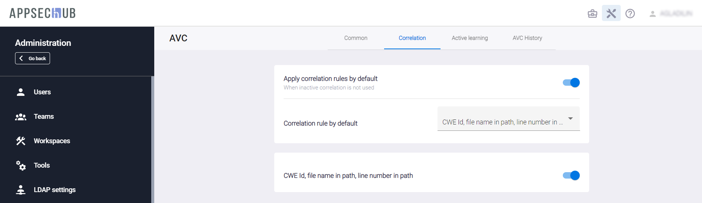

# Настройки корреляции уязвимостей приложения

!!! note "Примечание"
    Для выполнения нижеописанных действий требуется роль Администратора.

Нажмите на иконку **Administration**  в правом верхнем углу экрана. На экране появится страница администрирования.

Выберите пункт меню **AVC** (Application Vulnerabilities Correlation) в меню слева, чтобы обновить настройки корреляции уязвимостей приложения (AVC). Страница **AVC** содержит четыре вкладки: **Common**, **Correlation**, **Active learning** и **AVC History**.

<figure markdown></figure>

Вкладка **Common** содержит следующие настройки:

* **AVC domain name** — имя домена внешней веб-службы, которая обеспечивает AVC-анализ на основе своей определенной модели, созданной с использованием искусственного интеллекта (AI).
* **Enable auto-review** — включение автоматического анализа выявленных проблем безопасности после каждого импорта проблем из инструмента AST в AppSec.Hub. Это позволяет автоматически присваивать импортированным проблемам статус «ложно-положительный» (False Positive) или «истинно-положительный» (True Positive). Чтобы получать результаты AVC-анализа (анализа корреляции уязвимостей приложения) и оценку «истинно/ложноположительный» для проблем безопасности SAST, переведите селектор в положение «включено».
* **Observable statuses** — выбор статусов проблем безопасности, для которых выполняется AVC-анализ. В раскрывающемся меню выберите статусы проблем, для которых выполняется анализ.

<figure markdown></figure>

На вкладке **Correlation** могут быть выполнены следующие настройки:

* **Apply correlation rules by default** — включает применение правил корреляции по умолчанию. Если данная настройка отключена, корреляция использоваться не будет.
* **Correlation rule by default** — определяет используемое по умолчанию правило корреляции. В данном примере выбрано правило корреляции, основанное на совпадении в найденных security issues таких параметров как: CWE Id, имя файла и номер строки кода, в которой она была обнаружена.
* **CWE Id, file name in path, line number in path** — включение правила корреляции, используемого по умолчанию.

Вкладка **Active learning** предлагает следующие настройки.

<figure markdown></figure>

* **Enable active learning feature** — включение функции периодического переобучения предиктивной модели анализа проблем безопасности для повышения достоверности результатов.
* Параметр **DP threshold** задает пороговое значение для параметра **Discriminant power** для AVC-модели. Он определяет нижнюю границу качества работы предиктивной модели анализа. Если текущее значение работы AVC-модели опускается ниже заданного значения, запускается процесс дополнительного переобучения, иначе переобучение не требуется.

Вкладка **AVC History** содержит историю изменений настроек AVC-модели с точки зрения обучения (active learning) этой модели. Период тренировки AVC-модели задается в конфигурационном файле app.properties (см. раздел «[Приложение 4. Конфигурационный файл app.properties](../ug/appendix%205.md)»). По умолчанию, период переобучения составляет одни сутки.

<figure markdown></figure>
 
Вкладка **AVC History** содержит следующие поля:

* **ID** — идентификатор задачи по изменению настроек AVC в системе.
* **LEARNING STARTED** — дата начала выполнения задачи.
* **TOTAL ISSUES** — количество обработанных проблем безопасности.
* **REQUEST STATUS** — статус задачи.
* **LANGUAGES** — языки программирования, к которым относится задача.

Нажмите на строку задачи, чтобы перейти на страницу с детальной информацией о ней:

<figure markdown></figure>
 
На этой странице представлены следующие показатели для каждого из языков программирования:

* **LANGUAGE** — язык программирования.
* **STATUS** — статус задачи.
* **DP** — Вычисленное значение комбинированной метрики Discriminant power для AVC-модели. Значение этой метрики может стать триггером для переобучения модели.
* **STARTED** — дата начала выполнения задачи.
* **TOTAL** — количество обработанных проблем безопасности для данного языка программирования.
* **MIN RECALL** — Минимальная полнота, которая может быть у полученной модели с учетом достоверности. Это — основная метрика, характеризующая качество работы модели и попадание ее результатов в реальные данные.  По этой величине сравниваются AVC-модели.
* **SCORE** — Коэффициент полезности AVC-модели. Он отражает эффективность алгоритма. Чем ближе это значение к 1, тем лучше.
* **SPEC** — Параметр Specificity, который отражает количество найденных ложных security issues от общего количества ложных security issues. Чем ближе это значение к 1, тем лучше.
* **ACC** — Параметр Accuracy, который отвечает за общую точность модели без выделения той или иной характеристики как более важной. Чем ближе это значение к 1, тем лучше.
* **SENSE** — Параметр Sensitivity, который отражает насколько полно наш алгоритм определяет уязвимости (security issues). Чем ближе это значение к 1, тем лучше.
* **PREC** — Параметр Precision, который отражает долю реальных security issues среди всех, помеченных как security issues. Чем ближе это значение к 1, тем лучше.
* **TP** (True Positive) — Количество security issues, на которые модель указала, что это security issue.
* **TN** (True Negative) — Количество не security issues, на которые модель указала, что это не security issue.
* **FP** (False Positive) — Количество не security issues, на которые модель указала, что это security issue.
* **FN** (False Negative) — Количество security issues, на которые модель указала, что это не security issue.