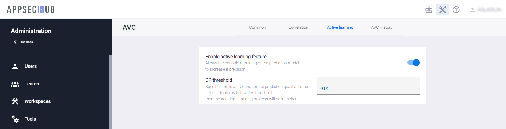

# Настройки корреляции уязвимостей приложения

!!! note "Примечание"
    Для выполнения нижеописанных действий требуется роль Администратора.

Нажмите на иконку **Administration**  в правом верхнем углу экрана. На экране появится страница администрирования.

Выберите пункт меню **AVC** (Application Vulnerabilities Correlation) в меню слева, чтобы обновить настройки корреляции уязвимостей приложения (AVC). Страница **AVC** содержит три вкладки: **Common**, **Correlation** и **Active learning**.

<figure markdown></figure>

Вкладка **Common** содержит следующие настройки:

* **AVC domain name** — имя домена внешней веб-службы, которая обеспечивает AVC-анализ на основе своей определенной модели, созданной с использованием искусственного интеллекта (AI).
* **Enable auto-review** — включение автоматического анализа выявленных проблем безопасности после каждого импорта проблем из инструмента AST в AppSec.Hub. Это позволяет автоматически присваивать импортированным проблемам статус «ложно-положительный» (False Positive) или «истинно-положительный» (True Positive). Чтобы получать результаты AVC-анализа (анализа корреляции уязвимостей приложения) и оценку «истинно/ложноположительный» для проблем безопасности SAST, переведите селектор в положение «включено».
* **Observable statuses** — выбор статусов проблем безопасности, для которых выполняется AVC-анализ. В раскрывающемся меню выберите статусы проблем, для которых выполняется анализ.

<figure markdown></figure>

На вкладке **Correlation** могут быть выполнены следующие настройки:

* **Apply correlation rules by default** — включает применение правил корреляции по умолчанию. Если данная настройка отключена, корреляция использоваться не будет.
* **Correlation rule by default** — определяет используемое по умолчанию правило корреляции. В данном примере выбрано правило корреляции, основанное на совпадении в найденных security issues таких параметров как: CWE Id, имя файла и номер строки кода, в которой она была обнаружена.
* **CWE Id, file name in path, line number in path** — включение правила корреляции, используемого по умолчанию.

Вкладка **Active learning** предлагает следующие настройки.

<figure markdown></figure>

* **Enable active learning feature** — включение функции периодического переобучения предиктивной модели анализа проблем безопасности для повышения достоверности результатов.
* Параметр **DP threshold** определяет нижнюю границу качества работы предиктивной модели анализа. Если его значение опускается ниже заданного значения, запускается процесс дополнительного переобучения.

Администратор определяет настройки AVC для всей системы AppSec.Hub. Если эти настройки необходимо переопределить для конкретного приложения, Менеджер приложения может задать настройки AVC приложения на вкладке AVC на странице настроек приложения **Settings**.