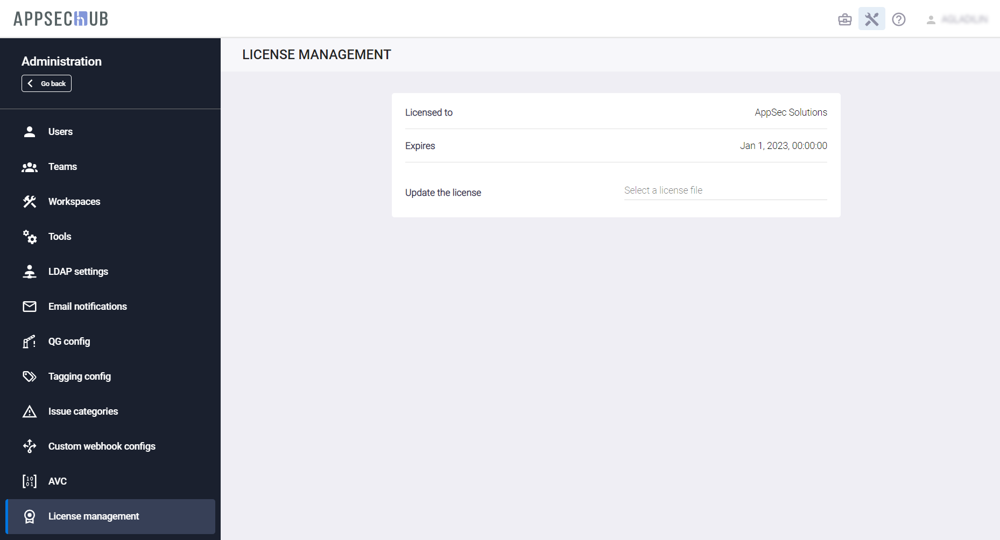

# Управление лицензией AppSec.Hub

!!! note "Примечание"
    Для выполнения нижеописанных действий требуется роль Администратора.

Нажмите на иконку администрирования  в правом верхнем углу экрана. На экране появится страница администрирования.

Выберите пункт меню **License Management** в консоли слева, чтобы обновить лицензию. Дата истечения срока лицензии отображается на экране.

<figure markdown></figure>

При необходимости обновить лицензию, выберите файл с новой лицензией в поле **Update the license**.