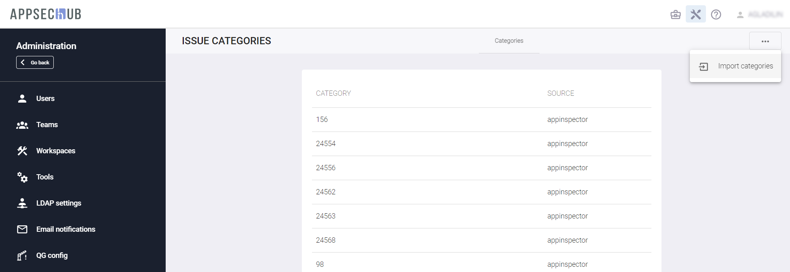

# Категории уязвимостей

!!! note "Примечание"
    Для выполнения нижеописанных действий требуется роль Администратора.

Нажмите иконку **Administration**  и слева выберите пункт меню **Issue Categories**. Данная страница используется для загрузки категорий уязвимостей из инструментов.

Нажав кнопку **Actions** , расположенную в правом верхнем углу пользовательского интерфейса, выберите пункт меню **Import Categories**.

<figure markdown></figure>

В появившемся диалоговом окне **Import categories** выберите необходимый инструмент и нажмите кнопку **Import**, чтобы импортировать категории из инструмента в AppSec.Hub. В правом нижнем углу пользовательского интерфейса появится соответствующее уведомление.

!!! note "Примечание"
    Возможен импорт как предустановленных в инструменте категорий, так и добавляемых в него, например, Инженерами ИБ (в случае Checkmarx — Cx и Corp соответственно). В дальнейшем импортированные категории могут использоваться в качестве условий для формирования правил условного принятия риска или присвоения уязвимости статуса False positive, см. раздел «[Добавление проблем безопасности в исключения](../../ug/security%20issues/#_5)» Руководства пользователя.