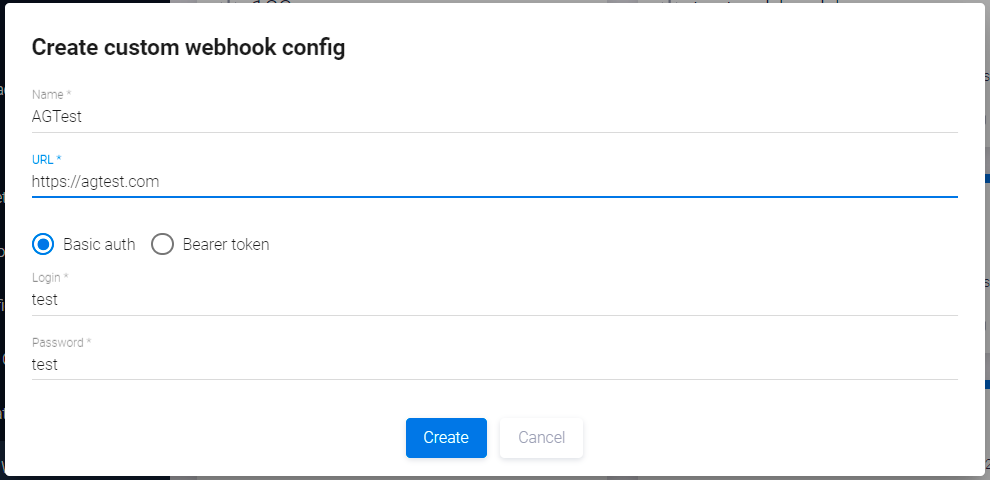

# Конфигурация Custom webhooks

!!! note "Примечание"
    Для выполнения нижеописанных действий требуется роль Администратора.

Чтобы создать и настроить Custom webhook, перейдите в панель администрирования, нажав кнопку **Administration** , расположенную в правом верхнем углу пользовательского интерфейса, а затем слева выберите пункт меню **Custom Webhook Configs**.

<figure markdown></figure>

В правом верхнем углу открывшейся страницы нажмите кнопку **+Add new**.

<figure markdown></figure>

В появившемся диалоговом окне в поле **Name** укажите название конфигурации, в поле **URL** — адрес, на который будут передаваться соответствующие данные, а также выберите способ авторизации: с использованием **Login/Password** или с помощью токена.

После создания и конфигурации Custom webhook может быть добавлен в Security Pipeline кодовой базы или артефакта. Более подробная информация приведена в разделе «[Security Pipelines](../../ug/security%20pipelines/#security-pipelines)» Руководства пользователя.

Нажмите иконку редактирования  на существующей карточке Custom webhook. В появившемся окне **Update custom webhook config** можно просмотреть и настроить его параметры.

После завершения конфигурирования Security Pipeline можно осуществлять экспорт в инструмент CI/CD с последующим запуском сканирования.

!!! note "Примечание"
    Если Security Pipeline c подключенной конфигурацией Custom Webhook будет выбран в качестве шаблона, например, при автоматизированной интеграции AppSec.Hub в цикл разработки, Custom Webhook будет автоматически включаться во все Security Pipeline, созданные в ходе такой интеграции.