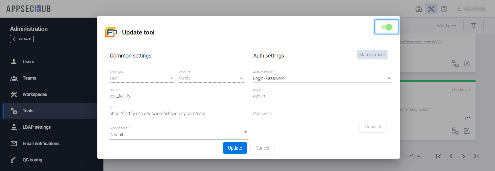

# Отключение инструментов

Если ранее подключенный инструмент больше не нужен, кликните иконку **Edit tool**  на карточке этого инструмента, выключите селектор в правом верхнем углу окна **Update tool** и нажмите кнопку **Update**.

Деактивированный таким образом инструмент будет недоступен для пользователей системы, однако пользователь с правами Администратора по-прежнему может видеть карточку этого инструмента, выделенную другим цветом.

<figure markdown></figure>