# Интеграция с инструментами AST

!!! note "Примечание"
    Для выполнения нижеописанных действий требуется роль Администратора.

## Подключение к Checkmarx

Подключение Checkmarx осуществляется на странице администрирования AppSec.Hub, см. раздел «[Интеграция с инструментами разработки ПО](../integration%20with%20software%20development%20tools/#_1)».

Выберите пункт **Tools** в меню, расположенном слева, и нажмите кнопку **+Add new** в правом верхнем углу.

В появившемся окне **Create tool** выберите элемент **sast** из выпадающего меню в поле **Tool type** и элемент **checkmarx** из выпадающего меню в поле **Product**.

<figure markdown></figure>

Если выбраны эти два значения, окно **Create tool** выглядит следующим образом.

<figure markdown>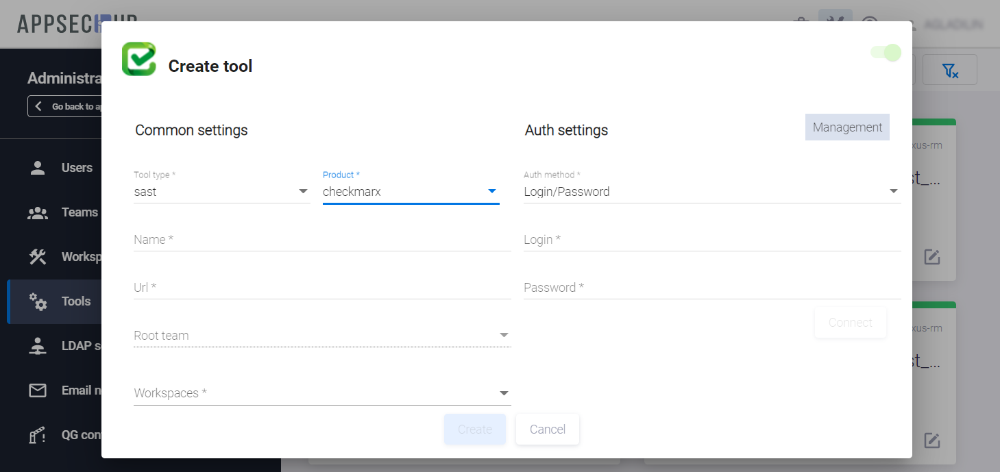</figure>

В этом окне определите следующие параметры для подключаемого инструмента Checkmarx:

* Имя инструмента задайте в поле **Name**.
* В поле **URL** укажите URL для инструмента Checkmarx.
* В поле **Workspace** выберите рабочее пространство, которое будет использоваться при работе с Checkmarx. Это может быть любое доступное рабочее пространство в AppSec.Hub.
* В поле **Authentication method** выберите **Login/password**, для работы с Checkmarx это единственная опция.
* Введите **Login** и **Password** учётной записи, которая выделена для доступа в данный инструмент. При необходимости перед именем пользователя через «/» указывается имя домена.
* Информационное поле **Management** в правом верхнем углу **Create tool** предназначено для отображения информации о категориях используемых учетных записей. На данный момент функциональность в полной мере не реализована.

Нажмите кнопку **Connect** для того, чтобы соединиться с Checkmarx.

<figure markdown>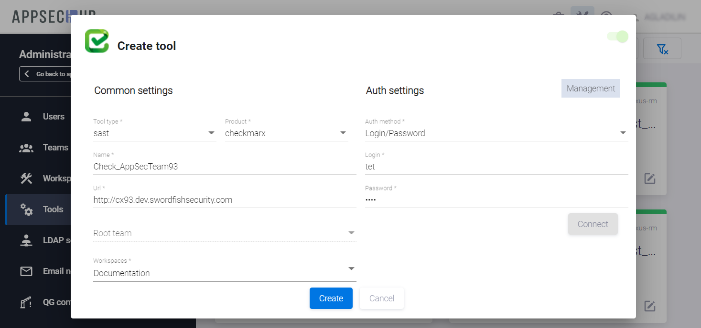</figure>

AppSec.Hub отправит запрос на подключение к инструменту Checkmarx. Если соединение было успешным, в правом нижнем углу экрана появится соответствующее уведомление.

Перед подключением к инструменту убедитесь, что селектор в правом верхнем углу окна **Create tool** находится в положении «включено», и нажмите кнопку **Create**. В правом нижнем углу экрана появится соответствующее уведомление.

Карточка вновь подключенного инструмента отобразится на странице инструментов (**Tools**), а также на странице соответствующего рабочего пространства (**Workspaces/ Workspaces name**).

## Подключение к Nexus IQ

Подключение Nexus IQ осуществляется на странице администрирования AppSec.Hub, см. раздел «[Интеграция с инструментами разработки ПО](../integration%20with%20software%20development%20tools/)».

Выберите пункт **Tools** в меню, расположенном слева, и нажмите кнопку **+Add new** в правом верхнем углу.

В появившемся окне **Create tool** выберите элемент **sca** из выпадающего меню в поле **Tool type** и элемент **nexus-iq** из выпадающего меню в поле **Product**.

<figure markdown>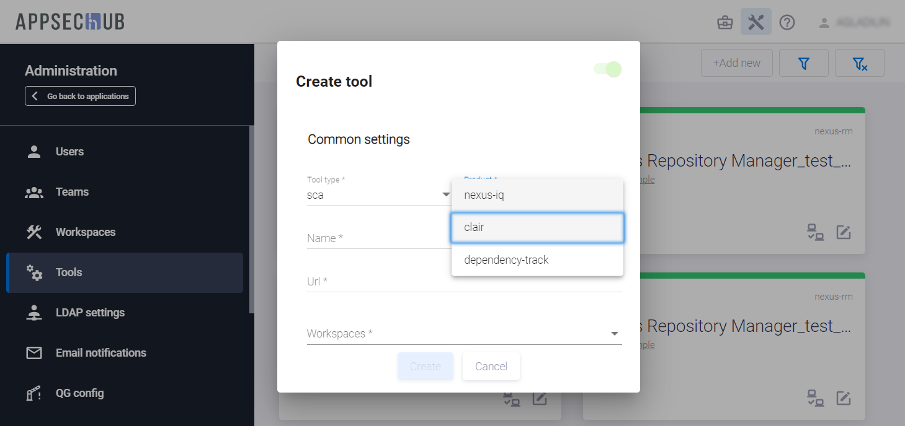</figure>

Если выбраны эти два значения, окно **Create tool** выглядит следующим образом.

<figure markdown>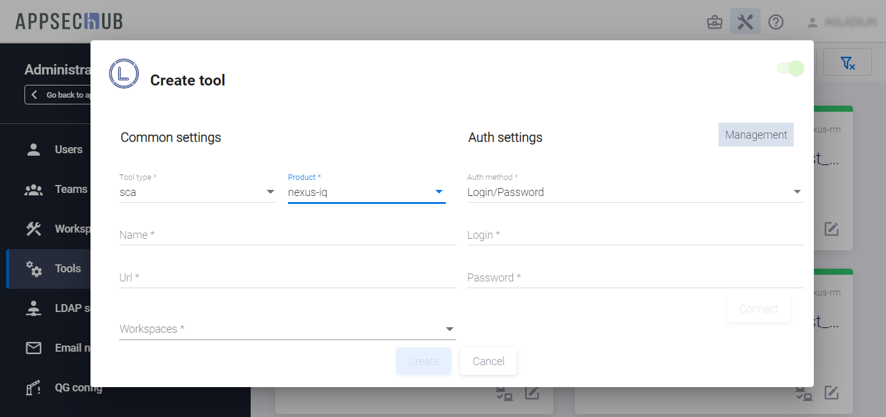</figure>

В этом окне определите следующие параметры для подключаемого инструмента Nexus IQ:

* Имя инструмента задайте в поле **Name**.
* В поле **URL** укажите URL для инструмента Nexus IQ.
* В поле **Workspace** выберите рабочее пространство, которое будет использоваться при работе с Nexus IQ. Это может быть любое доступное рабочее пространство в AppSec.Hub.
* В поле **Authentication method** выберите **Login/password**.
* Введите **Login** и **Password** учётной записи, которая выделена для доступа в данный инструмент.
* Информационное поле **Management** в правом верхнем углу **Create tool** предназначено для отображения информации о категориях используемых учетных записей. На данный момент функциональность в полной мере не реализована.

Нажмите кнопку **Connect** для того, чтобы соединиться с Nexus IQ.

<figure markdown>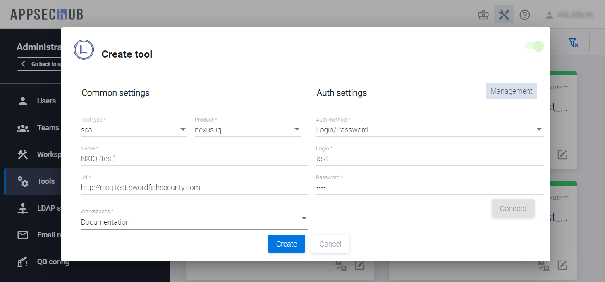</figure>

AppSec.Hub отправит запрос на подключение к инструменту Nexus IQ. Если соединение было успешным, в правом нижнем углу экрана появится соответствующее уведомление.

Перед подключением к инструменту убедитесь, что селектор в правом верхнем углу окна **Create tool** находится в положении «включено», и нажмите кнопку **Create**. В правом нижнем углу экрана появится соответствующее уведомление.

Карточка вновь подключенного инструмента отобразится на странице инструментов (**Tools**), а также на странице соответствующего рабочего пространства (**Workspaces/ Workspaces name**).

## Подключение к Clair

Подключение Clair осуществляется на странице администрирования AppSec.Hub, см. см. раздел «[Интеграция с инструментами разработки ПО](../integration%20with%20software%20development%20tools/#_1)».

Выберите пункт **Tools** в меню, расположенном слева, и нажмите кнопку **+Add new** в правом верхнем углу.

В появившемся окне **Create tool** выберите элемент **sca** из выпадающего меню в поле **Tool type** и элемент **clair** из выпадающего меню в поле **Product**.

<figure markdown></figure>

Если выбраны эти два значения, окно **Create tool** выглядит следующим образом.

<figure markdown>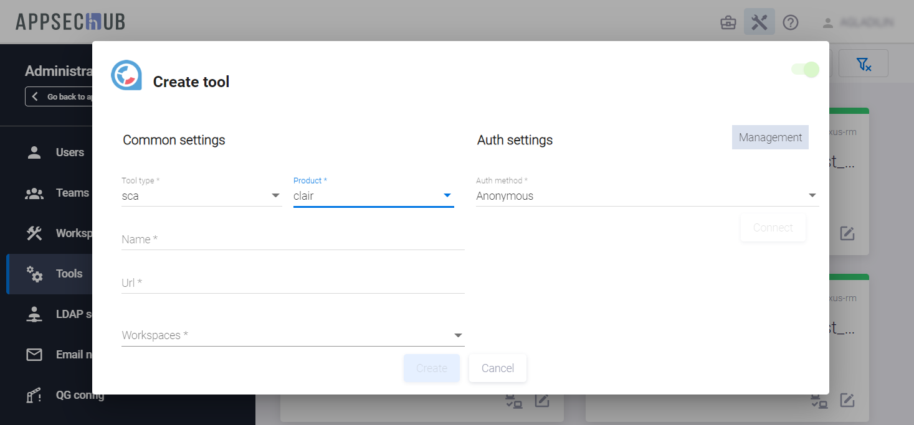</figure>

В этом окне определите следующие параметры для подключаемого инструмента Clair:

* Имя инструмента задайте в поле **Name**.
* В поле **URL** укажите URL для инструмента Clair.
* В поле **Workspace** выберите рабочее пространство, которое будет использоваться при работе с Clair. Это может быть любое доступное рабочее пространство в AppSec.Hub.
* В поле **Authentication method** выберите **Anonymous**.
* Информационное поле **Management** в правом верхнем углу **Create tool** предназначено для отображения информации о категориях используемых учетных записей. На данный момент функциональность в полной мере не реализована.

Нажмите кнопку **Connect** для того, чтобы соединиться с **Clair**.

<figure markdown>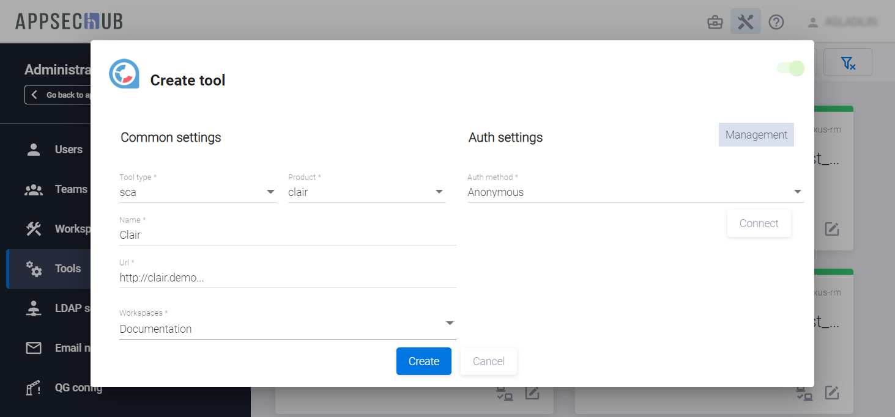</figure>

AppSec.Hub отправит запрос на подключение к инструменту Clair. Если соединение было успешным, в правом нижнем углу экрана появится соответствующее уведомление.

Перед подключением к инструменту убедитесь, что селектор в правом верхнем углу окна **Create tool** находится в положении «включено», и нажмите кнопку **Create**. В правом нижнем углу экрана появится соответствующее уведомление.

Карточка вновь подключенного инструмента отобразится на странице инструментов (**Tools**), а также на странице соответствующего рабочего пространства (**Workspaces/ Workspaces name**).

## Подключение к Netsparker

Подключение Netsparker осуществляется на странице администрирования AppSec.Hub, см. см. раздел «[Интеграция с инструментами разработки ПО](../integration%20with%20software%20development%20tools/#_1)».

Выберите пункт **Tools** в меню, расположенном слева, и нажмите кнопку **+Add new** в правом верхнем углу.

В появившемся окне **Create tool** выберите элемент **dast** из выпадающего меню в поле **Tool type** и элемент **netsparker** из выпадающего меню в поле **Product**.

<figure markdown></figure>

Если выбраны эти два значения, окно **Create tool** выглядит следующим образом.

<figure markdown>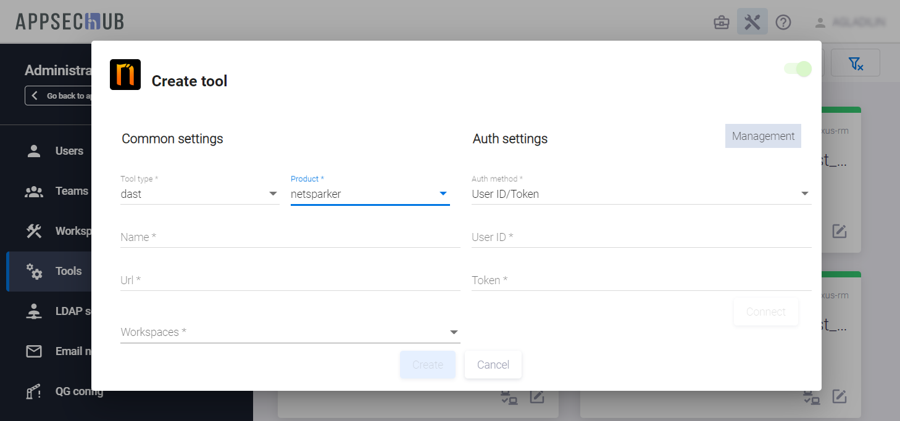</figure>

В этом окне определите следующие параметры для подключаемого инструмента Netsparker:

* Имя инструмента задайте в поле **Name**.
* В поле **URL** укажите URL для инструмента Netsparker.
* В поле **Workspace** выберите рабочее пространство, которое будет использоваться при работе с Netsparker. Это может быть любое доступное рабочее пространство в AppSec.Hub.
* В поле **Authentication method** выберите **User ID/Token**.
* **User ID** и **Token** учётной записи, которая выделена для доступа в данный инструмент.
* Информационное поле **Management** в правом верхнем углу **Create tool** предназначено для отображения информации о категориях используемых учетных записей. На данный момент функциональность в полной мере не реализована.

Нажмите кнопку **Connect** для того, чтобы соединиться с Netsparker.

<figure markdown>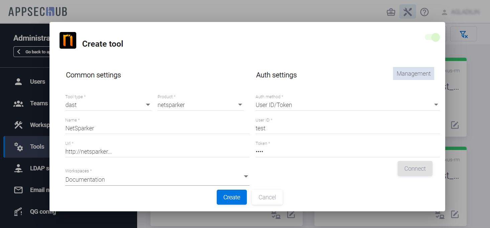</figure>

AppSec.Hub отправит запрос на подключение к инструменту Netsparker. Если соединение было успешным, в правом нижнем углу экрана появится соответствующее уведомление.

Перед подключением к инструменту убедитесь, что селектор в правом верхнем углу окна **Create tool** находится в положении «включено», и нажмите кнопку **Create**. В правом нижнем углу экрана появится соответствующее уведомление.

Карточка вновь подключенного инструмента отобразится на странице инструментов (**Tools**), а также на странице соответствующего рабочего пространства (**Workspaces/ Workspaces name**).

## Подключение к Fortify

Подключение Fortify осуществляется на странице администрирования AppSec.Hub, см. раздел «[Интеграция с инструментами разработки ПО](../integration%20with%20software%20development%20tools/#_1)».

Выберите пункт **Tools** в меню, расположенном слева, и нажмите кнопку **+Add new** в правом верхнем углу.

В раскрывающемся меню поля **Tool type** открывшегося диалогового окна **Create tool** выберите пункт **sast**, а в поле **Product** — **fortify**.

<figure markdown></figure>

После выбора этих значений окно **Create tool** примет следующий вид.

<figure markdown></figure>

Для подключения укажите в данном окне следующие параметры:

* Задайте имя инструмента в поле **Name**.
* Укажите **URL** инструмента Fortify Software Security Center (SSC).
* В поле **Workspace** выберите рабочее пространство (-а), в котором будет использоваться Fortify. Это может быть любое доступное рабочее пространство в AppSec.Hub.
* Для данного инструмента доступен только один способ авторизации — с использованием логина и пароля. Введите **Login** и **Password** в соответствующие поля.
* Информационное поле **Management** в правом верхнем углу **Create tool** предназначено для отображения информации о категориях используемых учетных записей. На данный момент функциональность в полной мере не реализована.

Нажмите кнопку **Connect**, чтобы проверить соединение с Fortify.

<figure markdown></figure>

AppSec.Hub отправит запрос на соединение с инструментом и в правом нижнем углу пользовательского интерфейса отобразится соответствующее уведомление.

Если соединение произошло успешно, нажмите кнопку **Create**, чтобы подключить инструмент, в противном случае проверьте правильность заполнения всех полей и внесите необходимые изменения.

Карточка вновь подключенного инструмента отобразится на странице инструментов (**Tools**), а также на странице соответствующего рабочего пространства (**Workspaces/ Workspaces name**).

!!! note "Примечание"
    В настоящее время Fortify поддерживает сканирование кодовых баз только на языке Java.

## Подключение к Solar appScreener

Подключение Solar appScreener осуществляется на странице администрирования AppSec.Hub, см. раздел «[Интеграция с инструментами разработки ПО](../integration%20with%20software%20development%20tools/#_1)».

Выберите пункт **Tools** в меню, расположенном слева, и нажмите кнопку **+Add new** в правом верхнем углу.

В раскрывающемся меню поля **Tool type** открывшегося диалогового окна **Create tool** выберите пункт **sast**, а в поле **Product** — **appscreener**.

<figure markdown></figure>

После выбора этих значений окно **Create tool** примет следующий вид.

<figure markdown>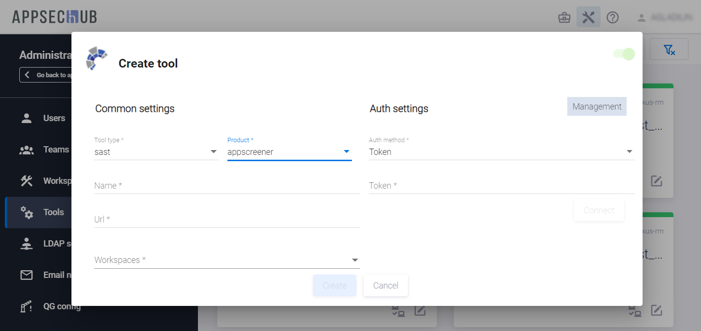</figure>

Для подключения укажите в данном окне следующие параметры:

* Задайте имя инструмента в поле **Name**.
* Укажите **URL** инструмента Solar appScreener.
* В поле **Workspace** выберите рабочее пространство (-а), в котором будет использоваться Solar appScreener. Это может быть любое доступное рабочее пространство в AppSec.Hub.
* Для данного инструмента доступен только один способ авторизации — с использованием токена. Введите токен в соответствующее поле.
* Информационное поле **Management** в правом верхнем углу **Create tool** предназначено для отображения информации о категориях используемых учетных записей. На данный момент функциональность в полной мере не реализована.

Нажмите кнопку **Connect**, чтобы проверить соединение с Solar appScreener.

<figure markdown></figure>

AppSec.Hub отправит запрос на соединение с инструментом и в правом нижнем углу пользовательского интерфейса отобразится соответствующее уведомление.

Если соединение произошло успешно, нажмите кнопку **Create**, чтобы подключить инструмент, в противном случае проверьте правильность заполнения всех полей и внесите необходимые изменения.

Карточка вновь подключенного инструмента отобразится на странице инструментов (**Tools**), а также на странице соответствующего рабочего пространства (**Workspaces/Workspaces name**).

!!! note "Примечание"
    В настоящее время Solar appScreener поддерживает сканирование кодовых баз только на языке Java.

## Подключение к Acunetix

Подключение Acunetix осуществляется на странице администрирования AppSec.Hub, см. раздел «[Интеграция с инструментами разработки ПО](../integration%20with%20software%20development%20tools/#_1)». Выберите пункт **Tools** в меню, расположенном слева, и нажмите кнопку **+Add new** в правом верхнем углу.

В раскрывающемся меню поля **Tool type** открывшегося диалогового окна **Create tool** выберите пункт **dast**, а в поле **Product** — **Acunetix**.

<figure markdown></figure>

После выбора этих значений окно **Create tool** примет следующий вид.

<figure markdown>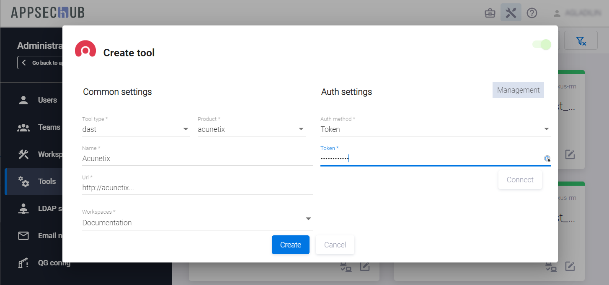</figure>

Для подключения укажите в данном окне следующие параметры:

* Задайте имя инструмента в поле **Name**.
* Укажите **URL** инструмента Acunetix.
* В поле **Workspace** выберите рабочее пространство (-а), в котором будет использоваться Acunetix. Это может быть любое доступное рабочее пространство в AppSec.Hub.
* Для данного инструмента доступен только один способ авторизации — с использованием токена. Введите токен в соответствующее поле.
* Информационное поле **Management** в правом верхнем углу **Create tool** предназначено для отображения информации о категориях используемых учетных записей. На данный момент функциональность в полной мере не реализована.

Нажмите кнопку **Connect**, чтобы проверить соединение с Acunetix.

<figure markdown></figure>

AppSec.Hub отправит запрос на соединение с инструментом и в правом нижнем углу пользовательского интерфейса отобразится соответствующее уведомление.

Если соединение произошло успешно, нажмите кнопку **Create**, чтобы подключить инструмент, в противном случае проверьте правильность заполнения всех полей и внесите необходимые изменения.

Карточка вновь подключенного инструмента отобразится на странице инструментов (**Tools**), а также на странице соответствующего рабочего пространства (**Workspaces/Workspaces name**).

!!! note "Примечание"
    В настоящее время поддерживается только совместная работа Acunetix с Jenkins.