# Интеграция с инструментами разработки ПО

!!! note "Примечание"
    Для выполнения нижеописанных действий требуется роль Администратора.

Нажмите на иконку администрирования  в правом верхнем углу экрана и выберите пункт меню **Tools** в меню слева. Все ранее подключенные инструменты будут отображены на экране.

<figure markdown>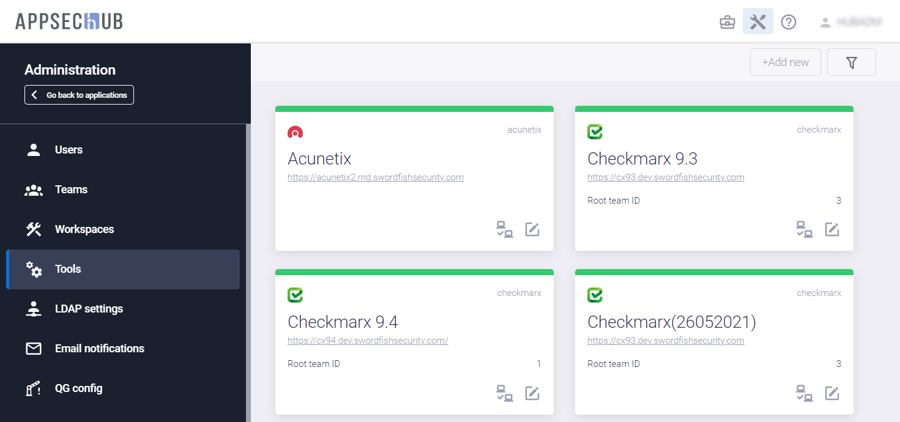</figure>

Подключенные инструменты сгруппированы по рабочим пространствам (workspaces). Подробное описание рабочих пространств и работы с ними приведено ниже в разделе «[Организация рабочих пространств](../organisation%20of%20workspaces/#_1)».

Можно найти и отфильтровать все подключенные инструменты, используя выпадающие меню в полях **by workspaces**, **by tool type** и **by tool product**, нажав кнопку **Show filters**  в правом верхнем углу страницы **Tools**.

## Подключение к Bitbucket

Нажмите кнопку **+Add new** в правом верхнем углу страницы **Tools**, чтобы начать подключение к новому инструменту.

<figure markdown></figure>

В открывшемся окне **Create tool** выберите элемент **vcs** из выпадающего меню в поле **Tool type** и элемент **git-based** в поле **Product**.

<figure markdown></figure>

Если были выбраны эти значения, в окне **Create tool** появятся несколько дополнительных полей.

<figure markdown></figure>

В этом окне определите следующие параметры для подключаемого инструмента Bitbucket:

* Имя инструмента определяется в поле **Name**. Это имя будет отображаться на вновь созданной карточке инструмента на странице **Tools**.
* В поле **URL** укажите URL для инструмента Bitbucket.
* В поле **VCS type** введите тип системы контроля версий (**git**).
* В поле **Workspace** выберите рабочее пространство, которое будет использоваться при работе с этим инструментом. Описание рабочих пространств и работы с ними приведено ниже в разделе «[Организация рабочих пространств](../organisation%20of%20workspaces/#_1)».
* **Auth method**. Для данного инструмента доступно четыре метода аутентификации: **Anonymous**, **Login/Password**, **SSH Key** и **Uploaded SSH key**.
    * **Uploaded SSH key**. Подразумевает использование SSH ключа, загруженного в инструменты оркестрации. В данном случае сами ключи в AppSec.Hub храниться не будут. Если в качестве инструмента оркестрации используется Teamcity, следует выбрать данный метод аутентификации. Укажите:
        * **Uploaded SSH key name** – наименование ключа, под которым он загружен в инструмент оркестрации.
        * **Uploaded SSH key passphrase** – парольная фраза к загруженному ключу.
    * **SSH Key** (данный метод не поддерживается в Teamcity). Для данного метода аутентификации укажите:
        * **SSH Username** – имя пользователя, от имени которого будет выполнено подключение в Bitbucket.
        * **SSH Passphrase** – парольная фраза к закрытому ключу.
        * **Public key** – открытый ключ.
        * **Private key** – закрытый ключ.
    * **Login/Password**. При выборе данного метода укажите Login и Password учётной записи, которая выделена для доступа к исходному коду.
    * **Anonymous**. Анонимный метод аутентификации обычно используется для доступа к внешним, публичным VCS.

Перед подключением к инструменту убедитесь, что селектор в правом верхнем углу окна **Create tool** находится в положении «включено», и нажмите кнопку **Create**.

<figure markdown>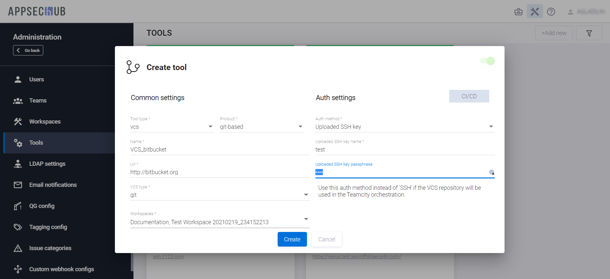</figure>

В правом нижнем углу экрана появится следующее уведомление.

<figure markdown>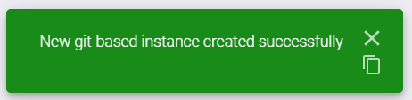</figure>

Карточка вновь подключенного инструмента отобразится на странице инструментов (**Tools**), а также на странице соответствующего рабочего пространства (**Workspaces/ Workspaces name**).

<figure markdown></figure>

Нажмите иконку редактирования инструмента  в правом нижнем углу карточки инструмента, чтобы изменить параметры его конфигурации. В появившемся окне **Update tool** есть те же поля, что и в окне **Create tool**. В окне **Update tool** можно изменить все настройки, кроме полей **Tool type** и **Product**. Необходимость изменения этих полей означает, что требуется подключение другого инструмента.

## Подключение к GitHub

Нажмите кнопку **+Add new** в правом верхнем углу страницы **Tools**, чтобы начать подключение к новому инструменту. В открывшемся окне **Create tool** выберите элемент **vcs** из выпадающего меню в поле **Tool type** и элемент **git-based** в поле **Product**.

<figure markdown></figure>

Если были выбраны эти значения, в окне **Create tool** появятся несколько дополнительных полей.

<figure markdown></figure>

В этом окне определите следующие параметры для подключаемого инструмента GitHub:

* Имя инструмента определяется в поле **Name**. Это имя будет отображаться на вновь созданной карточке инструмента на странице **Tools**.
    * В поле **URL** укажите URL для инструмента GitHub.
    * В поле **Workspace** выберите рабочее пространство, которое будет использоваться при работе с этим инструментом. Описание рабочих пространств и работы с ними приведено ниже в разделе «[Организация рабочих пространств](../organisation%20of%20workspaces/#_1)».
    * В поле **VCS type** введите тип системы контроля версий (**git**). 
    * **Auth method**. Для данного инструмента доступно четыре метода аутентификации: **Anonymous**, **Login/Password**, **SSH Key** и **Uploaded SSH key**.
        * **Uploaded SSH key**. Подразумевает использование SSH ключа, загруженного в инструменты оркестрации. В данном случае сами ключи в AppSec.Hub храниться не будут. Если в качестве инструмента оркестрации используется Teamcity, следует выбрать данный метод аутентификации. Укажите:
            * **Uploaded SSH key name** – наименование ключа, под которым он загружен в инструмент оркестрации.
            * **Uploaded SSH key passphrase** – парольная фраза к загруженному ключу.
        * **SSH Key** (данный метод не поддерживается в Teamcity). Для данного метода аутентификации укажите:
            * **SSH Username** – имя пользователя, от имени которого будет выполнено подключение в GitHub.
            * **SSH Passphrase** – парольная фраза к закрытому ключу.
            * **Public key** – открытый ключ.
            * **Private key** – закрытый ключ.
        * **Login/Password**. При выборе данного метода укажите **Login** и **Password** учётной записи, которая выделена для доступа к исходному коду.
        * **Anonymous**. Анонимный метод аутентификации обычно используется для доступа к внешним, публичным VCS.

Перед подключением к инструменту убедитесь, что селектор в правом верхнем углу окна **Create tool** находится в положении «включено», и нажмите кнопку **Create**.

<figure markdown>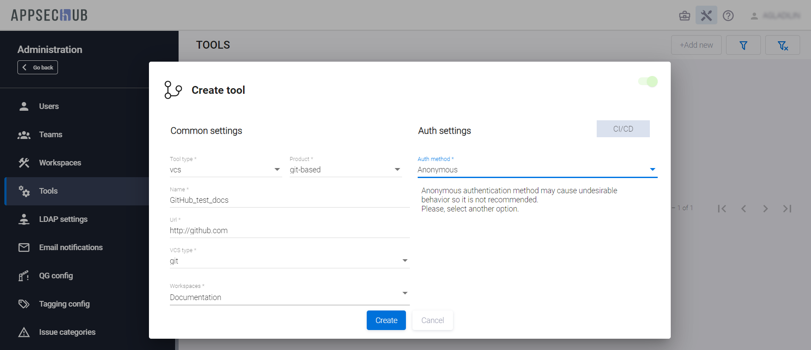</figure>

В правом нижнем углу экрана появится следующее уведомление.

<figure markdown></figure>

Карточка вновь подключенного инструмента отобразится на странице инструментов (**Tools**), а также на странице соответствующего рабочего пространства (**Workspaces/ Workspaces name**).

<figure markdown></figure>

Нажмите иконку редактирования инструмента  в правом нижнем углу карточки инструмента, чтобы изменить параметры его конфигурации. В появившемся окне **Update tool** есть те же поля, что и в окне **Create tool**. В окне **Update tool** можно изменить все настройки, кроме полей **Tool type** и **Product**. Необходимость изменения этих полей означает, что требуется подключение другого инструмента.

## Подключение к Nexus Repository Manager

Нажмите кнопку **+Add new** в правом верхнем углу страницы **Tools**, чтобы начать подключение к новому инструменту.

<figure markdown></figure>

В открывшемся окне **Create tool** выберите элемент **repository** из выпадающего меню в поле **Tool type** и элемент **nexus-rm** в поле **Product**.

<figure markdown></figure>

Если были выбраны эти значения, в окне **Create tool** появятся несколько дополнительных полей.

<figure markdown>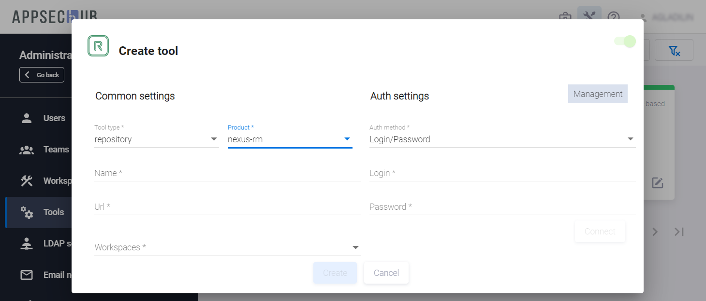</figure>

Укажите следующие параметры для подключаемого инструмента:

* Имя инструмента определяется в поле **Name**. Оно будет отображаться на вновь созданной карточке инструмента на странице **Tools**.
* В поле **URL** укажите URL для инструмента Nexus Repository Manager.
* В поле **Workspace** выберите рабочее пространство (-а), которое будет использоваться при работе с этим инструментом. Описание рабочих пространств и работы с ними приведено ниже в разделе «[Организация рабочих пространств](../organisation%20of%20workspaces/#_1)».
* Для данного инструмента доступен только один способ авторизации — с использованием логина и пароля. Введите **Login** и **Password** в соответствующие поля.
* Информационное поле **Management** в правом верхнем углу **Create tool** предназначено для отображения информации о категориях используемых учетных записей. На данный момент функциональность в полной мере не реализована.

Нажмите кнопку **Connect**, чтобы проверить соединение с Nexus Repository Manager.

<figure markdown></figure>

AppSec.Hub отправит запрос на соединение с инструментом и в правом нижнем углу пользовательского интерфейса отобразится соответствующее уведомление. Если соединение произошло успешно, нажмите кнопку **Create**, чтобы подключить инструмент, в противном случае проверьте правильность заполнения всех полей и внесите необходимые изменения.

В правом нижнем углу экрана появится следующее уведомление.

<figure markdown>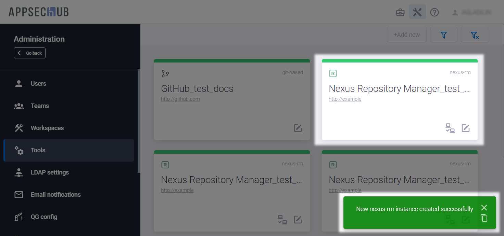</figure>

Карточка вновь подключенного инструмента отобразится на странице инструментов (**Tools**), а также на странице соответствующего рабочего пространства (**Workspaces/ Workspaces name**).

<figure markdown>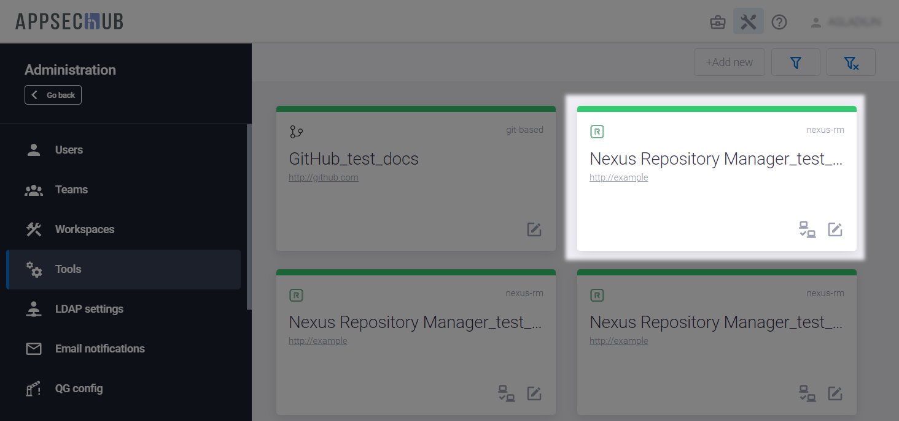</figure>

Нажмите иконку редактирования инструмента  в правом нижнем углу карточки, чтобы изменить параметры его конфигурации. В появившемся окне **Update tool** доступны для редактирования те же поля, что и в окне **Create tool**, за исключением **Tool type** и **Product**. Необходимость изменения этих полей означает, что требуется подключение другого инструмента.

## Подключение к TeamCity

Выберите пункт **Tools** в меню, расположенном слева, и нажмите кнопку **+Add new** в правом верхнем углу.

В появившемся окне **Create tool** выберите элемент **ci** из выпадающего меню в поле **Tool type** и элемент **teamcity** из выпадающего меню в поле **Product**.

<figure markdown></figure>

Если выбраны эти два значения, окно **Create tool** выглядит следующим образом.

<figure markdown>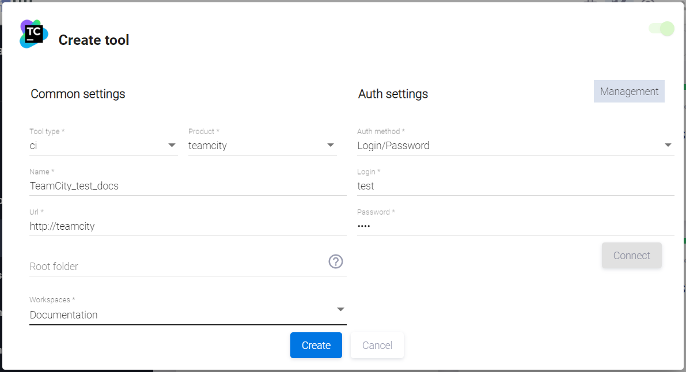</figure>

В этом окне определите следующие параметры для подключаемого инструмента TeamCity.

* Имя инструмента задайте в поле **Name**.
* В поле **URL** укажите URL для инструмента TeamCity.
* **Root project** — этот параметр определяет родительский проект в TeamCity. Если родительский проект с указанным именем в TeamCity не существует, AppSec.Hub создаст его. В рамках родительский проекта будут создаваться Security Pipelines. Такой подход позволяет осуществить структурную организацию пайплайнов в TeamCity, а также, разграничить права доступа к созданным Security Pipelines для команды разработки.
* В поле **Workspaces** выберите рабочее пространство, которое будет использоваться при работе с TeamCity. Это может быть любое доступное рабочее пространство в AppSec.Hub.
* В поле **Auth settings** выберите **Login/password**.
* Введите **Login** и **Password** учётной записи, которая выделена для доступа в данный инструмент.

Нажмите кнопку **Connect** в правой части окна для того, чтобы соединиться с TeamCity.

<figure markdown>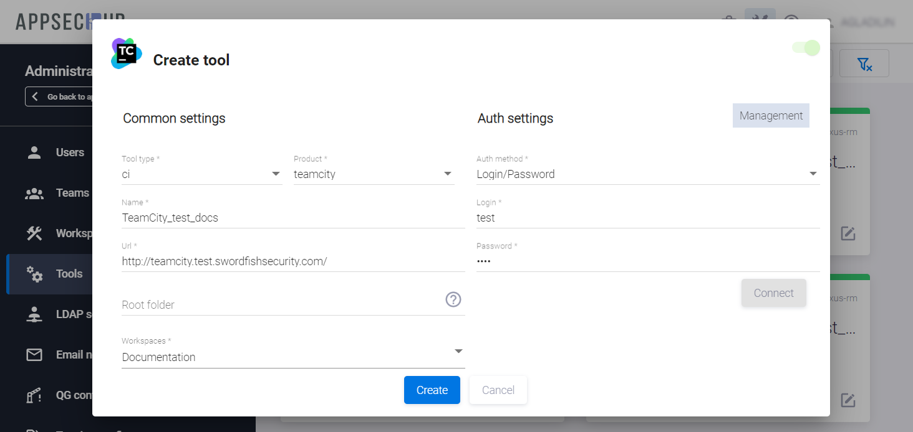</figure>

В правом нижнем углу экрана появится следующее уведомление.

<figure markdown>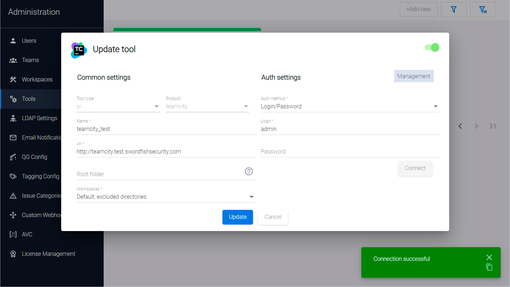</figure>

Перед подключением к инструменту убедитесь, что селектор в правом верхнем углу окна **Create tool** находится в положении «включено», и нажмите кнопку **Create**.

В правом нижнем углу экрана появится соответствующее уведомление о создании нового экземпляра инструмента TeamCity.

Карточка вновь подключенного инструмента отобразится на странице инструментов (**Tools**), а также на странице соответствующего рабочего пространства (**Workspaces/ Workspaces name**).

Существует возможность проверить соединение для инструмента TeamCity, нажатием на иконку **Test connection**  в правом нижнем углу карточки инструмента. Статус подключения инструмента будет подтвержден подтверждается в правом нижнем углу страницы **Tools**.

<figure markdown>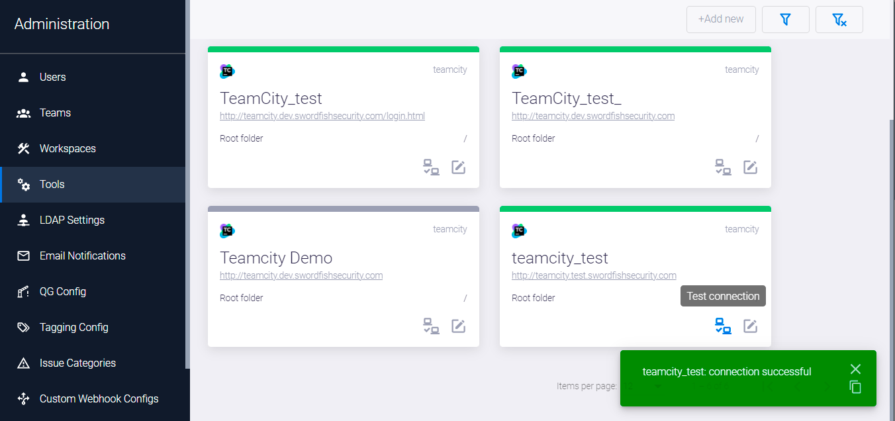</figure>

## Подключение к Jenkins

Выберите пункт **Tools** в меню, расположенном слева, и нажмите кнопку **+Add new** в правом верхнем углу.

В появившемся окне **Create tool** выберите **ci** в поле **Tool type** и **jenkins** в поле **Product**:

<figure markdown>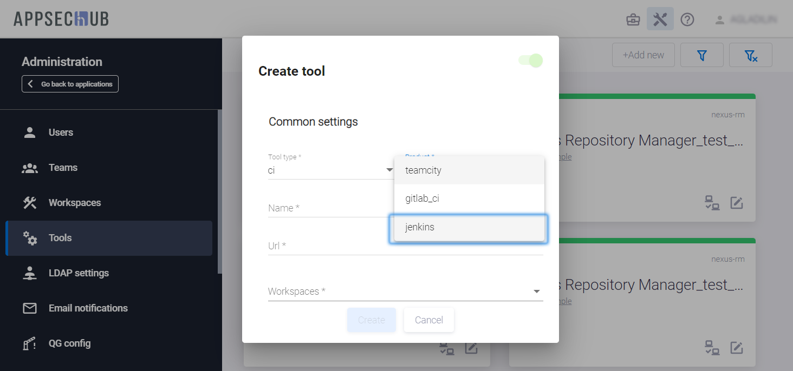</figure>

После выбора этих значений окно **Create tool** выглядит следующим образом:

<figure markdown>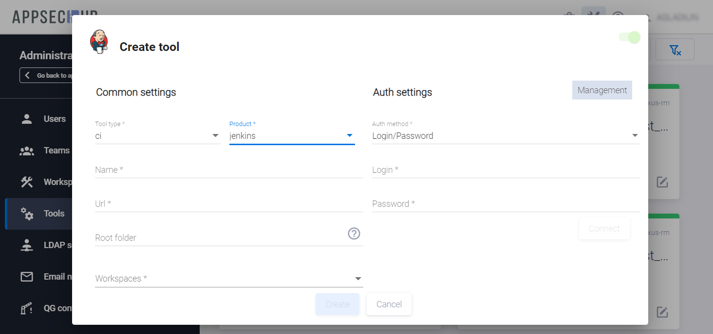</figure>

В этом окне определите следующие параметры для подключаемого инструмента Jenkins:

* Имя инструмента, используемое внутри AppSec.Hub, задайте в поле **Name**.
* В поле **URL** укажите URL для инструмента Jenkins.
* **Root folder** – этот параметр определяет корневую папку в Jenkins. Если это поле оставить пустым, корневой папке в Jenkins по умолчанию будет присвоено значение «/». Если папка с указанным именем в Jenkins не существует, AppSec.Hub создаст ее. Определение корневой папки необходимо для работы пайплайнов и для управления разрешениями на доступ, что может быть важно для организации работы крупных компаний
* В поле **Workspace** выберите рабочее пространство (-а), которое будет использоваться при работе с Jenkins. Это может быть любое доступное рабочее пространство в AppSec.Hub
* В поле **Authentication method** выберите **Login/password**, для работы с Jenkins это — это единственный доступный способ авторизации.

Нажмите кнопку **Connect** в правой части окна для того, чтобы соединиться с Jenkins:

<figure markdown></figure>

Перед подключением к инструменту убедитесь, что селектор в правом верхнем углу окна **Create tool** находится в положении «включено», и нажмите кнопку **Create**.

Карточка вновь подключенного инструмента отобразится на странице инструментов (**Tools**), а также на странице соответствующего рабочего пространства (**Workspaces/ Workspaces name**).

Существует возможность проверить соединение для инструмента Jenkins, нажатием на иконку **Test connection**  в правом нижнем углу карточки инструмента. Статус подключения инструмента будет подтвержден подтверждается в правом нижнем углу страницы **Tools**:

<figure markdown></figure>

## Подключение к Jira

Подключение к Jira выполняется с использованием тех же шагов, что и в случаях с подключением Bitbucket и TeamCity.

Выберите пункт **Tools** в меню, расположенном слева, и нажмите кнопку **+Add new** в правом верхнем углу.

В появившемся окне **Create tool** выберите элемент **tracking** из выпадающего меню в поле **Tool type** и элемент **jira** из выпадающего меню в поле **Product**:

<figure markdown></figure>

Если выбраны эти два значения, окно **Create tool** выглядит следующим образом.

<figure markdown></figure>

В этом окне определите следующие параметры для подключаемого инструмента Jira:

* Имя инструмента задайте в поле **Name**.
* В поле **URL** укажите URL для инструмента Jira.
* В поле **Workspace** выберите рабочее пространство, которое будет использоваться при работе с Jira. Это может быть любое доступное рабочее пространство в AppSec.Hub.
* В поле **Authentication method** выберите **Login/password** (Обратите внимание, что старые версии Jira (до мая 2020 г.) не требуют Account ID, но если вы используете Jira более новой версии (май 2020 г. или новее), вы должны указать Account ID в учетных данных пользователя).
* Введите **Login** и **Password** учётной записи, которая выделена для доступа в данный инструмент. Если выбран метод аутентификации **Login/Account Id/Password**, также укажите параметр **Account Id**.

Нажмите кнопку **Connect** для того, чтобы соединиться с Jira.

<figure markdown></figure>

Перед подключением к инструменту убедитесь, что селектор в правом верхнем углу окна **Create tool** находится в положении «включено», и нажмите кнопку **Create**.

В правом нижнем углу экрана появится уведомление, подтверждающее успешное соединение с Jira.

Карточка вновь подключенного инструмента отобразится на странице инструментов (**Tools**), а также на странице соответствующего рабочего пространства (**Workspaces/ Workspaces name**).

Подключение к Jira требует дополнительной тщательной настройки параметров подключения для работы с дефектами безопасности. Эти настройки должны выполняться пользователем с правами Менеджера для каждого приложения. Подробное описание приведено в разделе «[Синхронизация с Jira — настройки](../../ug/setting%20of%20synchronisation%20with%20Jira/#jira)» Руководства пользователя.