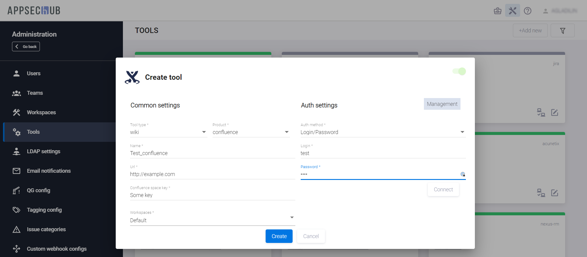

# Интеграция с инструментами Wiki

## Подключение к Confluence

!!! note "Примечание"
    Для выполнения нижеописанных действий требуется роль Администратора.

Подключение Confluence осуществляется на странице администрирования AppSec.Hub, см. раздел «[Интеграция с инструментами разработки ПО](../integration%20with%20software%20development%20tools/#_1)».

Выберите пункт **Tools** в меню, расположенном слева, и нажмите кнопку **+Add new** в правом верхнем углу.

В появившемся окне **Create tool** выберите элемент **wiki** из выпадающего меню в поле **Tool type** и элемент **confluence** из выпадающего меню в поле **Product**.

<figure markdown></figure>

Если выбраны эти два значения, окно **Create tool** выглядит следующим образом.

<figure markdown></figure>

В этом окне определите следующие параметры для подключаемого инструмента Confluence:

* Имя инструмента задайте в поле **Name**.
* В поле **URL** укажите URL для инструмента Confluence.
* **Confluence space key** — введите ключ пространства Confluence.
* В поле **Workspace** выберите рабочее пространство, которое будет использоваться при работе с Confluence. Это может быть любое доступное рабочее пространство в AppSec.Hub.
* В поле **Authentication method** выберите **Login/password**, для работы с Confluence это единственная опция.
* Введите **Login** и **Password** учётной записи, которая выделена для доступа в данный инструмент.
* Информационное поле **Management** в правом верхнем углу **Create tool** предназначено для отображения информации о категориях используемых учетных записей. На данный момент функциональность в полной мере не реализована.

Нажмите кнопку **Connect** для того, чтобы соединиться с Confluence.

<figure markdown></figure>

AppSec.Hub отправит запрос на подключение к Confluence. Если соединение было успешным, в правом нижнем углу экрана появится соответствующее уведомление.

Перед подключением к инструменту убедитесь, что селектор в правом верхнем углу окна **Create tool** находится в положении «включено», и нажмите кнопку **Create**. В правом нижнем углу экрана появится соответствующее уведомление.

Карточка вновь подключенного инструмента отобразится на странице инструментов (**Tools**), а также на странице соответствующего рабочего пространства (**Workspaces/Workspaces name**).