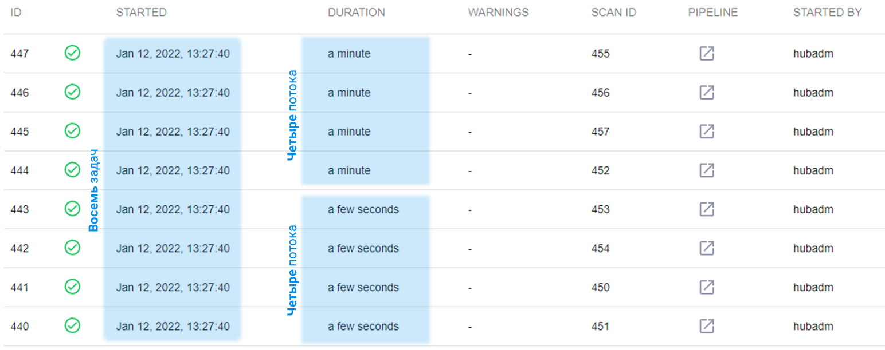

# Управление количеством задач/потоков импорта

Нижеописанные настройки выполняются прикладным системным администратором.

В AppSec.Hub предусмотрена возможность управления количеством одновременно запускаемых задач/потоков импорта.

Настройка осуществляется посредством редактирования конфигурационного файла **app.properties**, расположенного в директории `/opt/apphub/config/hub-core/` (если выбрана рекомендуемая директория установки AppSec.Hub).

Для настройки в файле **app.properties** необходимо отредактировать следующие параметры:

* `hub.config.importIssueThreadPoolSize` — количество одновременно выполняемых задач импорта в системе (значение по умолчанию: 8);

* `hub.config.importConfigThreadPoolSize` — количество одновременно выполняемых потоков импорта (значение по умолчанию: 8). В рамках одной задачи импорта может одновременно запускаться несколько потоков, например, при импорте из нескольких инструментов AST.

Чтобы продемонстрировать влияние данных параметров на характер импорта, установим для первого параметра значение «8», а для второго — «4». При одновременном запуске большого количества задач импорта можно заметить, что восемь задач импорта были запущены одновременно, но поскольку количество потоков ограничено вторым параметром до четырех, задачи выполняются последовательно по мере появления новых свободных потоков (в нашем примере по четыре). Соответственно продолжительность выполнения этих задач разная, см. колонку **Duration**.

<figure markdown></figure>

!!! note "Примечание"
    После изменения параметров в файле app.properties необходимо выполнить рестарт системы см. разделы «[Остановка AppSec.Hub](../installing%2C%20running%20and%20updating%20AppSec.Hub/#appsechub_3)» и «[Запуск AppSec.Hub](../installing%2C%20running%20and%20updating%20AppSec.Hub/#appsechub_2)».