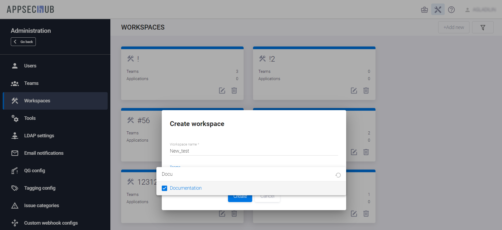
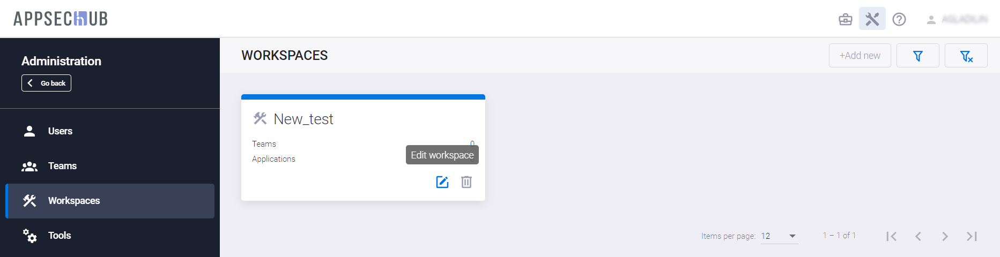
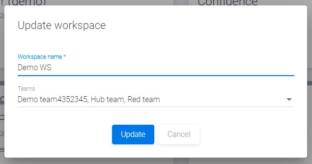
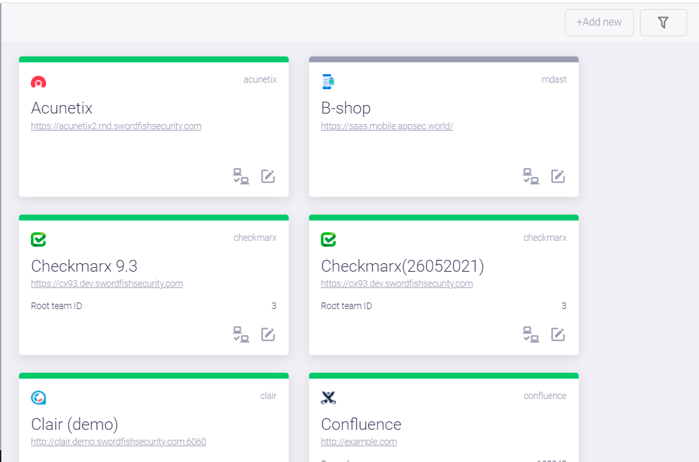
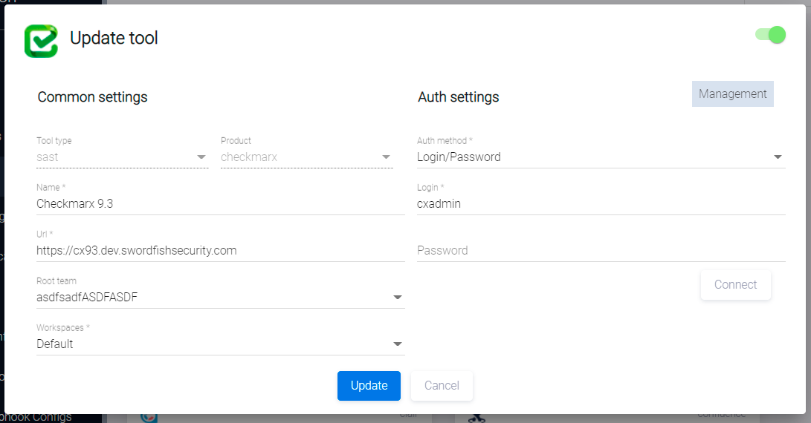

# Организация рабочих пространств

!!! note "Примечание"
    Для выполнения нижеописанных действий требуется роль Администратора.

Нажмите на иконку администрирования  в правом верхнем углу экрана. На экране появится страница администрирования.

Рабочие пространство (workspace) в системе объединяет команды, приложения и инструменты разработки в единое целое — среду для разработки программного обеспечения. Такая организация работы позволяет членам одной команды работать в одном и том же четко определенном рабочем пространстве, используя одну и ту же среду разработки, с одним и тем же набором инструментов и с одинаковой конфигурацией каждого инструмента. Кроме того, система позволяет нескольким командам использовать одно и то же рабочее пространство, если это является целесообразным для разработки приложения.

Для создания и настройки рабочих пространств предназначен пункт меню **Workspaces** в консоли слева. В самом начале работы с AppSec.Hub существует только одно предустановленное рабочее пространство — Default workspace. Все остальные рабочие пространства должны создаваться пользователем с правами Администратора.

Для создания нового рабочего пространства нажмите кнопку **+Add new**. В появившемся диалоговом окне **Create workspace** укажите наименование создаваемого рабочего пространства и выберите команды, которые смогут работать в этом рабочем пространстве.

<figure markdown></figure>

При создании нового рабочего пространства на странице появляется соответствующая ему карточка, а в правом нижнем углу — подтверждающее сообщение.

<figure markdown></figure>

Нажмите на иконку  в правом нижнем углу карточки, чтобы перейти на страницу соответствующего рабочего пространства.

<figure markdown></figure>

Для редактирования наименования рабочего пространства и связанных с ним команд нажмите кнопку **Edit workspace**  в правом верхнем углу страницы рабочего пространства. В появившемся окне **Update workspace** можно отредактировать имя рабочего пространства и привязать к нему команды, выбрав их из раскрывающегося списка. Для сохранения изменений нажмите кнопку **Update** внизу окна.

<figure markdown></figure>

После того как новое рабочее пространство создано, Администратор может привязать к нему инструменты, используя пункт меню **Tools** в консоли **Administration**.

<figure markdown></figure>

Нажмите на иконку редактирования  в правом нижнем углу карточки, чтобы обновить список привязанных к нему рабочих пространств. На экране появится окно **Update tool**.

<figure markdown></figure>

В поле **Workspaces** выберите рабочие пространства из выпадающего меню и нажмите кнопку **Update**. Данный инструмент будет доступен во всех указанных рабочих пространствах.

Пользователь с правами Менеджера может привязать к рабочему пространству приложения и команды. Менеджер может привязать приложение к рабочему пространству сразу при добавлении нового приложения в AppSec.Hub или переместить приложение в другое рабочее пространство — подробное описание приведено в разделе «[Настройки приложения](../../ug/application%20settings/#_1)» Руководства пользователя.

Нажмите на иконку корзины  в правом нижнем углу карточки рабочего пространства, чтобы его удалить.

В AppSec.Hub предоставляется возможность найти и отфильтровать существующие рабочие пространства с использованием выпадающих меню — по названию команды **by team name**, по инструменту **by tool product** и по названию приложения **by app name** — с помощью нажатия кнопки **Show filters**  в верхнем правом углу страницы Workspaces.