# Quality Gates

!!! note "Примечание"
    Для выполнения нижеописанных действий требуется роль Администратора.

AppSec.Hub позволяет создать и настроить для работы с приложением Quality Gates (QG) и, таким образом, определить критерии качества для приемки результатов сканирования. На основе критериев Quality Gate система решает, успешно ли завершилась работа Security Pipeline или нет. Если критерии QG оказались не выполнены, результат работы Security Pipeline получает статус «failed» («завершившийся неуспешно»). AppSec.Hub возвращает статус «failed» в инструмент CI/CD (TeamCity), и на этом выполнение пайплайна останавливается. Рекомендуется установить различные критерии QG для пайплайнов, предназначенных для целей разработки, тестирования и выпуска релизов, а также просто не устанавливать критерии QG для кода, находящегося в разработке и не включенного в релиз.

В AppSec.Hub реализовано централизованное управление Quality Gates. На панели администрирования создается определяющий основные критерии конфигурационный профиль Quality Gate, который в дальнейшем может включаться в различные Security Pipelines приложений. Благодаря системному подходу изменение условий профиля приводит к автоматическому и одновременному изменению критериев во всех Security Pipelines, в которых используется данный Quality Gate.

## Создание профиля Quality Gate

Нажав иконку **Administration** , расположенную в правом верхнем углу пользовательского интерфейса AppSec.Hub, перейдите на страницу администрирования системы.

<figure markdown></figure>

Выберите пункт меню **QG Config** и нажмите кнопку **+Add new**.

<figure markdown>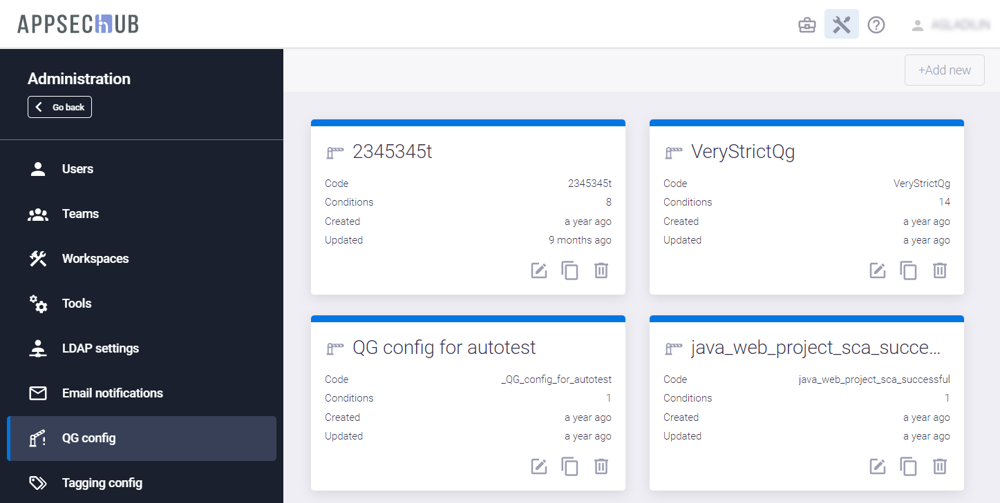</figure>

Укажите имя Quality Gate в поле **Quality Gate Name** и нажмите кнопку **Create**.

<figure markdown>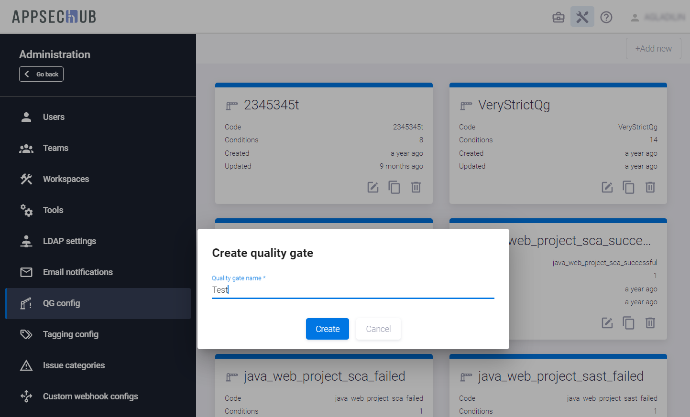</figure>

В правом нижнем углу пользовательского интерфейса появится подтверждающее сообщение, а на странице **QG Config** — карточка соответствующего конфигурационного профиля Quality Gate.

<figure markdown></figure>

На карточке профиля Quality Gate отображаются следующие параметры:

* Наименование Quality Gate.
* Код Quality Gate, который генерируется автоматически при создании профиля и является уникальным в системе.
* Количество заданных условий (**Conditions**).
* Время, прошедшее с создания Quality Gate (**Created**).
* Время, прошедшее с последнего обновления Quality Gate (**Updated**).

## Настройка профиля Quality Gate

Чтобы перейти к настройке профиля Quality Gate, нажмите иконку **Show/edit details** в правом нижнем углу его карточки. Более подробная информация о создании профиля Quality Gates приведена в разделе «[Создание профиля Quality Gate](../quality%20gates/#quality-gate)» см. выше.

<figure markdown></figure>

На странице профиля Quality Gate имеется две вкладки:

* Вкладка **Conditions** используется для определения условий Quality Gate.

    <figure markdown></figure>

* Вкладка **Used in apps** отображает перечень приложений, в которых используется данный Quality Gate.

    <figure markdown>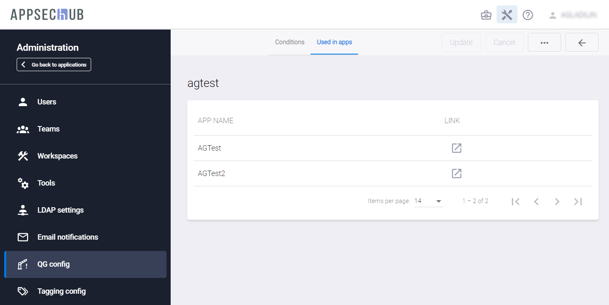</figure>

## Добавление условий Quality Gate

Для добавления в Quality Gate условий перейдя на страницу настройки профиля Quality Gate (см. раздел «[Настройка профиля Quality Gate](../quality%20gates/#quality-gate_1)», нажмите кнопку **+Add new**. В появившемся диалогом окне в поле **Issue type** укажите AST практики, для которых определяются условия.

<figure markdown></figure>

В поле **Issue state** укажите состояния проблем безопасности (доступные значения: **NEW**, **REPEATED**, **ALL**). Информация о настройках алгоритма изменения состояний проблем безопасности приведена в разделе «[Настройка алгоритма изменения состояний проблем безопасности](../../ug/security%20issues/#_7)».

<figure markdown>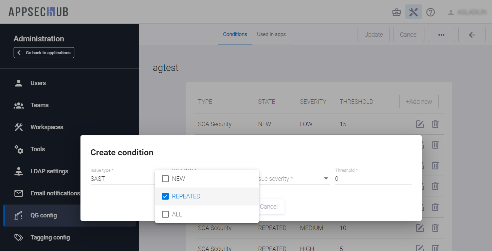</figure>

В поле **Issue severity** укажите степень серьезности Security Issue (доступные значения: **LOW**, **MEDIUM**, **HIGH**, **CRITICAL**).

<figure markdown></figure>

В поле **Threshold** укажите максимально допустимое количество соответствующих уязвимостей.

После выбора необходимых параметров нажмите кнопку **Create** и соответствующие условия будут добавлены в профиль Quality Gate.

<figure markdown>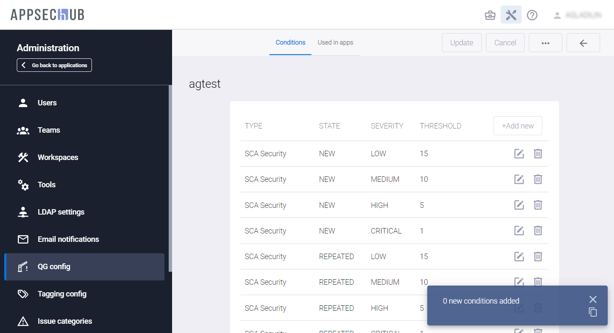</figure>

## Автоматическое добавление условий в Quality Gate

Учитывая широкий диапазон условий, которые могут определяться при создании Quality Gate, и заметные трудозатраты, связанные с добавлением этих условий, предусмотрена функция автоматического добавления критериев. Нажмите кнопку **Actions** сположенную в правом верхнем углу, и в появившемся раскрывающемся меню выберите пункт **Build default**. В Quality Gate будут добавлены все возможные условия и Инженеру ИБ останется только отредактировать пороговые значения для нужных условий и удалить ненужные.

<figure markdown>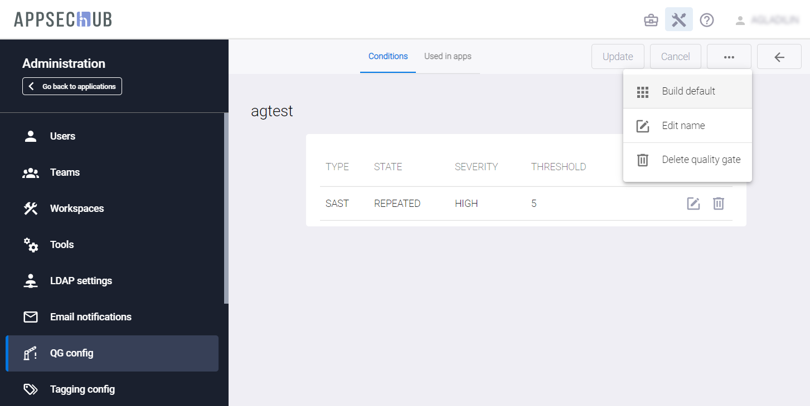</figure>

Для редактирования параметров условия нажмите иконку **Edit** . Измените необходимые значения и нажмите кнопку **Update**, чтобы сохранить изменения.

<figure markdown>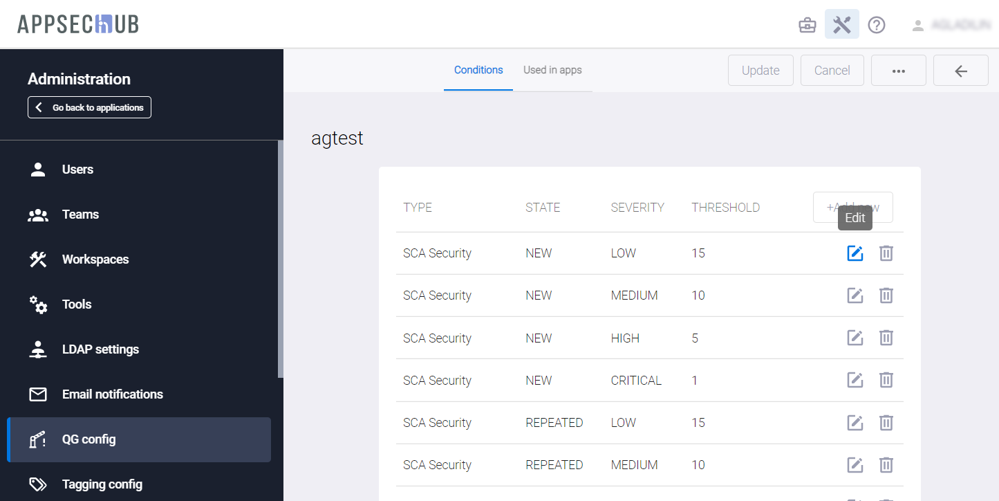</figure>

<figure markdown></figure>

## Удаление условий Quality Gate

Для удаления условия нажмите иконку **Remove** , расположенную справа.

<figure markdown>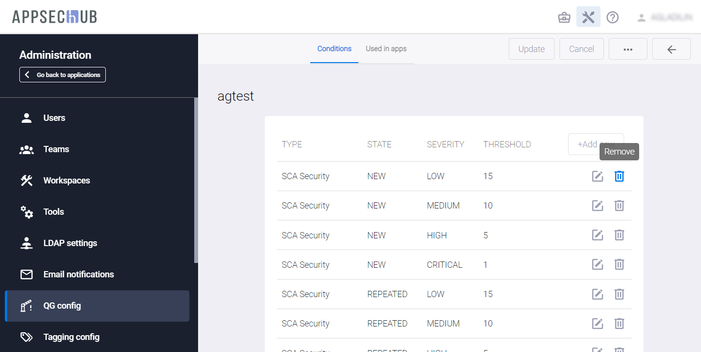</figure>

## Сохранение настроек профиля Quality Gate

После определения необходимых условий нажмите кнопку **Update**, расположенную в правом верхнем углу, чтобы сохранить сделанные изменения, или — кнопку **Cancel**, чтобы отменить их.

<figure markdown></figure>

Кроме этого, находясь на данной странице, можно отредактировать название Quality Gate или удалить его.

Чтобы отредактировать название Quality Gate, нажмите кнопку **Actions** , расположенную в правом верхнем углу пользовательского интерфейса, и в появившемся раскрывающемся меню выберите пункт **Edit name**.

<figure markdown></figure>

В появившемся диалоговом окне укажите новое наименование Quality Gate и нажмите кнопку **Update**.

<figure markdown>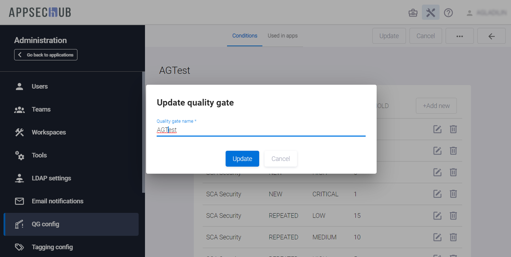</figure>

## Удаление Quality Gate

Чтобы удалить профиль Quality Gate, перейдите на страницу **QG Config**, см. раздел «[Создание профиля Quality Gate](../quality%20gates/#quality-gate)». В правом нижнем углу карточки Quality Gate нажмите иконку **Delete Quality Gate** .

<figure markdown>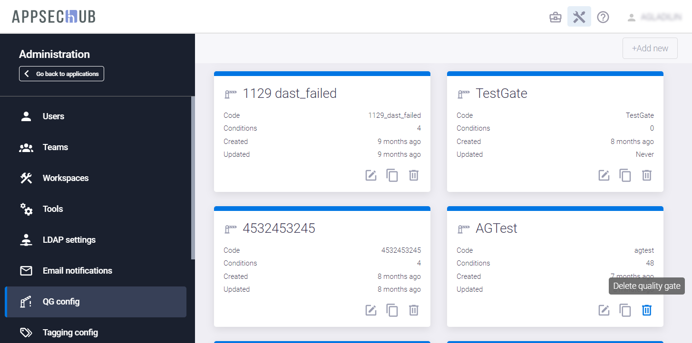</figure>

Для подтверждения удаления Quality gate нажмите кнопку **Confirm**.

<figure markdown>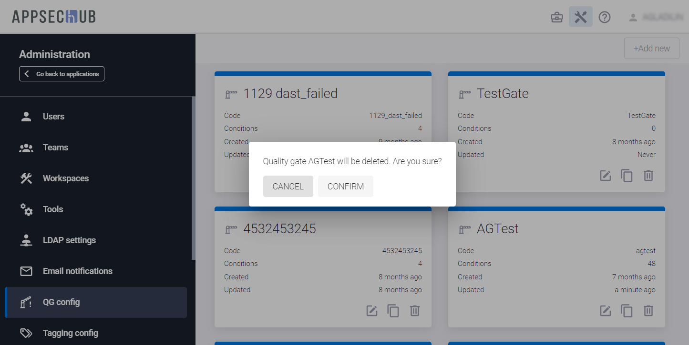</figure>

Кроме этого, профиль Quality Gate можно удалить, находясь на странице настройки его условий, см. раздел «[Добавление условий Quality Gate](../quality%20gates/#quality-gate_2)».

Нажмите кнопку **Actions** , расположенную в правом верхнем углу пользовательского интерфейса, и в появившемся раскрывающемся меню выберите пункт **Delete Quality Gate**.

<figure markdown></figure>

Для подтверждения удаления Quality gate нажмите кнопку **Confirm**.

<figure markdown></figure>

После удаления Quality gate в правом нижнем углу пользовательского интерфейса отобразится соответствующее уведомление.

<figure markdown>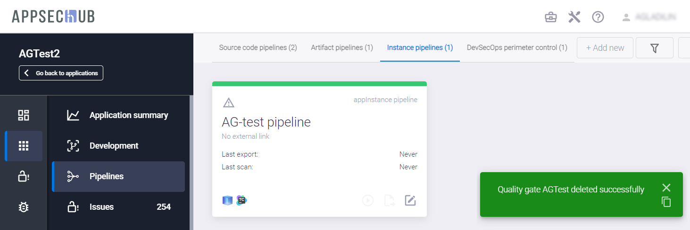</figure>

!!! note "Примечание"
    Если предпринимается попытка удаления Quality Gate, который используется в каких-либо Security Pipelines, в правом нижнем углу пользовательского интерфейса отображается соответствующее предупреждение.

<figure markdown></figure>

В таком случае необходимо предварительно отключить Quality Gate в соответствующем Security Pipeline (s), а затем удалить его. Удобнее всего это сделать следующим образом. Перейдите на страницу настройки профиля Quality Gate, см. раздел «[Настройка профиля Quality Gate](../quality%20gates/#quality-gate_1)». Выберите вкладку **Used in apps**. На данной вкладке отображается перечень приложений, в которых используется данный Quality Gate. Нажав иконку , расположенную в колонке **LINK**, перейдите на страницу соответствующего Security Pipeline и, выбрав в его настройках вкладку **Quality gate**, отключите Quality Gate от Security Pipeline. После этого можно переходить к удалению профиля Quality Gate любым из описанных выше способов.

## Дублирование Quality Gate

Чтобы создать дубликат профиля Quality Gate, в правом нижнем углу карточки Quality Gate нажмите иконку **Duplicate** .

Дублирование профиля Quality Gate может оказаться полезным, если необходимо создать новый профиль с аналогичным набором условий, но, например, с другими пороговыми значениями. В качестве примера можно привести ситуацию, когда аналогичные Quality Gates, но с разными количественными критериями используются для тестирования и релиза приложения.