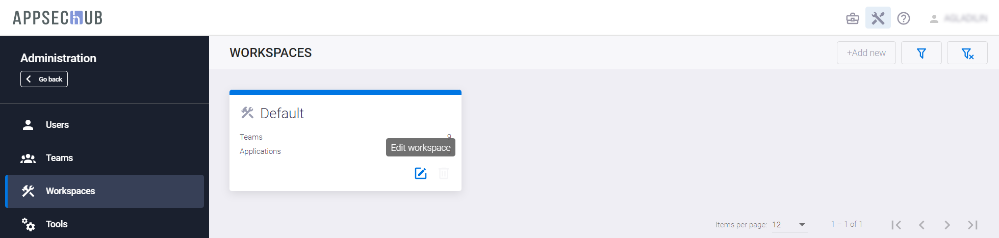
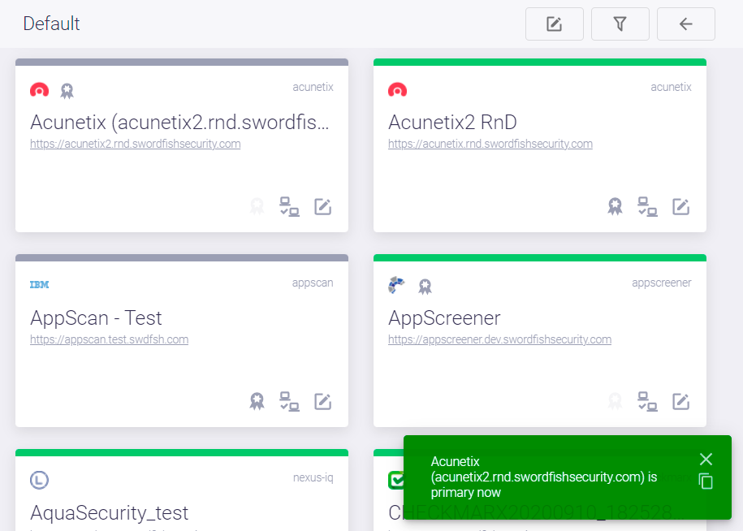

# Выбор приоритетных инструментов

Если для рабочего пространства (Workspace, см. раздел «[Организация рабочих пространств](../organisation%20of%20workspaces/#_1)») определены два и более инструментов одного типа (SAST, SCA и т. д.), предусмотрена возможность отдать приоритет одному из них. Выбор приоритетных инструментов (Primary tools) позволяет сформировать их набор, который в дальнейшем будет использоваться для автоматического создания Security Pipelines, в частности, при onboarding, см. раздел «[Aвтоматизация интеграции AppSec.Hub в цикл разработки (onboarding)](../../ug/on-boarding/#on-boarding-appsechub)» Руководства пользователя. Это позволяет сделать onboarding более предсказуемым.

Нажав иконку **Administration** , расположенную в правом верхнем углу пользовательского интерфейса, перейдите на экран администрирования AppSec.Hub. Выберите пункт меню **Workspaces**, а затем на карточке рабочего пространства нажмите иконку **Edit workspace** .

<figure markdown></figure>

Выберите необходимый инструмент и, нажав иконку **Make tool primary** , установите для него приоритет. В правом нижнем углу пользовательского интерфейса появится подтверждающее сообщение, иконка **Make tool primary** на карточке инструмента станет неактивной, а рядом с логотипом инструмента появится значок **Primary tool**.

<figure markdown></figure>