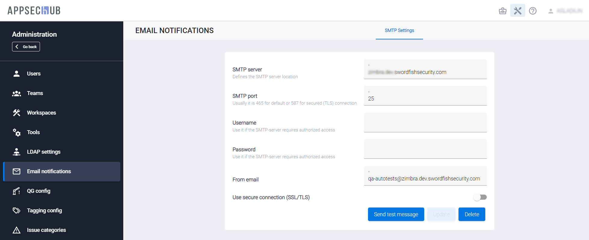

# Настройка уведомлений

Чтобы осуществлять рассылку пользователям уведомлений о различных происходящих в системе событиях, необходимо указать параметры почтового сервера, который будет использоваться для этого.

!!! note "Примечание"
    Для выполнения нижеописанных действий требуется роль Администратора.

Нажмите иконку администрирования  в правом верхнем углу, выберите пункт меню **Email Notifications** и на вкладке **SMTP Settings** укажите необходимые параметры:

* **SMTP server** — адрес SMTP сервера.
* **SMTP port** — номер SMTP порта.
* **Username** — имя пользователя, оно также будет использоваться в поле **From/Отправитель** при рассылке почты.
* **Password** — пароль.
* **From email** — адрес электронной почты, который будет указываться в поле **From/Отправитель** отправляемых уведомлений.

Кроме этого, с помощью соответствующего переключателя, можно включить или отключить использование безопасного соединения SSL/TLS.

Кнопка **Send test message** позволяет разослать тестовое сообщение.

Порядок настройки уведомлений для различных приложений и профиля пользователя приведен в Руководстве пользователя.

<figure markdown></figure>