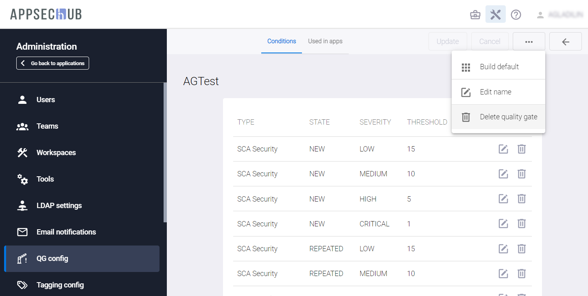
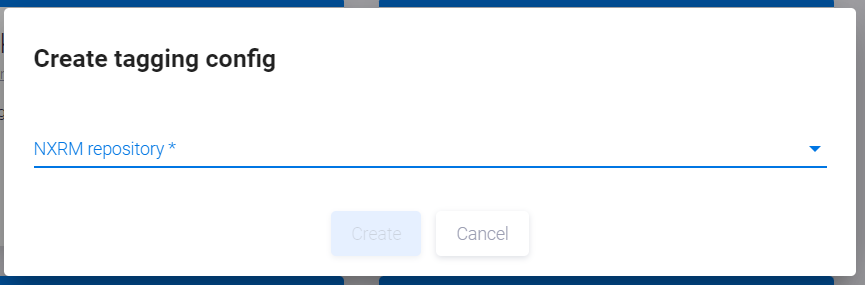
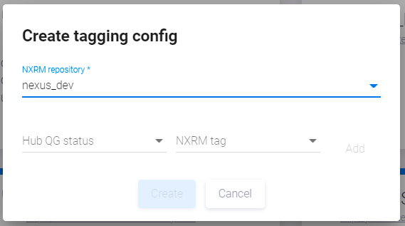

# Настройки тегирования

Теги, которыми может быть помечен артефакт, определяются пользователем с правами Администратора на странице администрирования с помощью пункта меню **Tagging Config**.

Нажмите иконку администрирования  в правом верхнем углу. В открывшейся странице администрирования выберите слева в консоли пункт меню **Tagging Config**. На экране откроется страница **Tagging Config**.

<figure markdown></figure>

Если на этой странице еще не существует карточек конфигурации тегирования для нужного типа инструмента, нажмите кнопку **+Add new** в верхнем правом углу страницы **Tagging Config**, чтобы определить параметры тегирования. На экране появится окно **Create tagging config**.

<figure markdown></figure>

Выберите NXRM repository из выпадающего списка и во вновь появившихся полях **Hub QG status** и **NXRM tag** попарно сопоставьте статусы QG и теги репозитория. Чтобы сопоставить такую пару, кликните поел Hub QG status и выберите статус QG из выпадающего списка. Затем кликните поле NXRM tag и выберите тег репозитория из выпадающего списка.

<figure markdown></figure>

Нажмите кнопку **Add** справа, чтобы добавить вновь созданную пару. Когда все пары созданы, нажмите кнопку **Create** внизу окна.

Нажмите иконку редактирования  на существующей карточке тегирования, чтобы просмотреть и настроить параметры тегирования. На экране появится окно **Update tagging config**.

<figure markdown></figure>

В этом окне отображается экземпляр (instance) репозитория артефактов и соответствие между статусами QG в AppSec.Hub и тегами репозитория. В AppSec.Hub для Quality Gates предусмотрены следующие статусы тегирования:

**SAST_BYPASSED** — сканирование инструментом SAST пропущено.
**SAST_FAILED** — сканирование инструментом SAST прервано.
**SAST_SUCCESSFUL** — сканирование инструментом SAST успешно завершено.

**DAST_BYPASSED** — сканирование инструментом DAST пропущено.
**DAST_FAILED** — сканирование инструментом DAST прервано.
**DAST_SUCCESSFUL** — сканирование инструментом DAST успешно завершено.

**SCA_BYPASSED** — сканирование инструментом SCA пропущено.
**SCA_FAILED** — сканирование инструментом SCA прервано.
**SCA_SUCCESSFUL** — сканирование инструментом SCA успешно завершено.

Сопоставление следует задавать отдельно для каждого репозитория. Некоторые теги и статусы ставятся в соответствие друг другу по умолчанию. При необходимости в инструменте сканирования (в данном случае — Nexus IQ Server) следует создать дополнительные теги для сопоставления. AppSec.Hub определяет практику, используемую во время сканирования (SAST, DAST или SCA), и результат сканирования (успешно или не успешно), выбирает соответствующий тег из списка (например, QG_SAST_PASS в случае успешного сканирования) и маркирует артефакт этим тегом.