# Пользователи и команды

## Роли пользователей

В AppSec.Hub существуют четыре роли пользователей.

**Администратор (Administrator)** определяет системные настройки на организационном уровне: пользователи, команды, рабочие пространства (workspaces), инструменты, тегирование, LDAP (Lightweight Directory Access Protocol), корреляция уязвимостей приложения, Quality Gates, нотификации по электронной почте, управление лицензией системы. Администратор не имеет доступа к работе с приложениями и их настройками, а также к работе с дефектами.

**Менеджер (Manager)** работает с одним или несколькими приложениями. Менеджер может добавлять/удалять кодовые базы, артефакты, экземпляры приложений, выполнять настройку приложений, устанавливать критерии качества с помощью QG. Менеджер не имеет доступа к настройкам организации. Он также не может работать с дефектами и уязвимостями.

**Инженер по информационной безопасности (Инженер ИБ, Security Engineer)** работает с техническим долгом, анализирует уязвимости, определяет взаимосвязь между проблемами безопасности и управляет дефектами. Инженер ИБ не имеет доступа к настройкам организации и настройкам приложения.

**Разработчик (Developer)** имеет доступ к информации в AppSec.Hub с правами только на чтение. Он может получать информацию, но не имеет прав на внесение каких-либо изменений. Исключением является возможность редактирования отдельных данных в профиле пользователя.

Возможно совмещение всех четырех ролей у одного пользователя.

В системе предусмотрено два типа пользователей с разным типом аутентификации:

* Локальные пользователи AppSec.Hub.
* LDAP (Lightweight Directory Access Protocol) пользователи. Управление LDAP пользователями производится в основном с помощью внешних программных инструментов сторонних производителей. LDAP пользователи просто импортируются в систему. Механизм LDAP реализован в ряде программных продуктов, таких как OpenLDAP, Microsoft Active Directory и др.

## Настройка профиля пользователя

Нажмите на значок пользователя  в правом верхнем углу, и после этого выберите элемент меню **User profile** из выпадающего меню, чтобы получить доступ к настройкам профиля пользователя.

<figure markdown></figure>

Прокрутите страницу профиля пользователя вниз, чтобы получить информацию о его роли в системе, доступе к рабочим пространствам (workspaces) и приложениям, а также членству в различных командах в AppSec.Hub.

<figure markdown></figure>

На этой странице также можно изменить пароль пользователя и адрес электронной почты, используя кнопку **Change password** справа. Данная функциональность доступна только для локальных учетных записей.

Выберите пункт **Tokens** в меню слева, чтобы просмотреть список токенов пользователя. Он может быть пустым.

<figure markdown>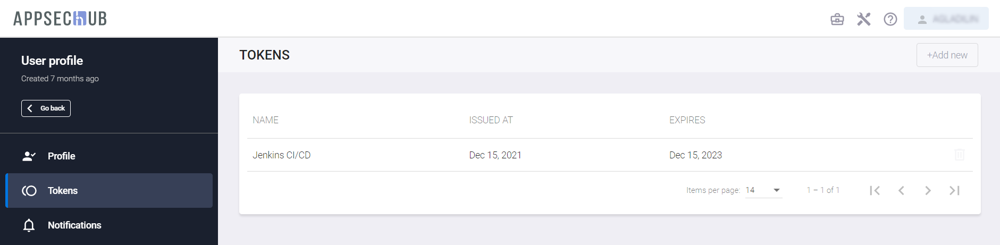</figure>

Выберите пункт **Notifications** в меню слева, чтобы установить настройки получения оповещений от системы о событиях на указанный в профиле пользователя адрес электронной почты. У каждого из событий можно переключить селектор в положение «включено», чтобы получать нотификацию о событиях этого типа.

<figure markdown>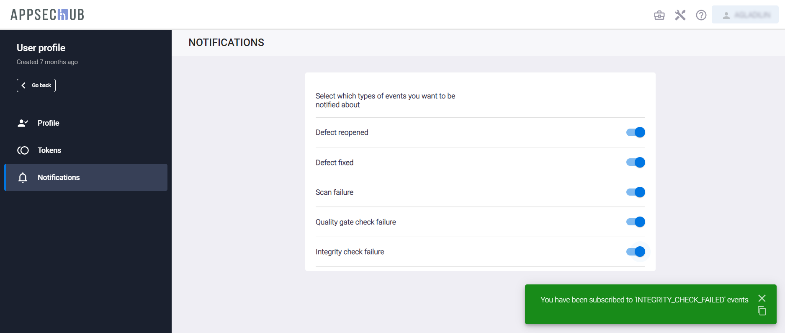</figure>

## Администрирование пользователей и команд

!!! note "Примечание"
    Для выполнения нижеописанных действий требуется роль Администратора.

Нажмите на иконку администрирования  в правом верхнем углу экрана. На экране появится страница администрирования.

<figure markdown>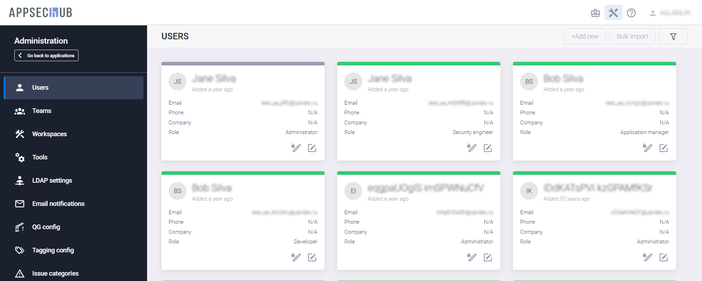</figure>

Используйте пункты меню слева для выполнения следующих настроек:

* **Users** — создание новых пользователей. Назначение пользователям ролей в системе.
* **Teams** — создание новых команд и добавление/удаление пользователей в команды. Новый пользователь автоматически добавляется в команду **Default team**.
* **LDAP Settings** — конфигурирование LDAP.

Нажмите иконку редактирования  в правом нижнем углу карточки пользователя, чтобы изменить настройки. Используя выпадающее меню в окне **Edit user data**, выберите необходимые роли.

<figure markdown>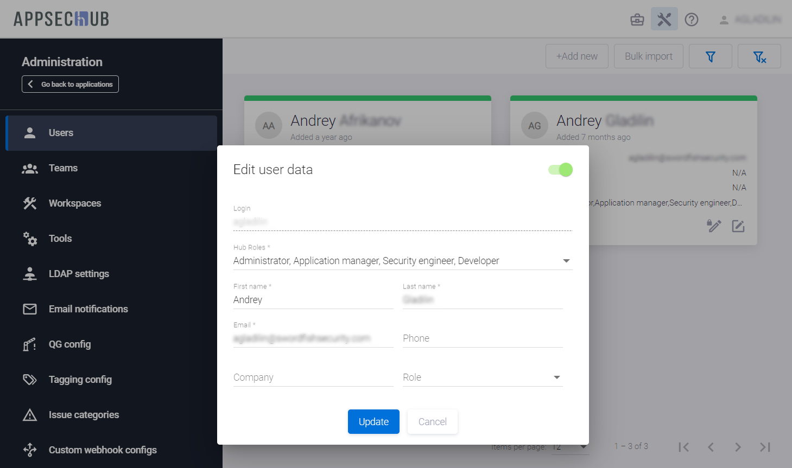</figure>

Нажмите кнопку **Update** внизу окна, чтобы сохранить изменения.

## Добавление пользователя

Выберите пункт меню **Users** в консоли слева и нажмите кнопку **+Add new**, чтобы добавить нового пользователя. Новый пользователь будет автоматически по умолчанию добавлен в команду Default team (В AppSec.Hub всегда существует предустановленная команда Default team). До момента создания других команд в системе все пользователи входят и могут быть добавлены только в эту команду.

На экране появится окно **Add user**.

<figure markdown>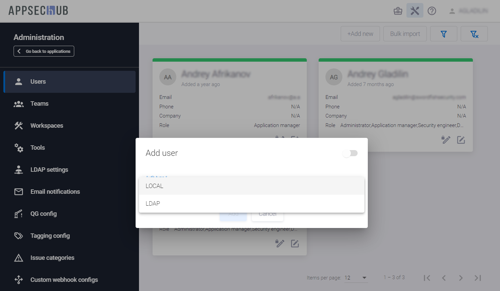</figure>

В этом окне определите, является ли пользователь локальным или LDAP-пользователем (внешним), используя выпадающее меню в поле **Auth type**. Заполните остальные поля окна информацией о пользователе. Поле **Hub Roles** предоставляет выпадающий список с ролями пользователей системы (Administrator, Manager, Security Engineer, Developer).

<figure markdown>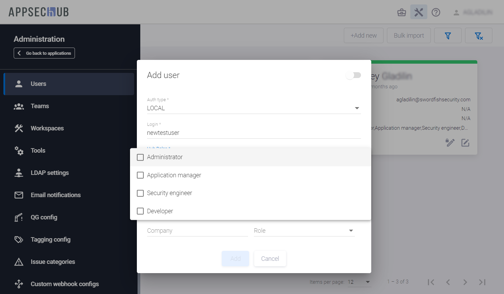</figure>

Нажмите кнопку **Add**, чтобы создать нового пользователя. Уведомление о создании нового пользователя появится в правом нижнем углу экрана, а на странице **Users** появится карточка вновь созданного пользователя. При этом на указанную электронную почту будет направлено уведомление с приглашением присоединиться к работе в системе.

<figure markdown>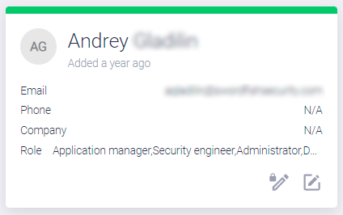</figure>

Нажмите на кнопку редактирования **Edit user**  в правом нижнем углу карточки пользователя, чтобы изменить настройки.

Нажмите на иконку **Change user password**  в правом нижнем углу карточки пользователя, чтобы изменить пароль пользователя.

## Поиск пользователя

Предусмотрена возможность поиска существующих пользователей системы с использованием кнопки **Show filters** 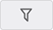, расположенной в правом верхнем углу. Чтобы найти пользователя или пользователей, нажмите эту кнопку и введите один из параметров для поиска пользователей в поле **by login**, **first**/**last name**, **email**.

<figure markdown>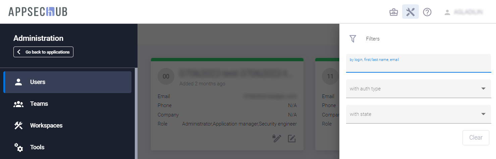</figure>

Список пользователей, соответствующих заданному критерию поиска, появится на экране.

Также существует возможность отфильтровать существующих пользователей, используя выпадающие меню **with auth type** и **with state**. Выберите пункты Local users, LDAP users или All auth types в меню **with auth type**. На экране появится список пользователей с соответствующим типом аутентификации. Выберите пункты **Active users**, **Non active users** или **All states** в меню **with state**. На экране появится список пользователей с соответствующим состоянием.

Настройки фильтра сохраняются в системе между сессиями пользователя. Нажмите кнопку **Reset filters**  в правом верхнем углу, чтобы сбросить все установленные фильтры.

## Пользователи и настройки LDAP

### Конфигурация LDAP сервиса

LDAP пользователи могут быть добавлены в AppSec.Hub только после конфигурации настроек LDAP. Выберите пункт меню **LDAP Settings** в консоли слева.

<figure markdown>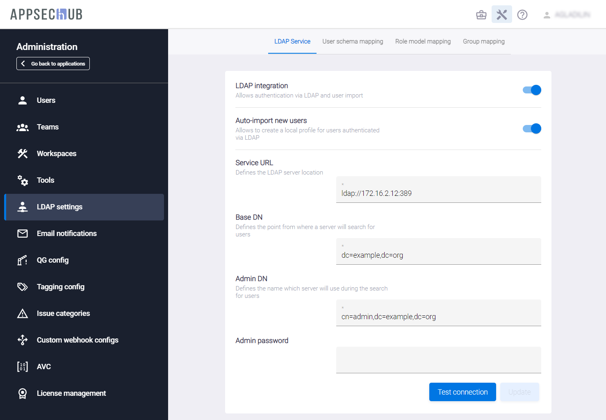</figure>

Полностью настроенная страница параметров LDAP содержит настройки, определенные на всех четырех вкладках. Если LDAP настраивается с нуля, начинать настройку следует с вкладки **LDAP Service**. Вкладки **User schema mapping**, **Role model mapping** и **Group mapping** в этом случае пусты и будут заполнены позже.

Вкладка **LDAP Service** содержит несколько полей, которые определяют конфигурацию LDAP.

<figure markdown></figure> 

* Поле **Service URL** содержит URL адрес сервера LDAP (можно использовать как IP адрес, так и имя домена). AppSec.Hub позволяет подключаться только к одному внешнему серверу LDAP. При необходимости можно изменить сервер LDAP на другой, однако для этого сначала следует удалить старую конфигурацию LDAP. На рисунке выше LDAP сконфигурирован для LDAP-сервера Microsoft Active Directory.
* Имя поля **Base DN** (Distinguished Name) является термином LDAP. DN — это атрибут LDAP, который однозначно определяет объект. У каждого DN должны быть уникальные имя и расположение, отличающиеся от всех других объектов в Active Directory. DN предоставляет способ выбора любого объекта в Active Directory. После того, как объект выбран, его атрибуты можно изменить. Base DN является корневым элементом дерева объектов.
* Поле **Admin DN** определяет доступ администратора LDAP и/или другого пользователя LDAP к дереву объектов. Этот доступ необходим для чтения параметров, сопоставления схемы пользователя и сопоставления ролевой модели.
* Поле **Admin Password** используется для установки пароля администратора LDAP. Введите новый пароль и нажмите кнопку **Update** внизу, чтобы установить новый пароль.

Включите переключатель **LDAP integration** в правом верхнем углу вкладки **LDAP Service**, чтобы активировать работу с LDAP в AppSec.Hub.

После того как параметры конфигурации LDAP заданы, нажмите кнопку проверки соединения **Test connection** в нижней части вкладки **LDAP Service**. Подтверждение результата подключения отобразится в правом нижнем углу экрана.

Селектор включения автоматического импорта для новых пользователей **Auto import new users** на вкладке **LDAP Service** может быть включен только после завершения сопоставления схемы пользователя и сопоставления ролевой модели. Подробности приведены в разделах «Сопоставление схемы пользователя» и «Сопоставление ролевой модели» ниже.

### Сопоставление схемы пользователя

Сопоставление схемы пользователя выполняется на вкладке **User schema mapping** на странице LDAP настроек **LDAP Settings**.

Сначала необходимо определить связанные с пользователями классы LDAP в поле **User-related LDAP classes**.

<figure markdown>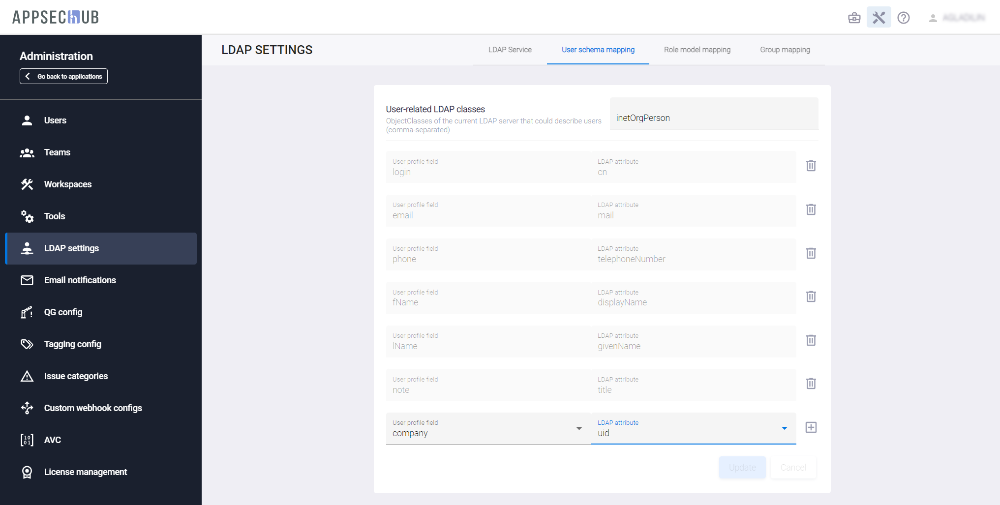</figure> 

После того, как связанные с пользователями классы LDAP были определены, необходимо попарно сопоставить друг с другом поля AppSec.Hub и атрибуты LDAP (взятые, например, из карты Microsoft AD). Чтобы сопоставить такую пару, кликните поле **User profile field** в нижней части вкладки и выберите поле AppSec.Hub из выпадающего списка. Затем кликните поле **LDAP attribute** и выберите атрибут из выпадающего списка.

Чтобы добавить дополнительную пару параметров, нажмите кнопку **Add row**  справа внизу вкладки. Нажмите кнопку **Update** внизу, чтобы сохранить сделанные изменения.

Список попарно сопоставленных элементов может выглядеть как это показано на рисунке ниже.

<figure markdown></figure> 

На этой вкладке обязательно должны быть соотнесены с атрибутами LDAP следующие поля AppSec.Hub:

* **login**;
* **email**.

Сопоставление других полей системы не является обязательным.

### Добавление LDAP пользователя

После того как сопоставление схемы пользователя завершено, можно добавить нового LDAP пользователя в систему, введя логин LDAP пользователя в поле **Find by login** или адрес электронной почты LDAP пользователя в поле **Find by email** в окне **Add user**. Выберите **LDAP** из выпадающего списка в поле **Auth type**, выберите значение **Find by login** или **Find by email**, и введите логин или адрес электронной почты LDAP пользователя.

<figure markdown>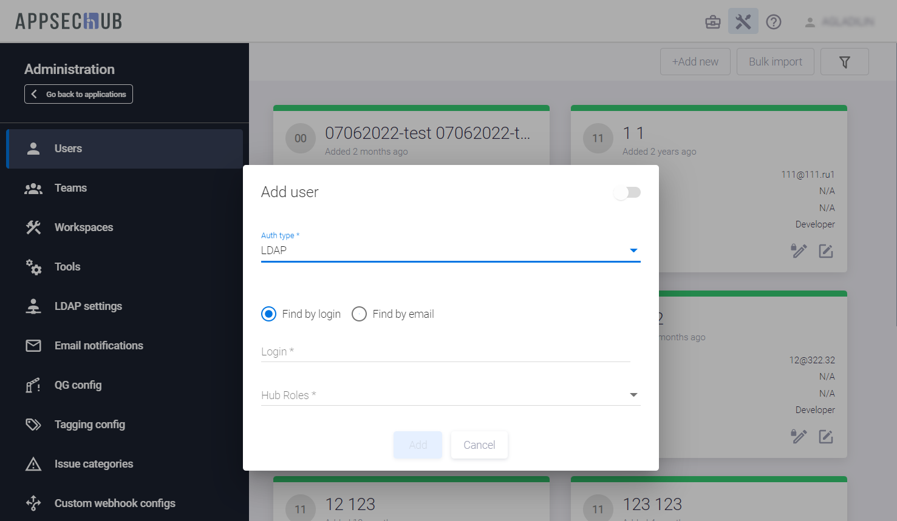</figure> 

Выберите роль пользователя в AppSec.Hub для LDAP пользователя из выпадающего списка в поле **Hub Roles**. Нажмите кнопку **Add** внизу, чтобы добавить нового LDAP пользователя в систему. Новый LDAP пользователь автоматически будет добавлен в команду Default team.

Кроме этого, предусмотрена возможность пакетного импорта пользователей. Нажмите кнопку **Bulk import** в правом вернем углу и подтвердите действие в появившемся диалоговом окне.

<figure markdown>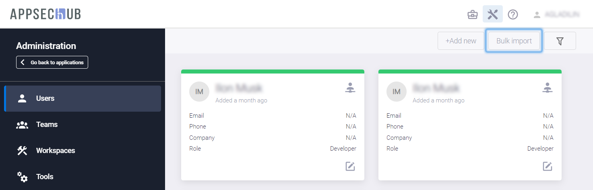</figure>

Выберите пункт меню **Users** в консоли слева и отфильтруйте существующих пользователей с помощью кнопки **Show filters**  в правом верхнем углу. Выберите пункт **LDAP users** в выпадающем меню **with auth type**.

<figure markdown>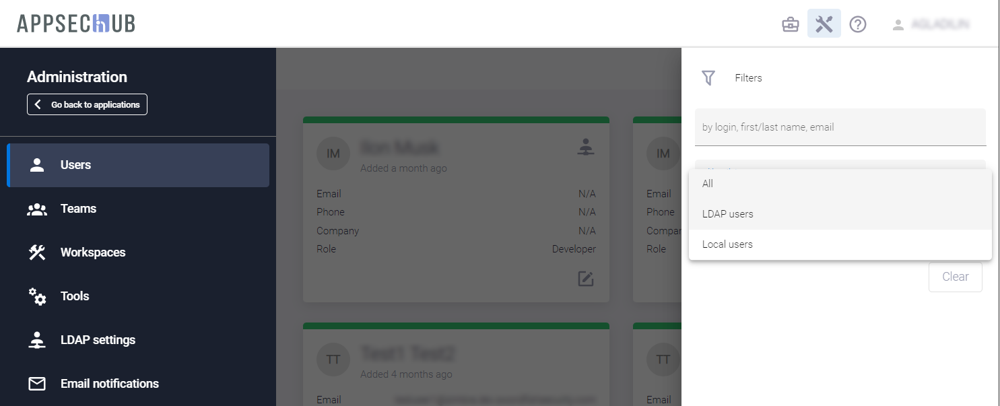</figure>

На экране появится список LDAP пользователей.

<figure markdown></figure>

В отличии от других LDAP пользователи имеют значок  в правом верхнем углу карточки пользователя.

### Сопоставление ролевой модели

Сопоставление ролевой модели определяет соответствие между ролями и группами LDAP и ролями пользователей в AppSec.Hub. Если в AppSec.Hub произведено сопоставление ролевой модели, роли пользователей в системе назначаются LDAP пользователям автоматически.

Сопоставление ролевой модели выполняется на вкладке **Role model mapping** на странице **LDAP Settings**.

<figure markdown>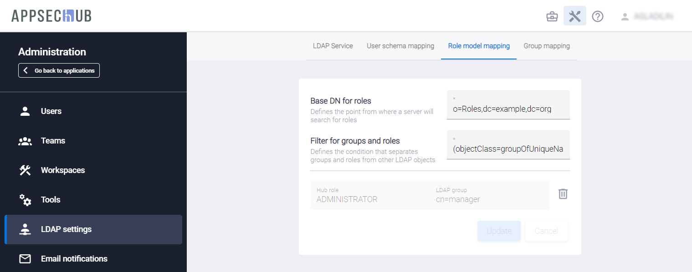</figure>

Поле Base **DN for groups and roles** определяет Base DN в терминах LDAP. Введите фильтр в поле **Filter for groups and roles** и нажмите кнопку **Create** в нижней части вкладки. Сообщение, подтверждающее обновление сопоставления ролевой модели, появится в правом нижнем углу экрана.

На вкладке **Role model mapping** теперь доступны новые поля **Hub role** и **LDAP group**. Чтобы сопоставить роли пользователей в AppSec.Hub и LDAP группы, кликните поле **Hub role** и выберите роль пользователя в системе из выпадающего списка, кликните поле **LDAP group** и выберите группу LDAP из выпадающего списка, а затем нажмите справа кнопку .

<figure markdown></figure>

Список сопоставленных элементов может выглядеть как показано на рисунке выше. В этом случае все пользователи домена LDAP получают роль Developer в AppSec.Hub.

<figure markdown></figure>

Нажмите кнопку **Update** на вкладке справа внизу, чтобы сохранить изменения в сопоставлении ролевых моделей.

### Сопоставление групп

Сопоставление групп определяет соответствие между группами LDAP и командами в AppSec.Hub. В случае, если в системе произведено сопоставление групп, команды в AppSec.Hub назначаются LDAP пользователям автоматически.

Сопоставление групп выполняется на вкладке **Group mapping** на странице **LDAP Settings**.

<figure markdown></figure>

Поле **Base DN for groups** определяет Base DN в терминах LDAP. Введите фильтр в поле **Filter for groups and roles** и нажмите кнопку **Create** в нижней части вкладки.

На вкладке **Group mapping** теперь доступны новые поля **Hub team** и **LDAP group**. Чтобы сопоставить команды в AppSec.Hub и LDAP группы, кликните поле **Hub team** и выберите команду в системе из выпадающего списка, кликните поле **LDAP group** и выберите группу LDAP из выпадающего списка, а затем нажмите справа кнопку .

Список сопоставленных элементов может выглядеть как показано на рисунке ниже.

<figure markdown></figure>

Нажмите кнопку **Update** на вкладке справа внизу, чтобы сохранить изменения в сопоставлении групп.

### Автоматический импорт новых LDAP пользователей

После того как сопоставление ролевых моделей настроено, можно автоматически импортировать новых LDAP пользователей в AppSec.Hub. Включите селектор **Auto import new users** на вкладке **LDAP Service**.

<figure markdown>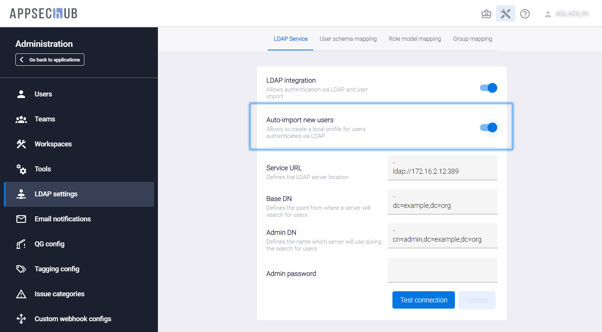</figure>

Если селектор **Auto import new users** включен, новые LDAP пользователи будут автоматически добавляться в AppSec.Hub. В этом случае пользователю системы с правами Администратора больше не нужно добавлять каждого нового LDAP пользователя с помощью кнопки **+Add new** на странице **Users**. Каждый LDAP пользователь с подходящей доменной ролью в Active Directory сможет войти в AppSec.Hub, используя свою учетную запись в домене на странице входа AppSec.Hub.

<figure markdown></figure>

LDAP пользователь получает роль пользователя в системе, в соответствии с тем, как она определена в сопоставлении ролевых моделей. AppSec.Hub автоматически добавляет этого нового LDAP пользователя в список существующих пользователей и в команду Default team, а также заполняет профиль пользователя.

## Создание команды

Для создания новой команды или для добавления пользователей в существующую команду используйте пункт меню **Teams** в консоли слева. Нажмите на кнопку **+Add new**, чтобы добавить новую команду.

<figure markdown></figure>

На экране появится окно **Create new team**.

<figure markdown>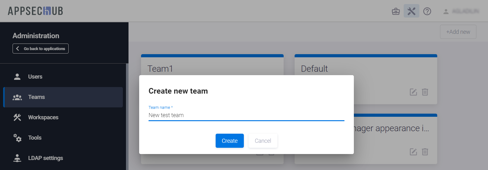</figure>

Введите имя новой команды и нажмите кнопку **Create**. На экране появятся карточка новой команды и соответствующее уведомление в правом нижнем углу экрана.

<figure markdown></figure>

Нажмите кнопку редактирования  на карточке команды. В появившейся странице с информацией о команде нажмите кнопку **Actions** 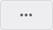. Чтобы добавить пользователя или пользователей в команду, в раскрывающемся меню выберите пункт **Add user**.

<figure markdown>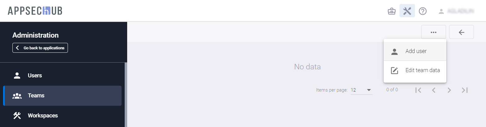</figure>

На экране появится окно **Find and add member to the team**. Дважды нажмите на имя пользователя из списка существующих пользователей, чтобы добавить этого пользователя в команду.

<figure markdown></figure>

Подтверждение о добавлении пользователей в команду появится в правом нижнем углу экрана.

<figure markdown>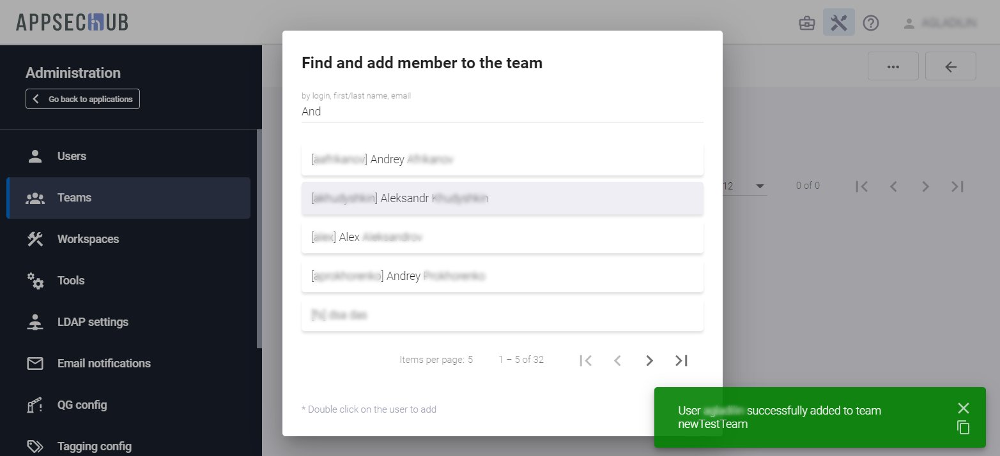</figure>

Чтобы удалить пользователя из команды, нажмите на значок **Delete user from team**  в правом нижнем углу карточки пользователя.

<figure markdown></figure>

## Изменение наименования команды

Нажмите кнопку редактирования  на карточке команды. В появившейся странице с информацией о команде нажмите кнопку **Actions** . Чтобы переименовать команду, выберите пункт **Edit team data** в раскрывающемся меню.

<figure markdown>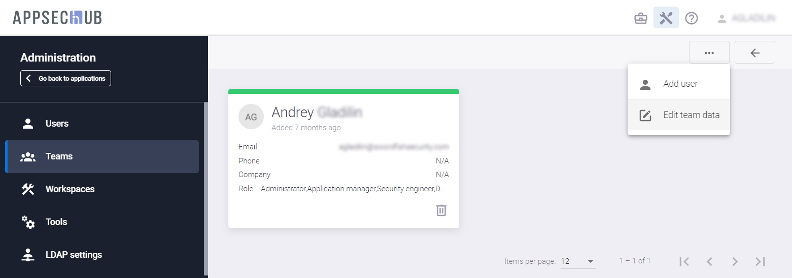</figure>

В появившемся диалоговом окне введите новое наименование команды (**Team name**).

<figure markdown>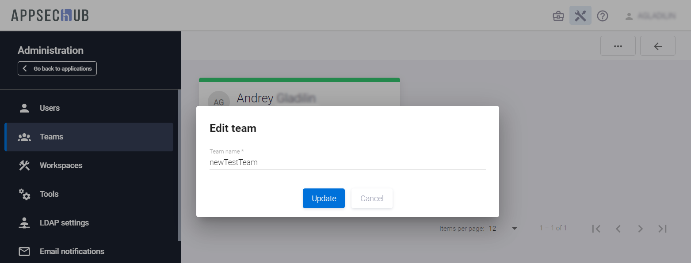</figure>

Нажмите кнопку **Update**, чтобы сохранить изменения.

## Настройки организации и доступ команд

Чтобы настроить параметры организации, нажмите иконку профиля организации  в правом верхнем углу.

На открывшейся странице используйте пункты меню в консоли слева, чтобы определить следующие настройки:

* Пункт меню **Profile**: профиль организации, включая название компании, URL сайта компании, адрес службы поддержки и краткое описание компании. Заметим, что информация, указанная в полях **Signature of support team** и **Email of support team**, отображается при завершении скриптов, которые используются для автоматической интеграции AppSec.Hub в единый цикл разработки программного обеспечения. Более подробная информация об автоматической интеграции приведена в разделе «[On-boarding — автоматизация интеграции AppSec.Hub в цикл разработки](../../ug/on-boarding/?h=bo#on-boarding-appsechub)» Руководства пользователя, а примеры завершающих сообщений в CLI можно посмотреть в «[Приложении 3. Результаты сканирования](../../ug/appendix%203/#3)» Руководства пользователя.

    <figure markdown></figure>

* Пункт меню **Structure**: организационная структура — департаменты, центры экспертизы (centers of excellence), команды. В один отдел может входить несколько команд и наоборот. Структура организации может быть определена не полностью. Структура организации используется для разделения доступа команд AppSec.Hub к инструментам и приложениям. Приложения и инструменты (а значит, и лицензии на эти инструменты) в AppSec.Hub привязаны к командам и, следовательно, и к структуре организации. Подробности приведены в разделе «[Настройки приложения](../../ug/application%20settings/#_1)» Руководства пользователя.

<figure markdown></figure>

Нажмите кнопку **+Add root** в правом верхнем углу, чтобы создать новое подразделение в структуре организации. На экране откроется окно **Create Org Structure**.

<figure markdown></figure>

В этом окне укажите имя нового подразделения в структуре организации в поле **Name** и краткое имя подразделения в поле **Short name**. В выпадающем меню **Type company** выберите тип компании (Empty, Department, COE — Center of Excellence, Team). В выпадающем меню **Parent** выберите родительское подразделение из списка существующих подразделений. Это поле можно оставить пустым. Укажите имя менеджера в поле **Manager** и нажмите кнопку **Create**. Новое структурное подразделение организации появится в структуре организации.

Для создания дочерних подразделений, редактирования или удаления информации о подразделении используется блок кнопок, расположенный справа от его наименования.

<figure markdown>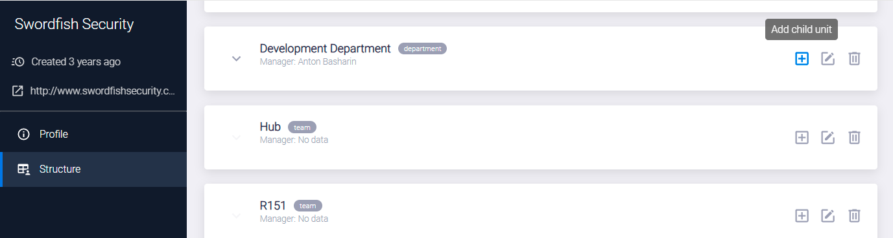</figure>