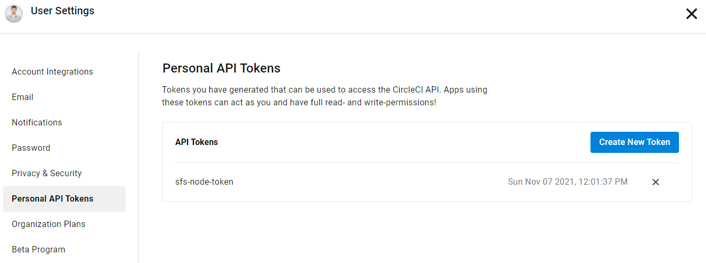
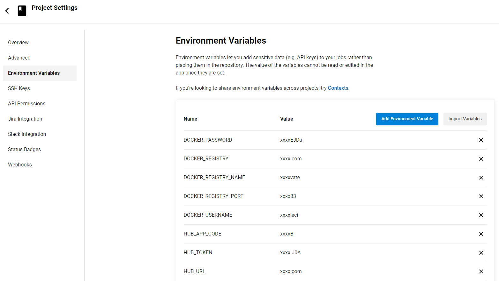

# Интеграция с CircleCI

Включение AppSec.Hub в пайплайн разработки, построенный с использованием CircleCI, позволяет автоматизировать и значительно ускорить сканирование кодовых баз и артефактов в рамках проверок информационной безопасности разрабатываемого ПО.

Интеграция осуществляется с помощью специальных  скриптов AppSec.Hub, работающих через CLI (Command Line Interface). Более подробная информация об AppSec.Hub CLI приведена в соответствующем [разделе](../ii/cli.md).

В данном разделе описаны:

* интеграция с облачной версией CircleCI (cloud);
* установка, запуск и интеграция с CircleCI с использованием собственных программно-аппаратных средств (private node).

## Интеграция с использованием облачного сервиса CircleCI

Процесс интеграции с CircleCI (cloud) включает два этапа:

1. Для успешной интеграции и безопасной работы с репозиториями необходимо добавить в проект CircleCI следующие переменные среды (**Project Settings** > **Environment Variables**). Болле подробная информация приведена в [документации](https://circleci.com/docs/2.0/env-vars/#) сервиса.

    * `DOCKER_USERNAME` — логин для доступа к Docker-регистру, содержащему образ ***hub-cli***.
    * `DOCKER_PASSWORD` — пароль для доступа к Docker-регистру, содержащему образ ***hub-cli***.
    * `HUB_URL` — URL AppSec.Hub (например, `https://hub.your.domain.local`).
    * `HUB_TOKEN` — токен аутентификации AppSec.Hub.
    * `PROJECT_NAME` — имя текущего проекта (например, **OurBank**, который содержит следующие репозитории: ***our-bank-core.git***, ***our-bank-front.git***, ***our-bank-db.git*** и т. д.).
    * `PROJECT_RELEASE` — релиз проекта (например, 2021.4).

2. Далее необходимо в конфигурационный файл ***.circleci/config.yml*** пайплайна каждого репозитория (например, ***our-bank-core.git***) включить следующее задание. Более подробная информация приведена в [документации](https://circleci.com/docs/2.0/workflows/#) сервиса.

        jobs:
        security_checks:
            docker:
            - image: docker.swordfishsecurity.com/hub-cli:latest
                auth:
                username: $DOCKER_USERNAME  # следует использовать переменные среды (см. шаг 1), 
                password: $DOCKER_PASSWORD  # а не указывать непосредственные значения
            steps:
                - run:
                    name: check_source_code
                command: |
                    python3 /opt/scan/scan_codebase.py \
                        --url  $HUB_URL --token "$HUB_TOKEN" \
                        --appcode "$PROJECT_NAME" \
                        --codebase-url "ssh://$CIRCLE_REPOSITORY_URL"
                        --codebase-build-tool maven \
                        --branch "$CIRCLE_BRANCH" \
                        --unit "$CIRCLE_PROJECT_REPONAME"
                - run:
                    name: check_artifact
                    command: |
                        python3 /opt/scan/scan_artifact.py \
                        --url  $HUB_URL --token "$HUB_TOKEN" \
                        --appcode "$PROJECT_NAME" \
                        --artifact-url https://nexus.company.com/repository/docker-private/v2/$CIRCLE_PROJECT_REPONAME/manifests/$PROJECT_RELEASE.$CIRCLE_BUILD_NUM
                        --unit "$CIRCLE_PROJECT_REPONAME"

## Интеграция с локально установленным CircleCI

В отдельных случаях для запуска среды выполнения заданий может потребоваться использование собственных программно-аппаратных средств.

Процесс интеграции с CircleCI (with private node) включает несколько этапов. В начале необходимо развернуть среду выполнения заданий (self hosted runner) и зарегистрировать ее как ***your-company-namespace/appsec-node***:

1.	Запустите виртуальную машину (Ubuntu 20.04 с Docker), на которой планируется запуск среды.

2.	Установите  **CircleCI CLI** на машину с ОС Linux или на эту же виртуальную машину. В целях повышения информационной безопасности рекомендуется использовать отдельную виртуальную машину. Более подробная информация приведена в [документации](https://circleci.com/docs/local-cli) сервиса.

        curl -fLSs https://raw.githubusercontent.com/CircleCI-Public/circleci-cli/master/install.sh | sudo bash
    
3.	На странице настроек **CircleCI** (**User Settings** > **Personal API Tokens**) создайте API-токен.

    <figure markdown>
    
    </figure>
 
4.	Запустите `circleci setup` и укажите созданный токен. Также укажите `CircleCI Server URL` (или используйте значение по умолчанию):

        $ circleci setup
        ? CircleCI API Token ****************************************
        API token has been set.
        ? CircleCI Host https://circleci.com
        CircleCI host has been set.
        Setup complete.
        Your configuration has been saved to /home/ubuntu/.circleci/cli.yml.

        Trying an introspection query on API to verify your setup... Ok.
        Trying to query our API for your profile name... Hello, ******@gmail.com.

5.	Создайте пространство имен

        circleci namespace create <name> <vcs-type> <org-name>

    !!! example "Например"
            Например, если URL вашего GitHub — `https://github.com/circleci`, укажите:
        
                circleci namespace create your-company-namespace github circleci

    и класс ресурсов.

        circleci runner resource-class create <name>/<resource-class> <description> --generate-token

    !!! example "Например"  
                circleci runner resource-class create your-company-namespace/appsec-node appsec-node-description --generate-token

    !!! note "Важно"
        Скопируйте сгенерированный токен!

6.	Создайте скрипт ***install_circleci.sh***, чтобы установить бинарные файлы Сircle CI на виртуальную машину.

        #!/bin/bash
        # Set up runner directory
        prefix=/opt/circleci
        sudo mkdir -p "$prefix/workdir"
        platform="linux/amd64"
        # Downloading launch agent
        echo "Using CircleCI Launch Agent version $agent_version"
        echo "Downloading and verifying CircleCI Launch Agent Binary"
        base_url="https://circleci-binary-releases.s3.amazonaws.com/circleci-launch-agent"
        export agent_version=$(curl "${base_url}/release.txt")
        echo "$base_url/$agent_version/checksums.txt"
        curl -sSL "$base_url/$agent_version/checksums.txt" -o checksums.txt
        file="$(grep -F "$platform" checksums.txt | cut -d ' ' -f 2 | sed 's/^.//')"
        mkdir -p "$platform"
        echo "Downloading CircleCI Launch Agent: $file"
        curl --compressed -L "$base_url/$agent_version/$file" -o "$file"

        # Verifying download
        echo "Verifying CircleCI Launch Agent download"
        grep "$file" checksums.txt | sha256sum --check && chmod +x "$file"; sudo cp "$file" "$prefix/circleci-launch-agent" || echo "Invalid checksum for CircleCI Launch Agent, please try download again"

    И выполните следующую команду.

        sudo bash install_circleci.sh

7.	На виртуальной машине создайте конфигурационный файл ***/opt/circleci/launch-agent-config.yaml***.
    
        api:
        auth_token: AUTH_TOKEN
        # On server, set url to the hostname of your server installation. For example,
            # url: https://circleci.example.com

        runner:
        name: sfs
        command_prefix: ["sudo", "-niHu", "circleci", "--"]
        working_directory: /opt/circleci/workdir/%s
        cleanup_working_directory: true

    , где `AUTH_TOKEN` — токен, созданный в шаге 5. Измените права доступа для данного файла:

        sudo chown root: /opt/circleci/launch-agent-config.yaml
        sudo chmod 600 /opt/circleci/launch-agent-config.yaml

8.	На виртуальной машине создайте пользователя `circleci`и рабочую директорию. 

        id -u circleci &>/dev/null || sudo adduser --disabled-password --gecos GECOS circleci

        sudo mkdir -p /opt/circleci/workdir
        sudo chown -R circleci /opt/circleci/workdir

9.	Если в этой среде планируется запуск Docker, добавьте в него пользователя `circleci`.

        sudo usermod -aG docker circleci

10.	На виртуальной машине создайте служебный файл ***/opt/circleci/circleci.service***.

        [Unit]
        Description=CircleCI Runner
        After=network.target
        [Service]
        ExecStart=/opt/circleci/circleci-launch-agent --config /opt/circleci/launch-agent-config.yaml
        Restart=always
        User=root
        NotifyAccess=exec
        TimeoutStopSec=18300
        [Install]
        WantedBy = multi-user.target
    
11.	Включите и запустите соответствующую службу.
    
        systemctl enable /opt/circleci/circleci.service
        systemctl start circleci.service

12.	Убедитесь, что служба запущена:

        journalctl -u circleci

13.	Для обеспечения успешной интеграции и безопасной работы с репозиториями добавьте в CircleCI следующие переменные среды.

    * `DOCKER_REGISTRY` — URL Docker-регистра без указания порта.
    * `DOCKER_REGISTRY_PORT` — порт Docker-регистра (по умолчанию: `443`).
    * `DOCKER_USERNAME` — логин для доступа в Docker-регистр.
    * `DOCKER_PASSWORD` — пароль для доступа в Docker-регистр.
    * `DOCKER_REGISTRY_NAME` — имя Docker-регистра (запросите у инженера ИБ или администратора Docker-регистра).
    * `HUB_URL` — URL AppSec.Hub (например, `https://hub.your.domain.local`).
    * `HUB_TOKEN` — токен для доступа к AppSec.Hub (запросите у инженера ИБ).
    * `HUB_APP_CODE` — код приложения в AppSec.Hub (запросите у инженера ИБ).
    * `CODE_BASE_URL` — URL приложения на GitHub/BitBucket.

    <figure markdown>
    
    </figure>

14.	Внесите следующие изменения (фрагменты кода) в конфигурационный файл пайплайна репозитория.

    **Общая часть**

        # Use the latest 2.1 version of CircleCI pipeline process engine.
        # See: https://circleci.com/docs/2.0/configuration-reference
        version: 2.1
        executors:
        appsec-node:
            machine: true
            resource_class: your-company-namespace/appsec-node
            
        # Invoke jobs via workflows
        # See: https://circleci.com/docs/2.0/configuration-reference/#workflows
        workflows:
        devsecops: # This is the name of the workflow, feel free to change it to better match your workflow.
            # Inside the workflow, you define the jobs you want to run.
            jobs:
            - build
            - sca:
                requires:
                    - build
            - sast:
                requires:
                    - build

    **Сканирование исходного кода**
    
        check_source_code:
        executor: appsec-node
        steps:
            - run:
                name: sast
                command: |
                docker login -u "$DOCKER_USERNAME" -p "$DOCKER_PASSWORD" docker.swordfishsecurity.com
                docker run --name hub-cli-codebase --rm docker.swordfishsecurity.com/hub-cli \
                    python3 /opt/scan/scan_codebase.py \
                    --url  $HUB_URL \
                    --token "$HUB_TOKEN" \
                    --appcode "$HUB_APP_CODE" \
                    --codebase-url "ssh://$CIRCLE_REPOSITORY_URL" ## https://github.com/<GITHUB_NAME>/<PROJECT_NAME>.git \
                    --codebase-name "codebase-name" \
                    --codebase-build-tool maven \
                    --branch "$CIRCLE_BRANCH" \
                    --unit "unit-name"

        sca:
        executor: appsec-node
        steps:
            - run:
                name: sast
                command: |
                docker login -u "$DOCKER_USERNAME" -p "$DOCKER_PASSWORD" docker.swordfishsecurity.com
                docker run --name hub-cli-artifact --rm docker.swordfishsecurity.com/hub-cli \
                    python3 /opt/scan/scan_artifact.py \
                    --url  $HUB_URL \
                    --token "$HUB_TOKEN" \
                    --appcode "$HUB_APP_CODE" \
                    --artifact-name "docker-image-name.docker" \
                    --artifact-type docker \
                    --version "latest" \
                    --docker-registry $DOCKER_REGISTRY \
                    --docker-registry-port "$DOCKER_REGISTRY_PORT" \
                    --docker-image "docker-image-name"\
                    --repository-name "$DOCKER_REGISTRY_NAME" \
                    --unit "unit-name"

!!!note "Примечание"
    Имена кодовых баз и артефактов в системе AppSec.Hub передаются с помощью параметров `--codebase-name` и `--artifact-name` (запросите у инженера ИБ). `--unit` — структурная единица приложения в AppSec.Hub (запросите у инженера ИБ). `--version` — актуальная версия.

!!!example "Например"
    
    Пример конфигурационного файла пайплайна:

        # Use the latest 2.1 version of CircleCI pipeline process engine.
        # See: https://circleci.com/docs/2.0/configuration-reference
        version: 2.1
        executors:
        appsec-node:
            machine: true
            resource_class: your-company-namespace/appsec-node

        # Invoke jobs via workflows
        # See: https://circleci.com/docs/2.0/configuration-reference/#workflows
        workflows:
        devsecops: # This is the name of the workflow, feel free to change it to better match your workflow.
            # Inside the workflow, you define the jobs you want to run.
            jobs:
            - build
            - sca:
                requires:
                    - build
            - sast:
                requires:
                    - build

        # Define a job to be invoked later in a workflow.
        # See: https://circleci.com/docs/2.0/configuration-reference/#jobs
        jobs:
        # Below is the definition of your job to build and test your app, you can rename and customize it as you want.
            build:
            executor: appsec-node
            steps:
                # Checkout the code as the first step.
                - checkout
                # Use mvn clean and package as the standard maven build phase
                - run:
                    name: Build application
                    command: docker run -v $CIRCLE_WORKING_DIRECTORY:/project --rm maven:3.3.9-jdk-8 mvn compile war:war -f /project
                - run:
                    name: docker build
                    command: |
                    docker login -u "$DOCKER_USERNAME" -p "$DOCKER_PASSWORD" "$DOCKER_REGISTRY:$DOCKER_REGISTRY_PORT"
                    docker build -f Dockerfile -t $DOCKER_REGISTRY:$DOCKER_REGISTRY_PORT/docker-image-name:latest .
                - run:
                    name: docker push
                    command: docker push $DOCKER_REGISTRY:$DOCKER_REGISTRY_PORT/docker-image-name:latest
            sast:
            executor: appsec-node
            steps:
                - run:
                    name: sast
                    command: |
                    docker login -u "$DOCKER_USERNAME" -p "$DOCKER_PASSWORD" docker.swordfishsecurity.com
                    docker run --name hub-cli-codebase --rm docker.swordfishsecurity.com/hub-cli \
                        python3 /opt/scan/scan_codebase.py \
                        --url  $HUB_URL \
                        --token "$HUB_TOKEN" \
                        --appcode "$HUB_APP_CODE" \
                        --codebase-url "ssh://$CIRCLE_REPOSITORY_URL"
                        --codebase-name "codebase-name" \
                        --codebase-build-tool maven \
                        --branch "master" \
                        --unit "unit-name"

            sca:
            executor: appsec-node
            steps:
                - run:
                    name: sast
                    command: |
                    docker login -u "$DOCKER_USERNAME" -p "$DOCKER_PASSWORD" docker.swordfishsecurity.com
                    docker run --name hub-cli-artifact --rm docker.swordfishsecurity.com/hub-cli \
                        python3 /opt/scan/scan_artifact.py \
                        --url  $HUB_URL \
                        --token "$HUB_TOKEN" \
                        --appcode "$HUB_APP_CODE" \
                        --artifact-name "docker-image-name.docker" \
                        --artifact-type docker \
                        --version "latest" \
                        --docker-registry $DOCKER_REGISTRY \
                        --docker-registry-port "$DOCKER_REGISTRY_PORT" \
                        --docker-image "docker-image-name"\
                        --repository-name "$DOCKER_REGISTRY_NAME" \
                        --unit "unit-name"
