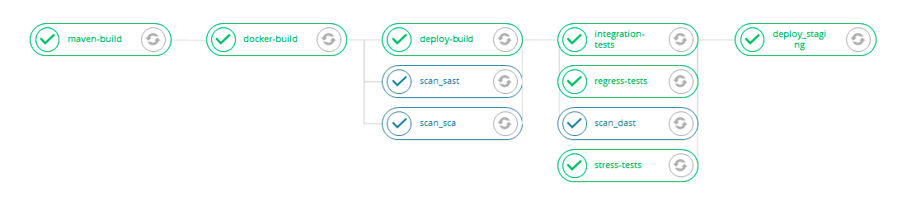
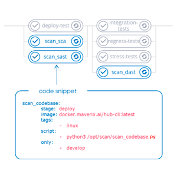

# AppSec.Hub CLI

Для упрощения работы с AppSec.Hub в системе реализована автоматизация ряда рутинных задач.  Для этого предлагаются специальные средства инструментальной поддержки – скрипты, работающие через CLI (Command Line Interface):

* ***scan_codebase.py***
* ***scan_artifact.py***
* ***import_results.py***

По существу, такой подход реализует упрощенный способ взаимодействия через REST API системы. Рассмотрим работу с этими скриптами подробнее.

## Сканирование кодовых баз и артефактов

Для сканирования кодовых баз и артефактов используются соответственно два скрипта: ***scan_codebase.py*** и ***scan_artifact.py***. Скрипты написаны на Python и взаимодействуют с бэкендом AppSec.Hub через HTTP. Описание параметров скриптов и примеры их использования для сканирования кодовых баз и различных типов артефактов приведены в [Приложениях 5](../ug/appendix%201.md) и [6](../ug/appendix%202.md) соответственно.

Общий принцип работы данных скриптов можно проиллюстрировать с помощью следующего примера. На рисунке ниже показан пример security pipeline для приложения с добавленными в него с помощью скриптов AppSec.Hub сканированиями безопасности SAST, SCA и DAST. Они выделены на рисунке синим цветом.

<figure markdown>

</figure>
 
Для подключения к инструментам оркестрации, таким как Jenkins или TeamCity, и встраивания проверок безопасности в security pipelines, AppSec.Hub использует фрагменты кода (code snippets) размером около 10 строк, которые можно скопировать в уже существующий security pipeline. Пример фрагмента кода, добавленного AppSec.Hub, выделен синим цветом на следующем рисунке.

<figure markdown>

</figure>
 
Такие фрагменты кода вызывают скрипты ***scan_codebase.py*** и/или ***scan_artifact.py***, которые подбирают и задают необходимые конфигурации security pipelines. С помощью встроенного фрагмента кода инструмент оркестрации может автоматически запустить security pipeline, настроенный в AppSec.Hub. Инструмент оркестрации запускает все инструменты разработки ПО и инструменты AST, заданные в security pipeline, и затем отправляет результаты в AppSec.Hub.
В качестве практического примера использования скриптов поэтапно рассмотрим типовой процесс сканирования кодовой базы.

    py scan_codebase.py --url http://hub.dev.swordfishsecurity.com/ \
        --token ***** \
        --appcode 0902202-1 \
        --codebase http://gitlab.service.yourcompany.com/test/java-web-project.git;master;;/        

1. AppSec.Hub находит приложение, код которого передан с помощью параметра `––appcode`, в противном случае создает новое. Более подробная информация о параметрах приведена в «[Приложении 5. Параметры скриптов AppSec.Hub CLI](../ug/appendix%201.md)».
2. AppSec.Hub находит кодовую базу, определенную параметром `--codebase`, в противном случае создает новую.
3. AppSec.Hub находит security pipeline для анализа кодовой базы. Если security pipeline обнаружен, AppSec.Hub запускает его, в противном случае на основе подходящего шаблона (см. раздел «[Security Pipelines](../ug/security%20pipelines.md)») создается новый security pipeline и запускается сканирование. Если подходящий шаблон не найден, генерируется сообщение об ошибке, см. раздел «[Приложение 7. Результаты сканирования AppSec.Hub CLI](../ug/appendix%203.md)». В таком случае следует создать соответствующий шаблон security pipeline, с использованием графического пользовательского интерфейса AppSec.Hub, см. раздел «[Security Pipelines](../ug/security%20pipelines.md)».
4. После завершения сканирования осуществляется возврат результатов с учетом Quality Gate, установленных в security pipeline (см. раздел «[Security Pipelines](../ug/security%20pipelines.md)»), и в CLI отображается ссылка на результаты сканирования. После перехода по ссылке (требуется предварительная авторизация в AppSec.Hub) можно просмотреть перечень обнаруженных в ходе сканирования security issues. Эта функциональность позволяет быстро ознакомиться с проблемами безопасности, выявленными в ходе соответствующего сканирования. Кроме этого, результаты сканирования могут быть сохранены в текстовый файл, который содержит информацию о статусе сканирования и причине его присвоения, использовавшихся при этом практиках и т. д.

## Импорт результатов сканирования

Также реализован механизм взаимодействия, позволяющий через REST API выполнить импорт результатов сканирования из различных AST инструментов, которые можно подключить к AppSec.Hub. Такой подход особенной удобен, когда в компании уже выстроен процесс разработки с использованием тех или иных инструментов и стоит задача передачи всех этих данных в AppSec.Hub. При этом нет необходимости запускать сканирование, как в приведенном выше примере. В результате на стороне AppSec.Hub создаются все необходимые объекты и связи: приложения, кодовые базы, security pipelines, а также запускается импорт обнаруженных уязвимостей и проверяется соответствие QG.

Для импорта результатов используется скрипт ***import_results.py***. Описание параметров скрипта и примеры его использования приведены в [Приложениях 5](../ug/appendix%201.md) и [6](../ug/appendix%202.md) соответственно. Описание результатов запуска скрипта приведено в разделе «[Приложение 7. Результаты сканирования AppSec.Hub CLI](../ug/appendix%203.md)».