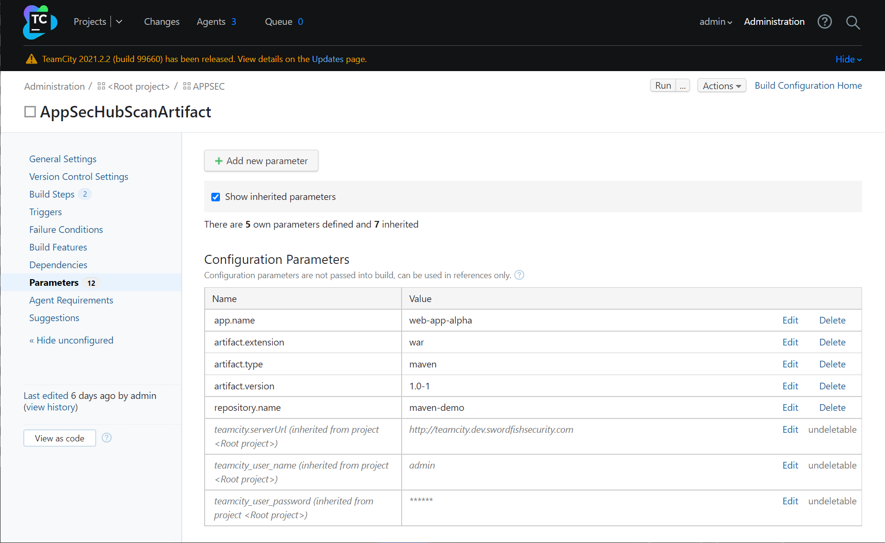

# Интеграция с TeamCity с использованием Meta-Runner

Благодаря предлагаемой инструментом оркестрации TeamCity функциональности Meta-Runner появилась возможность значительно сократить участие человека в процессе интеграции и снизить объем выполняемых «вручную» операций.

Специально разработанный конфигурационный файл Meta-Runner позволяет автоматизировать процесс настройки TeamCity с учетом специфических требований интеграции с AppSec.Hub. В ходе интеграции активно используются шаблоны, автоматическое распознавание кодовых баз и артефактов по URL и т. д.

### Настройка Meta-Runner

В комплект поставки AppSec.Hub входят следующие конфигурационные файлы Meta-Runner.

<figure markdown>
| Название конфигурационного файла | Назначение | Используемые скрипты |
|----------------------------------|------------|----------------------|
| ***scan-codebase-metarunner.xml*** | для работы только с кодовыми базами | ***scan_codebase.py*** |
| ***scan-artifact-metarunner.xml*** | для работы только с артефактами | ***scan_artifact.py*** |
| ***scan-codebase-or-artifact-metarunner.xml*** | для работы как с кодовыми базами, так и с артефактами | ***scan_codebase.py и scan_artifact.py*** |
</figure>

Конфигурационный файл определят вид диалогового окна, используя которое пользователь TeamCity может сформировать соответствующий Build Step и передать в сканирующие скрипты всю необходимую информацию, а также содержит исполняемый код, обеспечивающий взаимодействие сканирующих скриптов с API TeamCity и AppSec.Hub.

### Загрузка конфигурационного файла Meta-Runner в TeamCity

Находясь в корневой папке TeamCity, перейдите на страницу **Meta-Runners**. Нажмите кнопку **+Upload Meta-Runner**, выберите необходимый конфигурационный файл с расширением xml, при необходимости измените имя файла и нажмите кнопку **Save**.

<figure markdown></figure>

Конфигурационный файл будет загружен в корневой проект TeamCity и, соответственно, будет доступен для всех остальных проектов более низкого уровня, в которых, в свою очередь, он может быть добавлен в качестве одного из этапов пайплайна (Build Step) TeamCity.

### Добавление Build Step в TeamCity

Чтобы добавить загруженный нами конфигурационный файл в качестве одного из этапов пайплайна (Build Step) в TeamCity, необходимо:

* Выбрать проект и нажать кнопку **Edit configuration**, расположенную в правом верхнем углу интерфейса пользователя.

    <figure markdown></figure>

* Выбрать пункт меню **Build Steps** слева.

    <figure markdown></figure>

* Нажать кнопку **+Add build step** и в раскрывающемся меню выбрать название загруженного ранее конфигурационного файла Meta-Runner.

    <figure markdown></figure>

* Поля страницы **New Build Step** заполняются с учетом специфических проектных требований.

    <figure markdown></figure>

    * **Step name** — наименование этапа пайплайна (Build Step), например, **AppSec.Hub Meta-Runner**.
    * **Branches filter** — фильтр кодовых ветвей репозитория для сканирования. Фильтр применяется как к основной, так и к дополнительным кодовым базам. Если значение не указано, будут сканироваться все ветви кодовой базы (фильтрация отсутствует).
    * **Service name** — устанавливает соответствие между кодовой базой/артефактом и структурной единицей приложения (Structure unit). Если указанный Structure unit отсутствует в AppSec.Hub, он создается.
    * **Artifact url** — URL артефакта, хранящегося в Nexus RM или файловом хранилище. Если данный параметр отсутствует, сканирование запущено не будет. Здесь можно указать несколько URL артефактов через перевод строки.
    * **Base project lvl** — вложенность приложения относительно корневой папки. Если при интеграции/настройке TeamCity c AppSec.Hub, в качестве параметра **Root folder** был указан какой-либо проект, то отчет вложенности ведется от него.

<figure markdown>{width="1000"}</figure>

* **Insecure connection** — если выбрана данная опция, ошибки HTTPS игнорируются.
* **Release object url** — Если в этом поле указан URL релизного объекта, этот релизный объект может быть протегирован в зависимости от настройки в security pipeline (см. детали в разделе «[Тегирование релизных объектов](../ug/release%20objects.md#_4)»).
* **Fail build process** — если данная опция выбрана, ошибки сканирования игнорируются.

После завершения конфигурирования Build Step нажмите кнопку **Save**.

Кроме описанных выше параметров в скрипты ***scan_codebase.py*** и ***scan_artifact.py*** могут передаваться другие, например:

`--scan-initiator` — информация об инициаторе сканирования (например, ссылка на задачу TeamCity);

`--scan-initiator-environment` — среда окружения инициатора сканирования.

Передаваемая с их помощью информация отображается в соответствующих полях страницы с подробной информацией о задаче сканирования, а также ассоциируется с обнаруженными в ходе него проблемами безопасности.

<figure markdown></figure>

В свою очередь, созданные из таких проблем безопасности дефекты также наследуют указанную информацию, что в результате последующей синхронизации делает возможным ее передачу в проектную систему отслеживания дефектов.

Чтобы обеспечить возможность синхронизации, необходимо настроить соответствие полей в проектной системе отслеживания дефектов, см. раздел «[Синхронизация с Jira — настройки](../ug/setting%20of%20synchronisation%20with%20Jira.md)».

!!! note "Примечание"
    При каждой последующей синхронизации дефектов соответствующая информация в проектной системе отслеживания дефектов обновляется.

### Определение конфигурационных параметров и переменных среды

Кроме этого, для нормального функционирования Meta-Runner необходимо указать некоторые общие конфигурационные параметры и переменные среды на странице **Parameters**. Если данные параметры и переменные не наследуются из корневого проекта, необходимо их добавить.

<figure markdown></figure>

***Необходимые конфигурационные параметры***

<figure markdown>
| Параметр | Описание | Значение |
|----------|----------|----------|
| `teamcity.serverUrl` | URL TeamCity | `http://teamcity.dev.swordfishsecurity.com` |
| `teamcity_user_name` | Имя пользователя TeamCity | `admin` |
| `teamcity_user_password` | Пароль | `******` |
</figure>

***Необходимые переменные среды***

<figure markdown>
| Параметр | Описание | Значение |
|----------|----------|----------|
| `env.HUB_URL` | URL AppSec.Hub | `https://hub.dev.swordfishsecurity.com` |
| `env.NEXUS_URL` | URL Nexus | `https://nexus.dev.swordfishsecurity.com` |
| `env.TOKEN` | Токен | `******` |
</figure>

### Сканирование

После запуска пайплайна в TeamCity, когда очередь доходит до созданного нами этапа, происходит следующая последовательность действий:

* Обнаруживается кодовая база/артефакт.
* Выполняется ряд подготовительных и контрольных операций.
* Создаются виртуальные переменные, обеспечивающие возможность работы без доступа в Интернет.
* Подключаются необходимые библиотеки.
* Далее, на основе собранных данных, происходит запуск скриптов ***scan_codebase.py*** и/или ***scan_artifact.py***, которые, в свою очередь, создают в AppSec.Hub необходимые security pipelines, запускают сканирования соответствующих кодовых баз и артефактов с использованием выбранных инструментов, сохраняют и возвращают результаты сканирований.

При отсутствии ошибок процесс завершается с кодом выхода «0».

Коды ошибок, которые могут появляться при работе Meta-Runner, приведены в разделе «[Приложение 4. Коды выхода Meta-Runner](../ug/appendix%204.md)».

