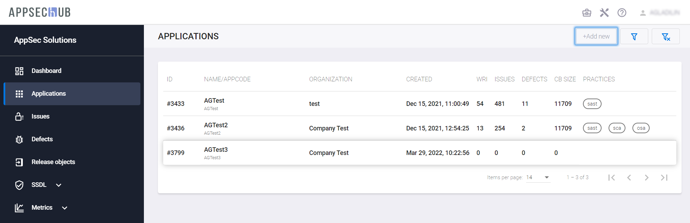
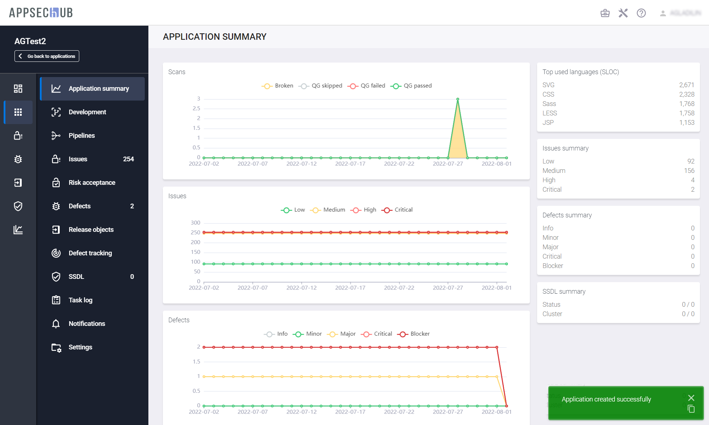

# Добавление нового приложения

Выберите пункт меню **Applications** в левом верхнем углу экрана и нажмите кнопку **+Add new**, чтобы создать новое приложение.

<figure markdown></figure>

Определите имя нового приложения, рабочее пространство приложения и подразделение организационной структуры для приложения в появившемся окне **Create application**. Рабочее пространство и подразделение для приложения можно выбрать из списков рабочих пространств и подразделений, доступных для команды (команд) Менеджера. У Администратора есть возможность в случае необходимости назначить Менеджера на работу с большим количеством команд до момента создания приложения. Таким образом, для вновь созданного приложения будет доступно больше рабочих пространств.

<figure markdown></figure>

Если процесс создания приложения завершился успешно, в правом нижнем углу страницы **Applications** появится соответствующее подтверждающее сообщение:

<figure markdown></figure>