# Аналитика

## Метрики безопасности приложений

Сбор данных и контроль метрик являются важнейшей частью процесса безопасной разработки приложений.

В AppSec.Hub реализованы механизмы сбора и консолидации данных для автоматизированного формирования метрик в различных областях, что позволяет осуществить эффективный анализ и управление разработкой приложения. Система хранит и получает данные метрик из хранилища данных (data warehouse).

Выберите пункт меню **Metrics** в верхнем левом углу экрана. На экране откроется страница **Metrics**.

На сегодняшний день на странице Metrics доступны следующие метрики:

* Codebase Structure.
* Defects Summary.
* Defects Trend.
* Scan Results.
* Risk Density.
* SAST Issues Discovery.
* SCA Security Issues Discovery.
* SCA Compliance Issues Discovery.
* Correlation Flow.
* AVC History.

На каждой из вкладок пользователь может сформировать интересующую его выборку данных при помощи набора фильтров и настроек.

### Codebase Structure

На вкладке **Codebase Structure** отображены метрики исходного кода для всех приложений в AppSec.Hub, включая:

* Размер исходного кода по приложениям (измеряется строками кода или количеством файлов).
* Размер исходного кода по языкам программирования (измеряется строками кода или количеством файлов).

<figure markdown></figure>

Чтобы получить метрики исходного кода для конкретного приложения (приложений) и/или языка (языков) программирования, выберите приложение (приложения) из выпадающего меню в поле **Applications** и/или язык (языки) программирования из выпадающего меню в поле **Languages** на вкладке **Filters** в правом верхнем углу.

Нажмите кнопку  в правом верхнем углу, чтобы сбросить фильтры.

### Defects Summary

На вкладке **Defects summary** представлена сводка дефектов с информацией о дефектах безопасности приложений, заведенных на тестируемые приложения, включая:

* Общее количество дефектов с распределением по приоритетам или по статусу.
* Количество дефектов по приложениям с распределением по приоритетам или по статусу.
* Количество дефектов по кодовым базам с распределением по приоритетам или по статусу.
* Количество дефектов по артефактам с распределением по приоритетам или по статусу.
* Количество дефектов по инструментам AST с распределением по приоритетам или по статусу.

<figure markdown></figure>

На этой странице есть два фильтра на вкладке **Filters** в правом верхнем углу, которые позволяют выбрать дефекты безопасности приложения на определенной стадии (стадиях) жизненного цикла дефекта для конкретного приложения (приложений). Выберите приложение из выпадающего меню в поле **Applications**, и этап жизненного цикла дефекта из выпадающего меню (Registered, Open, In Progress, Fixed, Rejected, Closed) в поле **Statuses**.

Используйте окно **Group by**, чтобы выбрать распределение дефектов по приоритету или по статусу с помощью пунктов Priority и Status.

В окне **Summary** приводится общая информацию по количеству дефектов.

Нажмите кнопку  в правом верхнем углу, чтобы сбросить фильтры.

### Defects Trend

Для работы с метриками на вкладке **Defects trend** обязательным является выбор временного интервала с помощью раскрывающегося меню **Periods** на вкладке **Filters** в правом верхнем углу. Можно выбрать интервал от последней недели до последних трех лет.

На вкладке **Defects trend** на нескольких графиках представлена информация о количестве дефектов безопасности приложений с разбиением по нескольким параметрам, включая:

* Распределение дефектов по практикам.
* Распределение дефектов по инструментам AST, с помощью которых эти дефекты были найдены.
* Распределение дефектов по приоритетам.
* Количество открытых и закрытых дефектов.

<figure markdown>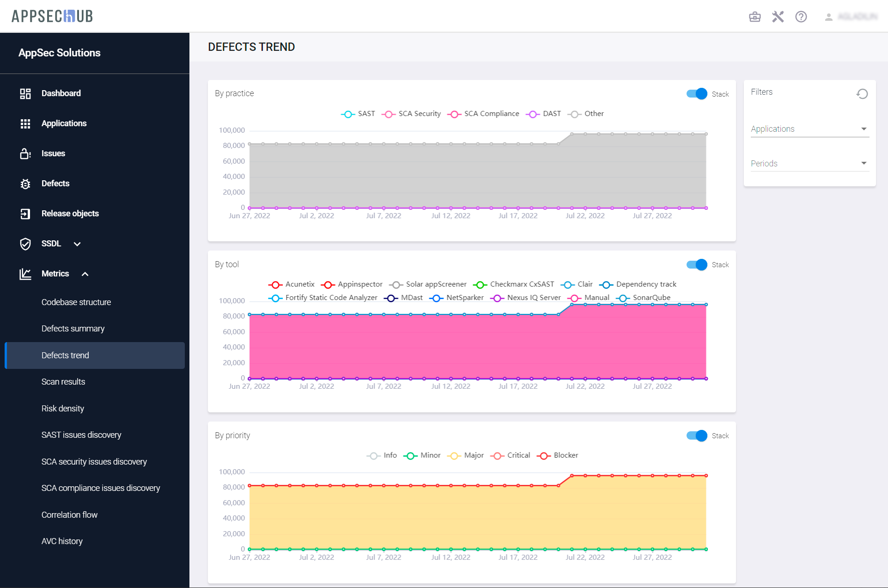</figure>
 
Существует возможность произвести настройку графиков. Чтобы просмотреть дефекты по одной или нескольким практикам, нажмите на графике **By practice** название практики (SAST, SCA Security, SCA Compliance, DAST или Other), чтобы отключить отображение дефектов, найденных в рамках этой практики. Повторное нажатие добавит обратно отображение этих дефектов. Таким образом, на графике можно оставить, например, только одну практику. В качестве примера на рисунке ниже показаны новые дефекты, найденные в рамках практик SCA Security и SCA Compliance за последние шесть месяцев.

<figure markdown>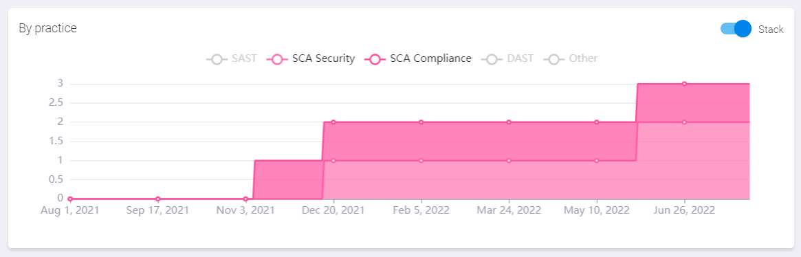</figure>
 
Если переключатель **Stack** в правом верхнем углу графика стоит в положении включено , то на графике будет показано суммарное распределение с разбиением по практикам. Если переключатель Stack в правом верхнем углу графика стоит в положении выключено , то на графике будет показано распределение для каждой из выбранных практик без суммарного распределения.

<figure markdown>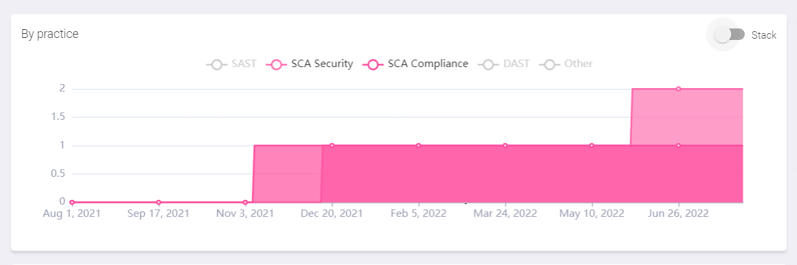</figure>
 
Чтобы просмотреть дефекты по одному или нескольким инструментам AST, с помощью которых эти дефекты были найдены, нажмите на графике **By tool** название инструмента, чтобы отключить отображение дефектов, найденных этим инструментом. Повторное нажатие добавит обратно отображение этих дефектов. Таким образом, на графике можно оставить, например, только один инструмент.

Чтобы просмотреть дефекты по одному или нескольким приоритетам, нажмите на графике **By priority** название приоритета, чтобы отключить отображение дефектов с этим приритетом. Повторное нажатие добавит обратно отображение этих дефектов. Таким образом, на графике можно оставить, например, дефекты только с одним приоритетом.

На графике **Open vs Closed** есть возможность выбрать только открытые или закрытые дефекты. Нажмите на графике элемент **Open** или **Closed**, чтобы включить или исключить соответствующие дефекты из графика.

<figure markdown>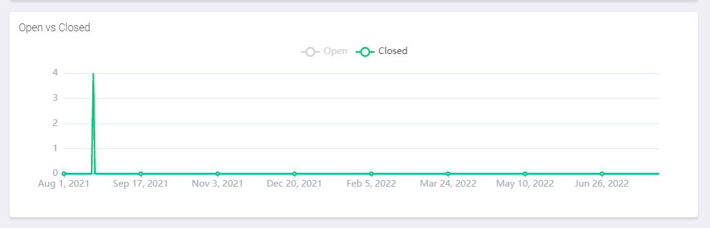</figure>
 
Чтобы получить метрики результатов сканирования для конкретного приложения (приложений), выберите приложение или приложения из выпадающего меню в поле **Applications** на вкладке **Filters** в правом верхнем углу.

Нажмите кнопку  в правом верхнем углу, чтобы сбросить фильтры.

### Scan Results

Для работы с метриками на вкладке **Scan results** обязательным является выбор временного интервала с помощью раскрывающегося меню **Periods** на вкладке **Filters** в правом верхнем углу. Можно выбрать интервал от последней недели до последних трех лет. Для выбранного периода времени отображаются следующие показатели.

* Найденные проблемы, сгруппированные по практикам (подсчитанные по четырем практикам — SAST, DAST, SCA Security, SCA Compliance), если на вкладке **Group by** выбран пункт **Practice**.
* Найденные проблемы, сгруппированные по серьезности (учитываются по уровням серьезности — Low severity, Medium severity, High severity, Critical severity), если на вкладке **Group by** выбран пункт **Severity**.
* История сканирования, измеряемая количеством закончившихся успешно и неудачно сканирований.

<figure markdown></figure>

Существует возможность произвести настройку графиков. Чтобы просмотреть новые проблемы по одной или нескольким практикам, выберите пункт **Practice** в окне **Group by** и на графике кликните название практики (SAST, DAST, SCA Security, SCA Compliance), чтобы отключить отображение проблем в рамках этой практики. Таким образом, на графике можно оставить, например, только одну практику. В качестве примера на рисунке ниже показаны новые проблемы, найденные в рамках практики SCA Security за последний месяц.

<figure markdown>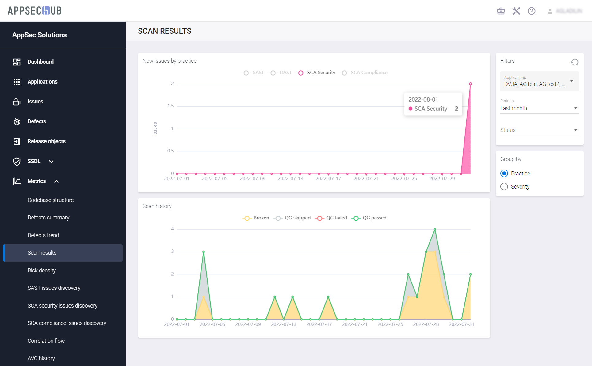</figure>

Чтобы получить метрики по новым проблемам с данными по серьезности проблем, выберите пункт **Severity** на вкладке **Group by** и кликните уровень серьезности (Low severity, Medium severity, High severity, Critical severity) на графике, чтобы включить или исключить из графика новые проблемы с данным уровнем серьезности. Таким образом, можно оставить на графике, например, только проблемы среднего уровня серьезности за  последний месяц, как это показано на рисунке ниже.

<figure markdown>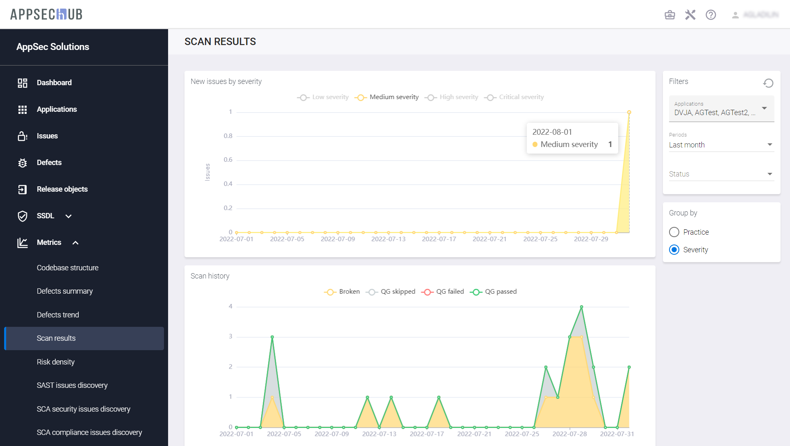</figure>

На графике **Scan history** есть возможность выбрать только успешные или неудачные сканирования. Кликните на графике элемент **Broken**, **QG skipped**, **QG failed**, **QG Passed**, чтобы включить или исключить соответствующие сканирования из графика.

<figure markdown>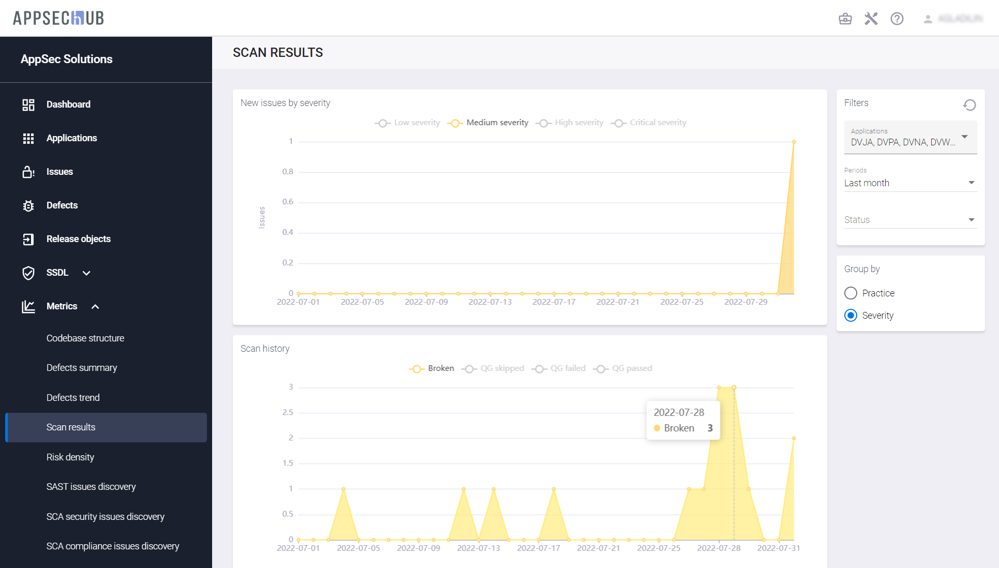</figure>

Чтобы получить метрики результатов сканирования для конкретного приложения (приложений), выберите приложение или приложения из выпадающего меню в поле **Applications** на вкладке **Filters** в правом верхнем углу.

Нажмите кнопку  в правом верхнем углу, чтобы сбросить фильтры.

### Risk Density

Для работы с метриками на вкладке Risk density обязательным является выбор временного интервала с помощью выпадающего меню Periods на вкладке Filters в правом верхнем углу. Можно выбрать интервал от последней недели до последних трех лет. Для выбранного периода времени отображаются следующие метрики:

* Плотность рисков в динамике, измеряемая количеством проблем (рисков) на KSLOC исходного кода.
* Динамика проблем по четырем практикам (SAST, DAST, SCA Security, SCA Compliance).
* Размер кодовой базы, измеряемый в SLOC.

<figure markdown>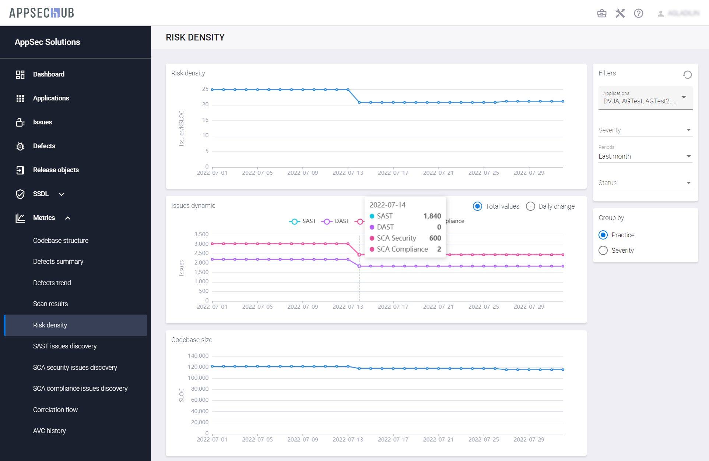</figure>

Существует возможность произвести настройку графика **Issues dynamic**. Чтобы просмотреть динамику проблем по одной практике или по нескольким практикам, выберите пункт **Practice** на вкладке **Group by** и кликните название практики (SAST, DAST, SCA Security, SCA Compliance) на графике, чтобы включить или исключить из графика проблемы, обнаруженные в рамках этой практики. Таким образом, можно оставить, например, только одну практику на этом графике. Выберите пункт **Total values** или **Daily change**, чтобы отобразить на графике соответственно общее число проблем или изменение этого числа за день. На рисунке ниже показано в качестве примера ежедневное изменение числа проблем, найденных в рамках практики SAST за  последний месяц.

<figure markdown></figure>

Чтобы получить метрики по динамике проблем с данными по серьезности проблем, выберите пункт **Severity** на вкладке **Group by** и кликните уровень серьезности (Low severity, Medium severity, High severity, Critical severity) на графике, чтобы включить или исключить из графика новые проблемы с данным уровнем серьезности. Выберите пункт **Total values** или **Daily change**, чтобы отобразить на графике соответственно общее число проблем или изменение этого числа за день. На рисунке ниже показаны в качестве примера ежедневное изменение числа проблем средней степени серьезности, найденных за  последний месяц.

<figure markdown>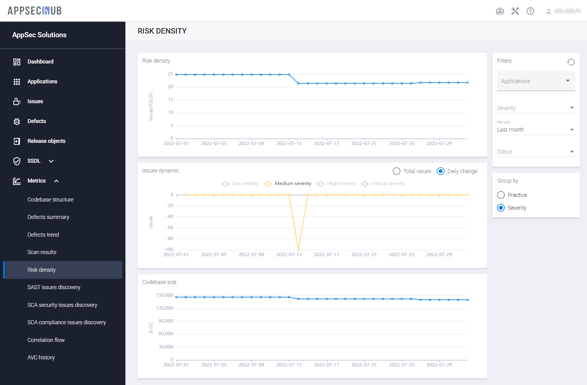</figure>

Чтобы получить метрики плотности рисков для конкретного приложения (приложений), выберите приложение или приложения из выпадающего меню в поле **Applications** на вкладке **Filters** в правом верхнем углу.

Нажмите кнопку  в правом верхнем углу, чтобы сбросить фильтры.

### SAST Issues Discovery

На странице **SAST issues discovery** показаны следующие метрики:

* Проблемы, найденные в рамках практики SAST, сгруппированные по приложениям, если на вкладке **Group by** выбран пункт **Applications**, с распределением по уровням серьезности.
* Проблемы, найденные в рамках практики SAST, сгруппированные по категориям, если на вкладке **Group by** выбран пункт **Categories**, с распределением по уровням серьезности.

<figure markdown></figure>

Чтобы получить метрики обнаружения проблем в рамках практики SAST для конкретного приложения (приложений), выберите пункт **Applications** на вкладке **Group by** и выберите приложение или приложения из выпадающего меню в поле **Applications** на вкладке **Filters** в правом верхнем углу.

Чтобы получить метрики обнаружения проблем в рамках практики SAST для конкретной категории (категорий), выберите пункт **Categories** на вкладке **Group by** и выберите категорию или категории из выпадающего меню в поле **Categories** на вкладке **Filters** в правом верхнем углу.

Используйте выпадающие меню в полях **Severity** и **Status** на вкладке **Filters**, чтобы получить метрики для проблем, найденных в рамках практики SAST, с заданной серьезностью и/или статусом.

Нажмите кнопку  в правом верхнем углу, чтобы сбросить фильтры.

### SCA Security Issues Discovery

На странице **SCA Security issues discovery** показаны следующие метрики:

* Проблемы безопасности, найденные в рамках практики SCA Security, сгруппированные по приложениям, если на вкладке **Group by** выбран пункт **Applications**, с распределением по уровням серьезности
* Проблемы безопасности, найденные в рамках практики SCA Security, сгруппированные по компонентам, если на вкладке **Group by** выбран пункт **Components**, с распределением по уровням серьезности

<figure markdown></figure>

Чтобы получить метрики обнаружения проблем в рамках практики SCA Security для конкретного приложения (приложений), выберите пункт **Applications** на вкладке **Group by** и выберите приложение или приложения из выпадающего меню в поле **Applications** на вкладке **Filters** в правом верхнем углу.

Чтобы получить метрики обнаружения проблем в рамках практики SCA Security для конкретного компонента (компонентов), выберите пункт **Components** на вкладке **Group by** и выберите компонент или компоненты из выпадающего меню в поле **Components** на вкладке **Filters** в правом верхнем углу.

Используйте выпадающие меню в полях **Severity** и **Status** на вкладке **Filters**, чтобы получить метрики для проблем, найденных в рамках практики SCA Security, с заданной серьезностью и/или статусом.

Нажмите кнопку  в правом верхнем углу, чтобы сбросить фильтры.

### SCA Compliance Issues Discovery

На странице **SCA Compliance issues discovery** показаны следующие метрики:

* Проблемы, связанные с корректностью использования лицензий, найденные в рамках практики SCA Compliance, сгруппированные по приложениям, если на вкладке **Group by** выбран пункт **Applications**, с распределением по уровням серьезности.
* Проблемы, связанные с корректностью использования лицензий, найденные в рамках практики SCA Compliance, сгруппированные по лицензиям, если на вкладке **Group by** выбран пункт **Open source licenses**, с распределением по уровням серьезности.

<figure markdown>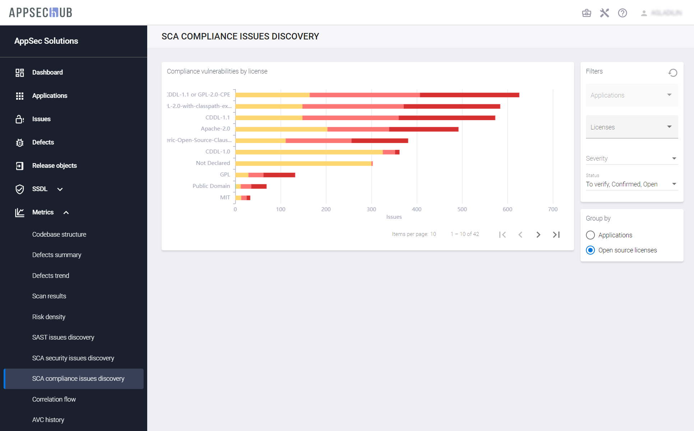</figure>

Чтобы получить метрики обнаружения проблем, связанных с корректностью использования лицензий, в рамках практики SCA Compliance для конкретного приложения (приложений), выберите пункт **Applications** на вкладке **Group by** и выберите приложение или приложения из выпадающего меню в поле **Applications** на вкладке **Filters** в правом верхнем углу.

Чтобы получить метрики обнаружения проблем, связанных с корректностью использования лицензий, в рамках практики SCA Compliance для конкретной лицензии (лицензий), выберите пункт **Open source licenses** на вкладке **Group by** и выберите лицензию или лицензии из выпадающего меню в поле **Licenses** на вкладке **Filters** в правом верхнем углу.

Используйте выпадающие меню в полях **Severity** и **Status** на вкладке **Filters**, чтобы получить метрики для проблем, найденных в рамках практики SCA Compliance, с заданной серьезностью и/или статусом.

Нажмите кнопку  в правом верхнем углу, чтобы сбросить фильтры.

### Correlation Flow

Вкладка **Correlation Flow** предоставляет аналитические данные о корреляции проблем, обнаруженных во время тестирования безопасности приложения с использованием инструментов AST, и приводящих к занесению дефектов безопасности приложения на их основе.

<figure markdown></figure>

На этой вкладке представлена статистика с точки зрения анализа корреляции проблем безопасности, а также формирования и занесения дефектов безопасности на их основе. Проблемы безопасности, обнаруженные инструментами AST, учитываются по четырем практикам (SCA License, SCA Security, SAST и DAST). Следующее разделение проблем выполняется по статусу проблем (Technical debt, False Positive, Confirmed, Fixed, Accepted risk). AppSec.Hub помогает определить корреляцию проблем безопасности, сгруппировать проблемы и занести дефекты безопасности.

Дефекты безопасности, открытые на основе проблем безопасности, могут быть отфильтрованы по уровню серьезности (Low, Medium, High, Critical) и по приложению.

Чтобы получить метрику Correlation Flow для конкретного приложения, нажмите поле **Applications** на вкладке **Filters** в правом верхнем углу и выберите приложение из выпадающего меню.

Используйте выпадающее меню в поле **Severity** на вкладке **Filters**, чтобы получить метрику Correlation Flow для дефектов безопасности с заданным уровнем серьезности.

Нажмите кнопку  в правом верхнем углу, чтобы сбросить фильтры.

### AVC History

Вкладка **AVC History** предоставляет данные о параметрах предиктивной модели анализа проблем безопасности AVC (Application Vulnerabilities Correlation) и о показателях качества проведенного AVC-анализа.

Для работы с метриками на вкладке **AVC History** обязательным является выбор временного интервала с помощью раскрывающегося меню **Periods** на вкладке **Filters** в правом верхнем углу. Можно выбрать интервал от последней недели до последних трех лет. Для выбранного периода времени отображаются следующая информация:

* Результаты обработки проблем безопасности с помощью AVC-модели.
* Метрики, характеризующие параметры процесса обучения и работы AVC-модели.

<figure markdown>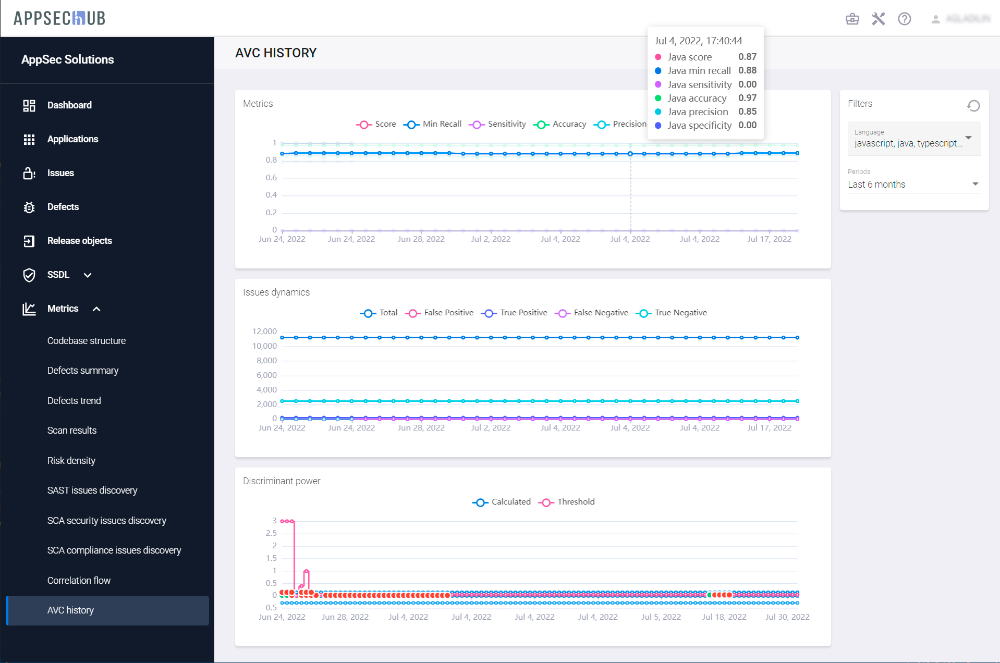</figure>
 
На графике **Issues dynamics** представлены следующие результаты работы AVC-модели:

* **Total** – Общее количество обработанных с использованием AVC-модели уязвимостей (security issues).
* **True Positive (𝑇𝑃)** – Количество security issues, на которые модель указала, что это security issue.
* **False Positive (𝐹𝑃)** – Количество не security issues, на которые модель указала, что это security issue.
* **False Negative (𝐹𝑁)** – Количество security issues, на которые модель указала, что это не security issue.
* **True Negative (𝑇𝑁)** – Количество не security issues, на которые модель указала, что это не security issue.

<figure markdown>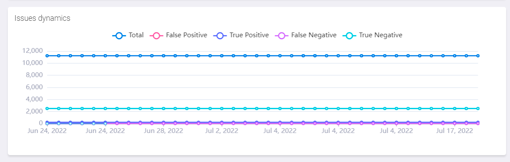</figure>

На графике **Metrics** представлены следующие параметры AVC-модели:

* **Score** – Коэффициент полезности AVC-модели. Он отражает эффективность алгоритма. Чем ближе это значение к 1, тем лучше.
* **Min Recall** – Минимальная полнота, которая может быть у полученной модели с учетом достоверности. Это основная метрика, характеризующая качество работы модели и попадание ее результатов в реальные данные. По этой величине сравниваются AVC-модели.
* **Sensitivity** – Параметр, который отражает насколько полно наш алгоритм определяет уязвимости (security issues). Чем ближе это значение к 1, тем лучше.
* **Accuracy** – Параметр, который отвечает за общую точность модели без выделения той или иной характеристики как более важной. Чем ближе это значение к 1, тем лучше.
* **Precision** – Параметр, который отражает долю реальных security issues среди всех, помеченных как security issues. Чем ближе это значение к 1, тем лучше.
* **Specificity** – Параметр, который отражает количество найденных ложных security issues от общего количества ложных security issues. Чем ближе это значение к 1, тем лучше.

<figure markdown>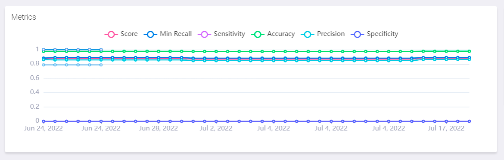</figure>
  

На графике **Discriminant power** представлены следующие параметры AVC-модели:

* **Calculated** – Вычисленное значение комбинированной метрики **Discriminant power** для AVC-модели. Значение этой метрики может стать триггером для переобучения модели. Зеленая точка на графике означает, что по результатам обучения модель была принята. Красная точка на графике означает, что в результате переобучения модель выдавала либо такой же, либо ухудшенный результат по сравнению с текущей моделью и замены модели не происходило.
* **Threshold** – Пороговые значения для срабатывания триггеров для переобучения модели.

<figure markdown>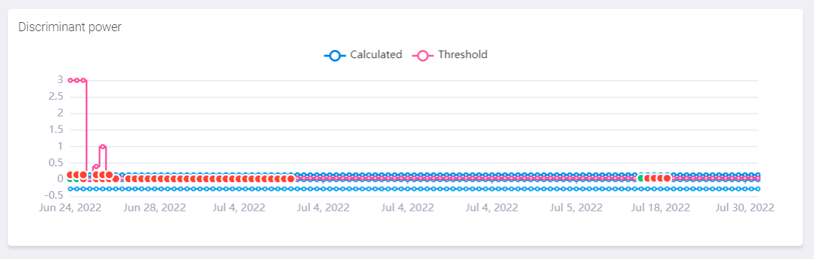</figure>

Описанные в этом разделе метрики собираются для каждого языка программирования отдельно. Чтобы получить метрики для конкретного языка или нескольких языков, выберите этот язык или языки из выпадающего меню в поле **Language** на вкладке **Filters** в правом верхнем углу.

Нажмите кнопку  в правом верхнем углу, чтобы сбросить фильтры.