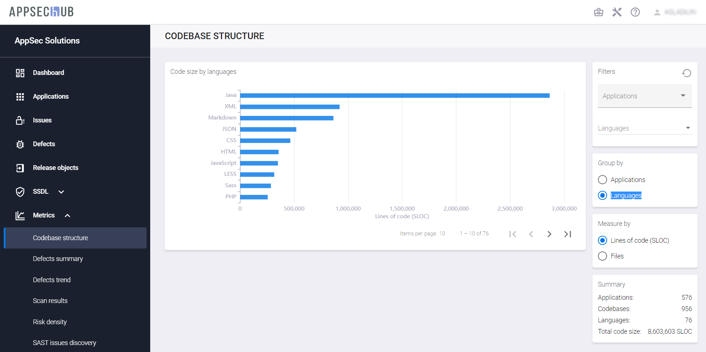
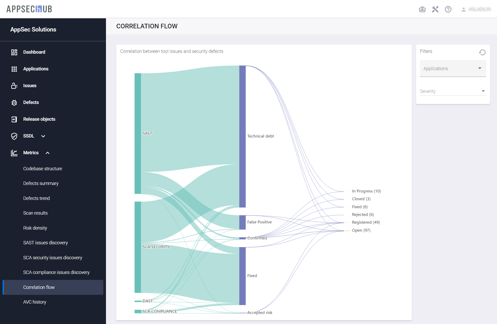

# Аналитика

## Метрики безопасности приложений

Сбор данных и контроль метрик являются важнейшей частью процесса безопасной разработки приложений.

В AppSec.Hub реализованы механизмы сбора и консолидации данных для автоматизированного формирования метрик в различных областях, что позволяет осуществить эффективный анализ и управление разработкой приложения. Система хранит и получает данные метрик из хранилища данных (data warehouse).

Выберите пункт меню **Metrics** в верхнем левом углу экрана. На экране откроется страница **Metrics**.

На сегодняшний день на странице Metrics доступны следующие метрики:

* Codebase Structure.
* Defect Summary.
* Scan Results.
* Risk Density.
* SAST Issues Discovery.
* SCA Security Issues Discovery.
* SCA Compliance Issues Discovery.
* Correlation Flow.

На каждой из вкладок пользователь может сформировать интересующую его выборку данных при помощи набора фильтров и настроек.

### Codebase Structure

На вкладке **Codebase Structure** отображены метрики исходного кода для всех приложений в AppSec.Hub, включая:

* Размер исходного кода по приложениям (измеряется строками кода или количеством файлов).
* Размер исходного кода по языкам программирования (измеряется строками кода или количеством файлов).

<figure markdown></figure>

Чтобы получить метрики исходного кода для конкретного приложения (приложений) и/или языка (языков) программирования, выберите приложение (приложения) из выпадающего меню в поле **Applications** и/или язык (языки) программирования из выпадающего меню в поле **Languages** на вкладке **Filters** в правом верхнем углу.

Нажмите кнопку  в правом верхнем углу, чтобы сбросить фильтры.

### Defect Summary

На вкладке **Defect summary** представлена сводка дефектов с информацией о дефектах безопасности приложений, заведенных на тестируемые приложения, включая:

* Общее количество дефектов с распределением по приоритетам или по статусу.
* Количество дефектов по приложениям с распределением по приоритетам или по статусу.
* Количество дефектов по кодовым базам с распределением по приоритетам или по статусу.
* Количество дефектов по артефактам с распределением по приоритетам или по статусу.
* Количество дефектов по инструментам AST с распределением по приоритетам или по статусу.

<figure markdown></figure>

На этой странице есть два фильтра на вкладке **Filters** в правом верхнем углу, которые позволяют выбрать дефекты безопасности приложения на определенной стадии (стадиях) жизненного цикла дефекта для конкретного приложения (приложений). Выберите приложение из выпадающего меню в поле **Applications**, и этап жизненного цикла дефекта из выпадающего меню (Registered, Open, In Progress, Fixed, Rejected, Closed) в поле **Statuses**.

Используйте окно **Group by**, чтобы выбрать распределение дефектов по приоритету или по статусу с помощью пунктов Priority и Status.

В окне **Summary** приводится общая информацию по количеству дефектов.

Нажмите кнопку  в правом верхнем углу, чтобы сбросить фильтры.

### Scan Results

Для работы с метриками на вкладке **Scan results** обязательным является выбор временного интервала с помощью раскрывающегося меню **Periods** на вкладке **Filters** в правом верхнем углу. Можно выбрать интервал от последней недели до последних трех лет. Для выбранного периода времени отображаются следующие показатели.

* Найденные проблемы, сгруппированные по практикам (подсчитанные по четырем практикам — SAST, DAST, SCA Security, SCA Compliance), если на вкладке **Group by** выбран пункт **Practice**.
* Найденные проблемы, сгруппированные по серьезности (учитываются по уровням серьезности — Low severity, Medium severity, High severity, Critical severity), если на вкладке **Group by** выбран пункт **Severity**.
* История сканирования, измеряемая количеством закончившихся успешно и неудачно сканирований.

<figure markdown></figure>

Существует возможность произвести настройку графиков. Чтобы просмотреть новые проблемы по одной или нескольким практикам, выберите пункт **Practice** в окне **Group by** и на графике кликните название практики (SAST, DAST, SCA Security, SCA Compliance), чтобы отключить отображение проблем в рамках этой практики. Таким образом, на графике можно оставить, например, только одну практику. В качестве примера на рисунке ниже показаны новые проблемы, найденные в рамках практики SCA Security за последний месяц.

<figure markdown></figure>

Чтобы получить метрики по новым проблемам с данными по серьезности проблем, выберите пункт **Severity** на вкладке **Group by** и кликните уровень серьезности (Low severity, Medium severity, High severity, Critical severity) на графике, чтобы включить или исключить из графика новые проблемы с данным уровнем серьезности. Таким образом, можно оставить на графике, например, только проблемы среднего уровня серьезности за  последний месяц, как это показано на рисунке ниже.

<figure markdown></figure>

На графике **Scan history** есть возможность выбрать только успешные или неудачные сканирования. Кликните на графике элемент **Broken**, **QG skipped**, **QG failed**, **QG Passed**, чтобы включить или исключить соответствующие сканирования из графика.

<figure markdown></figure>

Чтобы получить метрики результатов сканирования для конкретного приложения (приложений), выберите приложение или приложения из выпадающего меню в поле **Applications** на вкладке **Filters** в правом верхнем углу.

Нажмите кнопку  в правом верхнем углу, чтобы сбросить фильтры.

### Risk Density

Для работы с метриками на вкладке Risk density обязательным является выбор временного интервала с помощью выпадающего меню Periods на вкладке Filters в правом верхнем углу. Можно выбрать интервал от последней недели до последних трех лет. Для выбранного периода времени отображаются следующие метрики:

* Плотность рисков в динамике, измеряемая количеством проблем (рисков) на KSLOC исходного кода.
* Динамика проблем по четырем практикам (SAST, DAST, SCA Security, SCA Compliance).
* Размер кодовой базы, измеряемый в SLOC.

<figure markdown></figure>

Существует возможность произвести настройку графика **Issues dynamic**. Чтобы просмотреть динамику проблем по одной практике или по нескольким практикам, выберите пункт **Practice** на вкладке **Group by** и кликните название практики (SAST, DAST, SCA Security, SCA Compliance) на графике, чтобы включить или исключить из графика проблемы, обнаруженные в рамках этой практики. Таким образом, можно оставить, например, только одну практику на этом графике. Выберите пункт **Total values** или **Daily change**, чтобы отобразить на графике соответственно общее число проблем или изменение этого числа за день. На рисунке ниже показано в качестве примера ежедневное изменение числа проблем, найденных в рамках практики SAST за  последний месяц.

<figure markdown></figure>

Чтобы получить метрики по динамике проблем с данными по серьезности проблем, выберите пункт **Severity** на вкладке **Group by** и кликните уровень серьезности (Low severity, Medium severity, High severity, Critical severity) на графике, чтобы включить или исключить из графика новые проблемы с данным уровнем серьезности. Выберите пункт **Total values** или **Daily change**, чтобы отобразить на графике соответственно общее число проблем или изменение этого числа за день. На рисунке ниже показаны в качестве примера ежедневное изменение числа проблем средней степени серьезности, найденных за  последний месяц.

<figure markdown></figure>

Чтобы получить метрики плотности рисков для конкретного приложения (приложений), выберите приложение или приложения из выпадающего меню в поле **Applications** на вкладке **Filters** в правом верхнем углу.

Нажмите кнопку  в правом верхнем углу, чтобы сбросить фильтры.

### SAST Issues Discovery

На странице **SAST issues discovery** показаны следующие метрики:

* Проблемы, найденные в рамках практики SAST, сгруппированные по приложениям, если на вкладке **Group by** выбран пункт **Applications**, с распределением по уровням серьезности.
* Проблемы, найденные в рамках практики SAST, сгруппированные по категориям, если на вкладке **Group by** выбран пункт **Categories**, с распределением по уровням серьезности.

<figure markdown></figure>

Чтобы получить метрики обнаружения проблем в рамках практики SAST для конкретного приложения (приложений), выберите пункт **Applications** на вкладке **Group by** и выберите приложение или приложения из выпадающего меню в поле **Applications** на вкладке **Filters** в правом верхнем углу.

Чтобы получить метрики обнаружения проблем в рамках практики SAST для конкретной категории (категорий), выберите пункт **Categories** на вкладке **Group by** и выберите категорию или категории из выпадающего меню в поле **Categories** на вкладке **Filters** в правом верхнем углу.

Используйте выпадающие меню в полях **Severity** и **Status** на вкладке **Filters**, чтобы получить метрики для проблем, найденных в рамках практики SAST, с заданной серьезностью и/или статусом.

Нажмите кнопку  в правом верхнем углу, чтобы сбросить фильтры.

### SCA Security Issues Discovery

На странице **SCA Security issues discovery** показаны следующие метрики:

* Проблемы безопасности, найденные в рамках практики SCA Security, сгруппированные по приложениям, если на вкладке **Group by** выбран пункт **Applications**, с распределением по уровням серьезности
* Проблемы безопасности, найденные в рамках практики SCA Security, сгруппированные по компонентам, если на вкладке **Group by** выбран пункт **Components**, с распределением по уровням серьезности

<figure markdown></figure>

Чтобы получить метрики обнаружения проблем в рамках практики SCA Security для конкретного приложения (приложений), выберите пункт **Applications** на вкладке **Group by** и выберите приложение или приложения из выпадающего меню в поле **Applications** на вкладке **Filters** в правом верхнем углу.

Чтобы получить метрики обнаружения проблем в рамках практики SCA Security для конкретного компонента (компонентов), выберите пункт **Components** на вкладке **Group by** и выберите компонент или компоненты из выпадающего меню в поле **Components** на вкладке **Filters** в правом верхнем углу.

Используйте выпадающие меню в полях **Severity** и **Status** на вкладке **Filters**, чтобы получить метрики для проблем, найденных в рамках практики SCA Security, с заданной серьезностью и/или статусом.

Нажмите кнопку  в правом верхнем углу, чтобы сбросить фильтры.

### SCA Compliance Issues Discovery

На странице **SCA Compliance issues discovery** показаны следующие метрики:

* Проблемы, связанные с корректностью использования лицензий, найденные в рамках практики SCA Compliance, сгруппированные по приложениям, если на вкладке **Group by** выбран пункт **Applications**, с распределением по уровням серьезности.
* Проблемы, связанные с корректностью использования лицензий, найденные в рамках практики SCA Compliance, сгруппированные по лицензиям, если на вкладке **Group by** выбран пункт **Open source licenses**, с распределением по уровням серьезности.

<figure markdown></figure>

Чтобы получить метрики обнаружения проблем, связанных с корректностью использования лицензий, в рамках практики SCA Compliance для конкретного приложения (приложений), выберите пункт **Applications** на вкладке **Group by** и выберите приложение или приложения из выпадающего меню в поле **Applications** на вкладке **Filters** в правом верхнем углу.

Чтобы получить метрики обнаружения проблем, связанных с корректностью использования лицензий, в рамках практики SCA Compliance для конкретной лицензии (лицензий), выберите пункт **Open source licenses** на вкладке **Group by** и выберите лицензию или лицензии из выпадающего меню в поле **Licenses** на вкладке **Filters** в правом верхнем углу.

Используйте выпадающие меню в полях **Severity** и **Status** на вкладке **Filters**, чтобы получить метрики для проблем, найденных в рамках практики SCA Compliance, с заданной серьезностью и/или статусом.

Нажмите кнопку  в правом верхнем углу, чтобы сбросить фильтры.

### Correlation Flow

Вкладка **Correlation Flow** предоставляет аналитические данные о корреляции проблем, обнаруженных во время тестирования безопасности приложения с использованием инструментов AST, и приводящих к занесению дефектов безопасности приложения на их основе.

<figure markdown></figure>

На этой вкладке представлена статистика с точки зрения анализа корреляции проблем безопасности, а также формирования и занесения дефектов безопасности на их основе. Проблемы безопасности, обнаруженные инструментами AST, учитываются по четырем практикам (SCA License, SCA Security, SAST и DAST). Следующее разделение проблем выполняется по статусу проблем (Technical debt, False Positive, Confirmed, Fixed, Accepted risk). AppSec.Hub помогает определить корреляцию проблем безопасности, сгруппировать проблемы и занести дефекты безопасности.

Дефекты безопасности, открытые на основе проблем безопасности, могут быть отфильтрованы по уровню серьезности (Low, Medium, High, Critical) и по приложению.

Чтобы получить метрику Correlation Flow для конкретного приложения, нажмите поле **Applications** на вкладке **Filters** в правом верхнем углу и выберите приложение из выпадающего меню.

Используйте выпадающее меню в поле **Severity** на вкладке **Filters**, чтобы получить метрику Correlation Flow для дефектов безопасности с заданным уровнем серьезности.

Нажмите кнопку  в правом верхнем углу, чтобы сбросить фильтры.