# Конфигурация приложения
!!! note "Примечание"
    Для выполнения нижеописанных действий требуется роль Менеджер.

Выберите пункт меню **Applications** в левом верхнем углу экрана. Нажав значок **Show app details**, откройте страницу приложения.

<figure markdown></figure>

Слева в меню выберите пункт **Development**, чтобы просмотреть и настроить следующие элементы:

<figure markdown>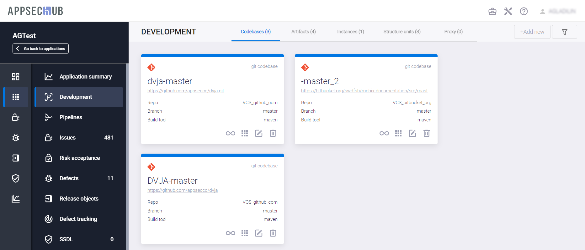</figure>

* **Codebases** — кодовые базы (исходный код).
* **Artifacts** — артефакты.
* **Instances** — экземпляры приложений (тестовые стенды).
* **Structure units** — структурные модули.
* **Proxy** — прокси-репозитории.

## Кодовые базы

Приложение не ограничено одной кодовой базой, а может включать несколько. Например, одно приложение может иметь разный код и разные кодовые базы для целей разработки и выпуска (***< application-dev >*** и ***< application-release >***) с разными метриками исходного кода, разными метриками дефектов и т. д.

Выберите пункт меню **Development**, а затем нажмите кнопку **+Add new** в правом верхнем углу вкладки **Codebases**, чтобы добавить новую кодовую базу. На экране появится окно **Create codebase**.

<figure markdown></figure>

Укажите следующие параметры кодовой базы:

* Выберите инструмент репозитория из выпадающего меню **Select Repository**, например VCS_Bitbucket.
* Введите абсолютный URL репозитория кодовой базы в поле **Enter absolute codebase URL**.

После ввода указанных параметров произойдет автоматическое распознавание кодовой базы. При необходимости внесите изменения в появившиеся дополнительные поля.

<figure markdown></figure>

* **VCS type** — тип системы контроля версий.
* **Auth method** — метод аутентификации, для Bitbucket — login_password.
* **Codebase name** — это имя кодовой базы в системе.
* **Codebase checkout URL** — URL для проверки кодовой базы, он содержит точный URL-адрес репозитория кода для приложения. Рекомендуется скопировать и вставить этот URL из инструмента репозитория.
* **Branch filter** — фильтр ветвей кодовой базы. В данном поле поддерживается использование масок, например, если указать значение feature_*, будут выбраны все ветки, имеющие префикс «feature_».
* **Build tool** определяет инструмент сборки, используемый для работы с репозиторием кода (в данном примере — Maven).

<figure markdown>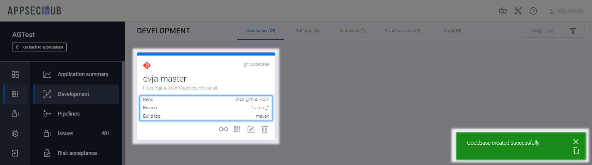</figure>

!!! note "Примечание"
    В имени ветки можно использовать символ «`*`» в качестве универсального знака, заменяющего один или несколько символов. Например, имя ветки feature/* позволяет использовать эту карточку кодовой базы для работы со всеми feature-ветвями в кодовой базе.

Нажмите кнопку **Create**, чтобы создать новую кодовую базу в AppSec.Hub.

На экране появится карточка вновь созданной кодовой базы и подтверждающее уведомление в правом нижнем углу пользовательского интерфейса.

<figure markdown>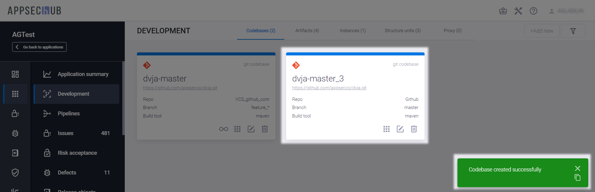</figure>

Для конфигурации существующей кодовой базы нажмите иконку **Edit codebase** в правом нижнем углу ее карточки.

<figure markdown></figure>

На экране появится окно **Update codebase**.

<figure markdown>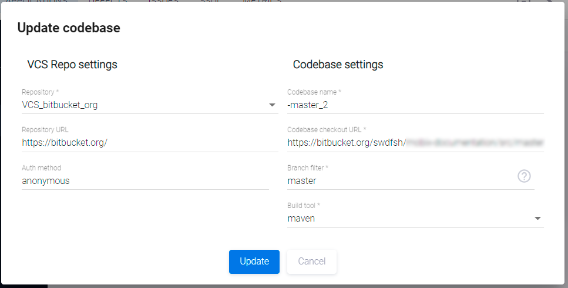</figure>

Измените параметры кодовой базы, как описано выше, и нажмите кнопку **Update**.

## Артефакты

Артефакт либо создается, либо используется командой, работающей над разработкой приложения. Например, артефакты, создаваемые инструментом Maven для разработки приложения, включают: JAR (Java ARchive) — Java-архивы, исходные и двоичные дистрибутивы, WAR-файлы (Web ARchive, или Web Application Resource) и т. д. Каждый maven-артефакт имеет идентификатор группы (group id), идентификатор артефакта (artifact ID), версию, расширение и классификатор (расширение + классификатор могут быть назван по типу артефакта).

!!! note "Примечание"
    Поддерживаются следующие типы артефактов: Maven artifact, NuGet package, Docker container, Node package (NPM), Raw file, yum/rpm package, Pypi package.

Выберите пункт меню **Development** слева, а затем нажмите кнопку **+Add new** в правом верхнем углу вкладки **Artifacts**, чтобы добавить новый артефакт, или нажмите на иконку **Edit artifact** на карточке существующего артефакта, чтобы проверить и/или сконфигурировать параметры артефакта.

<figure markdown>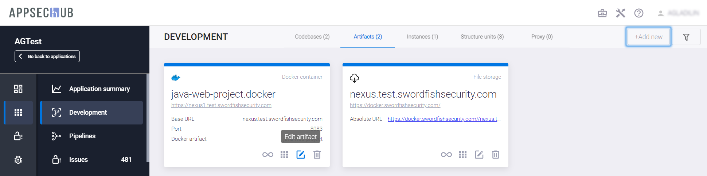</figure>

На экране появится окно **Update artifact**.

<figure markdown></figure>

В этом окне укажите следующие параметры артефакта:

* Выберите репозиторий из выпадающего меню Repository.
* В поле **Name** укажите имя артефакта.
* **Repository Name** — имя репозитория.
* **Group** — группа.
* В выпадающем меню **Artifact type** выберите тип артефакта. Поддерживаются следующие типы артефактов: Maven artifact, NuGet package, Docker container, Node package (NPM), Raw file, yum/rpm package, Pypi package.
* В поле **Artifact** укажите первую часть имени артефакта.
* В выпадающем меню Extension type выберите тип расширения (war, jar, ejb и т. д.).

Нажмите кнопку **Update**, чтобы сохранить изменения.

Чтобы удалить артефакт, нажмите иконку **Delete** на его карточке.

!!! note "Примечание"
    При удалении артефакта на странице **Development** он также удаляется из Security Pipeline, где он используется как тегируемый.

## Экземпляры приложения

Каждое приложение может иметь несколько экземпляров, например, один экземпляр используется в качестве тестового стенда, второй — для приемо-сдаточных испытаний, а третий — для развертывания в рабочей промышленной среде (production).

Выберите пункт меню **Development** слева, а затем нажмите кнопку **+Add new** в правом верхнем углу вкладки Instances, чтобы добавить новый экземпляр приложения, или иконку редактирования на карточке существующего экземпляра приложения, чтобы проверить и/или настроить параметры этого экземпляра.

<figure markdown>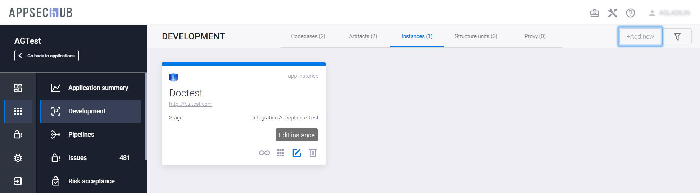</figure>

На экране появится окно **Update instance**.

<figure markdown></figure>

Укажите в этом окне следующие параметры экземпляра приложения:

* **Instance name** — имя экземпляра приложения.
* **URL** — адрес экземпляра приложения.
* Выберите этап из выпадающего меню **Stage** (System test, User Acceptance Test, Production, и т. д.).
* В разделе **Credentials** определяется список пользователей и их пароли для доступа к экземпляру приложения. Используйте кнопку **Add** справа, чтобы добавить нового пользователя. Нажмите иконку  рядом с учетными данными, чтобы пароли пользователей отображались на экране. Нажмите эту иконку еще раз, чтобы снова скрыть пароли.

Нажмите кнопку **Update**, чтобы сохранить изменения.

## Структурные единицы

На странице приложения выберите слева пункт меню **Settings** и перейдите на вкладку **General**. Текущий тип структурной единицы структуры приложения отображается в разделе **Structure unit type**.

<figure markdown>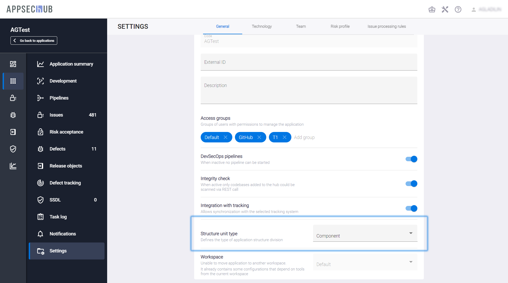</figure>

Тип структурной единицы структуры приложения может быть выбран из выпадающего меню (None, Module, Component, Microservice).

Возможность определения типа структурной единицы позволяет настроить работу с приложением в AppSec.Hub под структуру приложения (модули, компоненты или микросервисы). Например, если приложение имеет микросервисную архитектуру, целесообразно выбрать **Microservice** в разделе **Structure unit type** на вкладке **General**.

<figure markdown></figure>

Если тип структурной единицы структуры приложения определен как микросервис, структурные единицы соответствующего типа могут быть созданы с помощью кнопки **+Add new** на вкладке **Structure units** страницы разработки приложения **Development**.

<figure markdown>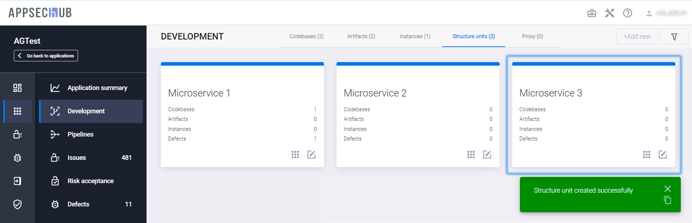</figure>

Каждая из этих структурных единиц имеет свои собственные кодовые базы, артефакты, экземпляры и дефекты. Каждая карточка структурной единицы отображает их количество, относящееся к этой структурной единице. Нажмите иконку **Edit unit**  на карточке структурной единицы, чтобы обновить ее параметры. На экране появится окно **Update structure unit**.

<figure markdown>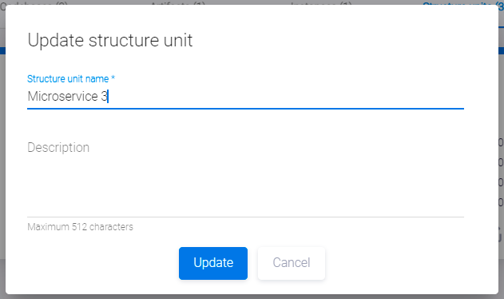</figure>

Введите имя и описание структурной единицы и нажмите кнопку **Update**.

Используйте иконку **Open details**  на карточке структурной единицы, чтобы просмотреть информацию об этой структурной единице.

<figure markdown>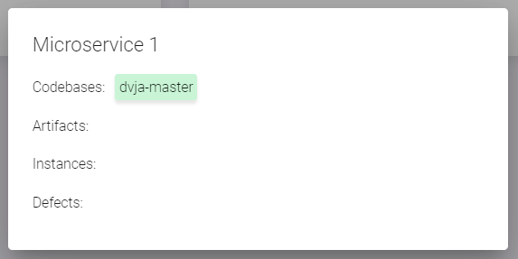</figure>

Используйте иконку  на карточке кодовой базы (см. вкладку **Codebases**), артефакта (**Artifacts**) или экземпляра (**Instances**), чтобы отнести этот элемент к структурной единице.

<figure markdown></figure>

На экране появится окно **Assign to structure unit**.

<figure markdown></figure>

Выберите структурную единицу из выпадающего меню и нажмите кнопку **Save**. Выберите в выпадающем меню пункт **None (remove from unit)**, чтобы удалить этот элемент из структурной единицы.

## Прокси-репозитории

В AppSec.Hub реализована возможность использования прокси-репозиториев.

Выберите соответствующее приложение на странице **Applications**.

<figure markdown></figure>

Выбрав слева пункт меню **Development**, перейдите на вкладку **Proxy**. На данной вкладке отображаются прокси-репозитории. Чтобы создать новый прокси-репозиторий, нажмите кнопку **+Add new**, после чего появится диалоговое окно **Create repository proxy**.

<figure markdown>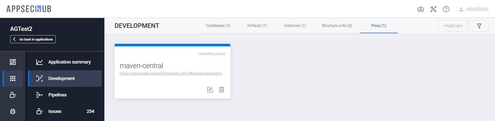</figure>

В поле **Repository Manager** выберите менеджер репозиториев, а в поле **Repository proxy** — необходимый репозиторий. После заполнения обеих полей, нажмите кнопку **Save**, чтобы создать прокси-репозиторий, или **Cancel**, чтобы отменить.

<figure markdown></figure>

Вновь созданный прокси-репозиторий появляется на вкладке **Proxy**, а в правом нижнем углу экрана отображается соответствующее подтверждающее сообщение.

<figure markdown>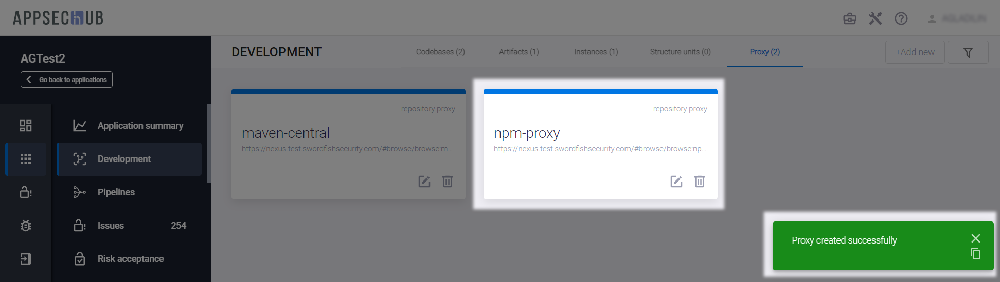</figure>

Созданный прокси-репозиторий автоматически добавляется в контур контроля разработки программного обеспечения, если на стороне **Repository Manager** включена функция контроля загружаемых компонент. Выбрав слева пункт меню **DevSecOps**, перейдите на вкладку **DevSecOps perimeter control**. На данной вкладке отображаются существующие прокси-репозитории с указанием используемой для них практики DevSecOps.

<figure markdown></figure>

!!! example "Например"
    В Nexus Repository Manager настроена интеграция с Nexus IQ, и для прокси-репозитория maven-central добавлена IQ: Audit and Quarantine capability. Это указывает, что практика контроля периметра уже применяется для данного прокси-репозитория, поэтому на вкладке DevSecOps perimeter control для репозитория maven-central отображается запись о включенном контроле периметра.

Чтоб исключить прокси-репозиторий из контура контроля, воспользуйтесь селектором, расположенным в правом нижнем углу соответствующего репозиторию элемента.

<figure markdown>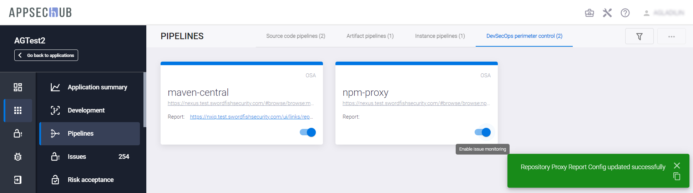</figure>

При исключении или включении прокси-репозитория в контур контроля в правой нижней части экрана отображается соответствующее подтверждающее сообщение.

Кроме этого, предусмотрена возможность удаления прокси-репозитория. Выбрав в меню слева пункт **Development**, перейдите на вкладку **Proxy**. Нажмите значок  на карточке прокси-репозитория, чтобы удалить соответствующий прокси-репозиторий.

<figure markdown></figure>

В появившемся диалоговом окне подтвердите удаление, нажав кнопку **Confirm**, или отмените кнопкой **Cancel**.

<figure markdown>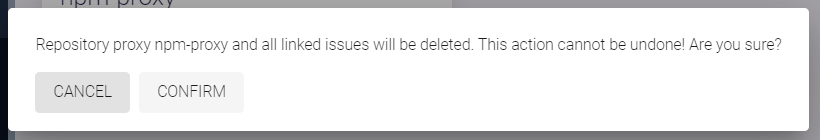</figure>

При удалении прокси-репозитория в правом нижнем углу экрана отображается соответствующее подтверждающее сообщение.

<figure markdown></figure>

Удаленный прокси-репозиторий больше не отображается на вкладке **Proxy** раздела **Development**, а также на вкладке **DevSecOps perimeter control** раздела **DevSecOps** и, соответственно, не может быть включен в контур контроля разработки программного обеспечения.

<figure markdown></figure>