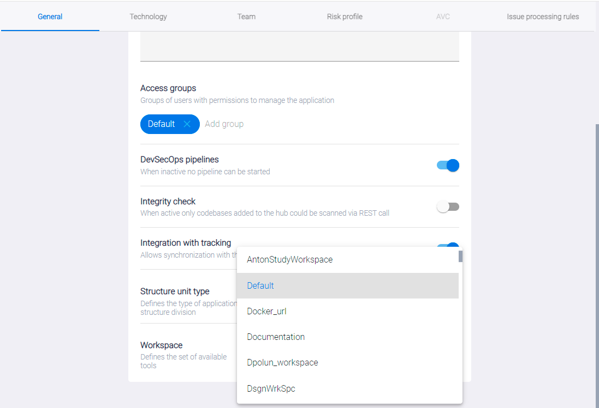
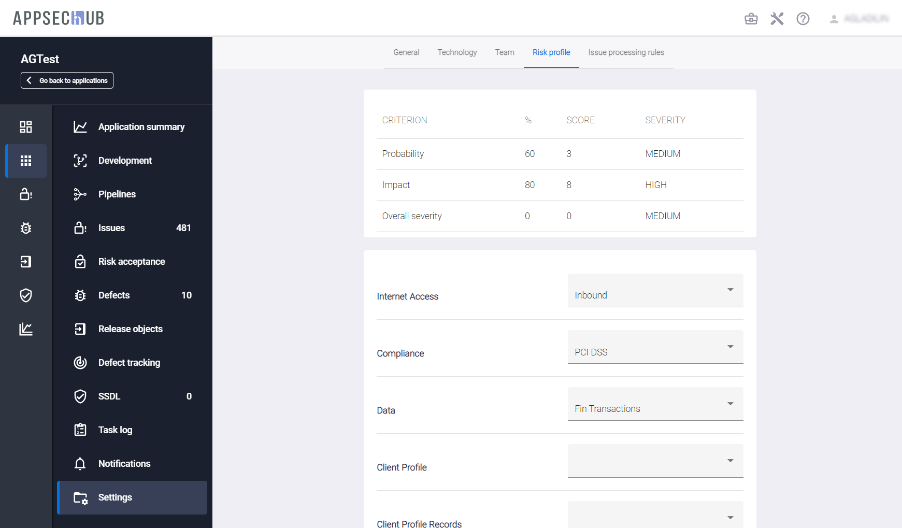
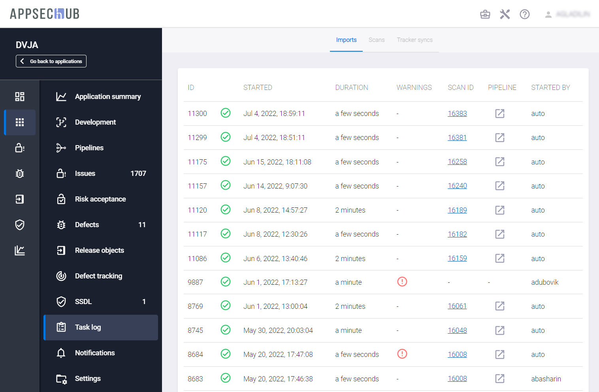

# Настройки приложения

Каждое приложение необходимо настроить и сконфигурировать до того, как члены команды начнут работать с ним в системе. Конфигурация приложения в AppSec.Hub охватывает несколько областей.

Чтобы начать процесс настройки, нажав значок **Show App details** , перейдите на страницу приложения.

<figure markdown></figure>

Вкратце, этот процесс включает определение и настройку параметров через пункты меню, расположенные слева.

<figure markdown></figure>

* **Info** — информация о приложении. На данной странице отображается текущий статус приложения с точки зрения метрик сканирования, проблем и дефектов безопасности, см. рис. выше. Также на экран выведены размер кодовой базы приложения в SLOC сводка по проблемам безопасности, сводка по дефектам безопасности и сводка по SSDL. Все эти данные извлекаются из хранилища данных (data warehouse).
* **Development** — этот пункт меню содержит пять вкладок (см. раздел «[Конфигурация приложения](../application configuration/#_1)»).
* Пункт меню **DevSecOps** предназначен для работы с Security Pipelines (описание приведено в разделе «[Security Pipelines](../Security Pipelines/#security-pipelines)»).
* Пункты меню **Issues** и **Defects** предназначены для работы с проблемами и дефектами приложения (см. раздел «[Работа с проблемами и дефектами безопасности](../handling%20security%20problems%20and%20defects/)»).
* **Risk Acceptance** — проблемы безопасности, добавленные в исключения, см. разделе «[Проблемы безопасности](../security%20issues/)».
* Пункт меню **Defect tracking** предназначен для настройки отслеживания дефектов приложения (описание приведено в разделе «[Синхронизация с Jira — настройки](../setting%20of%20synchronisation%20with%20Jira/)»).
* Пункт **SSDL** — информация, относящаяся к жизненному циклу разработки приложения.
* Пункт **Task log** — позволяет просмотреть перечень и статус выполняемых на бэкенде задач для данного приложения (см. раздел «[Журнал задач](../application%20settings/#_8)»).
* Пункт **Notifications** — настройка уведомлений для данного приложения. Более подробное описание приведено в разделе «[Уведомления приложения](../application%20settings/#_7)».
* Пункт **Settings** — настройки приложения. Шаги настройки приложения через пункт меню **Settings** подробно описаны ниже.

Чтобы получить подробную информацию о приложении, необходимо перейти на страницу **Applications** и, выбрав соответствующее приложение, нажать значок **Show app details** .

<figure markdown></figure>

На экране появится страница приложения с подробной информацией о нем. Выберите пункт меню **Settings** в консоли слева, чтобы изменить информацию о приложении и настроить его параметры. На экране откроется страница настроек приложения с шестью вкладками.

<figure markdown></figure>

Вкладка **General** позволяет настроить важные параметры приложения:

* **Application name** — название приложения.
* **Code** — внутренний код приложения во внешних пользовательских системах (это поле можно оставить пустым).
* **External ID** — внешний идентификатор приложения. Передается внешним инструментом, например, UUID сборки в Teamcity.
* **Description** — краткое описание приложения.
* а также выполнить прочие описанные ниже настройки.

## Сопоставление приложения с командой

Информация о командах с разрешением на управление приложением доступна в разделе **Access groups** на вкладке **General** на странице **Settings**.

<figure markdown></figure>

Нажмите кнопку **Add group** справа и выберите команду из выпадающего меню, чтобы добавить команду в список команд, работающих с приложением. Чтобы удалить команду из этого списка, нажмите на значок  справа от названия команды.

## Изменения статуса приложения (supported/not supported)

Все приложения в AppSec.Hub имеют статус либо «Supported», либо «Not supported». Текущий статус приложения отображается с помощью цвета вверху карточки приложения. Если линия имеет серый цвет, Security Pipelines для этого приложения не могут быть запущены, а само приложение имеет статус Not supported. Если линия имеет зеленый цвет, Security Pipelines для этого приложения могут быть запущены, а само приложение имеет статус Supported.

Выберите приложение на странице **Applications**, выберите пункт меню **Settings** в консоли слева и на ней выберите вкладку **General**. Текущее состояние приложения (Supported/Not supported) определяется с помощью селектора **DevSecOps pipelines**.

<figure markdown></figure>

Если селектор выключен, приложение имеет статус «Not supported», Security Pipelines для этого приложения не могут быть запущены, и на странице **Applications** приложение имеет следующий вид.

<figure markdown></figure>

Переведите селектор в положение «включено».

<figure markdown></figure>

Теперь приложение имеет статус «Supported», Security Pipelines для этого приложения могут быть запущены, и на странице **Applications** приложение имеет следующий вид.

<figure markdown></figure>

## Сопоставление приложения с рабочим пространством

Каждое приложение в AppSec.Hub сопоставляется с рабочим пространством. Более подробная информация о рабочих пространствах приведена в разделе «[Организация рабочих пространств](../../aag/organisation%20of%20workspaces/#_1)» Руководства прикладного администратора. В AppSec.Hub всегда существует предустановленное рабочее пространство Default workspace. До момента создания других рабочих пространств в системе все приложения могут быть сопоставлены только с этим рабочим пространством. По умолчанию, в процессе создания в окне **Create application** приложение сопоставляется с рабочим пространством Default workspace. При этом при создании приложения существует возможность сопоставить его с другим ранее созданным рабочим пространством при условии, что создающий приложение пользователь имеет к нему доступ.

<figure markdown></figure>

В AppSec.Hub всегда существует предустановленная команда Default team. До момента создания других команд в системе все пользователи входят только в эту команду. Если пользователь с правами Менеджера может работать только с командой Default team, рабочее пространство может быть изменено только на те рабочие пространства, доступ к которым имеют пользователи из Default team.

После создания в системе других команд пользователем с правами Администратора, пользователь с правами Менеджера может быть добавлен в них Администратором. В этом случае возможности доступа Менеджера к рабочим пространствам будут расширены, и он сможет выбрать рабочее пространство из всех тех, что доступны для пользователей всех команд, членом которых он является.

Можно сопоставить приложение с другим рабочим пространством, используя выпадающее меню **Workspace** на вкладке **General**.

<figure markdown></figure>

Просто выберите другое рабочее пространство из списка доступных.

<figure markdown></figure>

## Информация о технологиях приложения

Выбрав приложение на странице **Applications**, нажмите слева пункт меню **Settings** и перейдите на вкладку **Technology**.

<figure markdown></figure>

Информация, размещенная на этой вкладке, не является обязательной для заполнения. Она описывает используемые приложением технологии и не влияет на поведение приложения в AppSec.Hub.

## Сопоставление приложения с организационной структурой

Выберите вкладку **Team** на странице настроек приложения **Settings**.

<figure markdown></figure>

Текущее положение приложения в организационной структуре компании показано в разделе **Org structure**.

Обновите организационную структуру приложения, нажав кнопку **Change** справа. На экране появится окно **Assign application to another unit**.

<figure markdown></figure>

Кликните текущее подразделение структуры организации, выберите новое подразделение из списка и нажмите иконку **Assign to selected unit** 

<figure markdown></figure>

и подтвердите обновление структуры организации в появившемся окне. В разделе **Org structure** теперь отображаются обновленные данные.

Вкладка **Team** позволяет задать информацию о размере и уровне зрелости команды в полях **Team size** и **Team Maturity**. Эта информация не является обязательной, а эти поля можно оставить пустыми.

## Профиль рисков приложения

Выберите вкладку **Risk profile** на странице настроек приложения **Settings**.

<figure markdown></figure>

Эта вкладка рассчитывает и показывает сводку рисков приложений в верхней части вкладки.

Нижняя часть вкладки представляет собой вопросник по сбору информации о рисках приложения и позволяет вводить информацию о приложении, используя ряд полей с выпадающими меню. На основе этой информации в верхней части вкладки рассчитываются и отображаются риски информационной безопасности приложения в режиме реального времени.

## Уведомления приложения

Пункт меню **Notifications** позволяет настроить отправку уведомлений о различных событиях для данного приложения. Отправка уведомлений осуществляется по электронной почте.

Важно заметить, что настройка уведомлений возможна как для каждого отдельного приложения, так и в профиле пользователя. Таким образом, если определенный тип уведомлений, например **Defect reopened**, включен в настройках приложения (см. рис. ниже), но отключен в профиле пользователя (см. раздел «[Пользователи и команды](../../aag/users%20and%20teams/#_1)» Руководства прикладного администратора), соответствующие уведомления данному пользователю отправляться не будут.

<figure markdown></figure>

## Журнал задач

Пункт меню **Task log** позволяет просмотреть журнал задач с записями о различных типах событий для данного приложения.

<figure markdown></figure>

Страница содержит три вкладки:

* **Imports** — задачи, связанные с импортом Security Issues из других инструментов. Отображаются следующие данные:
    * **Id** — идентификационный номер.
    * **Status** — статус.
    * **Started** — дата запуска.
    * **Duration** — продолжительность.
    * **Warnings** — предупреждения. При наличии предупреждений в данном столбце отображается значок  (см. рис. выше), нажав который можно ознакомиться с перечнем предупреждений.
    

    * **Scan id** — идентификационный номер сканирования, запустившего эту задачу. При нажатии на эту ссылку происходит переход на страницу с детальной информацией об этом сканировании.
    * **Pipeline** — ссылка на Security Pipeline, в рамках которого выполнялось сканирование.
    * **Started by** — имя пользователя, инициировавшего процесс импорта Security Issues. Если данное поле пустое, импорт был запущен автоматический, например после завершения сканирования.
    
* **Scans** — задачи, связанные со сканированием Security Pipelines.
* **Tracker syncs** — задачи, связанные с синхронизацией с системой отслеживания ошибок.