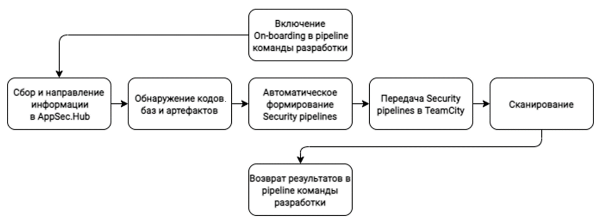
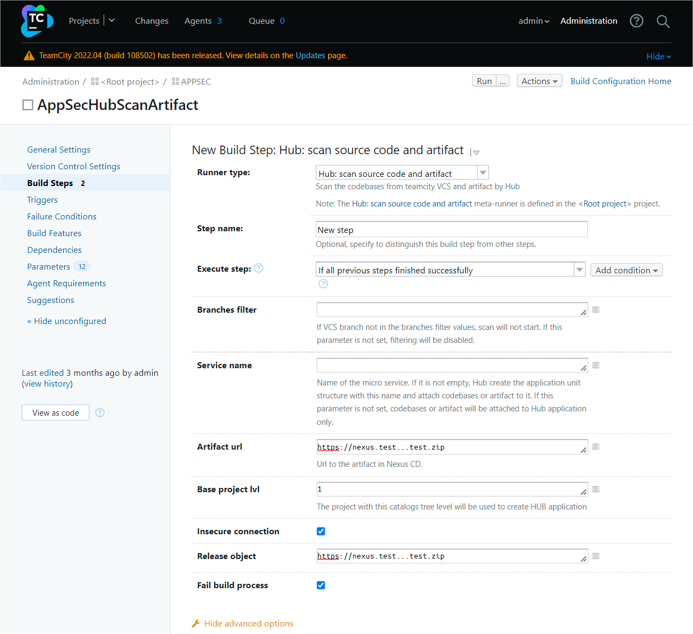

# On-boarding — автоматизация интеграции AppSec.Hub в цикл разработки

## Понятие On-boarding

В AppSec.Hub реализованы механизмы, позволяющие автоматизировать и, соответственно, значительно упростить и ускорить процесс интеграции системы в единый цикл разработки программного обеспечения, а значит в целом облегчить контроль безопасности разрабатываемого программного обеспечения. В ходе данного процесса происходит добавление в AppSec.Hub информации о кодовых базах, артефактах и т. д., формируются соответствующие Security Pipelines, запускаются сканирования и при необходимости инициируется обмен данными, например результатами сканирования, с другими инструментами и все эти операции выполняются в автоматическом режиме. Для определения данного процесса будем использовать термин On-boarding.

Другими словами, On-boarding — это быстрый и эффективный способ, позволяющий DevOps-команде оперативно и с наименьшими затратами пересмотреть существующие рабочие процессы в пользу дальнейшей разработки программного обеспечения в парадигме DevSecOps. А разработчики, уже использующие DevSecOps практики, получают мощный инструмент, позволяющий радикально сократить объем выполняемых «вручную» рутинных операций и, тем самым, повысить эффективность производственных процессов.

Переходя в практическую плоскость, отметим, что On-boarding в AppSec.Hub реализован с помощью скриптов, запускаемых с набором определенных параметров в CLI (Command Line Interface). По существу, такой подход реализует упрощенный способ взаимодействия с REST API системы.

Для сканирования кодовых баз и артефактов используются соответственно два скрипта: ***scan_codebase.py*** и ***scan_artifact.py***, см. таблицу ниже. Скрипты написаны на Python 3.7 и взаимодействуют с back-end AppSec.Hub с использованием протокола http. Описание параметров скриптов и примеры их использования для сканирования кодовых баз и различных типов артефактов приведены в [Приложениях 1](../appendix%201/#1-on-boarding) и [2](../appendix%202/#2) соответственно.

Скрипт|Описание
-|-
scan_codebase.py|Сканирование кодовых баз
scan_artifact.py|Сканирование артефактов

В качестве примера поэтапно рассмотрим типовой процесс сканирования кодовой базы.

    py scan_codebase.py --url http://hub.dev.swordfishsecurity.com/ \
        --token ***** \
        --appcode 09022021_cli \
        --branch master \
        --codebase-url http://gitlab.service.yourcompany.com/test/java-web-project.git

1. AppSec.Hub находит приложение, код которого передан с помощью параметра `––appcode`, в противном случае создает новое.
2. AppSec.Hub находит кодовую базу, определенную параметрами `--codebase-url` и `--branch`, в противном случае создает новую.
3. AppSec.Hub находит Security Pipeline для анализа кодовой базы. Если Security Pipeline обнаружен, AppSec.Hub запускает его, в противном случае на основе подходящего шаблона (см. раздел «[Security Pipelines](../security%20pipelines/#security-pipelines)») создается новый Security Pipeline и запускается сканирование. Если подходящий шаблон не найден, генерируется сообщение об ошибке, см. раздел «[Приложение 3. Результаты сканирования](../appendix%203/#3)». В таком случае следует создать соответствующий шаблон Security Pipeline, в пользовательском интерфейсе AppSec.Hub, см. раздел «[Security Pipelines](../security%20pipelines/#security-pipelines)».
4. После завершения сканирования осуществляется возврат результатов с учетом Quality Gate (см. раздел «[Security Pipelines](../security%20pipelines/#security-pipelines)») и в CLI отображается ссылка на результаты сканирования. После перехода по ссылке (требуется предварительная авторизация в AppSec.Hub), можно просмотреть перечень обнаруженных в ходе сканирования Security Issues. Эта функциональность позволяет быстро ознакомиться с проблемами безопасности, выявленными в ходе соответствующего сканирования. Кроме этого, результаты сканирования могут быть сохранены в текстовый файл, который содержит информацию о статусе сканирования и причине его присвоения, использовавшихся при этом практиках и т. д.

Кроме этого, реализован механизм взаимодействия, позволяющий через REST API выполнить импорт результатов сканирования из различных AST инструментов (Checkmarx, Nexus IQ). Такой подход особенной удобен, когда в компании уже выстроен процесс разработки с использованием тех или иных инструментов и стоит задача передачи всех этих данных в AppSec.Hub. При этом нет необходимости запускать сканирование, как в приведенном выше примере. В результате на стороне AppSec.Hub создаются все необходимые объекты и связи: приложения, кодовые базы, Security Pipelines, а также запускается импорт уязвимостей и проверяется соответствие QG.

Для импорта результатов используется скрипт ***import_results.py***. Описание параметров запуска скрипта приведено в разделе «[Приложение 1. Описание параметров запуска скриптов on-boarding](../appendix%201/#1-on-boarding)».

## Особенности интеграции с использованием TeamCity

Благодаря предлагаемой инструментом оркестрации TeamCity функциональности Meta-Runner появилась возможность еще больше сократить участие человека в процессе интеграции и снизить объем выполняемых «вручную» операций.

Meta-Runner — специально разработанный конфигурационный файл, позволяющий автоматизировать процесс настройки TeamCity с учетом специфических требований интеграции с AppSec.Hub. При этом активно используются шаблоны, автоматическое распознавание кодовых баз и артефактов по URL и т. д.

Упрощенно графически типовая интеграция AppSec.Hub в процесс разработки с использованием Meta-runner может быть представлена следующим образом.

<figure markdown>{ width="800" }</figure>

### Настройка Meta-Runner

В комплект поставки AppSec.Hub входят следующие конфигурационные файлы Meta-Runner.

<figure markdown>
| Название конфигурационного файла | Назначение | Используемые скрипты |
|----------------------------------|------------|----------------------|
| ***scan-codebase-metarunner.xml*** | для работы только с кодовыми базами | ***scan_codebase.py*** |
| ***scan-artifact-metarunner.xml*** | для работы только с артефактами | ***scan_artifact.py*** |
| ***scan-codebase-or-artifact-metarunner.xml*** | для работы как с кодовыми базами, так и с артефактами | ***scan_codebase.py и scan_artifact.py*** |
</figure>

Конфигурационный файл определят вид диалогового окна, используя которое пользователь TeamCity получает возможность сформировать соответствующий Build Step и передать в сканирующие скрипты всю необходимую информацию, а также содержит исполняемый код, обеспечивающий взаимодействие сканирующих скриптов с API TeamCity и AppSec.Hub.

### Загрузка конфигурационного файла Meta-Runner в TeamCity

Находясь в корневой папке TeamCity, перейдите на страницу **Meta-Runners**. Нажмите кнопку **+Upload Meta-Runner**, выберите необходимый конфигурационный файл с расширением xml, при необходимости измените имя файла и нажмите кнопку **Save**.

<figure markdown></figure>

Конфигурационный файл будет загружен в корневой проект TeamCity и, соответственно, будет доступен для всех остальных проектов более низкого уровня, в которых, в свою очередь, он может быть добавлен в качестве одного из этапов пайплайна (Build Step) TeamCity.

### Добавление Build Step в TeamCity

Чтобы добавить загруженный нами конфигурационный файл в качестве одного из этапов пайплайна (Build Step) в TeamCity, необходимо:

Выбрать проект и нажать кнопку **Edit configuration**, расположенную в правом верхнем углу интерфейса пользователя.

<figure markdown></figure>

Выбрать пункт меню **Build Steps** слева.

<figure markdown></figure>

Нажать кнопку **+Add build step** и в раскрывающемся меню выбрать название загруженного ранее конфигурационного файла Meta-Runner.

<figure markdown></figure>

Поля страницы **New Build Step** заполняются с учетом специфических проектных требований.

<figure markdown></figure>

* **Step name** — наименование этапа пайплайна (Build Step), например, **AppSec.Hub Meta-Runner**.
* **Branches filter** — фильтр кодовых ветвей репозитория для сканирования. Фильтр применяется как к основной, так и к дополнительным кодовым базам. Если значение не указано, будут сканироваться все ветви кодовой базы (фильтрация отсутствует).
* **Service name** — устанавливает соответствие между кодовой базой/артефактом и структурной единицей приложения (Structure unit). Если указанный Structure unit отсутствует AppSec.Hub, он создается.
* **Artifact url** — URL артефакта, хранящегося в Nexus RM или файловом хранилище. Если данный параметр отсутствует, сканирование запущено не будет.
* **Base project lvl** — вложенность приложения относительно корневой папки. Если при интеграции/настройке TeamCity c AppSec.Hub, в качестве параметра **Root folder** был указан какой-либо проект, то отчет вложенности ведется от него.

<figure markdown>{width="1000"}</figure>

* **Insecure connection** — если выбрана данная опция, ошибки HTTPs игнорируются.
* **Enable tagging for an artifact** — если выбрана данная опция, происходит тегирование артефакта в соответствующем пайплайне.
* **Fail build process** — если данная опция выбрана, ошибки сканирования игнорируются.

После завершения конфигурирования Build Step нажмите кнопку **Save**.

Кроме описанных выше параметров в скрипты ***scan_codebase.py*** и ***scan_artifact.py*** могут передаваться другие, например:

`--scan-initiator` — информация об инициаторе сканирования (например, ссылка на задачу TeamCity);

`--scan-initiator-environment` — среда окружения инициатора сканирования.

Передаваемая с их помощью информация отображается в соответствующих полях страницы с подробной информацией о задаче сканирования, а также ассоциируется с обнаруженными в ходе него проблемами безопасности.

<figure markdown></figure>

В свою очередь созданные из таких проблем безопасности дефекты также наследуют указанную информацию, что в результате последующей синхронизации делает возможным ее передачу в проектную систему отслеживания дефектов.

Чтобы обеспечить возможность синхронизации, необходимо настроить соответствие полей в проектной системе отслеживания дефектов, см. раздел «[Синхронизация с Jira — настройки](../setting%20of%20synchronisation%20with%20Jira/#jira)».

!!! note "Примечание"
    При каждой последующей синхронизации дефектов соответствующая информация в проектной системе отслеживания дефектов обновляется.

### Определение конфигурационных параметров и переменных среды

Кроме этого, для нормального функционирования Meta-runner необходимо указать некоторые общие конфигурационные параметры и переменные среды на странице **Parameters**. Если данные параметры и переменные не наследуются из корневого проекта, необходимо их добавить.

<figure markdown></figure>

***Необходимые конфигурационные параметры***

<figure markdown>
| Параметр | Описание | Значение |
|----------|----------|----------|
| teamcity.serverUrl | URL TeamCity | http://teamcity.dev.swordfishsecurity.com |
| teamcity_user_name | Имя пользователя TeamCity | admin |
| teamcity_user_password | Пароль | ****** |
</figure>

***Необходимые переменные среды***

<figure markdown>
| Параметр | Описание | Значение |
|----------|----------|----------|
| env.HUB_URL | URL AppSec.Hub | https://hub.dev.swordfishsecurity.com |
| env.NEXUS_URL | URL Nexus | https://nexus.dev.swordfishsecurity.com |
| env.TOKEN | Токен | ****** |
</figure>

### On-boarding и сканирование

После запуска пайплайна в TeamCity, когда очередь доходит до созданного нами этапа, происходит следующая последовательность действий:

* Обнаруживается кодовая база/артефакт.
* Выполняется ряд подготовительных и контрольных операций.
* Создаются виртуальные переменные, обеспечивающие возможность работы без доступа в Интернет.
* Подключаются необходимые библиотеки.
* Далее, на основе собранных данных, происходит запуск скриптов ***scan_codebase.py*** и/или ***scan_artifact.py***, которые, в свою очередь, создают в AppSec.Hub необходимые Security Pipelines, запускают сканирования соответствующих кодовых баз и артефактов с использованием выбранных инструментов, сохраняют и возвращают результаты сканирований.

При отсутствии ошибок процесс завершается с кодом выхода «0».

Коды ошибок, которые могут появляться при работе Meta-runner, приведены в «[Приложение 4. Коды выхода Meta-runner](../appendix%204/#4-meta-runner)».