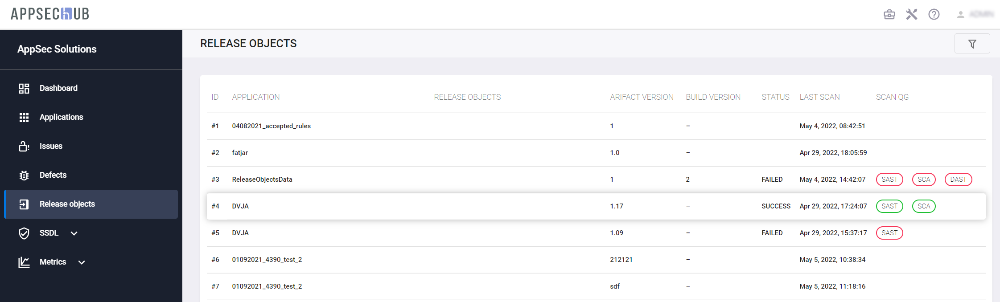
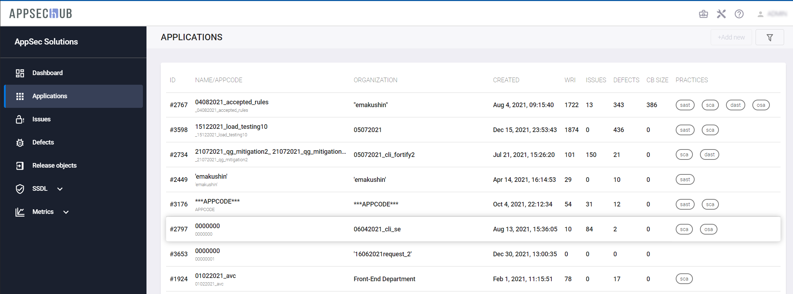
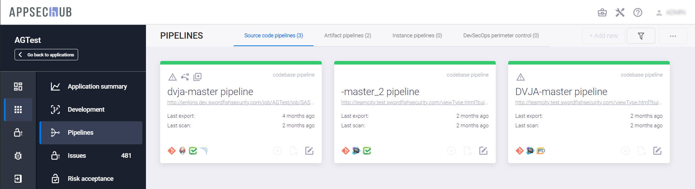
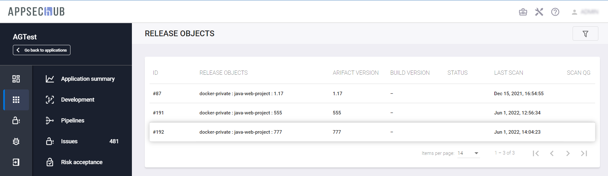
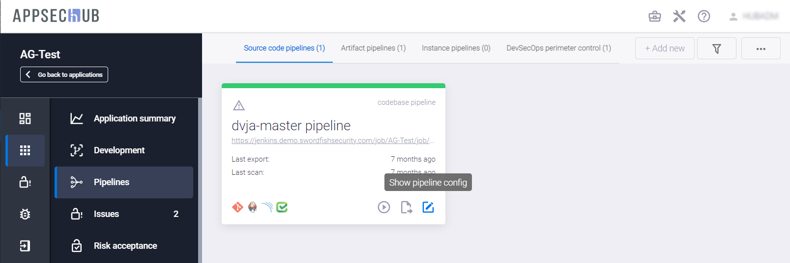
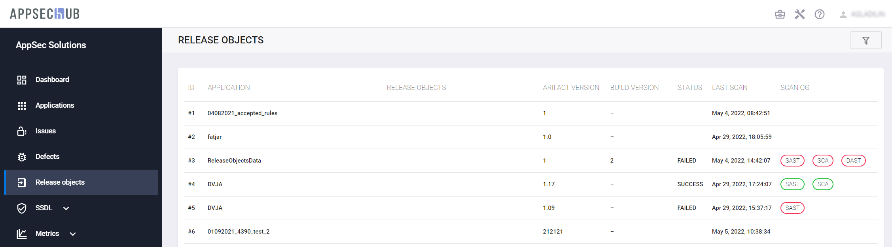
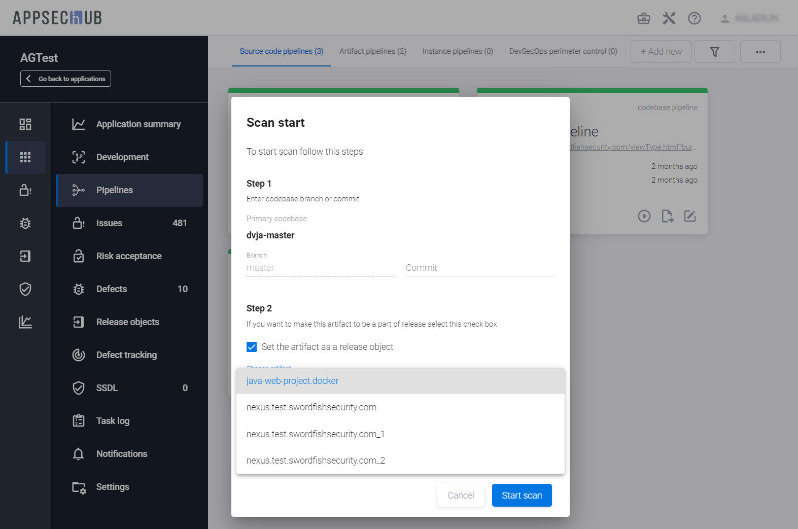

# Релизные объекты

С точки зрения обеспечения безопасности приложения, конечной целью является проверка безопасности сборки приложения, поставляемой конечному пользователю (клиенту). Для выполнения таких проверок в AppSec.Hub реализована работа с релизными объектами.

Релизный объект — это часть релиза (релизного пакета). Представляет собой артефакт, поставляемый конечному пользователю (клиенту) — образ Docker, WAR-файл и т. д. Релизный объект может быть идентифицирован срезом кодовой базы (по коммиту), версией сборки артефакта и/или версией развёрнутого экземпляра приложения.

Консолидация результатов и статусов сканирования всех кодовых баз, артефактов и экземпляров приложения, относящихся к релизному объекту, позволяет сделать общее заключение, соответствует ли данный релизный объект установленным в Quality Gates критериям безопасности и можно ли его поставлять конечному пользователю с точки зрения информационной безопасности.

Чтобы начать работу с релизными объектами, выберите пункт **RELEASE OBJECTS** в меню, расположенном в верхней части окна AppSec.Hub. На экране появится страница со всеми релизными объектами различных приложений, доступных данному пользователю. Релизные объекты могут просматривать все пользователи независимо от их роли в AppSec.Hub.

<figure markdown>

</figure>
 
Для работы с релизными объектами одного приложения, выберите пункт меню **Applications** в левом верхнем углу интерфейса пользователя. На экране появится страница с приложениями.

<figure markdown>

</figure>
 
Нажмите на иконку **Show app details**, расположенную в правом нижнем углу карточки выбранного приложения.

<figure markdown>

</figure>
 
На странице приложения слева в меню выберите пункт **Release objects**. На экране появятся релизные объекты приложения.

<figure markdown>

</figure>
 
На этой странице для каждого релизного объекта выбранного приложения отображается та же информация, что и на странице со всеми релизными объектами нескольких приложений.

Также в системе предусмотрена возможность фильтрации релизных объектов по следующим параметрам.

<figure markdown>

</figure>

* **by artifacts** — по артефактам, относящимся к релизным объектам. Один артефакт может относиться к нескольким релизным объектам;
* **by object** — по релизным объектам;
* **by status** — по статусу сканирования релизного объекта (SUCCESS, FAILED или EMPTY, если статус сканирования не был установлен);
* **by SAST quality gate** — по статусу прохождения Quality Gate для SAST-сканирования;
* **by SCA quality gate** — по статусу прохождения Quality Gate для SCA-сканирования;
* **by DAST quality gate** — по статусу прохождения Quality Gate для DAST-сканирования;
* **by version** — по версии релизного объекта;
* **by build version** — по версии билда релизного объекта;
* **by structure unit** — по структурным единицам, к которым относятся артефакты релизных объектов.

## Создание релизных объектов

Релизные объекты создаются в процессе сканирования. На странице приложения выберите пункт меню **DevSecOps** в меню слева и перейдите на вкладку с **Security pipeline** того объекта, сканирование которого будет привязано к создаваемому релизному объекту, например, на вкладку **Source code pipelines** для кодовых баз.

<figure markdown>

</figure>
 
Нажмите кнопку **Actions**  в правом верхнем углу и выберите пункт **Start scan** в выпадающем меню.

В появившемся окне **Scan start** в секции **Step 2** отметьте галочкой поле **Set the artifact as a release object**. Выберите существующий артефакт данного приложения из выпадающего списка в поле **Choose artifact**, чтобы привязать нему сканирование и сделать его релизным объектом. В поле **Artifact version** укажите версию создаваемого релизного объекта и версию билда в поле **Build version** (если применимо, это зависит от типа релизного объекта – обязательные поля отмечены звездочкой).

<figure markdown>

</figure>
 
Нажмите кнопку **Start scan** внизу окна, чтобы начать сканирование. Релизный объект будет создан одновременно со стартом сканирования.

<figure markdown>

</figure>
 
Чтобы убедиться в том, что это сканирование привязано к созданному релизному объекту, нажмите иконку **Show pipeline config**  на карточке пайплайна.

<figure markdown>

</figure>
  
На открывшейся странице с детальной информацией о пайплайне выберите вкладку **Scans**.

<figure markdown>

</figure>

Нажмите на строку вновь созданного сканирования. На странице с детальной информацией о сканировании приведена информация о релизном объекте, к которому оно привязано.

<figure markdown>

</figure>

Создание релизных объектов также доступно при онбординге с использованием CLI, см. детали в разделе «[On-boarding — автоматизация интеграции AppSec.Hub в цикл разработки](./on-boarding.md)».

## Информация о релизных объектах

Выберите пункт **RELEASE OBJECTS** в меню, расположенном в верхней части окна AppSec.Hub. На экране появится страница со всеми релизными объектами разных приложений, доступными данному пользователю. 

<figure markdown>

</figure>
  
Для каждого релизного объекта отображается следующая информация:

* **ID** — идентификатор релизного объекта в системе.
* **APPLICATION** — приложение, к которому относится релизный объект.
* **RELEASE OBJECTS** — имя релизного объекта. Оно формируется следующим образом:
`<repositoryName>` : `<group>` : `<artifact>` : `<version>` (build: `<buildVersion>`) где:

* `<repositoryName>` — имя репозитория, где лежит артефакт, на базе которого создан объект (опциональный параметр, указывается для nexus репозитория, для filestorage артефактов не существует);
* `<group>` — имя группы (опциональный параметр, указывается для maven и npm артефактов);
* `<artifact>` — имя артефакта в репозитории (не следует путать с именем артефакта в AppSec.Hub);
* `<version>` — версия артефакта (опциональный параметр, указывается, если она есть у артефакта, её может не быть для raw, yum, filestorage артефактов);
* `<buildVersion>` — версия билда (опциональный параметр, указывается, если она есть у артефакта).

* **ARTIFACT VERSION** — версия артефакта.
* **BUILD VERSION** — версия билда (если применимо).
* **STATUS** — cтатус сканирования релизного объекта (SUCCESS, FAILED или EMPTY, если статус сканирования не был установлен). Он определяется на основе статуса прохождения Quality Gates, установленных во всех относящихся к релизному объекту сканированиях кодовых баз, артефактов и экземпляров приложения. Для определения cтатуса сканирования релизного объекта используются результаты последнего из проведенных сканирований каждого из относящихся к нему артефактов, кодовых баз и экземпляров приложения. Результаты этих сканирований отображаются в столбце **SCAN QG**.
    * Если все сканирования завершились успешно и отмечены зеленым цветом в столбце **SCAN QG**, сканирование релизного объекта имеет статус SUCCESS.
    * Если хотя бы одно сканирование завершились неуспешно и отмечено красным цветом, сканирование релизного объекта имеет статус FAILED.
    * Если QG не был установлен ни в одном сканировании, это поле будет пустым (EMPTY).
* **LAST SCAN** — дата последнего из сканирований, относящихся к релизному объекту.
* **SCAN QG** — статус прохождения Quality Gates, установленных в относящихся к релизному объекту сканированиях SAST, SCA и DAST. Зеленым цветом отмечены успешно закончившиеся сканирования с выполненным критерием Quality Gate и со статусом SUCCESS, красным – сканирования, закончившиеся неуспешно (FAILED). Если QG не был установлен, это поле будет пустым.

Нажмите на строку релизного объекта. Откроется страница с детальной информацией об этом объекте.

<figure markdown>

</figure>
 
На вкладке **Description** представлена следующая информация:

* Статус сканирования релизного объекта (статус SUCCESS или FAILED показан в виде соответствующей плашки, статус EMPTY не отображается).
* **Details** — информация о проведенном сканировании, и о последнем из всех относящихся к релизному объекту сканирований, закончившемся со статусом FAILED.
* **Application** — приложение, к которому относится релизный объект.
* **Last scan** — дата последнего сканирования, относящегося к релизному объекту.
* **Scan targets** — список просканированных кодовых баз, артефактов и экземпляров приложений, относящихся к релизному объекту.
    * **Source code** — список просканированных кодовых баз, относящихся к релизному объекту. При нажатии на каждую из ссылок откроется соответствующий репозиторий.
    * **Artifact** — список просканированных артефактов, относящихся к релизному объекту. При нажатии на каждую из ссылок откроется соответствующий репозиторий.
    * **Instance** — список просканированных экземпляров приложений, относящихся к релизному объекту. При нажатии на каждую из ссылок откроется соответствующий веб-сайт.
* **Issue results** — сводная информация о выявленных во время сканирования проблемах безопасности.

На вкладке **Related scans** представлена информация о всех сканированиях, относящихся к релизному объекту.

<figure markdown>

</figure>
 
Для каждого сканирования отображается следующая информация:

* **ID** — идентификатор сканирования в системе.
* **TYPE** — тип сканирования (сканирование кодовых баз, артефактов, экземпляров приложений).
* **SCAN OBJECT** — имя объекта сканирования.
* **STATUS** — результат сканирования (SUCCESS, FAILED, также поле может остаться пустым). Статус SUCCESS присваивается, если установленный в Quality Gates критерий безопасности был выполнен. Статус FAILED присваивается, если установленный в Quality Gates критерий безопасности не был выполнен. Если QG не был установлен, это поле будет пустым.
* **DURATION** — продолжительность сканирования.
* **SAST QG** — статус прохождения Quality Gate для SAST-сканирования с точки зрения установленного QG. Если QG не был установлен, это поле будет пустым. Если QG был установлен, но критерий, заданный в QG, не был выполнен, это поле будет содержать соответствующую иконку **Failed** . Если QG был установлен и критерий, заданный в QG, был выполнен, это поле будет содержать соответствующую иконку **Passed** .
* **SCA QG** — статус прохождения Quality Gate для SCA-сканирования с точки зрения установленного QG. Если QG не был установлен, это поле будет пустым. Если QG был установлен, но критерий, заданный в QG, не был выполнен, это поле будет содержать соответствующую иконку **Failed** . Если QG был установлен и критерий, заданный в QG, был выполнен, это поле будет содержать соответствующую иконку **Passed** .
* **DAST QG** — статус прохождения Quality Gate для DAST-сканирования с точки зрения установленного QG. Если QG не был установлен, это поле будет пустым. Если QG был установлен, но критерий, заданный в QG, не был выполнен, это поле будет содержать соответствующую иконку **Failed** .  Если QG был установлен и критерий, заданный в QG, был выполнен, это поле будет содержать соответствующую иконку **Passed** .

При нажатии на строку сканирования на вкладке **Related scans** происходит переход на страницу с детальной информацией об этом сканировании.

<figure markdown>

</figure>

## Тегирование релизных объектов

Настройка тегирования релизных объектов позволяет автоматически ставить метку на релизные объекты в качестве результирующего шага сканирования безопасности.

Некоторые инструменты поддерживают механизм тегирования. Тегирование позволяет наносить метки на релизные объекты в зависимости от результатов сканирования. К примеру, если в результате анализа библиотек с открытым исходным кодом (с применением инструментов класса SCA) релизный объект успешно проходит Quality Gate, он будет помечен меткой «QG_SCA_PASS», а в противном случае — меткой «QG_SCA_FAIL». Отсутствие метки на релизном объекте при определенном QG означает, что релизный объект еще не сканировался после установки QG. Если QG не задан, а сканирование артефактов было выполнено, артефакт не будет помечен тегом в результате этого сканирования.

Чтобы разрешить или запретить тегирование релизных объектов в приложении, выберите пункт меню **Applications** в верхнем левом углу экрана. На экране появятся карточки приложений.

<figure markdown>

</figure>

Нажмите на иконку редактирования  в правом нижнем углу карточки выбранного приложения на странице **Applications**. На появившейся странице приложения выберите пункт меню **DevSecOps** слева, а затем – вкладку **Settings**.

<figure markdown>

</figure>
 
Для управления тегированием релизных объектов используется переключатель **Tagging** на данной вкладке. Если этот переключатель выключен, релизные объекты данного приложения не могут быть протегированы.

Если переключатель **Tagging** включен, то релизный объект, выбранный при старте сканирования в окне **Start scan** в поле **Choose artifact**, будет протегирован в зависимости от результата сканирования.

<figure markdown>

</figure>
 
!!! note "Важное замечание"
    Tеги, которыми может быть помечен релизный объект, определяются пользователем с правами Администратора на странице администрирования с помощью пункта меню **Tagging config**. Настройка тегирования артефактов описана в разделе «[Настройки тегирования](../aag/tagging%20settings.md)» Руководства прикладного администратора.
    
    В версиях AppSec.Hub ниже 1.9 для тегирования артефактов использовалась отдельная карточка в структуре security pipeline:
 
    При переходе с версии AppSec.Hub ниже 1.9 на версию AppSec.Hub 1.9 и выше, уже существующие карточки тегирования пропадут из структуры security pipeline, а все протегированные артефакты автоматически преобразуются в системе в релизные объекты.