# Дефекты безопасности

!!! note "Примечание"
    Для выполнения нижеописанных действий требуется роль Инженер ИБ.

Обычно инструмент AST генерирует десятки или даже сотни проблем безопасности. Не все эти проблемы уникальны и действительно важны для безопасности приложения. Инженеру ИБ необходимо проанализировать все проблемы безопасности и сформировать технический долг по безопасности приложения на основе результатов тестирования. Результатом анализа проблем безопасности является список дефектов безопасности, внесенных в систему отслеживания дефектов проекта.

Уязвимости, обнаруженные инструментами AST во время сканирования, также называются «проблемами безопасности» (Security Issues).

Уязвимости, занесенные в систему отслеживания дефектов (например, Jira), называются «дефектами безопасности» (Security Defects).

Между проблемами и дефектами безопасности есть несколько важных различий:

* Проблемы безопасности обнаруживаются и документируются с помощью инструментов AST. Статут дефекта проблеме (-ам) безопасности присваивает Инженер ИБ при занесении в систему отслеживания дефектов.
* Проблемы безопасности хранятся в инструментах AST и импортируются в AppSec.Hub. Дефекты безопасности создаются в AppSec.Hub и экспортируются в систему отслеживания дефектов (Jira).
* Дефекты создаются на основе проблем безопасности. Один дефект может включать несколько проблем безопасности. Такое решение должен принять Инженер ИБ на основе проведенного анализа.

Информация о дефектах всех приложений, к которым пользователь имеет доступ, отображается на общей странице дефектов.

<figure markdown>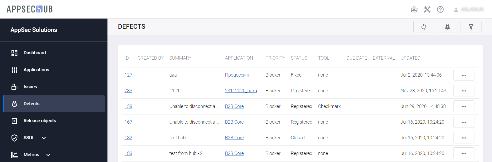</figure>

Для каждого дефекта отображается следующая информация:

* **ID** — идентификатор.
* **CREATED BY** — имя пользователя, создавшего дефект.
* **SUMMARY** — краткое описание дефекта.
* **APPLICATION** — приложение, к которому относится дефект.
* **PRIORITY** — приоритет дефекта (Blocker, Critical, Major, Minor или Info) указывает на важность или срочность исправления этого дефекта.
* **STATUS** — статус дефекта показывает текущий этап жизненного цикла дефекта в AppSec.Hub (Registered, Open, Fixed, In Progress, Closed или Rejected). 
* **TOOL** — AST-инструмент, с помощью которого были обнаружены проблемы безопасности.
* **DUE DATE** — срок устранения дефекта.
* **EXTERNAL** — ссылка на дефект в проектной системе отслеживания дефектов, соответствующий дефекту в AppSec.Hub. 
* **UPDATED** — дата обновления информации о дефекте.

!!! note "Примечание"
    Cсылка в поле **EXTERNAL** отображается, только если в результате синхронизации в проектной системе отслеживания дефектов был создан соответствующий дефект.

<figure markdown></figure>

Справа от дефекта располагается кнопка **Action** 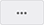, с помощью которой можно либо удалить дефект, либо разорвать связь (-и) с включенными в него проблемами безопасности.

Кроме этого, предусмотрена возможность фильтрации дефектов по следующим параметрам:

<figure markdown></figure>

* **by application** — по приложению. 
* **by author** — по автору дефекта. 
* **sort by** — сортировка в заданном порядке:
    * **Newest first** — от новых к старым.  
    * **Priority: High to Low** — по уменьшению приоритета.
    * **Priority: Low to High** — по возрастанию приоритета.
    * **Last updated** — от старых к новым.
    * **Due date: oldest on top** — по сроку устранения дефекта — от менее срочных к более срочным.
    * **Due date: newest on top** — по сроку устранения дефекта — от более срочных к менее срочным. 
* **by priority** — по приоритету (All, Info, Minor, Major, Critical или Blocker). 
* **by severity** — по серьезности дефекта (All, Low, Medium, High или Critical).
* **by status** — по статусу (All, Registered, Open, In Progress, Fixed, Rejected или Closed).
* **by sync** — по статусу синхронизации (Success, Not started или Failed).

## Создание дефекта безопасности без включения в него проблем безопасности

Инженер ИБ может создать дефект, находясь на общей странице дефектов. Важно отметить, что при создании дефекта на этой странице невозможно связать с ним какие-либо проблемы безопасности, обнаруженные инструментами AST. Порядок создания дефекта со связанными проблемами безопасности приведен в разделе «[Создание дефекта безопасности на основе проблем безопасности](../security%20defects/#_3)».

Нажмите кнопку **Open defect**.

!!! note "Примечание" 
    При создании дефекта на общей странице проблем безопасности **ISSUES**, можно выбирать проблемы безопасности только для одного приложения. В случае, если проблемы безопасности будут относиться к разным приложениям, при попытке завести дефект произойдет ошибка и на экране появится соответствующее сообщение.

<figure markdown></figure>

Выберите соответствующее приложение.

<figure markdown></figure>

Нажмите кнопку **Create**.

<figure markdown></figure>

Введите краткое описание дефекта и при необходимости заполните остальные поля.

Нажмите кнопку **Save**.

<figure markdown></figure>

Чтобы синхронизировать созданные дефекты с проектной системой отслеживания дефектов, нажмите кнопку **Sync with tracker**.

<figure markdown></figure>

В появившемся окне выберите одно или несколько приложений и нажмите кнопку **Start synchronization**.

<figure markdown></figure>

!!! note "Примечание"
    Для успешной синхронизации необходимо предварительно выполнить настройки, описанные в разделе «[Синхронизация с Jira — настройки](../setting%20of%20synchronisation%20with%20Jira/#jira)».

В результате успешной синхронизации в поле **EXTERNAL** на странице **DEFECTS** появится ссылка на созданный дефект в проектной системе отслеживания дефектов.

<figure markdown>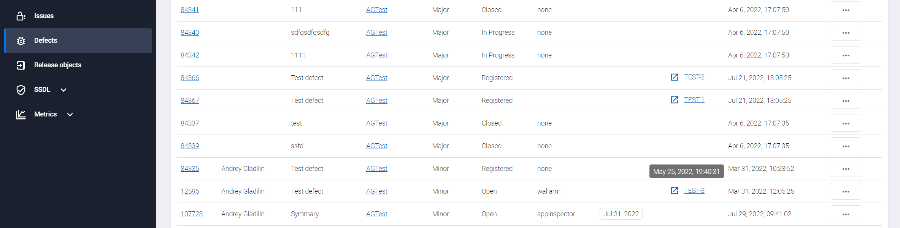</figure>

!!! note "Примечание"
    Особенность Jira такова, что при синхронизации в описание дефекта можно передать не более 32 000 символов. Чтобы сохранить возможность ознакомления с полным описанием дефекта, в соответствующую задачу Jira передается ссылка на полное описание дефекта в AppSec.Hub.

<figure markdown></figure>

## Создание дефекта безопасности на основе проблем безопасности

Создать новый дефект безопасности в AppSec.Hub на основе проблем безопасности можно либо на странице приложения, либо на общей странице проблем безопасности **ISSUES**.

Чтобы создать новый дефект безопасности на странице приложения, выберите приложение и нажмите на иконку **Show app details**  в правом нижнем углу его карточки.

<figure markdown></figure>

На появившейся странице приложения в меню слева выберите пункт меню **Issues**. Нажмите кнопку **Show filters**  в правом верхнем углу.

Чтобы создать дефект безопасности на общей странице проблем безопасности **ISSUES**, сразу нажмите кнопку **Show filters**  в правом верхнем углу.

На вкладке **Filters** выберите один из типов проблем безопасности в поле **by type** (SAST, DAST, SCA Compliance или SCA Security) и статус **To verify** в поле **by status**.

<figure markdown></figure>

Из списка выберите проблемы безопасности, которые будут использоваться для создания одного дефекта, нажатием на значок . Выбранные проблемы будут отмечены значком . В результате кнопка **Open defect** справа вверху станет активной и рядом с ней будет отображаться количество проблем безопасности, связанных с создаваемым дефектом.

<figure markdown>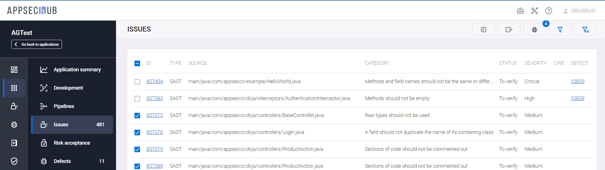</figure>

Нажмите кнопку **Open defect**, чтобы создать новый дефект безопасности. На экране появится окно с информацией о создаваемом дефекте. Окно имеет две вкладки: **Description** и **Linked issues**. Вкладка **Description** содержит подробное описание дефекта безопасности, а вкладка **Linked issues** — перечень связанных с дефектом проблем безопасности с указанием их общего количества.

<figure markdown>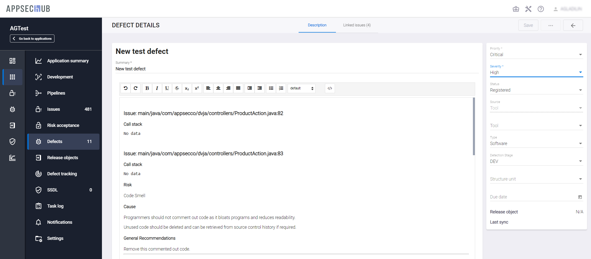</figure>

Немного подробнее остановимся на вкладке **Description**. На данной вкладке указываются подробные сведения о создаваемом дефекте безопасности (поля, обязательные для заполнения, отмечены звездочкой):

* Краткое описание дефекта в поле **Summary**.
* Информация из инструмента AST: имя файла, номер строки исходного кода, стек вызовов для проблемы безопасности, риск, причина и общие рекомендации.

Также в правой части интерфейса отображаются:

* **Priority** — приоритет дефекта (Blocker, Critical, Major, Minor, Info) — указывает на важность или срочность исправления.
* **Severity** — серьезность дефекта (Low, Medium, High, Critical) — характеризует степень влияния дефекта на разработку или работу приложения. Чем выше степень серьезности, тем более негативное влияние он оказывает на приложение.
* **Status** — статус дефекта показывает текущий этап жизненного цикла дефекта в AppSec.Hub (Registered, Open, Fixed, In Progress, Closed или Rejected). Статусы дефектов в AppSec.Hub должны быть сопоставлены со статусами в проектной системе отслеживания дефектов (например, Jira), см. раздел «[Синхронизация с Jira — настройки](../setting%20of%20synchronisation%20with%20Jira/#jira)».
* **Source** — источником дефекта может быть один из следующих:
    * **Manual** — дефект был обнаружен во время ручного тестирования.
    * **Tool** — дефект был найден инструментом AST.
    * **Public source** — о дефекте было сообщено в статье в интернете или в любом другом публичном отчете.
    * **External source** — о дефекте сообщил любой внешний источник в рамках программы Bug Bounty или в рамках любой другой программы лояльности.
* **Tool** — инструмент AST, обнаруживший дефект.
* **Type** — тип дефекта (Requirements, Architecture, Software, Configuration, Security). В примере на рисунке выше это дефект программного обеспечения (Software).
* **Detection stage** — этап, на котором был обнаружен дефект. Может быть выбран из следующего списка: Development, Functional Testing, Integration Testing, User Acceptance Testing или Production. В примере на рисунке выше это стадия разработки (DEV).
* **Structure unit** — структурная единица, к которой относится дефект (None, Front-end, Back-end, Database).
* **Due date** — срок устранения дефекта. Можно настроить синхронизацию данного параметра с проектной системой отслеживания дефектов. В зависимости от настроек синхронизация может носить как односторонний, так и двухсторонний характер. Более подробная информация о сопоставлении полей AppSec.Hub и проектной системы отслеживания дефектов приведена в разделе «[Синхронизация с Jira — настройки](../setting%20of%20synchronisation%20with%20Jira/#jira)». Кроме этого, фильтр на странице Defects позволяет использовать данный параметр в качестве аргумента фильтрации.
* **Last sync** — дата последней синхронизации дефекта с проектной системой отслеживания дефектов.

Теперь рассмотрим вкладку **Linked issues**. Как было сказано выше, на данной вкладке отображаются все проблемы безопасности, связанные с созданным дефектом.

<figure markdown>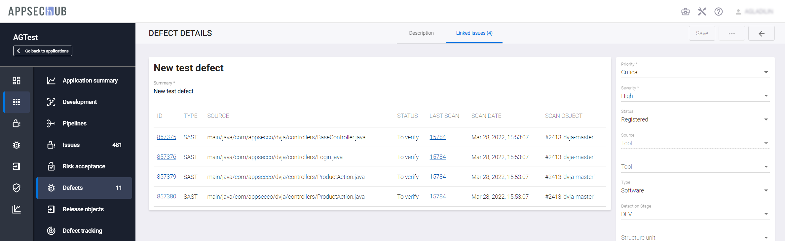</figure>

Для каждой связанной с соответствующим дефектом проблемы безопасности указывается следующая информация:

* **ID** — идентификатор проблемы безопасности в системе.
* **TYPE** — тип проблемы безопасности (SAST, DAST, SCA Security и т. д.).
* **SOURCE** — источник проблемы безопасности (файл, артефакт, библиотека и т. д.).
* **STATUS** — статус проблемы безопасности.
* **LAST SCAN** — идентификатор последнего сканирования, на основе которого определен статус проблемы безопасности. При нажатии на ссылку осуществляется переход на страницу с подробной информацией о соответствующем сканировании.
* **SCAN DATE** — дата и время сканирования.
* **SCAN OBJECT** — объект сканирования. Данное поле имеет структуру, состоящую из двух частей: `<идентификатор кодовой базы/артефакта/инстанса>` и `<ветвь кодовой базы/название и версия артефакта/сайт>`, в зависимости от объектов сканирования и типов уязвимостей. Если в ходе работы Security Pipeline произошло тегирование артефакта, то при наведении указателя мыши на значение в этом поле, во всплывающем окне отображаются идентификатор и версия протегированного артефакта.

    <figure markdown>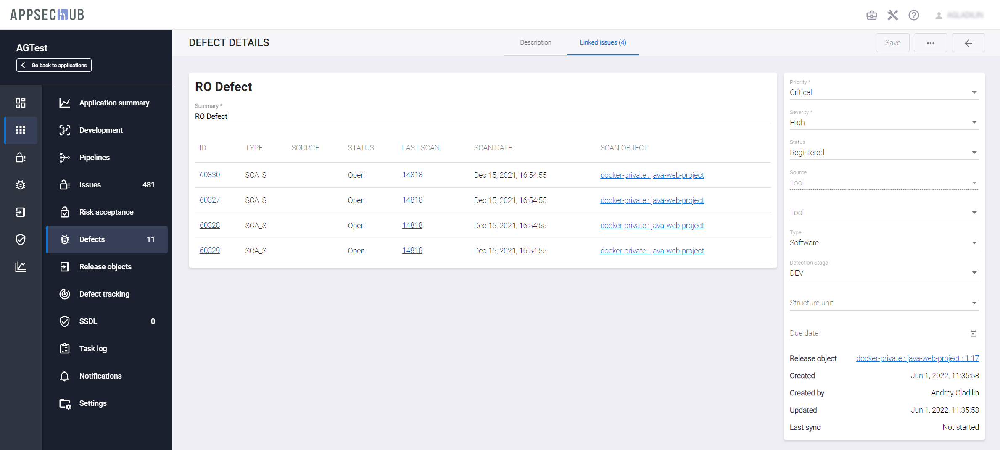</figure>

Введите/отредактируйте сведения о дефекте и нажмите кнопку **Save** в правом верхнем углу интерфейса пользователя.

<figure markdown>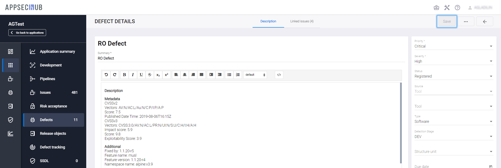</figure>

Все связанные с дефектом проблемы безопасности будут переведены в статус **Open**. Также будет создан новый дефект безопасности со статусом **Open**. Выберите слева в консоли пункт меню **Defects**, чтобы увидеть вновь созданный дефект безопасности на странице дефектов приложения. 

<figure markdown>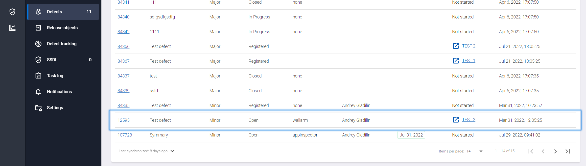</figure>

На странице отображается следующая информация о дефектах безопасности:

* **ID** — идентификационный номер в системе.
* **SUMMARY** — краткое описание.
* **PRIORITY** — приоритет.
* **STATUS** — статус.
* **TOOL** — инструмент AST, обнаруживший проблему безопасности.
* **AUTHOR** — имя пользователя, создавшего дефект. Фильтр на странице **Defects** позволяет использовать данный параметр в качестве аргумента фильтрации. Поиск осуществляется как по логину, так и по имени и фамилии пользователя.  
* **DUE DATE** — срок устранения дефекта безопасности. Данное поле облегчает Инженеру ИБ контроль за ходом исправления дефектов. Когда указанная дата будет просрочена, цвет рамки вокруг нее сменится на красный.
* **LAST SYNC** — дата последней синхронизации дефекта безопасности с проектной системой отслеживания дефектов (например, Jira).
* **UPDATED** — дата обновления информации о дефекте.

## Удаление дефекта безопасности

Предусмотрена возможность удаления созданного дефекта безопасности.

Выберите пункт меню **Defects**.

Нажмите кнопку **Actions**  и в раскрывающемся меню выберите пункт **Delete**.

<figure markdown>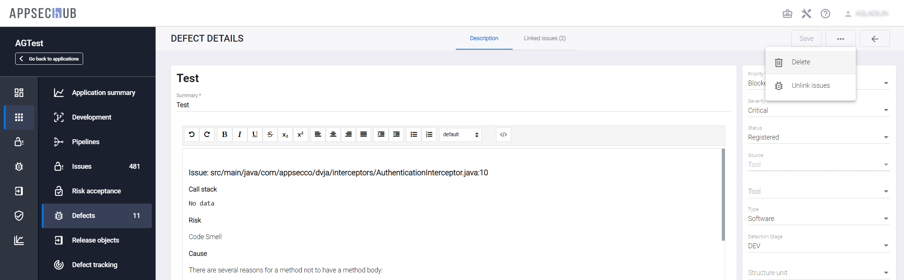</figure>

Подтвердите удаление, нажав кнопку **Confirm** — дефект будет удален.

<figure markdown></figure>

!!! note "Примечание"
    Если дефект синхронизирован с проектной системой отслеживания дефектов, произойдет не его удаление, а изменение статуса на **Rejected**. Чтобы полностью удалить дефект, необходимо предварительно удалить конфигурацию синхронизации с системой отслеживания дефектов (см. раздел «[Удаление конфигурации синхронизации с системой отслеживания дефектов](../setting%20of%20synchronisation%20with%20Jira/#_5)») и, только когда связи с созданными тикетами будут разорваны, дефект можно будет удалить полностью.

Предусмотрена возможность удаления из дефекта связанных с ним проблем безопасности. Открыв окно дефекта безопасности, нажмите кнопку **Actions**  и в раскрывающемся меню выберите пункт **Unlink issues**.

<figure markdown></figure>

После подтверждения все связи будут удалены.

<figure markdown></figure>

## Синхронизация дефектов безопасности с системой отслеживания дефектов

### С использованием пользовательского интерфейса

Предположим, что в AppSec.Hub был создан или обновлен один или несколько дефектов безопасности. Все вновь созданные или обновленные дефекты безопасности необходимо синхронизировать с проектной системой отслеживания дефектов (Jira или YouTrack).

Для корректной синхронизации дефектов между AppSec.Hub и Jira эти два инструмента должны быть согласованы между собой. Подробное описание процесса согласования приведено в разделе «[Синхронизация с Jira — настройки](../setting%20of%20synchronisation%20with%20Jira/#jira)».

AppSec.Hub позволяет синхронизировать дефекты как для одного выбранного приложения, так и для всех приложений, к которым пользователь имеет доступ.

Чтобы синхронизировать дефекты для одного выбранного приложения, выберите пункт меню **Applications** в левом верхнем углу интерфейса пользователя, выберите приложение и нажмите на иконку **Show app details** в правом нижнем углу карточки этого приложения. Слева в меню выберите пункт **Defects**. Находясь на странице **Defects**, нажмите кнопку **Show filters** cправа вверху.

<figure markdown>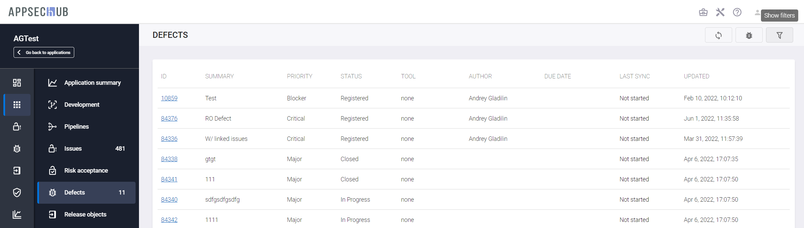</figure>

В синхронизацию попадают только дефекты, находящиеся в состоянии **Open**. Если вы хотите предварительно просмотреть список таких дефектов, на вкладке **Filters** выберите Open в поле **by status**. На странице будут отображены готовые к синхронизации дефекты безопасности.

<figure markdown>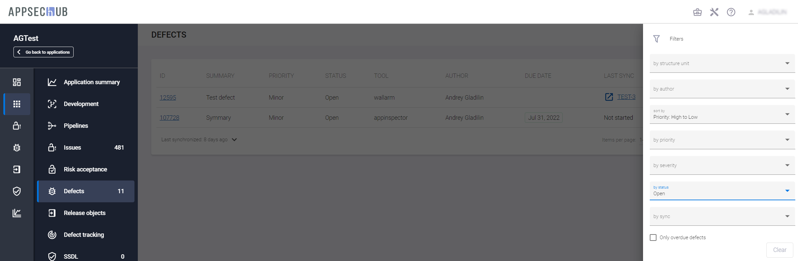</figure>

Нажмите кнопку **Sync with tracker** в правом верхнем углу.

<figure markdown>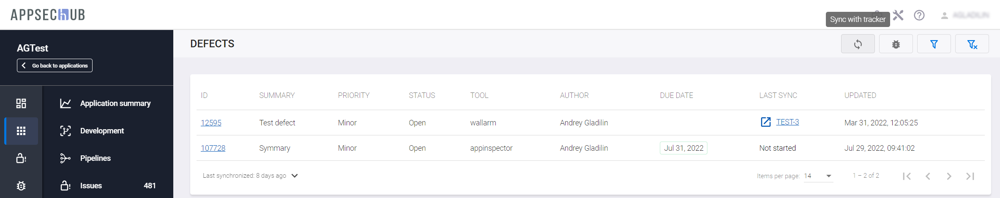</figure>

После короткого процесса синхронизации в правом нижнем углу экрана появится подтверждающее сообщение.

<figure markdown>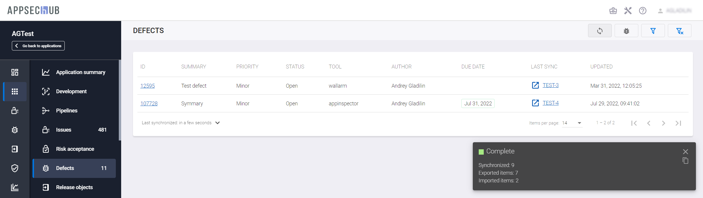</figure>

Дефекты безопасности были синхронизированы между AppSec.Hub и Jira.

Чтобы синхронизировать дефекты для нескольких приложений, выберите пункт меню **DEFECTS** в левом верхнем углу окна AppSec.Hub.
Нажмите кнопку **Sync with tracker**  в правом верхнем углу. На экране появится окно **Start synchronization**.

<figure markdown>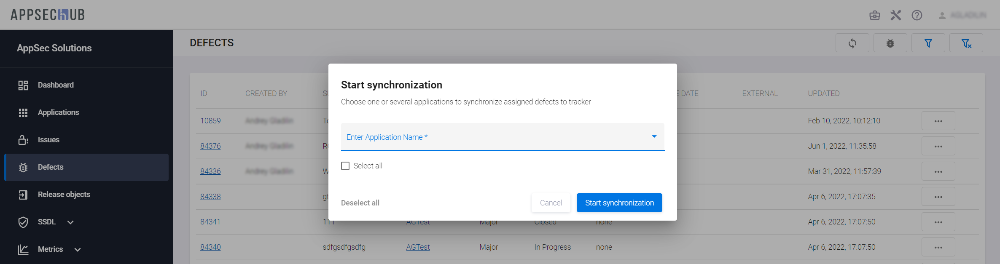</figure>
 
Выберите в этом окне приложения, дефекты которых необходимо синхронизировать с проектной системой отслеживания дефектов. Чтобы выбрать все доступные пользователю приложения, нажмите пункт **Select all**. Отдельные приложения можно выбрать, нажав на выпадающее меню **Enter Application Name**. Можно воспользоваться поиском нужных приложений, введя имя или часть имени приложения в поле **Search**.

<figure markdown></figure>
 
Список уже выбранных приложений можно скорректировать. Чтобы исключить из списка уже выбранное приложение, достаточно в списке нажать значок  справа от его имени. Чтобы очистить весь список, нажмите кнопку **Deselect all** в левом нижнем углу окна.

<figure markdown>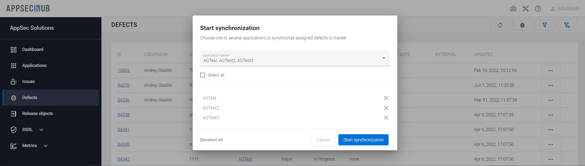</figure>
 
Чтобы начать процесс синхронизации, нажмите кнопку **Start synchronization** в правом нижнем углу окна. На экране появится окно **The synchronization process started**. В этом окне содержится информация о том, для каких дефектов был начат процесс синхронизации, а для каких он не стартовал по каким-либо причинам с указанием ID приложения, его имени и описанием ошибки. Нажмите кнопку **Ok** внизу окна.

<figure markdown></figure>

После завершения синхронизации в столбце **LAST SYNC** отображаются номера соответствующих дефектов в проектной системе отслеживания дефектов. Наведя указатель мыши на ссылку с номером дефекта, можно просмотреть дату и время последней синхронизации, а нажав на нее — перейти к соответствующему дефекту в проектной системе отслеживания дефектов (необходима авторизация).

Если ссылка синего цвета, синхронизация прошла успешно.

<figure markdown>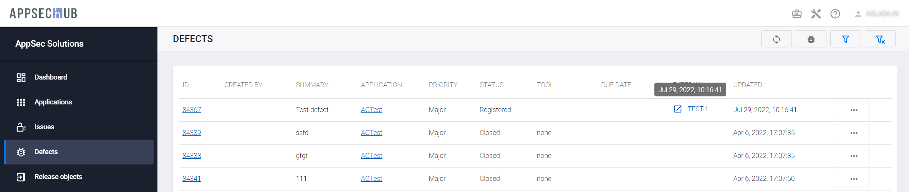</figure>

Ссылка красного цвета указывает на наличие ошибок синхронизации. Наведя указатель мыши на ссылку, можно увидеть дату успешной синхронизации или причину неуспешной синхронизации.

<figure markdown></figure>

Аналогичная ссылка появляется и в нижней части правой колонки на странице с подробной информацией о дефекте.

<figure markdown>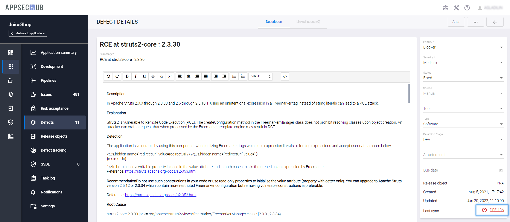</figure>

Чтобы обнаружить несинхронизированные дефекты или те, при синхронизации которых возникли ошибки, можно воспользоваться фильтром. Нажмите кнопку **Show filter**, расположенную в верхнем правом углу интерфейса, и в поле **by sync** выберите соответственно значение **Not started** или **Failed**.

<figure markdown>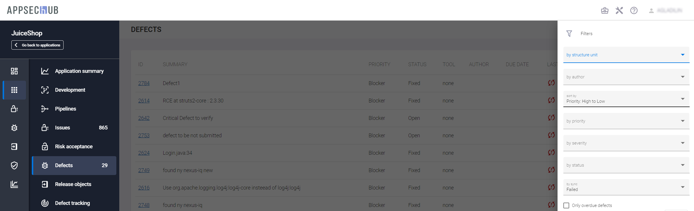</figure>

Кроме этого, нажав на расположенную в нижней части окна **Defects** стрелку (рядом с указанием времени, прошедшего с последней синхронизации), можно открыть всплывающее окно, которое содержит информацию о результатах последней синхронизации.

<figure markdown>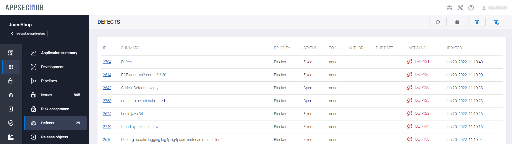</figure>

Если всплывающее окно зеленого цвета, синхронизация прошла успешно.

<figure markdown>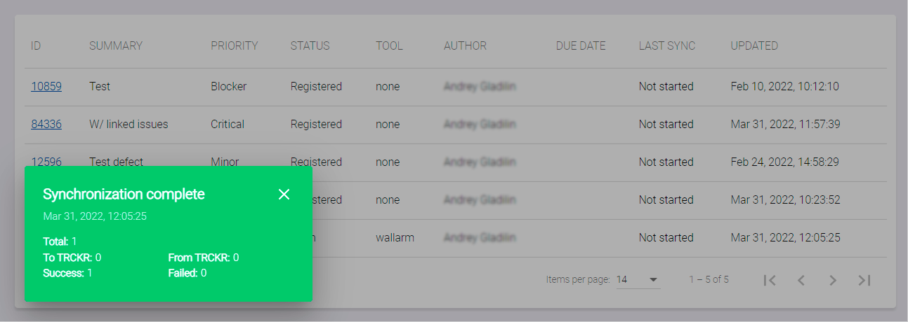</figure>

Если цвет всплывающего окна красный, при синхронизации возникли критические ошибки.

<figure markdown>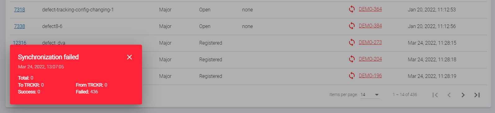</figure>

Желтый цвет всплывающего окна указывает на наличие незначительный ошибок, которые, однако, требуют внимания.

### Автоматическая синхронизация

!!! note "Примечание"
    Описанные ниже настройки выполняются прикладным администратором.

В системе предусмотрена возможность автоматизации процесса синхронизации дефектов между AppSec.Hub и проектной системой отслеживания дефектов, например, Jira. Автоматическая синхронизация полностью происходит в фоновом режиме, а для ее запуска используется планировщик задач.

Включение и настройка автоматической синхронизации дефектов осуществляется посредством редактирования конфигурационного файла **app.properties**, расположенного в директории `/opt/apphub/config/hub-core/` (если выбрана рекомендуемая директория установки AppSec.Hub).

Для настройки в файле **app.properties** необходимо отредактировать следующие параметры:

* `defect.enableDefectSynchronization` — включение/выключение автоматической синхронизации дефектов (значение по умолчанию: true (включено));

* `config.defectSynchronizationThreadPoolSize` — общее количество одновременно запускаемых потоков синхронизации дефектов. Учитываются как потоки, запущенные «вручную», так и автоматически (значение по умолчанию: 4);

* `defect.defectSynchronizationPeriodDurationCronExpression` — Cron-выражение, задающее период синхронизации (значение по умолчанию: 0 0 0/1 * * ? (каждый час));

* `defect.defectSynchronizationPeriod` — количество периодов синхронизации, заданных предыдущим параметром — общий период синхронизации определяется произведением значений двух последних параметров.

Например, если значение параметра `defect.defectSynchronizationPeriodDurationCronExpression` оставить по умолчанию (1 час), а для параметра `defect.defectSynchronizationPeriod` задать значение «2», автоматическая синхронизация будет осуществляться каждые два часа.

!!! note "Важно"
    После изменения параметров в файле **app.properties** необходимо выполнить рестарт системы, см. разделы «[Остановка AppSec.Hub](../../aag/installing%2C%20running%20and%20updating%20AppSec.Hub/#appsechub_3)» и «[Запуск AppSec.Hub](../../aag/installing%2C%20running%20and%20updating%20AppSec.Hub/#appsechub_2)» Руководства прикладного администратора.

Дополнительная информация о конфигурационном файле **app.properties** приведена в «[Приложении 5. Конфигурационный файл app.properties](../appendix%205/#5-appproperties)».

## Ручная верификация дефектов безопасности

Каждый дефект безопасности должен быть исправлен командой разработчиков приложения. Когда дефект исправлен, разработчики меняют статус дефекта безопасности Jira на **Fixed**. Теперь дефект необходимо синхронизировать между Jira и AppSec.Hub.

Как было описано в предыдущем разделе, выберите приложение и нажмите слева пункт меню **Defects**. На экране появится страница дефектов приложения. Нажмите кнопку **Sync with tracker**  в правом верхнем углу.

<figure markdown>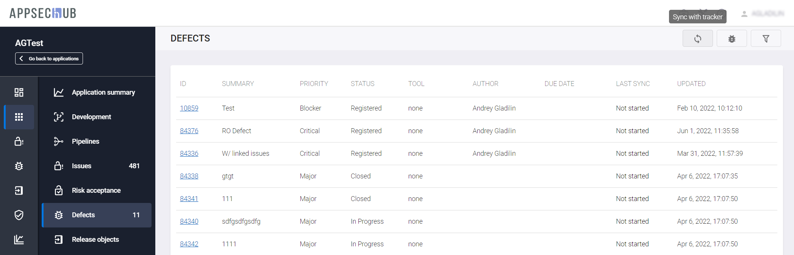</figure>

Подождите, пока процесс синхронизации будет успешно завершен. Теперь статус дефекта безопасности в AppSec.Hub должен получить значение **Fixed**, как и в Jira.

Для верификации этого дефекта безопасности Инженер ИБ должен запустить сканирование безопасности и проверить, действительно ли дефект безопасности был устранен (т. е. в последнем отчете по безопасности от инструмента AST больше нет соответствующей проблемы или группы проблем безопасности), и перевести этот дефект в статус **Closed** в AppSec.Hub. После синхронизации дефектов между AppSec.Hub и Jira соответствующий дефект безопасности также получит статус **Closed** также и в Jira.