# Проблемы безопасности

!!! note "Примечание"
    Для выполнения нижеописанных действий требуется роль Инженер ИБ.

Каждый инструмент AST создает отчет по безопасности (Security Report) во время каждого запуска тестирования безопасности. Это происходит в рамках работы Security Pipeline. Отчет по безопасности содержит список проблем безопасности (Security Issues), обнаруженных в ходе тестирования. Работу с отчетом по безопасности следует начинать с импорта выявленных проблем из инструментов AST в AppSec.Hub.

Информация о проблемах безопасности всех приложений, к которым пользователь имеет доступ, отображается на общей странице **Issues**.

<figure markdown></figure>

## Импорт проблем безопасности

Несмотря на то, что импорт Security Issues после завершения сканирования осуществляется автоматически, предусмотрена возможность выполнить его «вручную», используя пользовательский интерфейс AppSec.Hub.

Чтобы начать работу с проблемами безопасности для одного выбранного приложения, выберите пункт меню **Applications**. На экране появится страница с приложениями.

<figure markdown>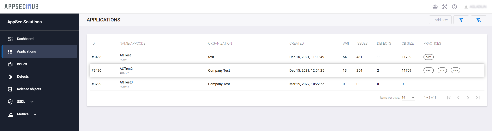</figure>

Нажмите строку выбранного приложения.

Слева в меню выберите пункт **Issues** и нажмите кнопку **Import issues**  в правом верхнем углу, чтобы импортировать проблемы из инструментов AST. В правом нижнем углу появится подтверждение начала импорта **Import started**.

<figure markdown>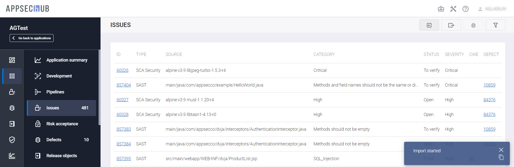</figure>

После завершения на экране появятся импортированные проблемы. В показанном на рисунке выше примере проблемы были обнаружены в результате запуска инструмента SCA.

Общее количество открытых на данный момент проблем безопасности (еще не исправленных и не имеющих статус **Fixed**), относящихся к данному приложению, отображается рядом с пунктом меню **Issues**.

Чтобы импортировать проблемы для нескольких приложений из ранее проведенных сканирований, выберите в меню пункт **Issues**.

Нажмите кнопку **Import issues**  в правом верхнем углу. На экране появится окно **Choose application**.

<figure markdown>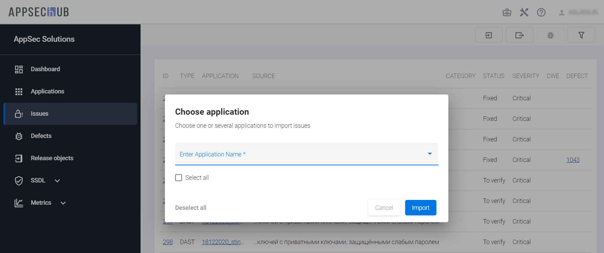</figure>
 
Выберите в этом окне приложения, для которых необходимо импортировать проблемы. Чтобы выбрать все доступные пользователю приложения, нажмите пункт **Select all**. Отдельные приложения можно выбрать, нажав на выпадающее меню **Enter Application Name**. Можно воспользоваться поиском нужных приложений, введя имя или часть имени приложения в поле **Search**.

<figure markdown>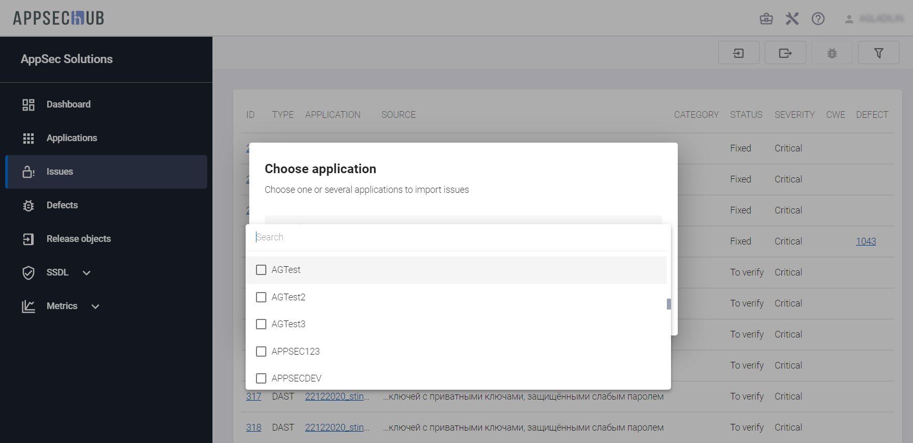</figure>
 
Список уже выбранных приложений можно скорректировать. Чтобы исключить из списка уже выбранное приложение, достаточно в списке нажать значок  справа от его имени. Чтобы очистить весь список, нажмите кнопку **Deselect all** в левом нижнем углу окна.

<figure markdown>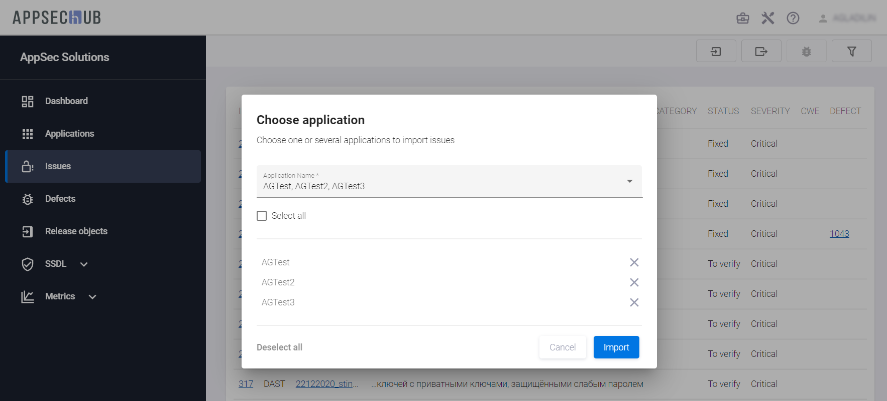</figure>
 
Чтобы начать импорт, нажмите кнопку **Import** в правом нижнем углу окна. На экране появится окно **The import process started**. В этом окне содержится информация о том, для каких приложений был начат процесс импорта проблем, а для каких он не стартовал по каким-либо причинам с указанием ID приложения, его имени и описанием ошибки. Нажмите кнопку **Ok** внизу окна.

<figure markdown>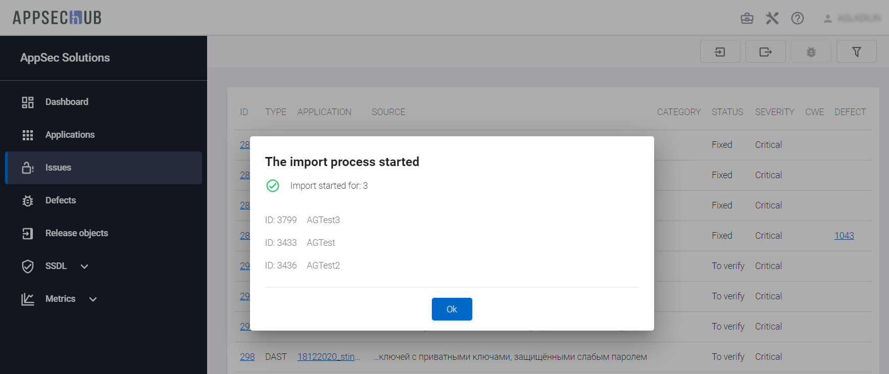</figure>
 
После завершения на экране появятся импортированные проблемы.

## Информация о проблемах безопасности

AppSec.Hub предоставляет информацию и позволяет работать с проблемами безопасности как для одного выбранного приложения, так и для всех приложений, к которым пользователь имеет доступ.
Информация о проблемах безопасности всех доступных пользователю приложений отображается на общей странице проблем безопасности **Issues**. По сути, собранная на этой странице информация объединяет и дублирует все сведения о проблемах безопасности, содержащиеся на страницах **Issues** для каждого отдельного приложения.

<figure markdown>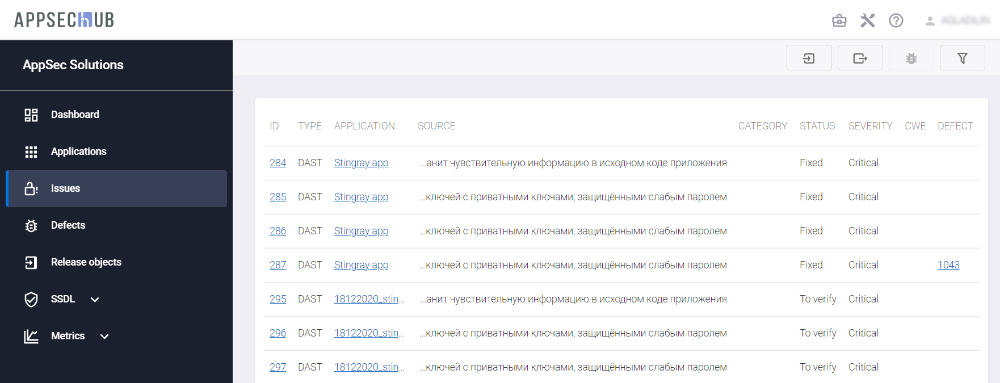</figure>

Каждая проблема представлена на экране отдельной строкой, которая содержит краткое описание проблемы в следующих столбцах:

* **ID** — идентификатор проблемы в системе.
* **TYPE** — тип проблемы (SAST, DAST, SCA Compliance и SCA Security).
* **APPLICATION** — ссылка на приложение, к которому относится проблема.
* **SOURCE** — источник проблемы, имя файла для проблем, выявленных SAST, или имя и версия компонента для проблем, выявленных SCA.
* **CATEGORY** — тип категории проблемы (например, Potential_SQL_Injection для проблем, выявленных SAST и т. д.).
* **STATUS** — статус проблемы в системе (To Verify, Confirmed, Open, Fixed, False Positive).
* **SEVERITY** — серьезность проблемы в инструменте AST (Low, Medium, High, Critical).
* **CWE** (Common Weakness Enumeration) — указывается, если применимо. CW — это список типов слабых мест (weakness) программного и аппаратного обеспечения, разработанный сообществом специалистов в этих областях. Он используется в качестве общего языка и стандарта для инструментов безопасности, а также в качестве базы для идентификации выявленных слабых мест, для уменьшения последствий от их присутствия, и для их предотвращения.
* **DEFECT** — ссылка на соответствующий дефект безопасности, если он уже существует.

Вся отображенная на экране информация о проблемах безопасности импортируется в AppSec.Hub из инструментов AST.

Нажмите идентификатор проблемы безопасности в столбце **ID**, чтобы поработать с этой проблемой. На экране появится окно с подробной информацией о ней. Окно содержит шесть вкладок.

* **Details** — подробная информация о проблеме с указанием потенциальной опасности, причины ее возникновения, а также рекомендаций по устранению. Для проблем безопасности, обнаруженных в ходе сканирования, привязанного к релизному объекту, приводится дополнительная ссылка на релизный объект. Кроме того, в полях **AVC Status** и **AVC Accuracy** приведены результаты AVC-анализа (Application Vulnerabilities Correlation), см. раздел «[Настройки корреляции уязвимостей приложения](../../aag/application%20vulnerability%20correlation%20settings/#_1)» Руководства администратора.

    <figure markdown>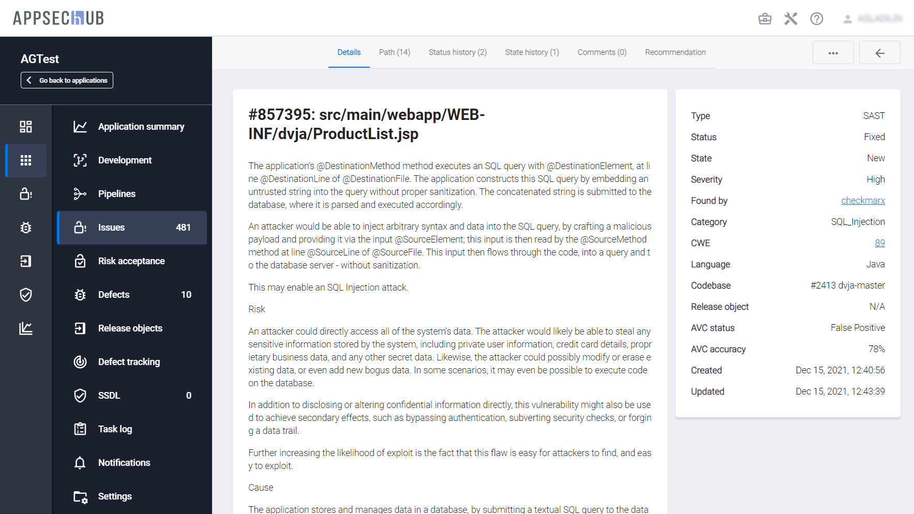</figure>

* **Path** — информация, позволяющая локализовать источник проблемы.

    <figure markdown></figure>

* **Status history** — история сканирования проблемы безопасности. Эта вкладка содержит информацию о каждом случае обнаружения проблемы во время выполненных проверок безопасности, а также на ней можно проследить историю изменения статусов уязвимости (поля **Old Status** и **New status**). Обновление статуса отображается только в случае его действительного изменения — если, например, было проведено сканирование, но статус Security Issue не изменился, обновляется только дата. Поле **Scan Task Id** автоматически заполняется по результатам проведенного сканирования, а при нажатии на эту ссылку происходит переход на страницу с детальной информацией об этом сканировании.

    <figure markdown>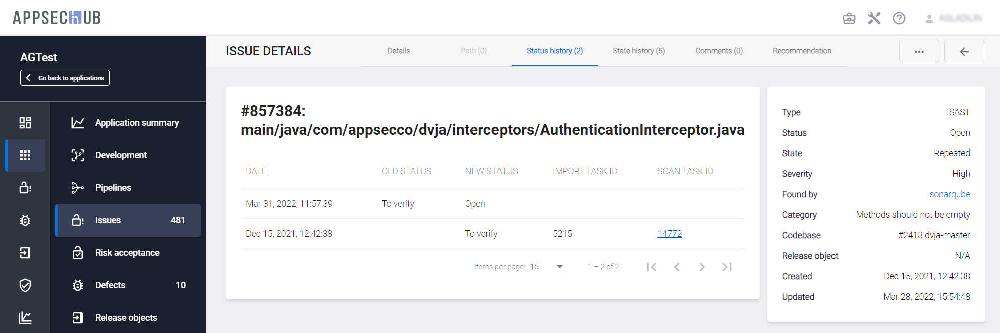</figure>

* **State history** — история изменения состояний проблемы безопасности. Помимо даты, времени и идентификатора сканирования на вкладке отображается состояние проблемы безопасности (**NEW**, **REPEATED**),  выбранный алгоритм изменения статуса (**ISSUE STATE POLICY**), а также идентификатор сканирования, с результатами которого осуществлялось сравнение (**REGARDING THE SCAN TASK**).

    <figure markdown>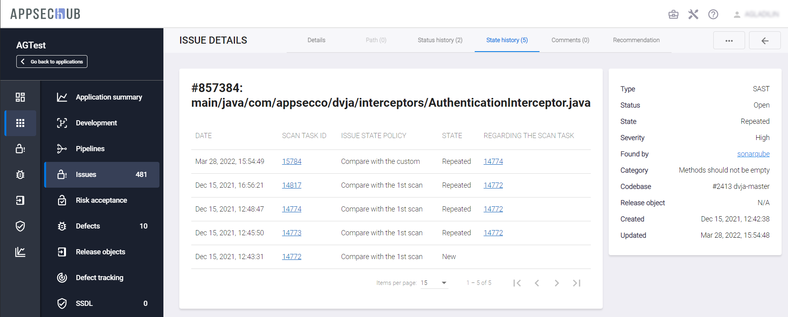</figure>

* **Comments** и **Recommendation** — обеспечивают возможность добавления соответственно комментариев и рекомендаций. Они будут сохранены после нажатия кнопок **Send** на вкладке **Comments** или **Save** на вкладке **Recommendation**. Если в дальнейшем будут обнаружены похожие проблемы безопасности, все сохраненные рекомендации будут автоматически добавлены к ним. Эта функциональность реализована в AppSec.Hub на основе анализа корреляции проблем.

    <figure markdown></figure>

AppSec.Hub анализирует историю каждой проблемы безопасности. Если проблема была обнаружена во время сканирования безопасности, но затем не была обнаружена во время следующего сканирования безопасности, она автоматически получает статус **Fixed**.

Нажмите ссылку на инструмент AST в поле **Found by** справа на вкладке **Details**. На экране откроется страница входа в инструмент AST. Введите учетные данные, чтобы просмотреть и при необходимости отредактировать проблему безопасности в инструменте AST. Проблемы безопасности невозможно редактировать в AppSec.Hub. Если проблемы безопасности были отредактированы и обновлены в инструменте AST, необходимо импортировать это обновление в AppSec.Hub. Чтобы импортировать обновленные задачи, нажмите на кнопку **Import issues** . Информацию о проблемах безопасности можно экспортировать в файл, см. раздел «[Экспорт проблем безопасности в файл](../security%20issues/#_11)».

## Группировка проблем безопасности

AppSec.Hub определяет корреляцию между импортированными из инструментов AST проблемами безопасности и группирует их. Система выполняет автоматический анализ выявленных проблем безопасности в контексте истинно/ложноположительных проблем на основе модели машинного обучения. Для схожих истинно положительных результатов в системе документируются один и тот же статус, а также рекомендации, предположения о причинах возникновения и меры по устранению. На основе используемой модели корреляции выявленные проблемы безопасности группируются и объединяются в дефекты безопасности.

Проблемы безопасности можно сгруппировать вручную. Чтобы настроить правила фильтрации, нажмите кнопку **Show filters**  в правом верхнем углу страницы. Реализованы четыре механизма фильтрации: один с применением правил корреляции, а также три настраиваемых.

Кроме того, на общей странице проблем безопасности **Issues** можно задать фильтр по приложению – **by application**. После того, как в поле **by application** выбрано приложение, можно поставить дополнительный фильтр на структурные единицы приложения в поле **by structure unit**.

Чтобы активировать режим фильтрации с использованием правила корреляции, переведите селектор **Apply correlation rules by default** в положение «включено» и выберите используемое правило корреляции (только для SAST уязвимостей).

<figure markdown></figure>

Три настраиваемых режима фильтрации предлагают следующие возможности:

* Фильтрация с использованием **Issue properties**.
* Фильтрация с использованием **Linked entities**.
* Фильтрация с использованием **AVC**.

Выбрав вариант фильтрации **Issue properties**, получаем возможность сортировки проблем безопасности по следующим критериям:

* **by structure unit** — по структурным единицам приложения;
* **sort by** — по уровню серьезности — **Severity: High to Low/Low to High** (от более серьезных к менее, и наоборот) или по времени занесения/последнего обновления — **Newest first/Last updated** (сначала новые/сначала старые);
* **by type** — по типу (**SAST**, **SCA Compliance**, **SCA Security** и **DAST**);
* **by status** — по статусу (**To Verify**, **Confirmed**, **Open**, **Fixed** и **False Positive**);
* **by tool** — по инструменту, с помощью которого обнаружена уязвимость (**NetSparker**, **Acunetix**, **MDast**, **Wallarm**, **IBM Security AppScan**, **Fortify Static Code Analyzer** и **SonarQube**);
* **by severity** — по серьезности (**Low**, **Medium**, **High** и **Critical**);
* **by source** — по источнику;
* **by category** — по категории;
* **by CWE ID** — по CWE ID;
* **updated in** — по дате последнего обновления (**Last week**, **Last month**, **Last 3 months**, **Last 6 months**, **Last year**, **Last 2 years** и **Last 3 years**).

!!! note "Примечание"
    В полях **by type**, **by status**, **by tool**, **by severity** и **updated in** может быть одновременно выбрано несколько параметров, см. рис. ниже.

<figure markdown>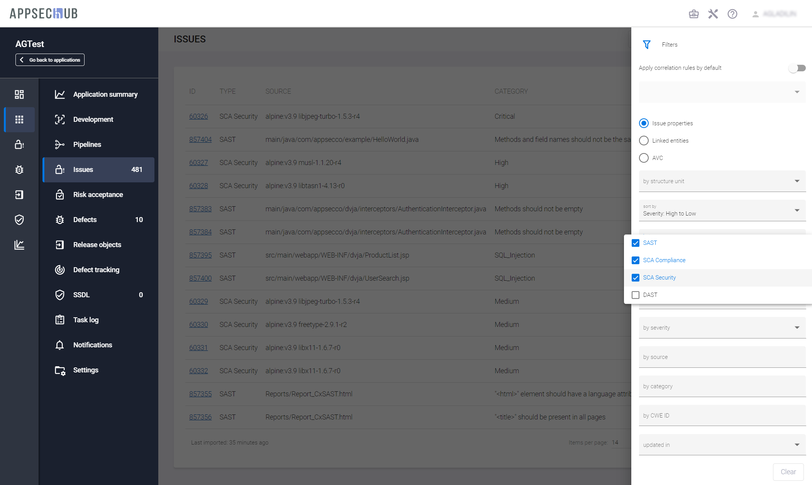</figure>

Выберите группу проблем безопасности из доступных вариантов. Для более точной группировки проблем в AppSec.Hub доступно применение нескольких критериев фильтрации одновременно. Проблемы на рисунке ниже сгруппированы в соответствии с выбранными опциями (**SAST** и **DAST** в поле **by type**, **To verify** в поле **by status**, **WEB-INF** в поле **by source**).

<figure markdown></figure>

Выберите вариант фильтрации **Linked entities**, чтобы отсортировать проблемы безопасности с учетом связанных с ними сущностей (кодовых баз, артефактов или инстансов), используя следующие поля:

* **Sort by** — по уровню серьезности — **Severity: High to Low/Low to High** (от более серьезных к менее, и наоборот) или по времени занесения/последнего обновления — **Newest first/Last updated** (сначала новые/сначала старые).
* **By type** — по типу уязвимости (**SAST**, **SCA Compliance**, **SCA Security** и **DAST**).
* **By codebase** — по кодовым базам.
* **By artifact** — по артефактам.
* **By instance** — по инстансам.
* **By repository proxy** — по проски-репозиториям.

!!! note "Примечание"
    В полях **by type**, **by codebase**, **by artifact**, **by instance** и **by repository proxy** может быть одновременно выбрано несколько параметров, см. рис. ниже.

<figure markdown></figure>

Выберите вариант фильтрации **AVC**, чтобы отсортировать проблемы безопасности с использованием результатов AVC-анализа:

* **Sort by** — по уровню серьезности — **Severity: High to Low/Low to High** (от более серьезных к менее, и наоборот) или по времени занесения/последнего обновления — **Newest first/Last updated** (сначала новые/сначала старые).
* **By type** — по типу уязвимости (**SAST**, **SCA Compliance**, **SCA Security** и **DAST**).
* **By AVC status** — по статусу AVC (**False Positive** (ложноположительные), **True Positive** (истинно положительные)).
* **By lower limit of accuracy** — по нижнему пределу точности оценки AVC.
* **By upper limit of accuracy** — по верхнему пределу точности оценки AVC.

!!! note "Примечание"
    В полях **by type** и **by AVC status** может быть одновременно выбрано несколько параметров, см. рис. ниже.

<figure markdown>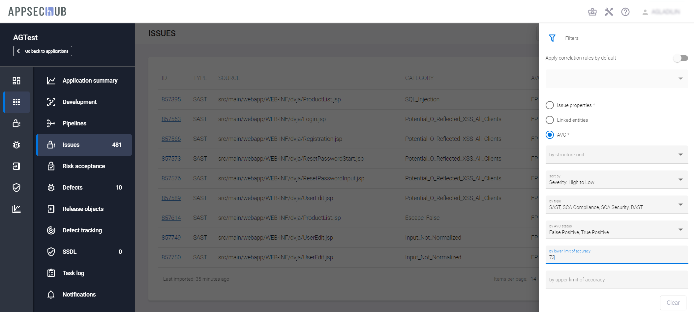</figure>

Для опции **AVC** для каждой проблемы на экран выводится статус AVC в соответствующем столбце — здесь указывается, имеет ли проблема «истинно положительный» (TP) или «ложноположительный» (FP) статус в соответствии с оценкой AppSec.Hub, а также вероятность этой оценки в процентах, предоставленная AppSec.Hub для этой проблемы. Вероятность отображается в виде числа в синем кружке рядом с аббревиатурой TP или FP:  (в этом примере AppSec.Hub указывает, что эта проблема является «истинно положительной» с вероятностью 73 процента).

<figure markdown>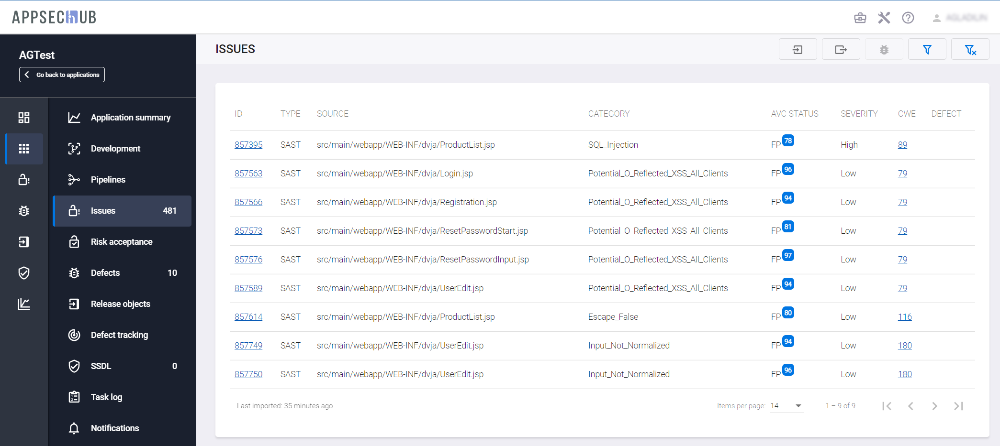</figure>

## Добавление проблем безопасности в исключения

!!! note "Важное замечание"
    Для выполнения нижеописанных действий требуется роль Инженер ИБ. Для других ролей в AppSec.Hub данная функциональность недоступна.

Некоторые компоненты (например, open-source библиотеки), используемые при разработке приложений, могут не иметь безопасных версий. В такой ситуации Инженеры ИБ, в результате соответствующих управленческих решений, могут разрешать использование таких компонентов, допуская наличие соответствующего риска (Accepted Risk), путем добавления проблем безопасности в исключения. В результате при сканировании AppSec.Hub не воспринимает данную уязвимость как подлежащую учету при расчете критериев QG. Таким образом, по сути происходит преднамеренный отказ от использования тех или иных критериев или политик безопасности в отношении проблем, добавленных в исключения.

В AppSec.Hub реализован механизм добавления выявленных проблем безопасности в исключения. Наличие уязвимости, добавленной с помощью данного механизма в исключения, считается допустимым и не является блокирующим фактором, например, при принятии окончательного решения о готовности релиза к развертыванию в промышленную эксплуатацию. На данный момент в AppSec.Hub статус **Accepted Risk** может устанавливаться только для уязвимостей, выявленных инструментами SCA (например, Clair).

Заметим, что добавление уязвимостей в исключения в том или ином виде реализовано во многих инструментах AST. Для получения дополнительной информации, пожалуйста, обращайтесь к сопроводительной документации соответствующих продуктов. Важно подчеркнуть, что обмен информацией о Security Issues между AppSec.Hub и инструментами носит двухсторонний характер. Например, после изменения статуса в AppSec.Hub также изменяется статус в отчете Nexus IQ.

Если в SCA инструменте (например, Nexus IQ) уязвимость добавлена в исключения (waived), то при импорте в AppSec.Hub она получает статус **Accepted risk**. И наоборот, если какая-либо уязвимость будет добавлена в исключения в AppSec.Hub, соответствующий компонент автоматически получит статус waived в инструменте. Также в инструмент будут переданы данные о пользователе, создавшем данное исключение, идентификационные данные уязвимости с указанием CVE и соответствующий комментарий. 

Если для приложения включен прокси-репозиторий и в нем уязвимость добавлена в исключения, а также к исключению добавлен комментарий «Autowaive: True», то при импорте уязвимостей в AppSec.Hub создается правило, которое отображается на вкладке **Rules** страницы **Risk Acceptance**. Также аналогичное правило может быть создано и непосредственно из интерфейса AppSec.Hub, см. разделы «[Безусловное принятие риска](../security%20issues/#_6)» и «[Условное принятие риска](../security%20issues/#_7)».

<figure markdown>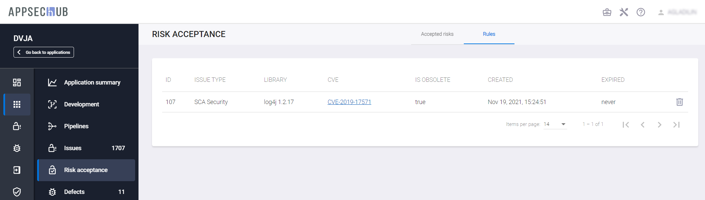</figure>

Для каждого правила указывается следующая информация:

* **ID** — идентификатор правила в системе.
* **ISSUE TYPE** — тип Security Issue.
* **LIBRARY** — используемая библиотека.
* **CVE** — ссылка на описание уязвимости в базе данных общеизвестных уязвимостей информационной безопасности (CVE, Common Vulnerabilities and Exposures).
* **IS OBSOLETE** — статус правила — если правило распространяется на какие-либо проблемы безопасности в приложении, в данном поле появляется значение **true**, в противном случае — **false**. 
* **CREATED** — дата и время создания.
* **EXPIRED** — срок действия.

Справа от каждого правила располагается иконка , нажав которую его можно удалить, см. раздел «[Удаление правил](../security%20issues/#_10)».

Если при последующем сканировании кодовой базы или артефакта будет обнаружена уязвимость с таким же названием, такой же версии и идентичным значением severity, то на основе созданного правила ей будет автоматически присвоен статус **Accepted risk**. Такой подход позволяет избежать заметных временных затрат на повторное изменение статуса с **To verify** на **Accepted risk** для аналогичных проблем безопасности — однажды определив риск как допустимый, в дальнейшем нет необходимости изменять статус «вручную».

В AppSec.Hub реализована возможность импорта комментариев из инструментов, т. е. информацию о причине добавления уязвимости в исключения можно посмотреть на вкладке **Comments** соответствующей Security Issue. Аналогично комментарии передаются из AppSec.Hub в соответствующий инструмент.

В свою очередь, если в AppSec.Hub для уязвимости установлен статус **Accepted Risk**, в инструмент (например, Nexus IQ) также отправляется запрос на изменение статуса соответствующей уязвимости (в случае Nexus IQ уязвимость получит статус **waived**).

В системе реализованы два типа механизмов принятия рисков: безусловный и условный. В случае безусловного принятия риска Инженер ИБ безоговорочно допускает наличие определенной уязвимости и она не учитывается при расчете Quality Gates. Во втором случае, как очевидно из названия, риск принимается с определенным условием — он также считается допустимым и наличие уязвимости не учитывается при расчете QG, но только до тех пор, пока выполняется определенное условие (правило) — в исходном коде не найдено ни одной уязвимости, обусловленной данным правилом (см. раздел «[Категории уязвимостей](../../aag/categories%20of%20vulnerabilities/#_1)» Руководства администратора). Для условного принятия риска зачастую используется термин митигация (от англ. mitigation — ослабление/смягчение условий).

Суть условного принятия заключается в том, что за счёт специальных конструкций кода, уязвимость не может быть эксплуатируемой. То есть, код написан так, что он защищает от злоумышленника, фильтрует и контролирует пользовательские данные, передаваемые в компоненту. Либо правило условного принятия контролирует, что уязвимый метод/класс не используется или вызывается.

Проиллюстрируем последнее утверждение следующим примером. Предположим, что необходимо разрешить использование некоторой библиотеки, в которой инструментами SCA выявлена уязвимость, но только до тех пор, пока в исходном коде SAST инструментом не будет обнаружена уязвимость определенной категории, например All_Passwords. Таким образом, понимая, что общая уязвимость библиотеки обусловлена наличием в ней отдельных небезопасных методов или функций и ограничивая именно их использование (посредством задания определенного условия), Инженер ИБ принимает допустимость соответствующего риска. При этом, как только использование небезопасных методов или функций будет обнаружено инструментом SAST (заданное условие, в нашем примере All_Passwords, будет нарушено), добавленная в исключения SCA-уязвимость начнет учитываться при расчете Quality Gate.

В AppSec.Hub создается необходимое правило (о практической реализации ниже), см. блок **Risk accepted** на рисунке ниже. В соответствии с ним, данная уязвимость учитывается при расчете Quality Gate, только если в ходе сканирования выявлена SAST-уязвимость типа All_Passwords (см. поле **Condition**).

!!! note "Примечание"
    Важно заметить, что пока в AppSec.Hub существует действующее правило, все соответствующие импортируемые из инструмента уязвимости, будут получать определенный этим правилом статус, независимо от предыдущих изменений их статусов. Небольшой пример: в ходе очередного сканирования уязвимость не обнаружена инструментом и для нее в системе устанавливается статус **Fixed**.

    Однако если при следующем сканировании эта же уязвимость будет обнаружена вновь, то при импорте в AppSec.Hub она снова получит статус, например, **False Positive**.

    Другими словами, статус, задаваемый правилом в AppSec.Hub, имеет более высокий приоритет, чем статус инструмента.

<figure markdown>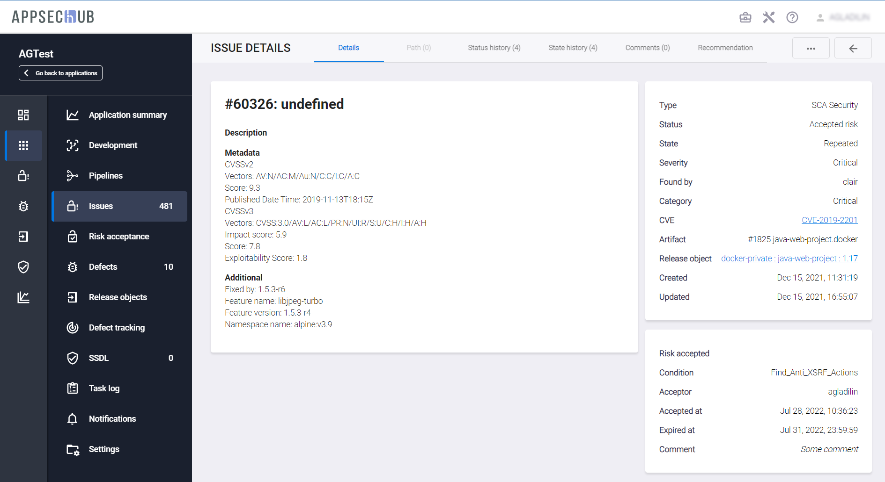</figure>

Чтобы из AppSec.Hub добавить проблему безопасности в исключения, переходим на страницу **Security Issue** и, нажав кнопку **Actions** , расположенную в правом верхнем углу пользовательского интерфейса, в раскрывающемся меню выбираем пункт **Accept risk**.

<figure markdown>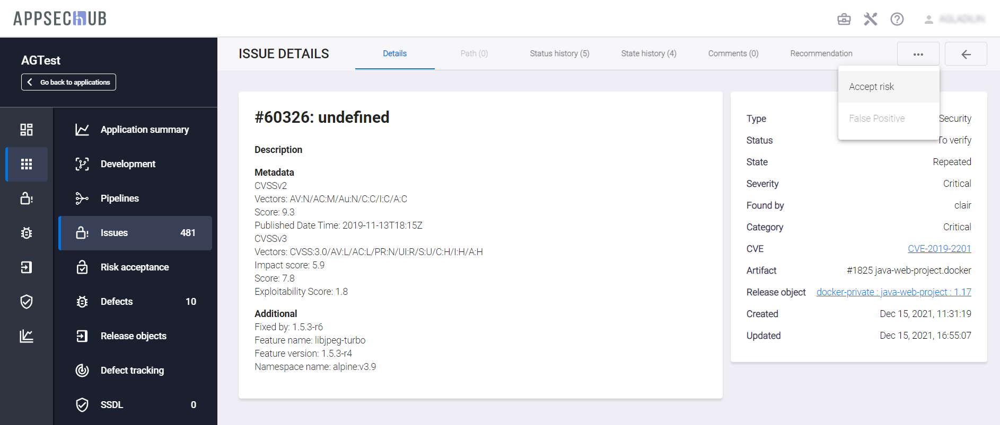</figure>

### Безусловное принятие риска

Чтобы выполнить безусловное принятие риска и исключить уязвимость из расчета Quality Gate, в появившемся окне **Accept the risk** достаточно указать причину в поле **Comment** и нажать кнопку **Accept**. При необходимости можно указать срок принятия риска в поле **Expiration Date**. Если срок не указан, риск будет принят на постоянной основе — без ограничений по времени.

Если выбрана опция **With similar issues in the current application**, то в исключения будут добавлены все аналогичные уязвимости данного приложения (эта опция доступна только для OSA практики, т. е. уязвимостей, найденных в компонентах из карантина репозитория). 

<figure markdown></figure>

В правом нижнем углу пользовательского интерфейса на странице уязвимости появляется соответствующее подтверждающее сообщение, а в правой колонке вкладки **Details** — блок **Risk Accepted**, содержащий краткую информацию о созданном правиле:

* **Acceptor** — логин пользователя, принявшего данный риск.
* **Accepted at** — дата и время создания правила.
* **Expired at** — срок действия созданного правила.
* **Comment** — комментарий.

<figure markdown></figure>

### Условное принятие риска

Условное принятие риска выполняется аналогично безусловному (см. раздел «[Безусловное принятие риска](../security%20issues/#_6)»), с той разницей, что в окне **Accept the risk** необходимо выбрать опцию **With condition**.

<figure markdown></figure>

Затем в раскрывающемся меню поля **Considered SAST category** выбираем необходимое условие. 

!!! note "Примечание"
    В данном поле отображаются только SAST-категории, подгружаемые из соответствующих инструментов. Более подробная информация приведена в разделе «[Категории уязвимостей](../../aag/categories%20of%20vulnerabilities/)» Руководства администратора.

<figure markdown></figure>

При необходимости можно указать срок принятия риска в поле **Expiration Date**. Если срок не указан, риск будет принят на постоянной основе — без ограничений по времени. 

<figure markdown></figure>

Поле **Comment** является обязательным для заполнения. Если выбрана опция **With similar issues in the current application**, то в исключения будут добавлены все аналогичные уязвимости данного приложения (эта опция доступна только для OSA практики, т. е. уязвимостей, найденных в компонентах из карантина репозитория). После нажатия кнопки **Accept** в правом нижнем углу пользовательского интерфейса отображается подтверждающее сообщение, а в системе создается соответствующее правило. При условном принятии риска в блоке **Risk accepted** появляется дополнительное поле **Condition**, в котором указывается выбранное условие.

<figure markdown>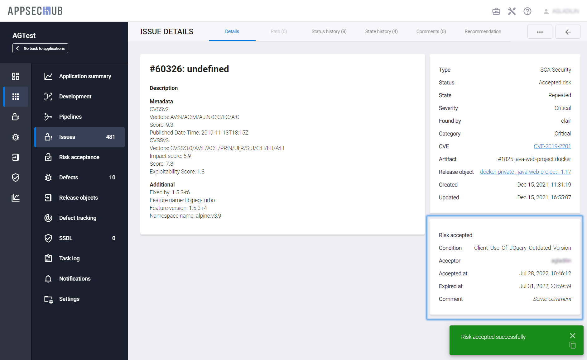</figure>

### Информация о добавленных в исключения уязвимостях

Информация об уязвимостях, добавленных в исключения, отображается на странице **Risk Acceptance**.

<figure markdown>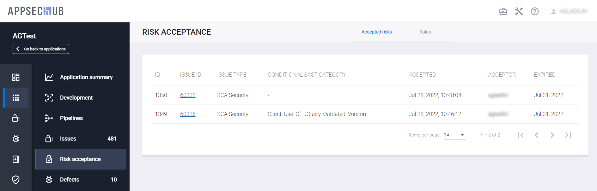</figure>

Для каждой Security Issue, имеющей статус Accepted Risk, отображается следующая информация:

* **ID** — идентификационный номер правила, созданного в AppSec.Hub.
* **ISSUE ID** — идентификационный номер Security Issue.
* **ISSUE TYPE** — тип Security Issue.
* **CONDITIONAL SAST CATEGORY** — используемое SAST категория (условие) в случае условного принятия риска.
* **ACCEPTED** — дата и время создания соответствующего правила (принятия риска).
* **ACCEPTOR** — учетная запись пользователя, создавшего соответствующее правило.
* **EXPIRED** — срок действия правила.

Кроме этого, на вкладке **Rules** данной страницы отображается перечень созданных для данного приложения правил.

## Настройка алгоритма изменения состояний проблем безопасности

!!! note "Примечание"
    Для выполнения нижеописанных действий требуется роль Менеджер.

В отдельных случаях специфические особенности организации работы команд разработки требуют нестандартных подходов к настройкам алгоритма изменения состояний проблем безопасности.

Чтобы более ярко обозначить потенциальную проблему, рассмотрим гипотетическую ситуацию, когда Quality Gate настроен на полное отсутствие новых проблем безопасности (имеющих состояние NEW). Более подробная информация о критериях качества (Quality Gates) и их настройках приведена в разделе «[Quality Gates](../../aag/quality%20gates/#quality-gates)» Руководства администратора. При первой проверке безопасности все проблемы получают состояние NEW, Quality Gate определяет наличие недопустимого количества проблем безопасности, о чем система информирует Инженера ИБ. Однако при последующих сканированиях найденные ранее проблемы безопасности изменяют состояние на REPEATED и настроенный указанным выше способом Quality Gate не срабатывает, что может привести к выпуску в промышленную эксплуатацию приложения, имеющего неустраненные уязвимости. Чтобы исключить описанную ситуацию, необходимо либо более тщательно подходить к определению критериев качества (Quality Gate), либо, при необходимости, использовать предусмотренную в системе возможность настройки алгоритма изменения состояний проблем безопасности.

При настройке Security Pipeline пользователь с ролью Менеджер может выбрать одну из трех настроек (поле **Issue state policy** на вкладке **Settings**). Более подробная информация о настройках Security Pipeline приведена в разделе «[Security Pipelines](../security%20pipelines/#security-pipelines)».

* **Compare with the 1st scan** — определять состояние обнаруживаемых проблем безопасности в сравнении с результатами первого сканирования (стандартная настройка системы).
* **Compare with previous scan** — определять состояние обнаруживаемых проблем безопасности в сравнении с результатами предыдущего сканирования.
* **Compare with the custom** — определять состояние обнаруживаемых проблем безопасности в сравнении с результатами произвольного успешного сканирования. При выборе этого варианта на вкладке **Settings** настроек Security Pipelines появляется дополнительное поле **Issue state policy scan task**, в котором необходимо указать соответствующее сканирование. 

<figure markdown></figure>

!!! note "Примечание"
    Для сравнения не могут использоваться сканирования, завершившиеся с ошибкой (статус FAILED), за исключением получивших такой статус в результате непрохождения Quality Gate.

## Присвоение проблеме безопасности статуса False positive

Чтобы исключить необходимость обработки проблем безопасности, которые являются результатом ложных срабатываний инструментов, Инженер ИБ может присвоить им статус **False positive**, указывающий на то, что проблема безопасности является ложноположительной. Такой подход позволят не учитывать соответствующие проблемы безопасности при расчете Quality Gates.

!!! note "Примечание"
    Статус **False positive** может быть присвоен только проблемам безопасности, находящимся в статусе **To verify**.

Одновременно с присвоением проблеме безопасности данного статуса в системе создается соответствующее правило, которое работает только в рамках текущего приложения. В дальнейшем, если среди импортируемых проблем безопасности будут встречаться те, на которые распространяется созданное правило, они будут автоматически получать статус **False positive**.

!!! note "Примечание"
    В настоящее время реализована возможность присвоения статуса **False positive** только проблемам безопасности типа SCA Security, выявленным инструментами Nexus IQ. 

Чтобы присвоить проблеме безопасности статус **False positive** и создать правило в системе, перейдите на страницу с детальной информацией о соответствующей проблеме, нажав ее **ID** на странице **Issues**.

Нажмите на кнопку **Actions** .

В раскрывающемся меню выберите пункт **False positive**.

<figure markdown></figure>

В открывшемся окне **Accept the False Positive** заполните или отредактируйте необходимые поля. Часть полей данного окна будет заполнена автоматически на основе информации, полученной из инструмента AST.

<figure markdown></figure>

* **Target status** — устанавливаемый статус.
* **Target issue type** — тип проблемы безопасности.
* **Expiration date** — срок действия создаваемого правила. При наступлении указанной даты статус уязвимости изменится с **False positive** на **To verify**.   
* **Comment** — комментарии Инженера ИБ с указанием причины присвоения статуса **False positive**.
* **Category** — категория проблемы безопасности.

!!! note "Примечание"
    Категории уязвимостей подгружаются из соответствующего инструмента. Более подробная информация приведена в разделе «[Категории уязвимостей](../../aag/categories%20of%20vulnerabilities/#_1)» Руководства администратора.

* **Component group** — группа компонента, содержащего проблему безопасности.
* **Component name** — наименование компонента, содержащего проблему безопасности.
* **Component version** — версия компонента, содержащего проблему безопасности.

!!! note "Примечание"
    В полях **Component group**, **Component name**, **Component version** можно использовать символ «`*`» в качестве универсального знака, заменяющего один или несколько символов. Например, если в поле Component name указать `log*`, будет создано правило для всех компонентов, начинающихся с log.

* **CVE** — идентификатор уязвимости в базе данных общеизвестных уязвимостей информационной безопасности, также в данном поле можно указать CVE в формате, предлагаемом компанией Sonatype. Если поле пустое, добавляются все CVE для данной компоненты.

Нажмите кнопку **Create**.

В случае успешного создания правила в правом нижнем углу интерфейса пользователя появляется подтверждающее сообщение.

Кроме этого, в правом нижнем углу страницы с подробной информацией о соответствующей уязвимости (вкладка **Details**) появится карточка **Risk recognized**, содержащая сведения о созданном правиле.

<figure markdown></figure>

В карточке **Risk recognized** содержится следующая информация:

* **FP Rule** — номер правила в системе.
* **Date of recognition** — дата и время создания правила.
* **Expiration date** — срок действия правила (дата и время).
* **Vulnerability type** — тип проблемы безопасности.
* **Category** — категория (-ии) уязвимости (-ей).
* **Component group** — группа компонента.
* **Component name** — наименование компонента.
* **Component version** — версия компонента.
* **Comments** — комментарии Инженера ИБ.

Кроме этого, информация о созданных для приложения правилах добавляется на вкладки **Issue processing rules** страницы **Settings** и **Rules** страницы **Risk Acceptance**.

<figure markdown>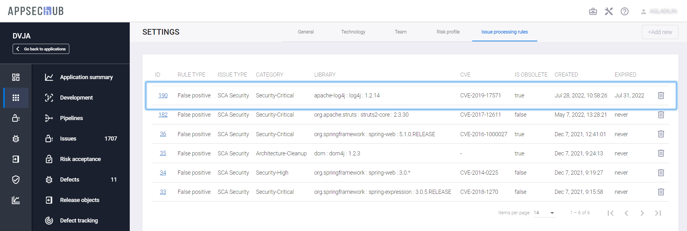</figure>

На данной вкладке приводится следующая информация о правилах:

* **ID** — идентификационный номер правила в системе. 
* **RULE TYPE** — тип правила. 
* **ISSUE TYPE** — тип проблемы безопасности. 
* **CATEGORY** — выбранная категория (-ии). 
* **LIBRARY** — библиотека. 
* **CVE** — идентификатор уязвимости в базе данных общеизвестных уязвимостей информационной безопасности.
* **IS OBSOLETE** — статус правила — если правило распространяется на какие-либо проблемы безопасности в приложении, в данном поле появляется значение **true**, в противном случае — **false**. 
* **CREATED** — дата создания правила. 
* **EXPIRED** — срок действия правила. 

Также правило может быть создано непосредственно на вкладке **Issue processing rules** страницы **Settings**:

Нажмите кнопку **+Add new**.

В появившемся окне **New issue processing rule** в поле **Target status** укажите статус, который необходимо установить для проблемы безопасности, а в поле **Target issue type** — тип уязвимости, после чего количество полей в окне увеличится и их необходимо заполнить/отредактировать аналогично тому, как было писано выше.

После создания правила, нажав его идентификационный номер, можно просмотреть перечень проблем безопасности, на которое оно распространяется.

!!! note "Примечание"
    Важно заметить, что пока в AppSec.Hub существует действующее правило, все соответствующие импортируемые из инструмента уязвимости, будут получать определенный этим правилом статус, независимо от предыдущих изменений их статусов. Небольшой пример: в ходе очередного сканирования уязвимость не обнаружена инструментом и для нее в системе устанавливается статус **Fixed**.
    
    Однако если при следующем сканировании эта же уязвимость будет обнаружена вновь, то при импорте в AppSec.Hub она снова получит статус, например, **False Positive**. 
    
    Другими словами, статус задаваемый правилом в AppSec.Hub имеет более высокий приоритет, чем статус инструмента. 

## Удаление правил

Если необходимо удалить правило, перейдите на вкладку **Issue processing rules** страницы **Settings** и нажмите расположенную справа от него иконку **Cancel rule** .

<figure markdown></figure>

В появившемся диалоговом окне **Cancel issue processing rule** нажмите кнопку **Submit**, чтобы отменить правило. Если выбрана опция **Change the Status of the all Issue covered by this Rule to To Verify**, статус всех проблем безопасности, которым в соответствии с данным правилом был присвоен статус **False positive**, будет изменен на **To Verify**, в противном случае — останется без изменений.

<figure markdown></figure>

В результате успешного удаления правила в правом нижнем углу пользовательского интерфейса отображается подтверждающее сообщение, а информация о правиле удаляется с вкладки **Issue processing rules**.

<figure markdown></figure>

!!! note "Примечание"
    Аналогично правило может быть удалено на вкладке **Rules** страницы **Risk Acceptance** соответствующего приложения.

## Экспорт проблем безопасности в файл

Предусмотрена возможность скачивания отчета о выбранных проблемах безопасности в файлы формата XLSX или PDF. Кроме этого, можно скачать ZIP-архив, который объединяет XLSX-отчет с описанием уязвимостей в формате HTML.

!!! note "Примечание"
    Если к перечню Security Issues были применены какие-либо фильтры, они учитываются при формировании отчета. Например, если необходимо сформировать отчет, содержащий Security Issues в порядке убывания степени их серьезности, применим фильтр Severity: High to Low и сгенерируем отчет.

Перейдите на страницу **Issues** и нажмите на кнопку **Export Issues** 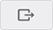, расположенную в правом верхнем углу пользовательского интерфейса.

<figure markdown>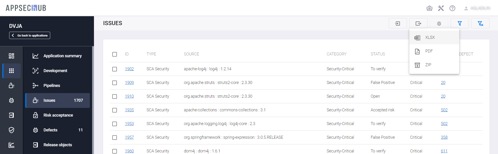</figure>

В раскрывающемся меню выберите необходимый формат (XLSX, PDF или ZIP). В правом нижнем углу пользовательского интерфейса появится подтверждающее сообщение и, спустя несколько секунд, начнется скачивание файла отчета в выбранном формате.

Не останавливаясь подробно на структуре отчетов, отметим, что в них, помимо прочего, реализовано отображение ссылок на уязвимости, обнаруженные продуктами Sonatype (**CVE id**), а также безопасных версий библиотек (**Non-vulnerable versions**).

<figure markdown></figure>

При нажатии на идентификатор уязвимости в XLSX-отчете происходит переход на страницу описания соответствующей уязвимости в AppSec.Hub или, если выбран отчет в формате ZIP, открывается скачанная HTML-страница с аналогичным описанием.