# Security Pipelines

!!! note "Примечание"
    Для выполнения нижеописанных действий требуется роль Менеджер.

## Структура Security Pipeline

В AppSec.Hub каждый Security Pipeline привязан к приложению. Security Pipeline выполняет сканирование безопасности. Security Pipeline позволяет создать и использовать автоматизированные процессы тестирования безопасности приложений в рабочих пространствах для разработки, тестирования и развертывания приложений в различных средах.

Security Pipelines предназначены для анализа трех различных типов объектов. Таким образом, существует три вида Security Pipelines:

* Security Pipeline исходного кода (source code Security Pipeline).
* Security Pipeline артефактов (artifact Security Pipeline).
* Security Pipeline экземпляра приложения (application instance Security Pipeline).

Security Pipelines создаются в инструменте оркестрации (TeamCity) для конкретной кодовой базы / артефакта / экземпляра приложения на основе конфигурации используемых инструментов разработки ПО и инструментов AST.

AppSec.Hub предоставляет возможность запуска тестирования безопасности нажатием кнопки **Start scan**  на карточке Security Pipeline.

Выберите пункт меню **Applications** в верхнем левом углу экрана, чтобы начать работу с приложениями и их пайплайнами. На экране появятся карточки приложений.

<figure markdown></figure>

Нажмите на иконку редактирования  в правом нижнем углу карточки приложения на странице **Applications**. Появится экран с названием выбранного приложения в верхнем левом углу и с подробной информацией о выбранном приложении. Выберите элемент меню **DevSecOps** слева. На экране появятся вкладки с тремя типами Security Pipelines для выбранного приложения, а также вкладка **DevSecOps perimeter control**, предназначенная для работы с прокси-репозиториями. Описание работы с прокси-репозиториями приведено в разделе «[Конфигурация приложения](../application%20configuration/#_1)».

<figure markdown>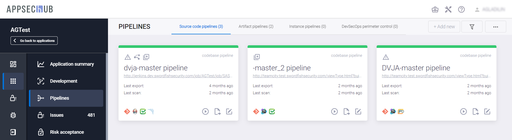</figure>

Нажмите на иконку редактирования  в правом нижнем углу карточки Security Pipeline, чтобы просмотреть или обновить сведения об этом пайплайне. Например, при нажатии на иконку редактирования  на карточке Security Pipeline исходного кода можно получить следующую информацию о пайплайне на вкладке **Structure**:

* Используемый инструмент VCS (Version Control System, система управления версиями), URL кодовой базы, тип ветки кода, инструмент сборки.
* Инструмент оркестрации (CI/CD) и его URL.
* Инструмент для сканирования безопасности (например, Checkmarx) и используемый режим сканирования (например, инкрементальный).
* Общая информация — последний экспорт в CI/CD, последнее сканирование, дата последнего обновления, статус автоматического импорта security issues.
    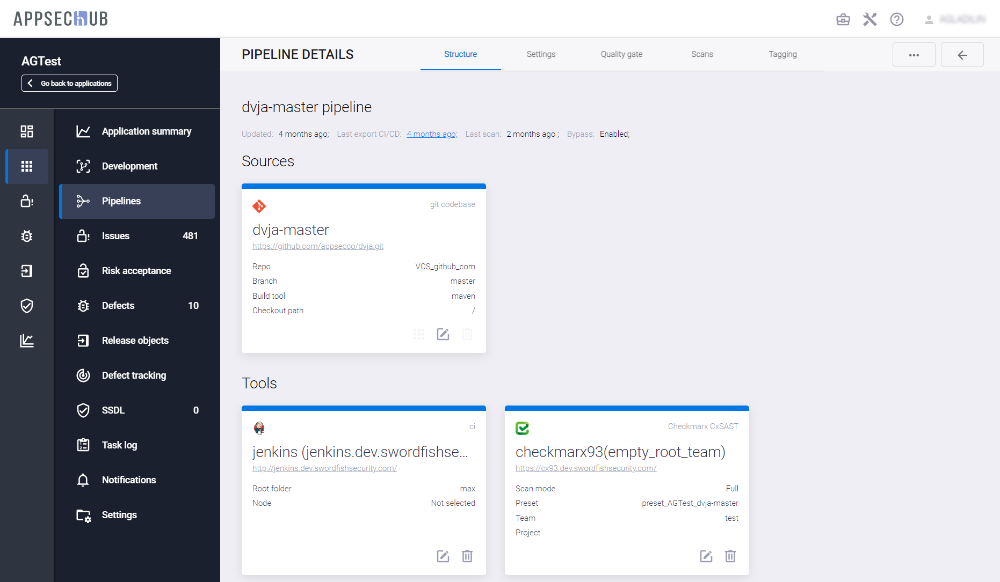

Security Pipeline исходного кода содержит несколько карточек — по одной на каждый инструмент, задействованный в пайплайне. На рисунке выше показан Security Pipeline исходного кода, который состоит из трех частей (или трех карточек):

* Кодовая база с исходным кодом.
* Инструмент оркестрации CI/CD.
* Инструмент AST (Checkmarx).

Процесс конфигурации Security Pipeline включает следующие шаги:

* Выбор инструментов разработки ПО и инструментов AST.
* Настройка выбранных инструментов.
* Определение критериев качества и создание Quality Gate (описание работы с QG приведено в разделах «[Добавление Quality Gate в Security Pipelines](../security%20pipelines/#quality-gate-security-pipelines)» данного документа и «[Quality Gates](../../aag/quality%20gates/#quality-gates)» Руководства прикладного администратора).

Набор используемых инструментов определяется в зависимости от имеющихся лицензий. Настройки каждого инструмента определяются в AppSec.Hub. Рассмотрим в качестве примера конфигурацию инструмента Checkmarx. Нажмите на иконку редактирования  в правом нижнем углу карточки Checkmarx. Появится окно **Update SAST scan config**.

<figure markdown></figure>

Задайте настройки Checkmarx в этом окне:

* **Scan mode** — выберите из выпадающего меню пункт Full или Incremental.
* **Predefined preset/Dynamically modified preset** — выбор предустановленного или динамического пресета, который будет использоваться при сканировании. Более подробная информация об использовании динамических пресетов для инструмента Checkmarx приведена в разделе «[Security Pipeline исходного кода](../security%20pipelines/#security-pipeline_3)».
* **Preset** — выберите правила, определенные в Checkmarx (Checkmarx Default, Checkmarx Express, All, High and Medium и т. д.). Данное поле активно, если выбран **Predefined preset**.
* **Root team** — определяется в настройках Checkmarx.
* **Team** — выберите структурную единицу из выпадающего меню.
* **Excluded directories** — указанные здесь каталоги не будут проверяться во время сканирования безопасности.

Нажмите кнопку **Update**, чтобы сохранить настройки Checkmarx. Карточка инструмента Checkmarx после конфигурации будет отображать вновь заданные настройки. Кроме того, она содержит ссылку на проект в Checkmarx. Если нажать эту ссылку, то через в появившемся окне инструмента можно ввсети свои учетные данные и зайти в проект Checkmarx.

Обратите внимание, что AppSec.Hub автоматически обновляет настройки в самом инструменте Checkmarx — никакие дополнительные действия пользователя не требуются.

Пользователь AppSec.Hub с правами Менеджера может выполнить следующие действия с Security Pipeline, нажав кнопку **Actions**  в правом верхнем углу и выбрав одно из этих действий из выпадающего меню:

* Экспортировать Security Pipeline в инструмент CI/CD.
* Запустить сканирование (запустить Security Pipeline).
* Добавить новый элемент в Security Pipeline.

## Настройки Security Pipeline

Выберите вкладку **Settings**, чтобы установить настройки Security Pipeline.

<figure markdown>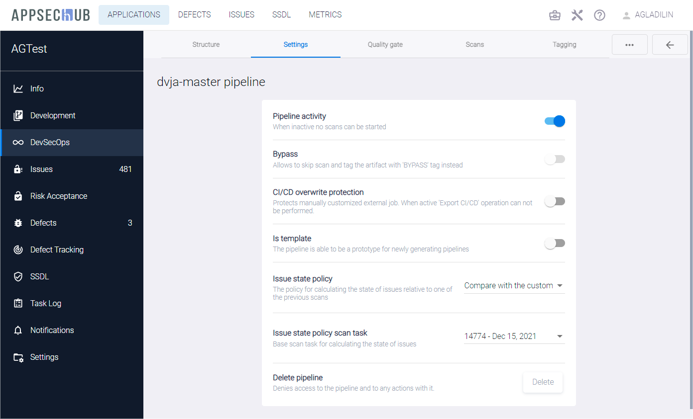</figure>

На этой вкладке с помощью селекторов можно установить следующие настройки:

* **Pipeline activity** — если этот переключатель выключен, Security Pipeline не может быть запущена на сканирование. Состояние этой настройки пайплайна в AppSec.Hub отображается с помощью цвета линии вверху карточки пайплайна. Если линия имеет серый цвет, переключатель выключен, Security Pipeline не может быть запущена на сканирование. Если линия имеет зеленый цвет, переключатель выключен, Security Pipeline может быть запущена на сканирование. 

<figure markdown>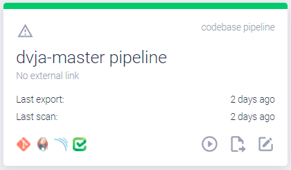</figure>
<figure markdown>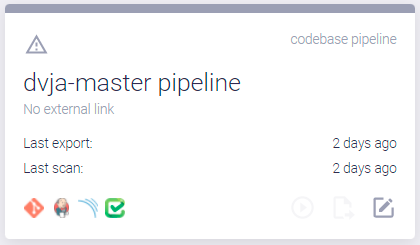</figure>

* **Bypass** — если этот переключатель включен, сканирование при запуске Security Pipeline не выполняется, при этом артефакт будет помечен тегом BYPASS, а на карточке пайплайна появится значок **Bypass is enabled** .

!!! note "Примечание"
    Данная функциональность доступна только после добавления в Security Pipeline тегируемого артефакта, см. раздел «[Security Pipeline артефакта](../security%20pipelines/#security-pipeline_4)».

При запуске такого Security Pipeline в правом нижнем углу пользовательского интерфейса отображается подтверждающее уведомление, но фактически сканирования не выполняется и в истории сканирования (вкладка **Scans**) отображается соответствующее предупреждение.

Данная функциональность может, например, применяться при On-boarding с использованием Meta-runner, если необходимо выполнить сканирование только артефакта, но не кодовой базы. В таком случае для Security Pipeline кодовой базы активируется опция Bypass.

<figure markdown>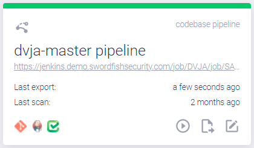</figure>

* **CI/CD overwrite protection** — этот переключатель блокирует экспорт Security Pipeline в CI/CD инструмент с помощью пункта меню Export CI/CD. Это позволяет защитить настройки Security Pipeline от нежелательной перезаписи, а на карточке пайплайна появится значок **Overwrite protection is enabled** .

<figure markdown>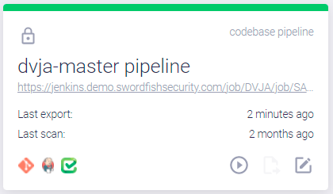</figure>

* **Is template** — этот переключатель активирует функциональность, которая позволяет использовать Security Pipeline в качестве шаблона при создании новых. На карточке появляется значок **This is a template pipeline** . Важно заметить, что для корректного завершения On-boarding (см. раздел «[On-boarding — автоматизация интеграции AppSec.Hub в цикл разработки](../on-boarding/)») необходимо наличие в AppSec.Hub предопределенного шаблона Security Pipeline. В качестве такого шаблона может использоваться любой ранее созданный для данного приложения Security Pipeline соответствующего типа (для кодовых баз, артефактов и т. д.). Если для приложения определено несколько Security Pipelines одного типа, для предсказуемого завершения интеграции важно для нужного Security Pipeline активировать опцию Is template — вновь автоматически создаваемые Security Pipelines для данного приложения будут использовать выбранный шаблон.

<figure markdown>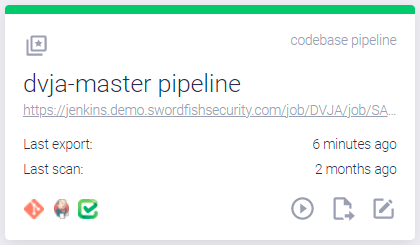</figure>

* **Issue state policy** — настройка алгоритма изменения состояний проблем безопасности. Может быть выбрана одна из трех настроек:
    * **Compare with the 1st scan** — определять состояние обнаруживаемых проблем безопасности в сравнении с результатами первого сканирования (стандартная настройка системы).
    * **Compare with previous scan** — определять состояние обнаруживаемых проблем безопасности в сравнении с результатами предыдущего сканирования.
    * **Compare with the custom** — определять состояние обнаруживаемых проблем безопасности в сравнении с результатами произвольного успешного сканирования. При выборе этого варианта на вкладке **Settings** настроек Security Pipelines появляется дополнительное поле **Issue state policy scan task**, в котором необходимо указать соответствующее сканирование.
* **Delete pipeline** — нажмите кнопку **Delete**, чтобы запретить доступ к пайплайну и действиям с ним.

## Добавление Quality Gate в Security Pipelines

Когда профиль Quality Gate создан и настроен (см. разделы «[Quality Gates](../../aag/quality%20gates/#quality-gates)» Руководства прикладного администратора), он может быть добавлен в Security Pipeline (s) одного или нескольких приложений.

Чтобы добавить Quality Gate в Security Pipeline, предварительно выбрав необходимое приложение (см. раздел «[Приложения в AppSec.Hub](../work%20with%20applications/#appsechub)»), перейдите на страницу настроек Security Pipeline, см. раздел «[Настройки Security Pipeline](../security%20pipelines/#security-pipeline_1)».

Перейдите на вкладку **Quality Gate** и, выбрав в раскрывающемся меню предварительно созданный профиль Quality Gate (см. раздел «[Quality Gates](../../aag/quality%20gates/#quality-gates)» Руководства прикладного администратора), нажмите кнопку **Save**, чтобы включить Quality Gate в Security Pipeline.

<figure markdown>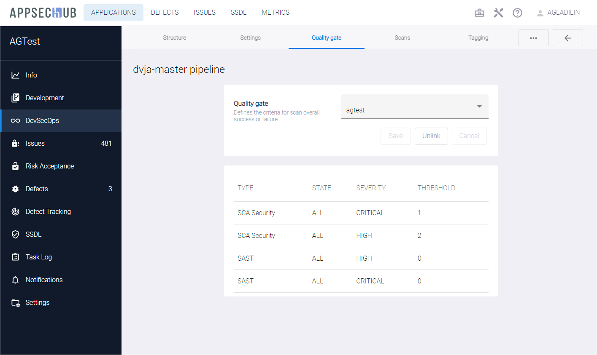</figure>

После добавления Quality Gate в Security Pipeline, ниже отобразится перечень условий, определенных в профиле Quality Gate.

Для подключения другого Quality Gate выберите его в раскрывающемся меню и нажмите кнопку **Save**. На странице отобразятся условия для вновь подключенного Quality Gate.

!!! note "Примечание"
    К Security Pipeline одновременно может быть подключен только один Quality Gate. При подключении нового Quality Gate ранее подключенный — отключается.

Чтобы отключить Quality Gate от Security Pipeline, нажмите кнопку **Unlink**.

!!! example "Пример"
    Рассмотрим пример использования Quality Gate в Security Pipeline. Предположим, для выпуска релиза приложения определены следующие критерии: отсутствие любых уязвимостей высокой и критической степени серьезности (high/critical severity issues), выявленных инструментами SAST и DAST.
    Чтобы создать Quality Gate с такими критериями, при настройке профиля Quality Gate (см. раздел «[Quality Gates](../../aag/quality%20gates/#quality-gates)» Руководства прикладного администратора) выберем следующие параметры.
    <figure markdown>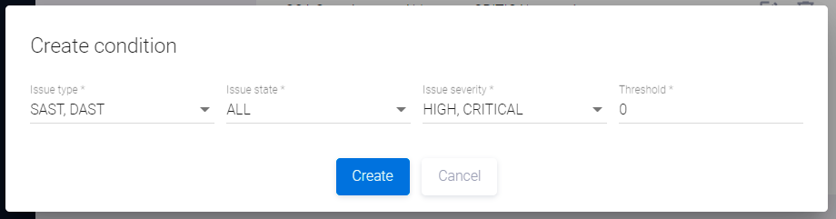</figure>
    Перечень заданных условий будет выглядеть следующим образом.
    <figure markdown>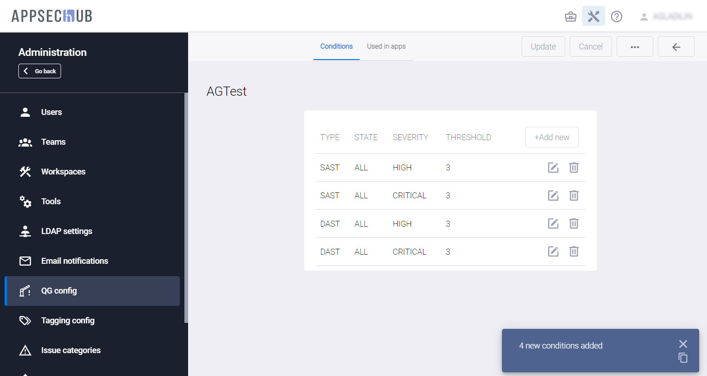</figure>
    Таким образом создан Quality Gate, который при включении его в Security Pipeline будет отслеживать выполнение указанных критериев.
    Если критерии Quality Gate не выполняются (для приведенного примера во время сканирования обнаружена минимум одна уязвимость высокой или критической степени серьезности), AppSec.Hub прервет выполнение Security Pipeline и релиз приложения не будет создан. Чтобы выпустить релиз, который соответствует заданному критерию QG, все уязвимости высокой и критической степени серьезности должны быть устранены до запуска Security Pipeline, создающего релиз приложения.

## История сканирований

Выберите вкладку **Scans**, чтобы получить подробную информацию о результатах сканирования для выбранного Security Pipeline.

<figure markdown>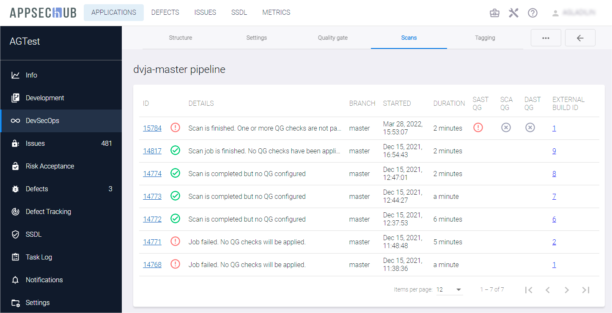</figure>

Каждое выполненное сканирование представлено отдельной строкой. Эта строка содержит следующие поля:

* **ID** выполненного сканирования в AppSec.Hub. Чтобы ознакомиться с подробной информацией о сканировании, нажмите значение в данном столбце. Отобразится следующая страница.

    <figure markdown>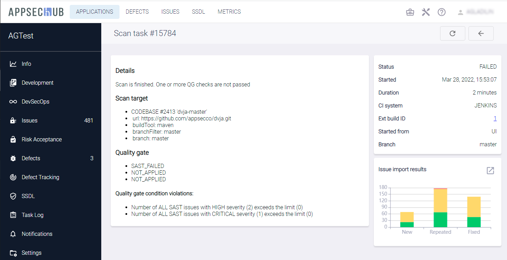</figure>

    На данной странице приведена следующая информация:

    * **Scan task** — номер сканирования в системе.
    * Общий статус сканирования.
    * **Application** — имя приложения.
    * **Started** — время и дата запуска сканирования.
    * **Duration** — продолжительность сканирования.
    * **CI system** — используемый инструмент CI/CD.
    * **External build ID** — внешний идентификатор сканирования. При нажатии на значение осуществляется переход в соответствующий инструмент CI/CD.
    * **Details** — сводная информация о сканировании.
    * **Scan target** — информация об объекте сканирования.
    * **Quality gates** — информации о прохождении установленных критериев качества (Quality gates).
    * **Quality gate condition violations** — информация о превышении пороговых значений, определенных в профиле подключенного Quality gates.
    * **Issue import results** — результат импорта security issues в виде диаграммы с распределением по статусам (New, Repeated, Fixed). Рядом с диаграммой располагается иконка, нажав которую можно перейти к перечню security issues, обнаруженных в ходе данного сканирования. Предусмотрена возможность обновления данных на странице (кнопка **Refresh data**).
    * **Release object** — ссылка на релизный объект.
    * **Details** — статус сканирования в инструменте оркестрации:
        *  — SUCCESS.
        *  — FAILURE.
        *  — BYPASSED.

!!! note "Важное замечание"
    Заметим, что с учетом установленного Quality Gate, результаты сканирования с точки зрения инструмента оркестрации TeamCity и с точки зрения AppSec.Hub могут значительно различаться. Выполнение сканирования в инструменте оркестрации могло пройти успешно, однако определенные в QG критерии с точки зрения серьезности обнаруженных рисков безопасности (security risks) и рисков, связанных с корректностью использования лицензии (compliance risks), при этом могут быть не выполнены. В этом случае статус QG Check в AppSec.Hub может иметь значение Failed, и выполнение Security Pipeline должно быть прервано, поскольку критерии QG не были выполнены. Например, после невыполнения критерия QG не должен быть осуществлен шаг по разворачиванию этой сборки в целевом окружении. Если QG не был установлен, то результат сканирования в AppSec.Hub определяется как Passed, если оно успешно прошло в инструменте оркестрации TeamCity. Статус сканирования в AppSec.Hub с точки зрения QG отображается в полях SAST QG, SCA QG и DAST QG.

* **Version** — версия просканированного артефакта.
* **Branch** — содержит название ветки. Для артефакта данное поле называется **Version** и содержит версию просканированной сборки.
* **Started** — дата и время начала сканирования.
* **Duration** — продолжительность сканирования.
* **SAST QG** — статус выполнения сканирования в AppSec.Hub с точки зрения установленного SAST QG. Если QG не был установлен, это поле будет пустым. Если QG был установлен, но критерий, заданный в QG, не был выполнен, это поле будет содержать соответствующую иконку **Failed** . Нажмите эту иконку, чтобы получить детальную информацию о результате сканирования.

<figure markdown>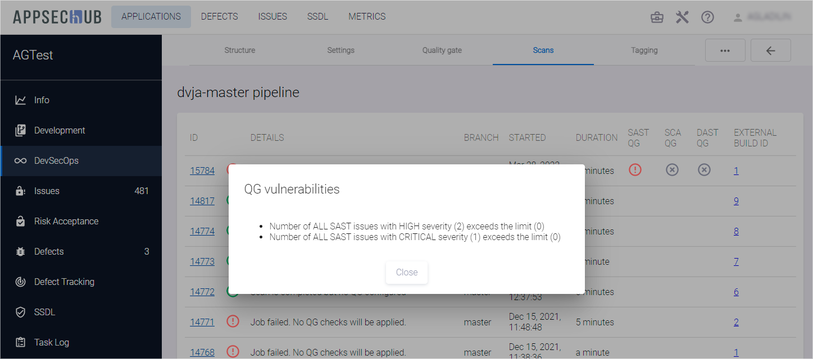</figure>

* Если QG был установлен и критерий, заданный в QG, был выполнен, это поле будет содержать соответствующую иконку Passed .
* **SCA QG** — статус выполнения сканирования в AppSec.Hub с точки зрения установленного SCA QG. Если QG не был установлен, это поле будет пустым. Если QG был установлен, но критерий, заданный в QG, не был выполнен, это поле будет содержать соответствующую иконку Failed . Нажмите эту иконку, чтобы получить детальную информацию о результате. Если QG был установлен, и критерий, заданный в QG, был выполнен, это поле будет содержать соответствующую иконку Passed .

<figure markdown>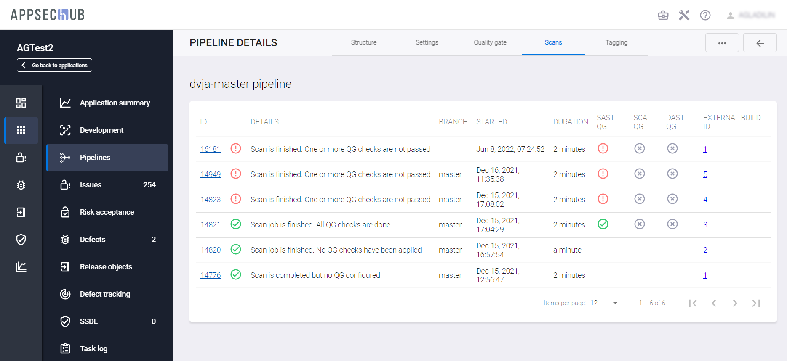</figure>

* **DAST QG** — статус выполнения сканирования в AppSec.Hub с точки зрения установленного DAST QG. Если QG не был установлен, это поле будет пустым. Если QG был установлен, но критерий, заданный в QG, не был выполнен, это поле будет содержать соответствующую иконку Failed . Нажмите эту иконку, чтобы получить детальную информацию о результате. Если QG был установлен, и критерий, заданный в QG, был выполнен, это поле будет содержать соответствующую иконку Passed .
* **EXTERNAL ID** — внешний идентификатор сканирования. При нажатии на значение осуществляется переход в соответствующий инструмент CI/CD.

## Экспорт в CI/CD

После того, как Security Pipeline создан и сконфигурирован в AppSec.Hub, его можно экспортировать в инструмент CI/CD.

!!! note "Примечание"
    Если в пользовательском интерфейсе AppSec.Hub выполнены какие-либо изменения структуры Security Pipeline, необходимо выполнить повторный экспорт параметров в инструменты CI/CD, см. ниже.

На вкладке **Structure** нажмите кнопку **Actions**  в правом верхнем углу и выберите в выпадающем меню пункт **Export CI/CD**, чтобы экспортировать Security Pipeline в инструмент CI/CD — TeamCity.

<figure markdown>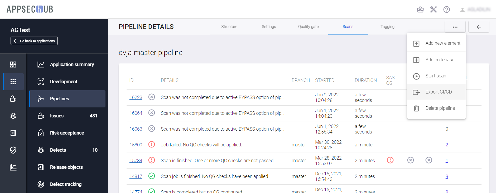</figure>

Сообщение о результате экспорта появится в правом нижнем углу экрана.

<figure markdown>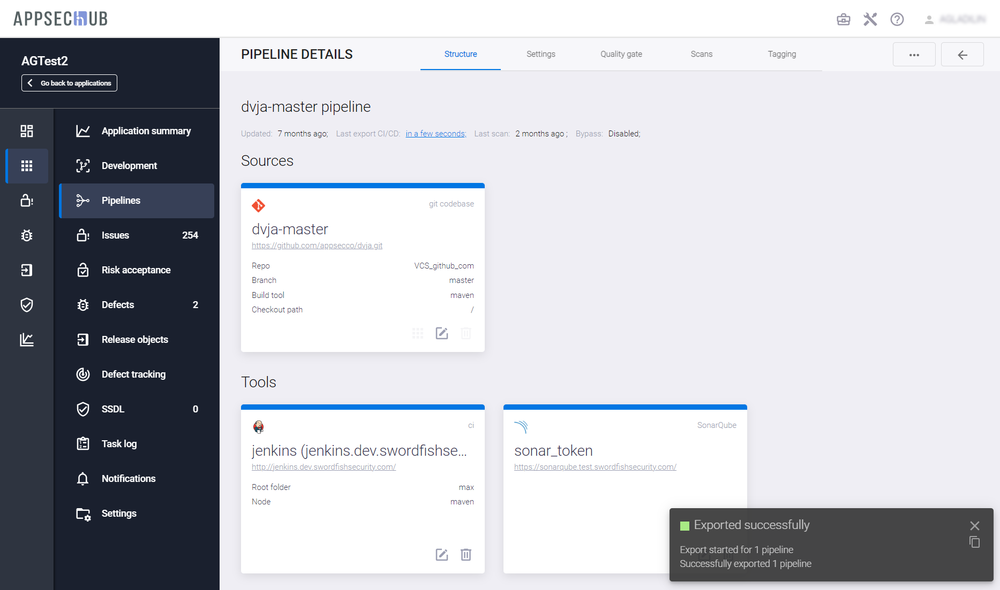</figure>

В результате экспорта, в TeamCity будет создан Security Pipeline с параметрами конфигурации, определенными в AppSec.Hub. Теперь TeamCity может выполнять сконфигурированный Security Pipeline. TeamCity будет запускать все инструменты в пайплайне и предоставлять полученные результаты тестирования безопасности в AppSec.Hub.

Чтобы выполнить экспорт Security Pipeline в инструмент CI/CD на странице **DevSecOps**, нажмите кнопку **Export CI/CD**  в правом нижнем углу карточки пайплайна.

<figure markdown>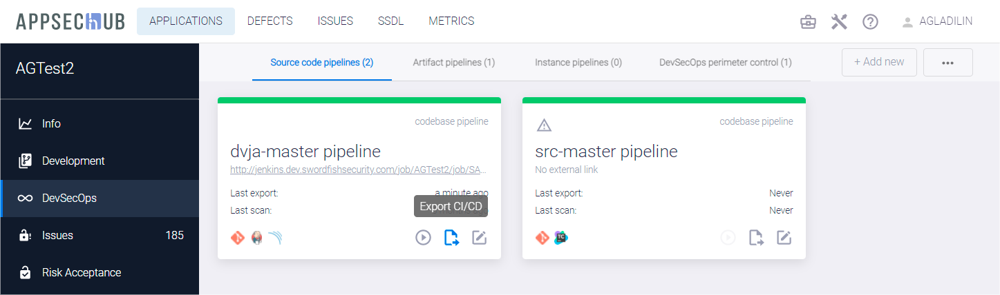</figure>

## Доступ к Security Pipeline в инструменте оркестрации

Выберите пункт меню **Applications** в верхнем левом углу экрана и выберите приложение. Нажмите на иконку редактирования  в правом нижнем углу карточки приложения на странице **Applications**. Выберите элемент меню **DevSecOps** слева. Нажмите на иконку **Show pipeline config**  в правом нижнем углу карточки Security Pipeline.

Нажмите на ссылку на инструмент оркестрации 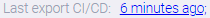 справа от пункта **Last export CI/CD**, чтобы получить доступ к Security Pipeline в TeamCity.

<figure markdown>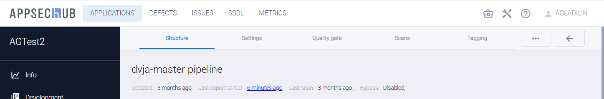</figure>

На экране появится страничка для входа в TeamCity.

## Security Pipeline исходного кода

!!! note "Важное замечание"
    Если подготовленной базы исходного кода не существует, ее следует создать перед началом работы с Security Pipeline исходного кода. Процесс создания новой базы кода описан в разделе «[Кодовые базы](../application%20configuration/#_2)».

Выберите элемент меню **DevSecOps** в консоли слева, а затем нажмите кнопку **+Add new** в правом вернем углу вкладки **Source code pipelines**, чтобы добавить новый Security Pipeline исходного кода.

<figure markdown>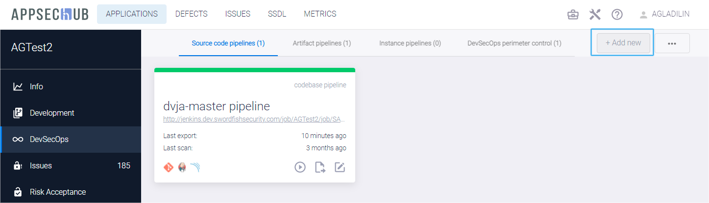</figure>

В открывшемся окне для добавления новой кодовой базы **Choose the codebase for pipeline** выберите и дважды кликните имя кодовой базы, которую нужно добавить.

<figure markdown>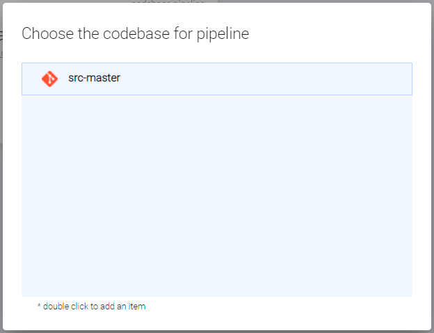</figure>

Новый Security Pipeline исходного кода появляется на вкладке **Source code pipelines**.

<figure markdown>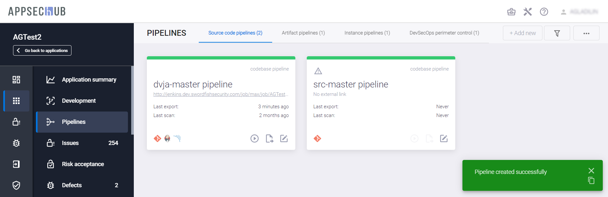</figure>

Нажмите на иконку редактирования  на карточке пайплайна исходного кода. Откроется страница с детальной информацией о пайплайне. На этой странице, как показано на рисунке ниже, выведены два предупреждения о том, что инструмент оркестрации (CI/CD) и инструмент сканирования еще не добавлены в пайплайн.

<figure markdown>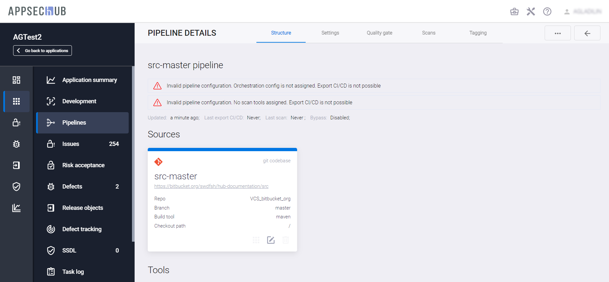</figure>

Обратите внимание, что на карточке кодовой базы появился новый параметр — Checkout path. Он задает ту директорию, в которой будет производиться выгрузка (checkout) данной кодовой базы в CI/CD инструменте.

Нажмите кнопку **Actions**  справа вверху и выберите пункт **Add new element** из выпадающего меню.

<figure markdown>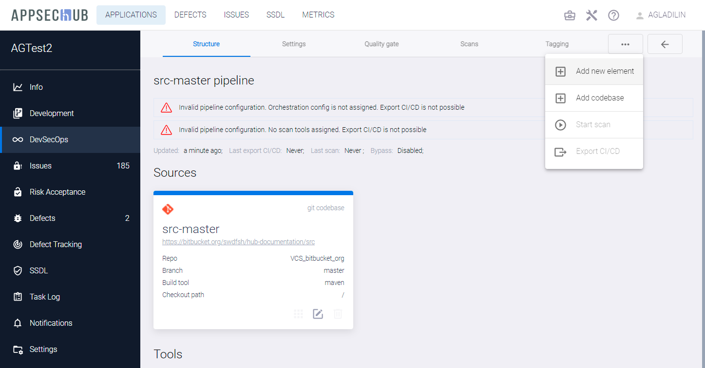</figure>

Выберите пункт **CI** во вновь появившемся окне, чтобы добавить инструмент оркестрации CI/CD TeamCity в пайплайн.

<figure markdown>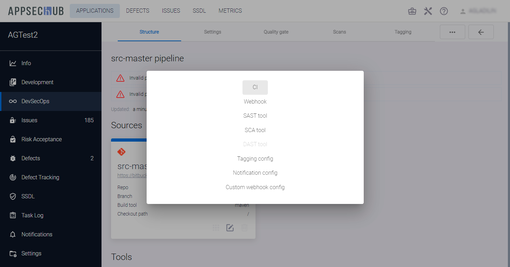</figure>

В следующем окне выберите TeamCity из списка инструментов и нажмите кнопку **Create**. Поле **Pipeline auth token** можно оставить пустым.

<figure markdown>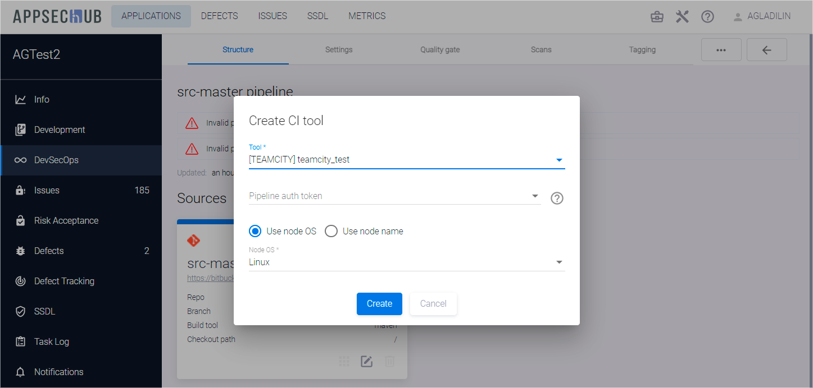</figure>

В результате, на вкладке **Pipeline Structure** появится новая карточка инструмента TeamCity, а также исчезнет одно соответствующее предупреждение.

<figure markdown>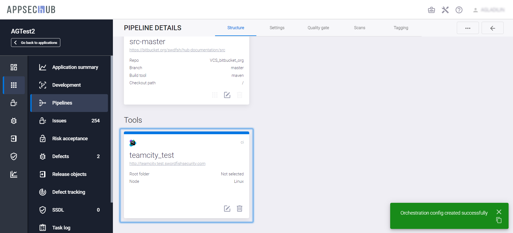</figure>

Следующим шагом является добавление инструмента сканирования.

Нажмите кнопку **Actions**  справа вверху и выберите пункт **Add new element** из выпадающего меню.

<figure markdown></figure>

Выберите пункт **SAST tool** во вновь появившемся окне, чтобы добавить инструмент сканирования Checkmarx в пайплайн.

<figure markdown>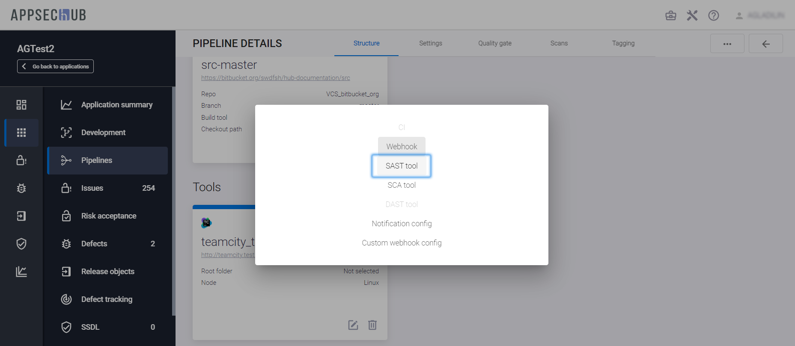</figure>

Выберите пункт Checkmarx из списка инструментов в появившемся окне **Create SAST scan config**.

<figure markdown>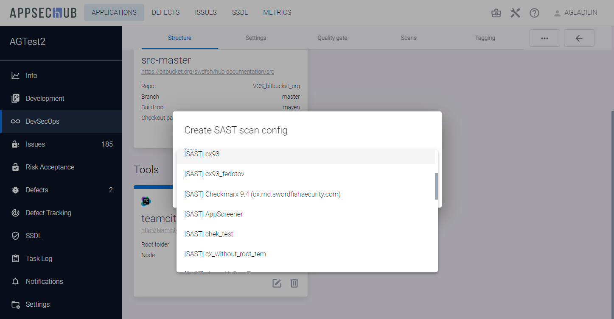</figure>

В появившемся окне выполните настройку следующих параметров:

<figure markdown>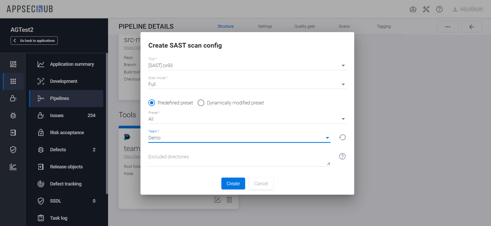</figure>

* **Scan mode** — выберите режим сканирования (**Full**/**Incremental**).
* **Predefined preset/Dynamically modified preset** — выбор соответственно предустановленного или динамического пресета, который будет использоваться при сканировании. Опция **Predefined preset** позволяет следующим шагом выбрать любой импортированный из Checkmarx пресет. Более подробная информация о динамических пресетах приведена ниже в данном разделе.
* **Preset** — выберите пресет Checkmarx, который будет использоваться для сканирования. Данный параметр используется, только если в предыдущем поле выбран **Predefined preset**.

Заполнив остальные поля (**Root team**, **Team**, **Excluded directories**), нажмите кнопку **Create**, см. раздел «[Структура Security Pipeline](../security%20pipelines/#security-pipeline)».

!!! note "Примечание"
    Если поле **Team** отставлено пустым, автоматически будет создана команда с именем, соответствующим названию приложения в AppSec.Hub.

На странице с информацией о пайплайне появится новая карточка инструмента Checkmarx, и последнее предупреждение исчезнет со страницы.

!!! note "Примечание"
    Наименование используемого пресета (-ов) указывается на карточке инструмента.

<figure markdown>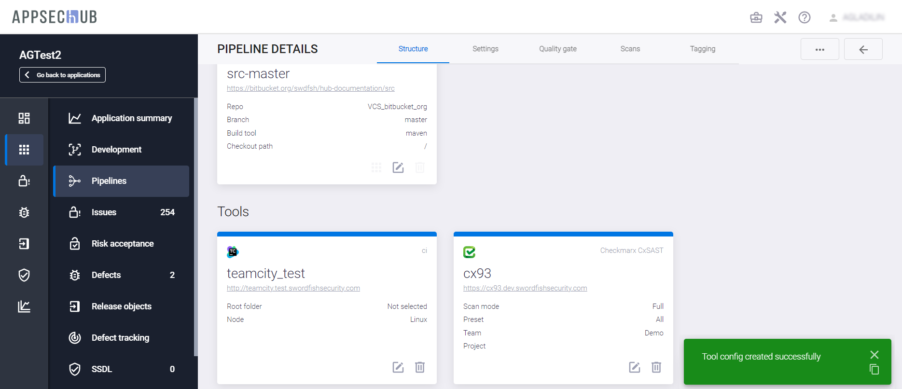</figure>

Теперь нажмите кнопку **Actions**  в правом верхнем углу страницы с детальной информацией о пайплайне и выберите пункт **Export CI/CD** из выпадающего меню, чтобы экспортировать пайплайн в инструмент оркестрации CI/CD (в этом примере — TeamCity). Это необходимо для синхронизации настроек пайплайна в AppSec.Hub и в TeamCity. В правом нижнем углу экрана появится следующее подтверждающее сообщение.

<figure markdown>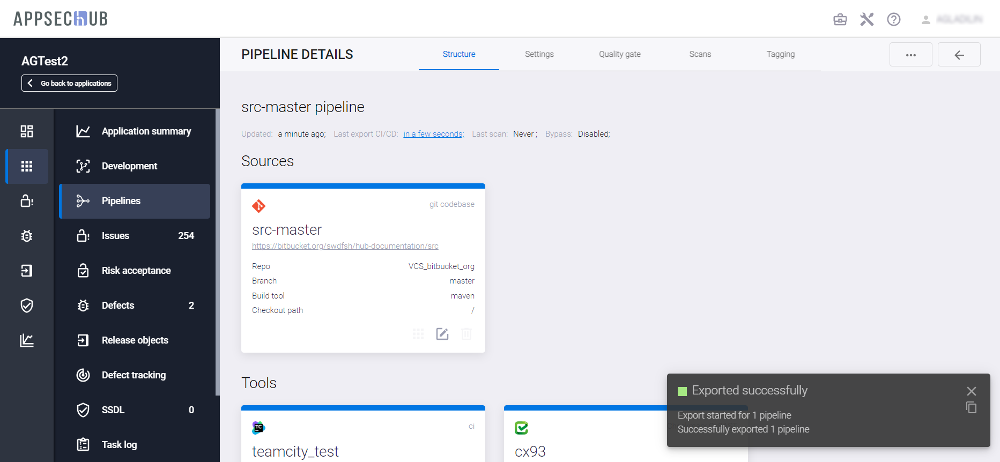</figure>

После успешного экспорта в инструмент CI/CD используйте кнопку **Actions**  и далее пункт **Start scan** в выпадающем меню, чтобы запустить сканирование безопасности исходного кода с помощью инструмента Checkmarx.

### Security Pipeline нескольких кодовых баз

AppSec.Hub позволяет создать пайплайн для нескольких кодовых баз. При этом существуют ограничения на состав включаемых в пайплайн кодовых баз.

Чтобы добавить дополнительтельные кодовые базы в уже существующий пайплайн, нажмите кнопку **Actions**  и выберите в выпадающем меню пункт **Add codebase**.

<figure markdown>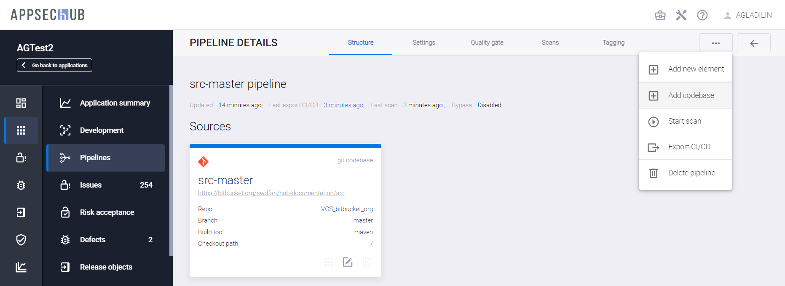</figure>
 
В появившемся окне **Add codebase** приведен лист доступных для добавления в данный пайплайн кодовых баз.

<figure markdown>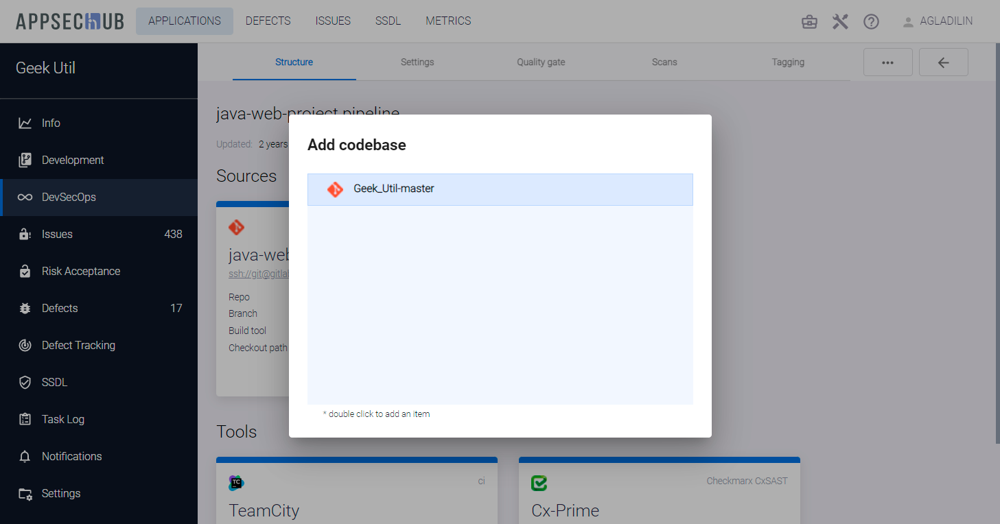</figure>
 
Добавляемые в пайплайн кодовые базы должны быть привязаны к тому же репозиторию VCS (системы контроля версий), что и уже существующая в пайплайне.

Выберите кодовую базу, которыю необходимо включить в пайплайн, и двойным щелчком мыши добавьте ее в пайплайн.

<figure markdown>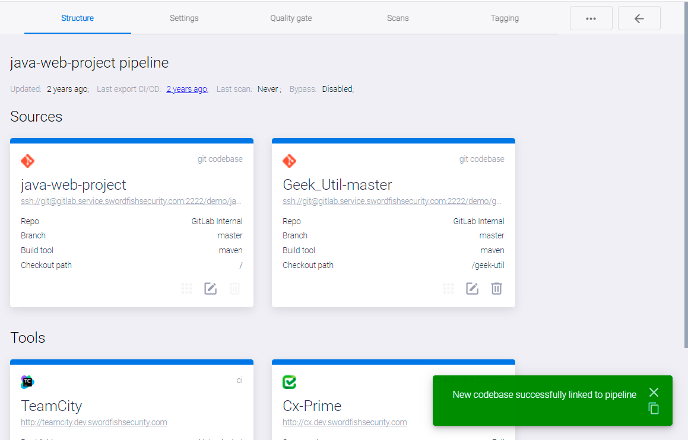</figure>
 
Для основной кодовой базы, с которой создается пайплайн, параметр **Checkout path** всегда имеет значение «/», то есть он всегда указывает на корневую директорию в CI/CD инструменте. Для всех вновь добавляемых кодовых баз эта директория генерируется автоматически и значение этого параметра можно поменять. Для этого нажмите на иконку **Edit codebase**  в правом нижнем углу карточки кодовой базы, в появишемся окне **Update codebase** отредактируйте значение параметра **Checkout directory** и нажмите кнопку **Update**.

<figure markdown>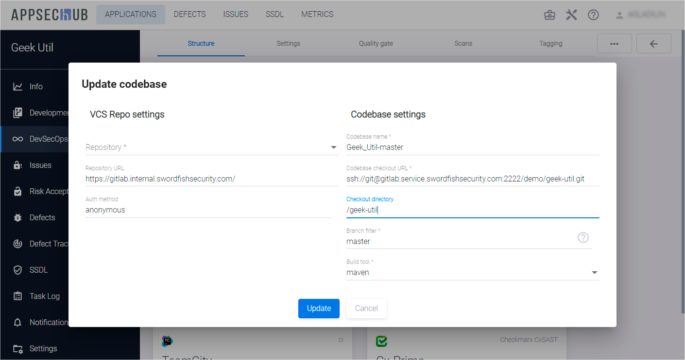</figure>
 
Для вновь добавляемых кодовых баз эта в качестве параметра нельзя указывать корневую директорию. Также значение параметра **Checkout path** не должно совпадать с уже используемыми другими кодовыми базами директориями. В этих случаях система выведет на экран сообщение о невозможности присвоить параметру заданное значение.

Сканирование пайплайнов для нескольких кодовых баз поддерживается в AppSec.Hub.

Система также позволяет провести импорт результатов через CLI.

### Динамические пресеты в Checkmarx

Если в качестве SAST-инструмента используется Checkmarx, при его добавлении в AppSec.Hub реализована возможность использования динамических пресетов (**Dynamically modified preset**).

!!! note "Примечание"
    Если тот или иной язык программирования (и соответствующие проверки) не выбран в **предустановленном** пресете (**Predefined preset**), написанный на нем код при сканировании будет игнорироваться.

При использовании **Dynamically modified preset** во время сканирования происходит автоматическое распознавание языков программирования, составляющих кодовую базу, и формируется новый пресет, в который включаются проверки для обнаруженных языков. Вместе с тем, если в AppSec.Hub создано правило (-а), определяющее условное принятие риска (см. раздел «[Проблемы безопасности](../security%20issues/#_1)»), соответствующее условие (-я) также будет автоматически добавлено в динамически обновляемый пресет инструмента.

Среди преимуществ такого похода можно выделить следующие:

* Оперативная реакция на изменение состава кодовой базы (появление новых языков программирования) с последующим обновлением пресета Checkmarx с целью активации специфических проверок.
* Сокращение времени сканирования в результате пропуска ненужных проверок.

Если в кодовой базе появляется новый язык программирования или пропадает ранее использовавшийся, происходит динамическое обновление пресета в соответствии с произошедшими изменениями.

## Security Pipeline артефакта

Для инструментов сборки артефактом является исходный код программы, скомпилированный для выполнения или тестирования. Артефакты создаются инструментами разработки ПО на базе исходного кода. Артефакты важны с точки зрения разработки приложений как сущности, которые могут быть включены в поставку.

Выберите приложение и нажмите пункт меню **Development** в консоли слева. Артефакты помещаются на вкладке **Artifacts** на странице приложения.

<figure markdown>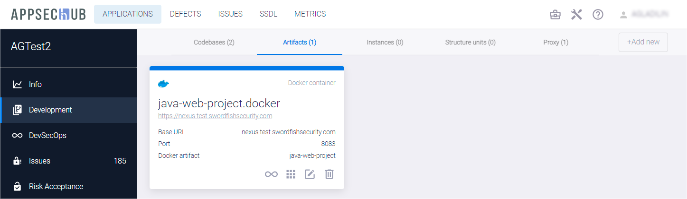</figure>

Для одной базы исходного кода приложения может существовать несколько артефактов (например, WAR-файлы, дистрибутивы в виде архивных файлов, образы Docker и т. д.).

С точки зрения безопасности приложения, каждый артефакт можно просканировать, чтобы найти проблемы информационной безопасности. AppSec.Hub автоматизирует этот процесс и поддерживает DevSecOps пайплайны артефактов. Выберите пункт меню **DevSecOps** в консоли слева и нажмите иконку **Show pipeline config**  на карточке пайплайна артефактов на вкладке **Artifact pipelines**, чтобы просмотреть подробную информацию о пайплайне артефактов.

<figure markdown>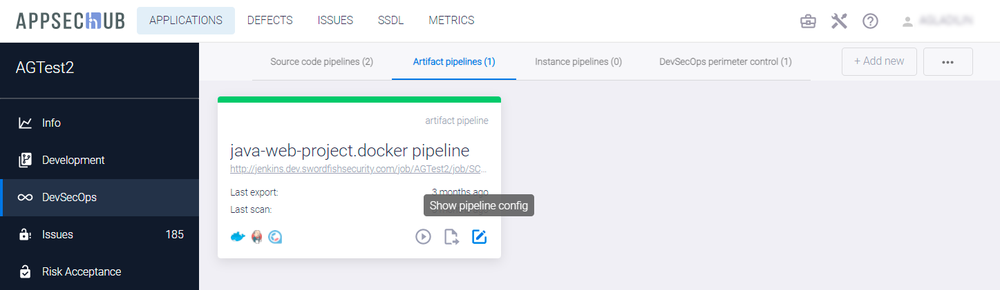</figure>

Откроется страница с детальной информацией о пайплайне.

<figure markdown>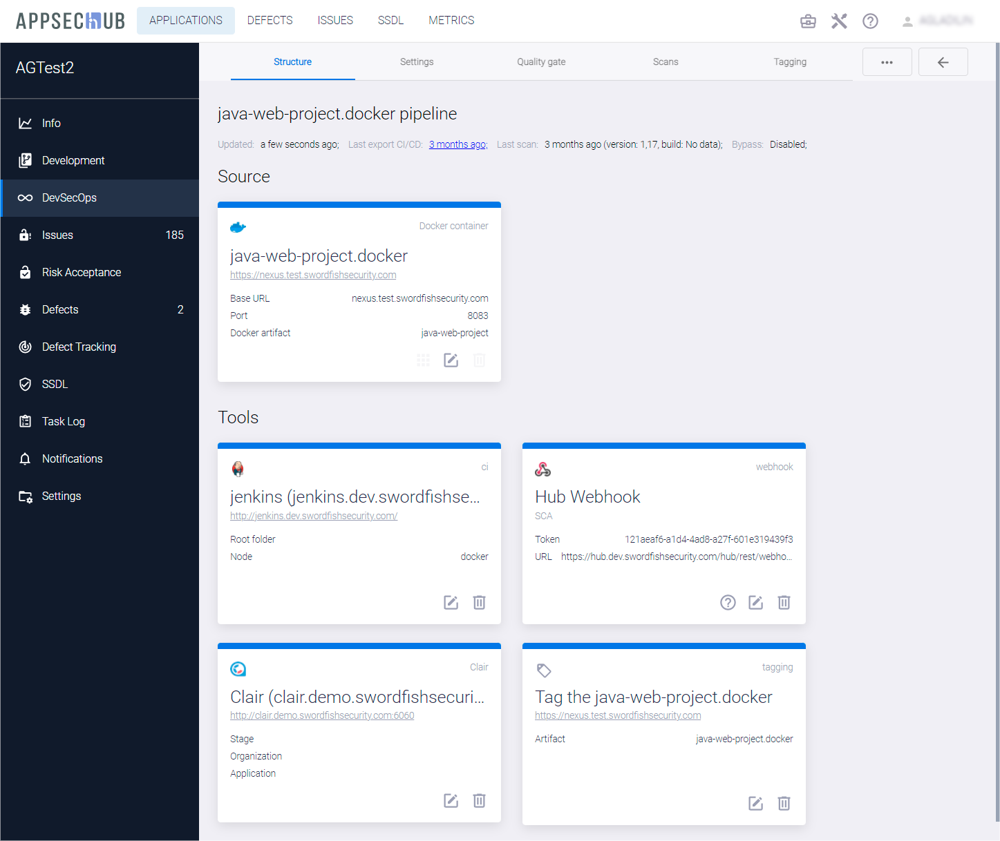</figure>

Эта страница в версиях AppSec.Hub ниже 1.9 может содержать пять карточек, или компонентов, как в показанном на рисунке выше примере пайплайна артефактов:

* Карточка артефакта.
* Карточка инструмента оркестрации.
* Карточка инструмента AST.
* Карточка тегирования (tagging) и подход с ее использованием применяется только в версиях AppSec.Hub ниже 1.9. Тегирование в версиях AppSec.Hub 1.9 и выше описано в разделе «[Тегирование релизных объектов](./release%20objects.md#_4)».
* Карточка Webhook.

!!! note "Важное замечание"
    Подход с использованием карточки тегирования используется только в версиях AppSec.Hub ниже 1.9. Его подробное описание приведено ниже в разделе «Тегирование артефактов». В версиях AppSec.Hub 1.9 и выше карточки тегирования в структуре security pipeline артефактов и связанный с ними подход не используются. Тегирование в версиях AppSec.Hub 1.9 и выше описано в разделе «[Тегирование релизных объектов](./release%20objects.md#_4)».

    Первая карточка представляет артефакт, который необходимо сканировать на наличие проблем информационной безопасности. Необходимая версия указывается в качестве параметра:

* Нажмите кнопку **Actions**  в правом верхнем углу и выберите пункт **Start scan** в выпадающем меню.
* В появившемся окне **Scan start** в поле **Step 1** выберите версию артефакта для сканирования из списка доступных версий в поле **Artifact version** и версию билда (если применимо) в поле **Build version**.
* Если вы хотите просто запустить сканирование артефакта, перейдите к следующему шагу. Если вы хотите сделать данный артефакт релизным объектом, в секции **Step 2** отметьте галочкой поле **Set the artifact as a release object**. Выберите существующий артефакт данного приложения из выпадающего списка в поле **Choose artifact**, чтобы привязать к нему сканирование и сделать его релизным объектом. В поле **Artifact version** укажите версию создаваемого релизного объекта и версию билда в поле **Build version** (если применимо, это зависит от типа релизного объекта – обязательные поля отмечены звездочкой).

<figure markdown>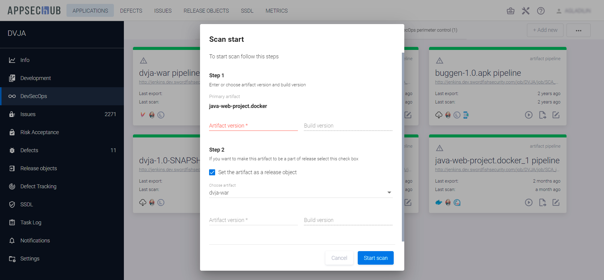</figure>

* Нажмите кнопку **Start scan** внизу окна, чтобы начать сканирование. Если была выбрана опция **Set the artifact as a release object**, одновременно будет создан релизный объект.

Следующая карточка для этого пайплайна — карточка инструмента оркестрации TeamCity. Эта карточка позволяет настроить инструмент оркестрации. Если TeamCity работает на нескольких узлах (nodes), можно выбрать конкретный узел для сканирования, указав метку, которой он помечен. Чтобы выбрать для работы узел, помеченный меткой, например, **linux3**, нажмите иконку редактирования  на карточке инструмента оркестрации. В открывшемся окне **Update CI tool** выберите режим **Use node name** и выберите **linux3** из выпадающего списка в поле **Node label** и нажмите кнопку **Update**.

<figure markdown>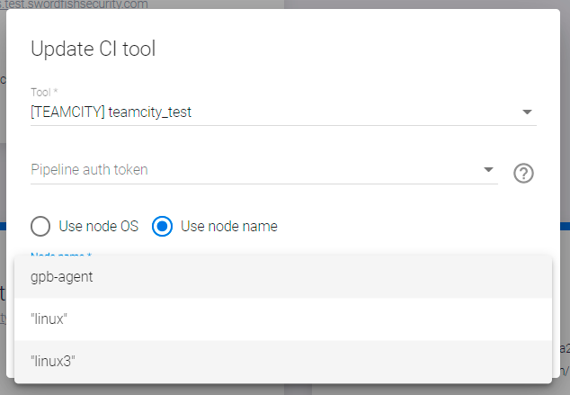</figure>

Сообщение, подтверждающее обновление конфигурации TeamCity, появится в правом нижнем углу экрана.

<figure markdown>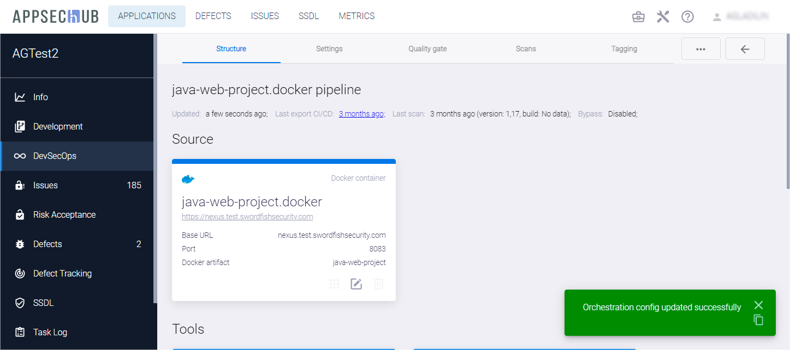</figure>

Карточка инструмента оркестрации TeamCity теперь содержит информацию о том, что метка «**linux3**» является меткой выбранной узла.

<figure markdown>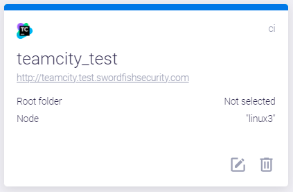</figure>

Процесс сканирования будет выполняться на этом узле с меткой «linux3».

Следующая карточка для этого пайплайна — карточка инструмента AST. В данном примере это инструмент Clair. Для одного пайплайна может быть использовано несколько инструментов сканирования. Clair — это инструмент сканирования SCA (Software Composition Analysis). Нажмите иконку редактирования  на карточке инструмента сканирования, чтобы настроить параметры сканирования в окне **Update SCA scan config**.

<figure markdown>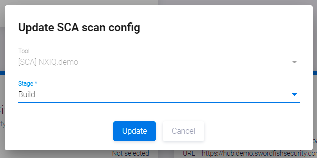</figure>

В этом окне можно выбрать инструмент сканирования и выбрать этап (stage) из выпадающего списка (**Develop**, **Build**, **Stage Release**, **Release**, **Operate**).

### Тегирование артефактов

!!! note "Важное замечание"
    Описанный в этом разделе подход к тегированию артефактов может быть применен только в версиях AppSec.Hub ниже 1.9. При переходе с версии AppSec.Hub ниже 1.9 на версию AppSec.Hub 1.9 и выше, уже существующие карточки тегирования пропадут из структуры security pipeline, а все протегированные артефакты автоматически преобразуются в системе в релизные объекты. Тегирование в версиях AppSec.Hub 1.9 и выше описано в разделе «[Тегирование релизных объектов](./release%20objects.md#_4)».
 

Карточка тегирования (Tagging) и тегирование арефактов само по себе являются опциональными. Чтобы добавить тегирование в Security Pipeline артефакта, нажмите кнопку **Actions**  справа вверху на вкладке **Structure** и выберите пункт **Add new element** из выпадающего меню. Выберите пункт конфигурации **Tagging config** из списка во вновь появившемся окне.

Некоторые репозитории, например Nexus Pro, поддерживают механизм тегов и тегирования. Тегирование позволяет наносить метки на артефакты в зависимости от результатов сканирования. Инструмент Nexus IQ Server работает в области SCA. Если сканирование успешно проходит Quality Gate, артефакт будет помечен меткой «QG_SCA_PASS», а в противном случае — меткой «QG_SCA_FAIL». Отсутствие метки на артефакте при определенном QG означает, что артефакт еще не сканировался после установки QG. Если QG не задан, а сканирование артефактов было выполнено, артефакт вообще не будет помечен тегом в результате этого сканирования.

Карточка тегирования (tagging) позволяет автоматически выполнять тегирование артефактов в качестве результирующего шага сканирования безопасности.

Нажмите иконку редактирования  на карточке тегирования и выберите имя артефакта из списка **Target artifact** в окне **Update tagging config**, чтобы определить артефакт, который нужно пометить тегом.

<figure markdown>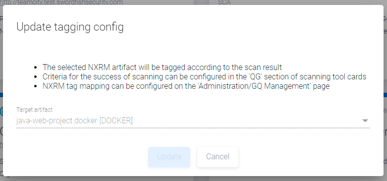</figure>

!!! note "Важное замечание"
    Tеги, которыми может быть помечен артефакт, определяются пользователем с правами Администратора на странице администрирования с помощью пункта меню **Tagging config**. Соответствующее уведомление расположено в окне **Update tagging config**. Настройка тегирования артефактов описана в разделе «[Настройки тегирования](../../aag/tagging%20settings/#_1)» Руководства прикладного администратора.

AppSec.Hub определяет практику, используемую во время сканирования (SAST, DAST или SCA), и результат сканирования (успешно или не успешно), выбирает соответствующий тег из списка (например, QG_SAST_PASS в случае успешного сканирования) и маркирует артефакт этим тегом.

### Webhooks

Карточка Webhook и использование webhook-механизма не являются обязательными в Security Pipeline артефакта. По сути, webhook — это метод оповещения системы о событиях. Используя webhook, можно вызвать пайплайн в случае, когда произошло какое-либо предопределенное событие. Например, webhook может быть установлен для конкретного репозитория следующим образом: webhook вызывается, если в этот репозиторий помещается конкретный предопределенный артефакт. Параметры webhook можно просмотреть в карточке Webhook. Они могут быть обновлены с помощью кнопки редактирования  в этом же поле.

<figure markdown>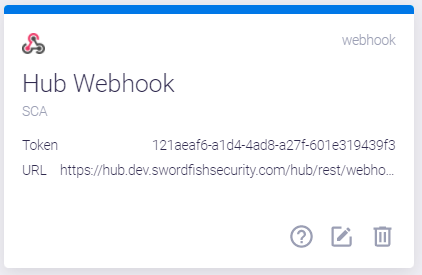</figure>

Webhook посылает сигнал для запуска некоторых процессов. Он не использует обратную связь от инициированных им процессов. Webhook может использоваться не только в пайплайнах артефактов, но и в пайплайнах исходного кода. Как правило, webhook может быть настроен для процесса заливки нового исходного кода. В этом случае сканирование безопасности вновь залитого кода должно запускаться автоматически с помощью механизма webhook. 

Чтобы скопировать токен в буфер обмена, достаточно нажать на его значение на карточке соответствующего Webhook.

<figure markdown>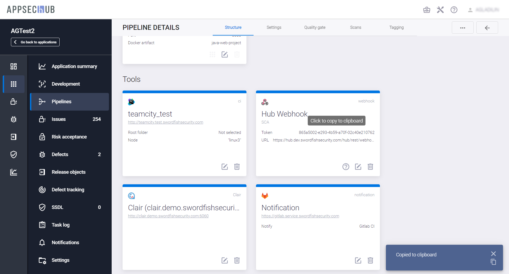</figure>

### Custom webhook

В некоторых случаях особенности организации рабочего процесса диктуют необходимость использования нестандартных способов взаимодействия с внешними инструментами, например, непосредственное тегирование артефактов через API Nexus RM может иметь определенные ограничения на уровне организации. Зачастую это обусловлено разграничением прав доступа или другими специфическими требованиями. Для преодоления таких ограничений могут использоваться Custom webhook.

Заметим, что для нормального функционирования данного механизма необходимо соблюдение следующих условий. Во-первых, следует разрешить тегирование релизного объекта с помощью переключателя **Tagging** на вкладке **Settings** пункта меню **DevSecOps** страницы приложения. Во-вторых, к Security Pipeline должен быть подключен профиль Quality Gate, чтобы, в свою очередь, обеспечить возможность функционирования механизма тегирования.

Прежде чем включить конфигурацию Custom webhook в Security Pipeline, необходимо создать ее на странице администрирования системы. Более подробная информация приведена в разделе «[Конфигурация Custom webhooks](../../aag/custom%20webhooks%20configuration/#custom-webhooks)» Руководства прикладного администратора.

Рассмотрим включение Custom webhook на примере Security Pipeline артефакта. Включение в Security Pipeline исходного кода выполняется аналогично.

Выберите приложение и на его карточке нажмите на иконку **Show app details** .

<figure markdown></figure>

Слева в меню выберите пункт **DevSecOps** и перейдите на вкладку **Artifact pipelines**. Откройте страницу конфигурации **Security Pipeline**, нажав на иконку **Show pipeline config**.

<figure markdown>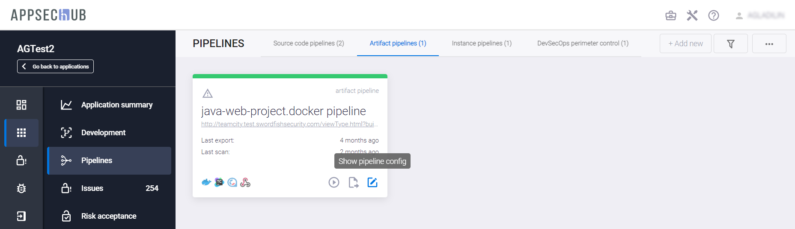</figure>

В правом верхнем углу вкладки **Structure** нажмите кнопку **Action**  и в раскрывающемся меню выберите пункт **Add new element**.

<figure markdown>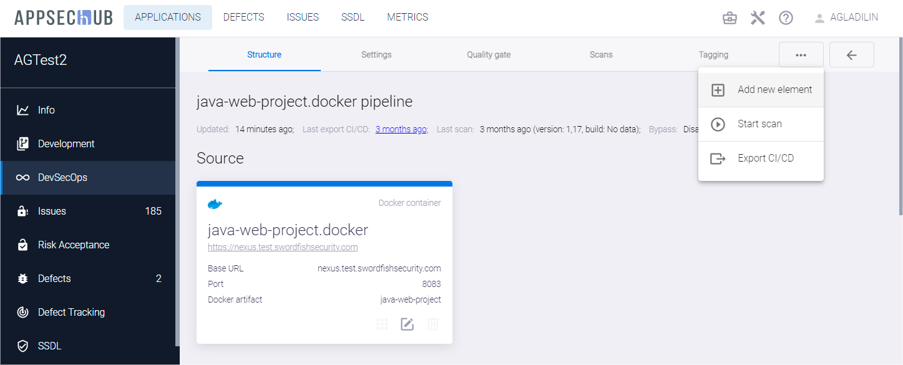</figure>

В появившемся диалоговом окне выберите пункт **Custom webhook config**.

<figure markdown>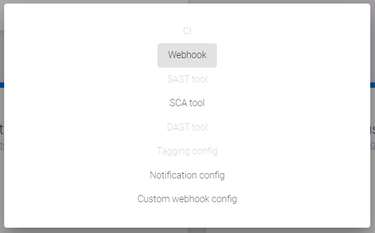</figure>

Выберите предварительно созданную конфигурацию из раскрывающегося списка появившегося диалогового окна, а затем нажмите кнопку **Create**.

<figure markdown>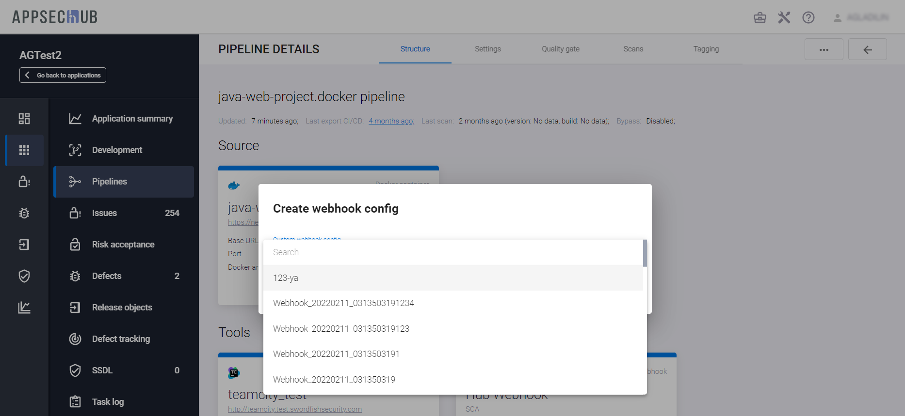</figure>

### Сканирование

После того как все компоненты DevSecOps пайплайна артефактов настроены и пайплайн был экспортирован, нажмите кнопку **Actions**  в правом верхнем углу страницы с детальной информацией о пайплайне и выберите пункт **Export CI/CD** в выпадающем меню, чтобы экспортировать пайплайн в инструмент оркестрации CI/CD (TeamCity).

<figure markdown>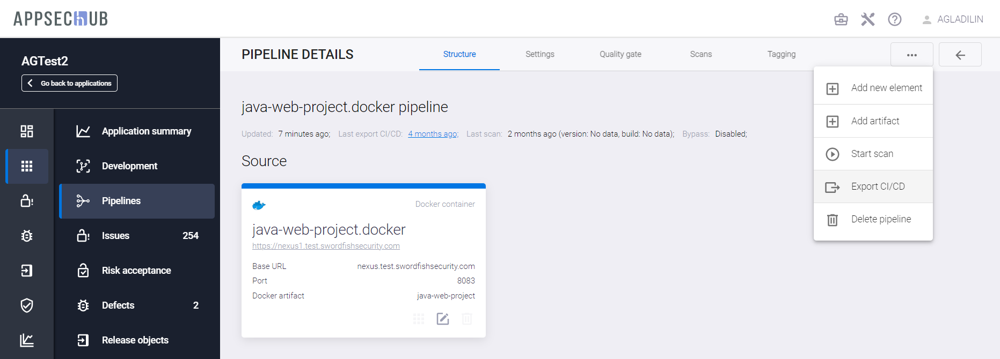</figure>

Используйте кнопку **Actions**  и выберите в выпадающем меню пункт **Start scan**, чтобы запустить сканирование безопасности артефактов с помощью инструмента Nexus IQ Server. В появившемся окне **Scan the artifact** выберите версию артефакта для сканирования из списка доступных версий в поле **Artifact version** и нажмите кнопку **Start scan** внизу окна, чтобы начать сканирование.

<figure markdown>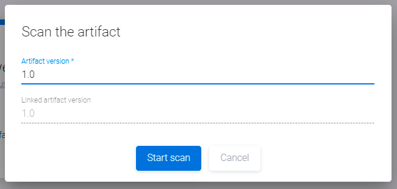</figure>

Подтверждение начала сканирования появится на экране справа внизу и через несколько секунд там же появится следующее подтверждение.

<figure markdown>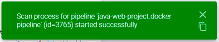</figure>

После окончания сканирования его результат будет добавлен на вкладке **Scans**.

### Security Pipeline нескольких артефактов

AppSec.Hub позволяет создать пайплайн для нескольких артефактов. При этом существует несколько ограничений на состав включаемых в пайплайн артефактов.

Чтобы добавить дополнительтельные артефакты в уже существующий пайплайн, нажмите кнопку **Actions**  и выберите в выпадающем меню пункт **Add artifact**.

<figure markdown>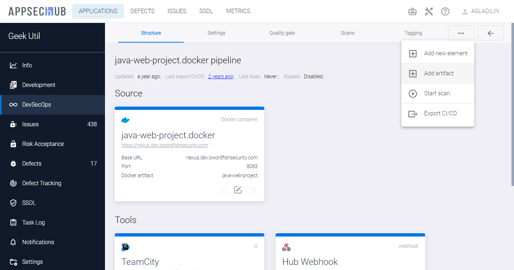</figure>
 
В появившемся окне **Add artifact** приведен лист доступных для добавления в данный пайплайн артефактов.

<figure markdown>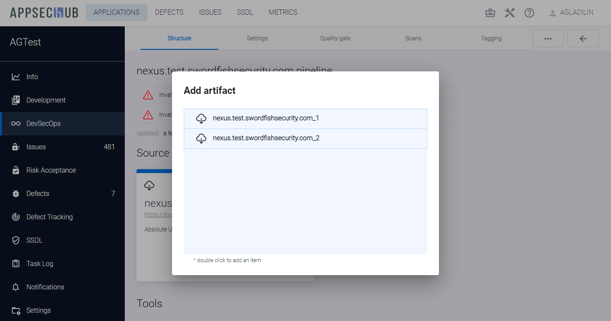</figure>
 
!!! note "Примечание" 
    Существует несколько ограничений на добавляемые артефакты:
    
    1.	Артефакт должен быть такого же типа, как и уже существующий в пайплайне. Например, к артефакту Docker container могут быть добавлены только артефакты Docker container, а Maven артефакт, например, WAR-файл, добавлен быть не может. Артефакты, не подходящие по типу для добавления в пайплайн, не отображаются в окне **Add artifact**.
    
    2.	В системе не должно существовать пайплайнов с одинаковым набором артефактов. Если в системе уже существует пайплайн с некотором набором артефатов, то создать второй такой же пайплайн не удастся. AppSec.Hub отслеживает уникальность каждого пайплайна с несколькими артефактами. Артефакты, выбор которых мог бы привести к созданию «не уникального» пайплайна, повторяющего уже существующий в системе пайплайн, просто не отображаются в окне **Add artifact**.

Выберите артефакт, который необходимо включить в пайплайн, и двойным щелчком мыши добавьте его в пайплайн.

<figure markdown>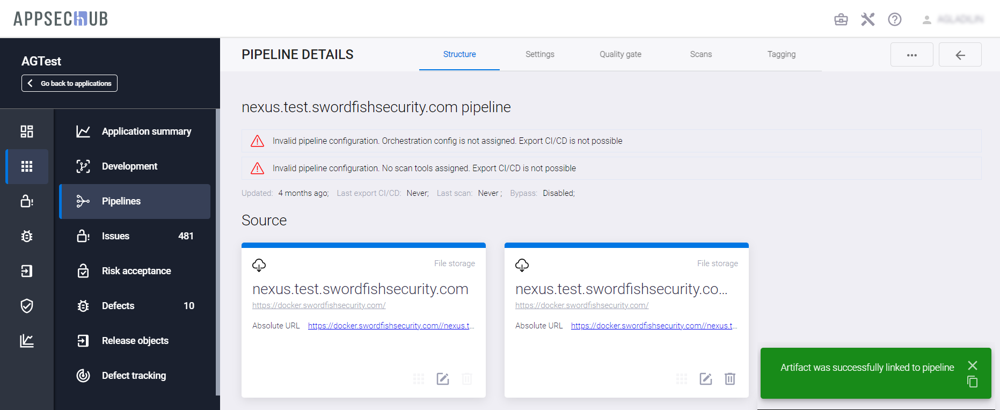</figure>
 
Сканирование пайплайнов для нескольких артефактов на данный момент в AppSec.Hub не поддерживается. Добавление этой функциональности запланировано в следующем релизе.

Система позволяет провести импорт результатов через CLI.

## Security Pipeline экземпляра приложения

Понятие экземпляра приложения (application instance) является важным с точки зрения разработки приложения. Экземпляр приложения предназначен для поставки и развертывания на различных тестовых стендах, промежуточных и производственных окружениях. Для развернутых экземпляров приложения могут быть запущены автоматизированные тесты. AppSec.Hub поддерживает DevSecOps пайплайны экземпляров приложения.

Выберите приложение и нажмите слева пункт меню **Development**. Экземпляры приложения размещаются на вкладке **Instances** страницы разработки приложения.

<figure markdown>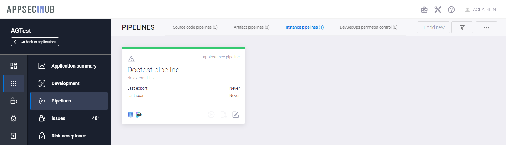</figure>

Для одного приложения может существовать несколько экземпляров для разных этапов разработки (System test, Stage, Production, Integration Acceptance Test, User Acceptance Test) и для разных конфигураций для одного и того же этапа разработки.

Для создания Security Pipeline экземпляра приложения, выберите элемент меню **DevSecOps** в консоли слева, а затем нажмите кнопку **+Add new** в правом вернем углу вкладки **Instance pipelines**. В появившемся окне **Choose the AppInstance for pipeline** выберите и дважды кликните имя экземпляра приложения, который нужно добавить.

<figure markdown>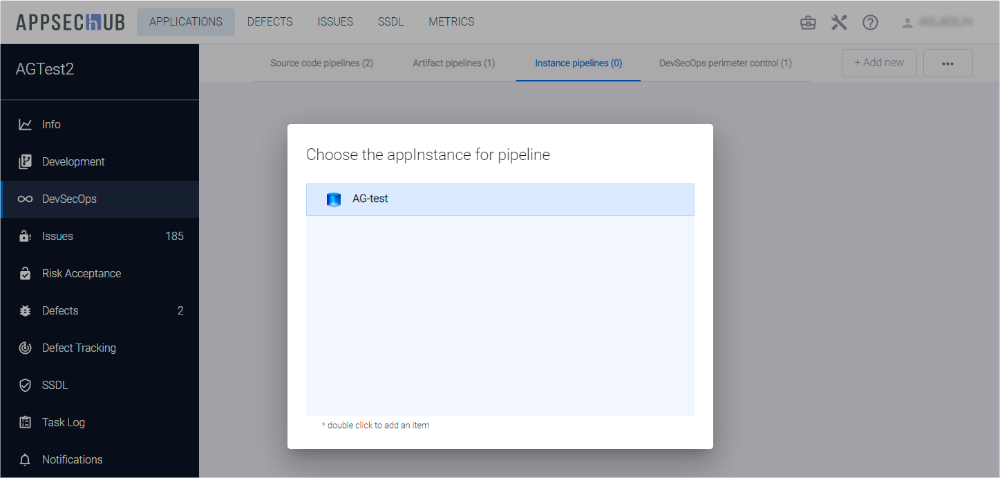</figure>

Новый Security Pipeline экземпляра приложения появляется на вкладке **Instance pipelines**.

<figure markdown>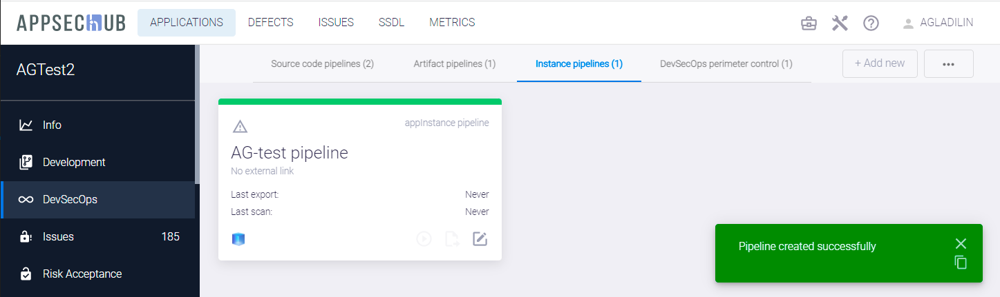</figure>

Нажмите на иконку редактирования  в карточке пайплайна. Откроется страница с детальной информацией о пайплайне. На этой странице выведены два предупреждения о том, что инструмент оркестрации и инструмент сканирования еще не добавлены в пайплайн. Нажмите кнопку **Actions**  справа вверху и выберите пункт **Add new element** из выпадающего меню. Выберите пункт **CI** во вновь появившемся окне, чтобы добавить инструмент оркестрации TeamCity в пайплайн, и введите параметры инструмента. Нажмите кнопку **Actions**  справа вверху и выберите пункт **Add new element** из выпадающего меню. Выберите пункт **DAST tool** во вновь появившемся окне, чтобы добавить инструмент сканирования в пайплайн, и введите параметры инструмента.

В появившемся окне **Create DAST scan config** выберите инструмент в поле **Tool**.

<figure markdown>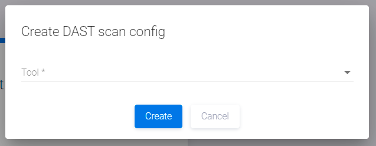</figure>

После выбора инструмента Netsparker в данном окне появятся следующие обязательные для заполнения поля:

* **License** — укажите лицензионный ключ.
* **Scan Profile** — выберите профиль сканирования.

При необходимости отметьте пункт **Include «Accepted Risk» and «False Positive» vulnerabilities** (Включать ложноположительные и добавленные в исключения проблемы безопасности).

<figure markdown>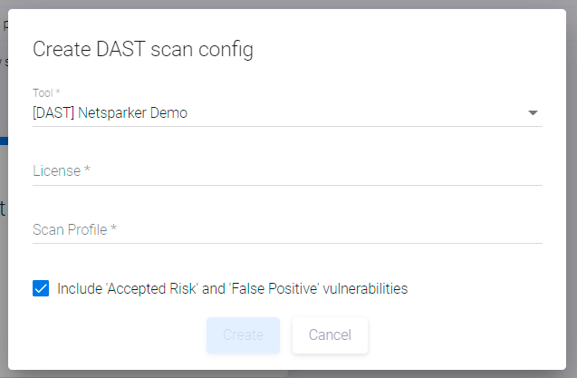</figure>

Выберите пункт меню **DevSecOps** слева и нажмите иконку редактирования  в правом нижнем углу карточки Security Pipeline экземпляра приложения на вкладке **Instances**, чтобы получить информацию об этом паплайне. На экране появится детальная информация о Security Pipeline данного экземпляра приложения.

Типовой Security Pipeline экземпляра приложения состоит из трех компонентов (представленных на экране в виде трех карточек):

* Экземпляр приложения.
* Инструмент оркестрации.
* Инструмент AST.

Карточка экземпляра приложения представляет тот instance, который нужно сканировать на наличие проблем информационной безопасности. Чтобы настроить его параметры, нажмите иконку редактирования  на карточке экземпляра приложения. Откроется окно обновления параметров экземпляра приложения. Описание конфигурации параметров экземпляра приложения представлено в разделе «[Конфигурация приложения](../application%20configuration/#_1)».

Карточка инструмента оркестрации представляет соответствующий инструмент для этого пайплайна (TeamCity). Эта карточка позволяет настроить параметры инструмента оркестрации с помощью иконки редактирования  на карточке инструмента, включая метку узла, как в случае с Security Pipeline артефактов.

Карточка инструмента AST представляет инструмент, выбранный для этого пайплайна, например, Netsparker — инструмент DAST (Dynamic Application Security Testing). Для одного пайплайна может быть выбрано несколько инструментов AST. Нажмите иконку редактирования  на карточке инструмента AST, чтобы настроить параметры сканирования в окне **Update DAST scan config**.

Когда все компоненты DevSecOps пайплайна экземпляра приложения настроены, нажмите кнопку **Actions**  в верхнем правом углу страницы сведений о пайплайне и выберите в выпадающем меню пункт **Export CI/CD**, чтобы экспортировать пайплайн в инструмент оркестрации CI/CD.

После успешного экспорта в CI/CD нажмите кнопку **Actions**  и выберите в выпадающем меню пункт **Start scan**, чтобы запустить сканирование безопасности экземпляра приложения. В открывшемся окне нажмите кнопку Start scan. Подтверждение начала сканирования появится в правом нижнем углу экрана.

Выберите вкладку **Scan history**, чтобы просмотреть статус всех выполненных сканирований.