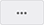

# Security Pipelines

!!! note "Примечание"
    Для выполнения нижеописанных действий требуется роль Менеджер.

## Структура security pipeline

В AppSec.Hub каждый security pipeline привязан к приложению. Security pipeline выполняет сканирование безопасности. Security pipeline позволяет создать и использовать автоматизированные процессы тестирования безопасности приложений в рабочих пространствах для разработки, тестирования и развертывания приложений в различных средах.

Security pipelines предназначены для анализа трех различных типов объектов. Таким образом, существует три вида security pipelines:

* Security pipeline исходного кода (source code security pipeline).
* Security pipeline артефактов (artifact security pipeline).
* Security pipeline экземпляра приложения (application instance security pipeline).

Security pipelines создаются в инструменте оркестрации (TeamCity) для конкретной кодовой базы / артефакта / экземпляра приложения на основе конфигурации используемых инструментов разработки ПО и инструментов AST.

AppSec.Hub предоставляет возможность запуска тестирования безопасности нажатием кнопки **Start scan**  на карточке security pipeline.

Выберите пункт меню **Applications** в верхнем левом углу экрана, чтобы начать работу с приложениями и их пайплайнами. На экране появятся карточки приложений.

<figure markdown></figure>

Нажмите на иконку редактирования  в правом нижнем углу карточки приложения на странице **Applications**. Появится экран с названием выбранного приложения в верхнем левом углу и с подробной информацией о выбранном приложении. Выберите элемент меню **DevSecOps** слева. На экране появятся три вкладки с тремя типами security pipelines для выбранного приложения.

<figure markdown></figure>

Кроме трех вкладок для работы с тремя типами security pipelines, на экране представлена вкладка **DevSecOps perimeter control**, предназначенная для работы с прокси-репозиториями. Описание работы с прокси-репозиториями приведено в разделе «[Конфигурация приложения]()».

Нажмите на иконку редактирования  в правом нижнем углу карточки security pipeline, чтобы просмотреть или обновить сведения об этом пайплайне. Например, при нажатии на иконку редактирования  на карточке security pipeline исходного кода можно получить следующую информацию о пайплайне на вкладке **Structure**:

* Используемый инструмент VCS (Version Control System, система управления версиями), URL кодовой базы, тип ветки кода, инструмент сборки.
* Инструмент оркестрации (CI/CD) и его URL.
* Инструмент для сканирования безопасности (например, Checkmarx) и используемый режим сканирования (например, инкрементальный).
* Общая информация — последний экспорт в CI/CD, последнее сканирование, дата последнего обновления, статус автоматического импорта security issues.
    

Security pipeline исходного кода содержит несколько карточек — по одному на каждый инструмент, задействованный в пайплайне. На рисунке выше показан security pipeline исходного кода, который состоит из трех частей (или трех карточек):

* Кодовая база с исходным кодом.
* Инструмент оркестрации CI/CD.
* Инструмент AST (Checkmarx).

Процесс конфигурации security pipeline включает следующие шаги:

* Выбор инструментов разработки ПО и инструментов AST.
* Настройка выбранных инструментов.
* Определение критериев качества и создание Quality Gate (описание работы с QG приведено в разделах «[Добавление Quality Gate в Security Pipelines]()» данного документа и «[Quality Gates]()» Руководства прикладного администратора).

Набор используемых инструментов определяется в зависимости от имеющихся лицензий. Настройки каждого инструмента определяются в AppSec.Hub. Рассмотрим в качестве примера конфигурацию инструмента Checkmarx. Нажмите на иконку редактирования image12.png в правом нижнем углу карточки Checkmarx. Появится окно **Update SAST scan config**.

<figure markdown></figure>

Задайте настройки Checkmarx в этом окне:

* **Scan mode** — выберите из выпадающего меню пункт Full или Incremental.
* **Predefined preset/Dynamically modified preset** — выбор предустановленного или динамического пресета, который будет использоваться при сканировании. Более подробная информация об использовании динамических пресетов для инструмента Checkmarx приведена в разделе «[Security pipeline исходного кода]()».
* **Preset** — выберите правила, определенные в Checkmarx (Checkmarx Default, Checkmarx Express, All, High and Medium и т. д.). Данное поле активно, если выбран **Predefined preset**.
* **Root team** — определяется в настройках Checkmarx.
* **Team** — выберите структурную единицу из выпадающего меню.
* **Excluded directories** — указанные здесь каталоги не будут проверяться во время сканирования безопасности.

Нажмите кнопку **Update**, чтобы сохранить настройки Checkmarx. Карточка инструмента Checkmarx после конфигурации будет отображать вновь заданные настройки.

Обратите внимание, что AppSec.Hub автоматически обновляет настройки в самом инструменте Checkmarx — никакие дополнительные действия пользователя не требуются.

Пользователь AppSec.Hub с правами Менеджера может выполнить следующие действия с security pipeline, нажав кнопку **Actions**  в правом верхнем углу и выбрав одно из этих действий из выпадающего меню:

* Экспортировать security pipeline в инструмент CI/CD.
* Запустить сканирование (запустить security pipeline).
* Добавить новый элемент в security pipeline.

## Настройки Security Pipeline

Выберите вкладку **Settings**, чтобы установить настройки Security Pipeline.

<figure markdown></figure>

На этой вкладке с помощью селекторов можно установить следующие настройки:

Pipeline activity — если этот переключатель выключен, Security Pipeline не может быть запущена на сканирование. Состояние этой настройки пайплайна в AppSec.Hub отображается с помощью цвета линии вверху карточки пайплайна. Если линия имеет серый цвет, переключатель выключен, Security Pipeline не может быть запущена на сканирование. Если линия имеет зеленый цвет, переключатель выключен, Security Pipeline может быть запущена на сканирование. 
image187.png     image176.png

Bypass — если этот переключатель включен, сканирование при запуске security pipeline не выполняется, при этом артефакт будет помечен тегом BYPASS, а на карточке пайплайна появится значок Bypass is enabled image185.png.
Примечание: данная функциональность доступна только после добавления в Security Pipeline тегируемого артефакта, см. раздел «Security pipeline артефакта».
При запуске такого Security Pipeline в правом нижнем углу пользовательского интерфейса отображается подтверждающее уведомление, но фактически сканирования не выполняется и в истории сканирования (вкладка Scans) отображается соответствующее предупреждение.
Данная функциональность может, например, применяться при On-boarding с использованием Meta-runner, если необходимо выполнить сканирование только артефакта, но не кодовой базы. В таком случае для Security Pipeline кодовой базы активируется опция Bypass.
image171.png

CI/CD overwrite protection — этот переключатель блокирует экспорт security pipeline в CI/CD инструмент с помощью пункта меню Export CI/CD. Это позволяет защитить настройки security pipeline от нежелательной перезаписи, а на карточке пайплайна появится значок Overwrite protection is enabled image226.png.
image216.png

Is template — этот переключатель активирует функциональность, которая позволяет использовать Security Pipeline в качестве шаблона при создании новых. На карточке появляется значок This is a template pipeline image206.png. Важно заметить, что для корректного завершения On-boarding (см. раздел «On-boarding — автоматизация интеграции AppSec.Hub в цикл разработки») необходимо наличие в AppSec.Hub предопределенного шаблона Security Pipeline. В качестве такого шаблона может использоваться любой ранее созданный для данного приложения Security Pipeline соответствующего типа (для кодовых баз, артефактов и т. д.). Если для приложения определено несколько Security Pipelines одного типа, для предсказуемого завершения интеграции важно для нужного Security Pipeline активировать опцию Is template — вновь автоматически создаваемые Security Pipelines для данного приложения будут использовать выбранный шаблон.
image202.png

Issue state policy — настройка алгоритма изменения состояний проблем безопасности. Может быть выбрана одна из трех настроек:
Compare with the 1st scan — определять состояние обнаруживаемых проблем безопасности в сравнении с результатами первого сканирования (стандартная настройка системы).
Compare with previous scan — определять состояние обнаруживаемых проблем безопасности в сравнении с результатами предыдущего сканирования.
Compare with the custom — определять состояние обнаруживаемых проблем безопасности в сравнении с результатами произвольного успешного сканирования. При выборе этого варианта на вкладке настроек Security Pipelines (Settings) появляется дополнительное поле Issue state policy scan task, в котором необходимо указать соответствующее сканирование.
Delete pipeline — нажмите кнопку Delete, чтобы запретить доступ к пайплайну и действиям с ним.
Добавление Quality Gate в Security Pipelines
Когда профиль Quality Gate создан и настроен (см. разделы «Quality Gate» Руководства прикладного администратора), он может быть добавлен в Security Pipeline (s) одного или нескольких приложений.

Чтобы добавить Quality Gate в Security Pipeline, предварительно выбрав необходимое приложение (см. раздел «Приложения»), перейдите на страницу настроек Security Pipeline, см. раздел «Настройки security pipeline».

Перейдите на вкладку Quality Gate и, выбрав в раскрывающемся меню предварительно созданный профиль Quality Gate (см. раздел «Quality Gate» Руководства прикладного администратора), нажмите кнопку Save, чтобы включить Quality Gate в Security Pipeline.

Изображение выглядит как текст, снимок экрана, монитор, компьютер
Автоматически созданное описание

После добавления Quality Gate в Security Pipeline, ниже отобразится перечень условий, определенных в профиле Quality Gate.

Для подключения другого Quality Gate выберите его в раскрывающемся меню и нажмите кнопку Save. На странице отобразятся условия для вновь подключенного Quality Gate.

Примечание: к Security Pipeline одновременно может быть подключен только один Quality Gate. При подключении нового Quality Gate ранее подключенный — отключается.

тобы отключить Quality Gate от Security Pipeline, нажмите кнопку Unlink.

Рассмотрим пример использования Quality Gate в Security Pipeline. Предположим, для выпуска релиза приложения определены следующие критерии: отсутствие любых уязвимостей высокой и критической степени серьезности (high/critical severity issues), выявленных инструментами SAST и DAST.

Чтобы создать Quality Gate с такими критериями, при настройке профиля Quality Gate (см. раздел «Quality Gate» Руководства прикладного администратора) выберем следующие параметры.

image199.png

Перечень заданных условий будет выглядеть следующим образом.

image154.png

Таким образом создан Quality Gate, который при включении его в Security Pipeline будет отслеживать выполнение указанных критериев.

Если критерии Quality Gate не выполняются (для приведенного примера во время сканирования обнаружена минимум одна уязвимость высокой или критической степени серьезности), AppSec.Hub прервет выполнение security pipeline и релиз приложения не будет создан. Чтобы выпустить релиз, который соответствует заданному критерию QG, все уязвимости высокой и критической степени серьезности должны быть устранены до запуска Security Pipeline, создающего релиз приложения.

История сканирований
Выберите вкладку Scans, чтобы получить подробную информацию о результатах сканирования для выбранного Security Pipeline.

Рисунок 16

Каждое выполненное сканирование представлено отдельной строкой. Эта строка содержит следующие поля:

ID выполненного сканирования в AppSec.Hub. Чтобы ознакомиться с подробной информацией о сканировании, нажмите значение в данном столбце. Отобразится следующая страница.

Рисунок 30
На данной странице приведена следующая информация:
Details — сводная информация о сканировании.
Scan target — информация об объекте сканирования.
Quality gate — информации о прохождении установленных критериев качества (Quality gates).
Quality gate condition violations — информация о превышении пороговых значений, определенных в профиле подключенного Quality gates.
Status — статус сканирования.
Started — время и дата запуска сканирования.
Duration — продолжительность сканирования.
CI system — используемый инструмент CI/CD.
Ext build ID — внешний идентификатор сканирования. При нажатии на значение осуществляется переход в соответствующий инструмент CI/CD.
Started from — способ запуска сканирования.
Branch — ветвь кодовой базы.
Issue import results — результат импорта Security Issues в виде диаграммы с распределением по статусам (New, Repeated, Fixed). Рядом с диаграммой располагается иконка, нажав которую можно перейти к перечню Security Issues, обнаруженных в ходе данного сканирования. Предусмотрена возможность обновления данных на странице (кнопка Refresh data).
Details — статус сканирования в инструменте оркестрации:
image149.png — SUCCESS.
image126.png — FAILURE.
Изображение выглядит как текст
Автоматически созданное описание — BYPASSED.
Важное замечание: заметим, что с учетом установленного Quality Gate, результаты сканирования с точки зрения инструмента оркестрации TeamCity и с точки зрения AppSec.Hub могут значительно различаться. Выполнение сканирования в инструменте оркестрации могло пройти успешно, однако определенные в QG критерии с точки зрения серьезности обнаруженных рисков безопасности (security risks) и рисков, связанных с корректностью использования лицензии (compliance risks), при этом могут быть не выполнены. В этом случае статус QG Check в AppSec.Hub может иметь значение Failed, и выполнение security pipeline должно быть прервано, поскольку критерии QG не были выполнены. Например, после невыполнения критерия QG не должен быть осуществлен шаг по разворачиванию этой сборки в целевом окружении. Если QG не был установлен, то результат сканирования в AppSec.Hub определяется как Passed, если оно успешно прошло в инструменте оркестрации TeamCity. Статус сканирования в AppSec.Hub с точки зрения QG отображается в полях SAST QG, SCA QG и DAST QG.

Version — версия просканированного артефакта.
Branch — содержит название ветки. Для артефакта данное поле называется Version и содержит версию просканированной сборки.
Started — дата и время начала сканирования.
Duration — продолжительность сканирования.
SAST QG — статус выполнения сканирования в AppSec.Hub с точки зрения установленного SAST QG. Если QG не был установлен, это поле будет пустым. Если QG был установлен, но критерий, заданный в QG, не был выполнен, это поле будет содержать соответствующую иконку Failed image126.png. Нажмите эту иконку, чтобы получить детальную информацию о результате сканирования.
image132.png
Если QG был установлен, и критерий, заданный в QG, был выполнен, это поле будет содержать соответствующую иконку Passed image149.png.
SCA QG — статус выполнения сканирования в AppSec.Hub с точки зрения установленного SCA QG. Если QG не был установлен, это поле будет пустым. Если QG был установлен, но критерий, заданный в QG, не был выполнен, это поле будет содержать соответствующую иконку Failed image126.png. Нажмите эту иконку, чтобы получить детальную информацию о результате. Если QG был установлен, и критерий, заданный в QG, был выполнен, это поле будет содержать соответствующую иконку Passed image149.png.
image163.png
DAST QG — статус выполнения сканирования в AppSec.Hub с точки зрения установленного DAST QG. Если QG не был установлен, это поле будет пустым. Если QG был установлен, но критерий, заданный в QG, не был выполнен, это поле будет содержать соответствующую иконку Failed image126.png. Нажмите эту иконку, чтобы получить детальную информацию о результате. Если QG был установлен, и критерий, заданный в QG, был выполнен, это поле будет содержать соответствующую иконку Passed image149.png.
EXTERNAL ID — внешний идентификатор сканирования. При нажатии на значение осуществляется переход в соответствующий инструмент CI/CD.
Экспорт в CI/CD
После того, как Security Pipeline создан и сконфигурирован в AppSec.Hub, его можно экспортировать в инструмент CI/CD.

Примечание: если в пользовательском интерфейсе AppSec.Hub выполнены какие-либо изменения структуры Security Pipeline, необходимо выполнить повторный экспорт параметров в инструменты CI/CD, см. ниже.

На вкладке Structure нажмите кнопку Actions image4.png в правом верхнем углу и выберите в выпадающем меню пункт Export CI/CD, чтобы экспортировать security pipeline в инструмент CI/CD — TeamCity.

Изображение выглядит как текст, снимок экрана, монитор
Автоматически созданное описание

Сообщение о результате экспорта появится в правом нижнем углу экрана.

Изображение выглядит как текст, снимок экрана, монитор, компьютер
Автоматически созданное описание

В результате экспорта, в TeamCity будет создан security pipeline с параметрами конфигурации, определенными в AppSec.Hub. Теперь TeamCity может выполнять сконфигурированный security pipeline. TeamCity будет запускать все инструменты в пайплайне и предоставлять полученные результаты тестирования безопасности в AppSec.Hub.

Чтобы выполнить экспорт security pipeline в инструмент CI/CD на странице DevSecOps, нажмите кнопку Export CI/CD image90.png в правом нижнем углу карточки пайплайна.

image97.png

Доступ к security pipeline в инструменте оркестрации
Выберите пункт меню Applications в верхнем левом углу экрана и выберите приложение. Нажмите на иконку редактирования image12.png в правом нижнем углу карточки приложения на странице Applications. Выберите элемент меню DevSecOps слева. Нажмите на иконку Show pipeline config image12.png в правом нижнем углу карточки security pipeline.

Нажмите на ссылку на инструмент оркестрации image77.png справа от пункта Last export CI/CD, чтобы получить доступ к security pipeline в TeamCity.

image71.png

На экране появится страничка для входа в TeamCity.

Security pipeline исходного кода
Важное замечание: если подготовленной базы исходного кода не существует, ее следует создать перед началом работы с security pipeline исходного кода. Процесс создания новой базы кода описан в разделе «Конфигурация приложения/Кодовые базы».

Выберите элемент меню DevSecOps в консоли слева, а затем нажмите кнопку +Add new в правом вернем углу вкладки Source code pipelines, чтобы добавить новый security pipeline исходного кода.

Изображение выглядит как текст
Автоматически созданное описание

В открывшемся окне для добавления новой кодовой базы Choose the codebase for pipeline выберите и дважды кликните имя кодовой базы, которую нужно добавить.

image110.png

Новый security pipeline исходного кода появляется на вкладке Source code pipelines.

image117.png

Нажмите на иконку редактирования image12.png на карточке пайплайна исходного кода. Откроется страница с детальной информацией о пайплайне. На этой странице, как показано на рисунке ниже, выведены два предупреждения о том, что инструмент оркестрации (CI/CD) и инструмент сканирования еще не добавлены в пайплайн.

image109.png

Нажмите кнопку Actions image4.png справа вверху и выберите пункт Add new element из выпадающего меню. Выберите пункт CI во вновь появившемся окне, чтобы добавить инструмент оркестрации CI/CD TeamCity в пайплайн.

image55.png

В следующем окне выберите TeamCity из списка инструментов и нажмите кнопку Create. Поле Pipeline auth token можно оставить пустым.

image50.png

В результате, на вкладке Pipeline Structure появится новая карточка инструмента TeamCity, а также исчезнет одно соответствующее предупреждение.

image39.png

Следующим шагом является добавление инструмента сканирования.

Нажмите кнопку Actions image4.png справа вверху и выберите пункт Add new element из выпадающего меню. Выберите пункт SAST tool во вновь появившемся окне, чтобы добавить инструмент сканирования Checkmarx в пайплайн.

Изображение выглядит как текст, снимок экрана, монитор
Автоматически созданное описание

image40.png

Выберите пункт Checkmarx из списка инструментов в появившемся окне Create SAST scan config.

image29.png

image35.png

В появившемся окне выполните настройку следующих параметров:

Scan mode — выберите режим сканирования (Full/Incremental).
Predefined preset/Dynamically modified preset — выбор соответственно предустановленного или динамического пресета, который будет использоваться при сканировании. Опция Predefined preset позволяет следующим шагом выбрать любой импортированный из Checkmarx пресет. Более подробная информация о динамических пресетах приведена ниже в данном разделе.
Preset — выберите пресет Checkmarx, который будет использоваться для сканирования. Данный параметр используется, только если в предыдущем поле выбран Predefined preset.
Заполнив остальные поля (Root team, Team, Excluded directories), нажмите кнопку Create, см. раздел «Структура security pipeline».

Примечание: если поле Team отставлено пустым, автоматически будет создана команда с именем, соответствующим названию приложения в AppSec.Hub.

На странице с информацией о пайплайне появится новая карточка инструмента Checkmarx, и последнее предупреждение исчезнет со страницы.

Примечание: наименование используемого пресета указывается на карточке инструмента.

Теперь нажмите кнопку Actions image4.png в правом верхнем углу страницы с детальной информацией о пайплайне и выберите пункт Export CI/CD из выпадающего меню, чтобы экспортировать пайплайн в инструмент оркестрации CI/CD (в этом примере — TeamCity). Это необходимо для синхронизации настроек пайплайна в AppSec.Hub и в TeamCity. В правом нижнем углу экрана появится следующее подтверждающее сообщение.

После успешного экспорта в инструмент CI/CD используйте кнопку Actions image4.png и далее пункт Start scan в выпадающем меню, чтобы запустить сканирование безопасности исходного кода с помощью инструмента Checkmarx.

Динамические пресеты в Checkmarx
Если в качестве SAST-инструмента используется Checkmarx, при его добавлении в AppSec.Hub реализована возможность использования динамических пресетов (Dynamically modified preset).

Примечание: если тот или иной язык программирования (и соответствующие проверки) не выбран в предустановленном пресете (Predefined preset), написанный на нем код при сканировании будет игнорироваться.

При использовании Dynamically modified preset во время сканирования происходит автоматическое распознавание языков программирования, составляющих кодовую базу, и формируется новый пресет, в который включаются проверки для обнаруженных языков. Вместе с тем, если в AppSec.Hub создано правило (-а), определяющее условное принятие риска (см. раздел «Проблемы безопасности»), соответствующее условие (-я) также будет автоматически добавлено в динамически обновляемый пресет инструмента.

Среди преимуществ такого похода можно выделить следующие:

Оперативная реакция на изменение состава кодовой базы (появление новых языков программирования) с последующим обновлением пресета Checkmarx с целью активации специфических проверок.
Сокращение времени сканирования в результате пропуска ненужных проверок.
Если в кодовой базе появляется новый язык программирования или пропадает ранее использовавшийся, происходит динамическое обновление пресета в соответствии с произошедшими изменениями.

Security pipeline артефакта
Для инструментов сборки артефактом является исходный код программы, скомпилированный для выполнения или тестирования. Артефакты создаются инструментами разработки ПО на базе исходного кода. Артефакты важны с точки зрения разработки приложений как сущности, которые могут быть включены в поставку.

Выберите приложение и нажмите пункт меню Development в консоли слева. Артефакты помещаются на вкладке Artifacts на странице приложения.

Для одной базы исходного кода приложения может существовать несколько артефактов (например, WAR-файлы, дистрибутивы в виде архивных файлов, образы Docker и т. д.).

С точки зрения безопасности приложения, каждый артефакт можно просканировать, чтобы найти проблемы информационной безопасности. AppSec.Hub автоматизирует этот процесс и поддерживает DevSecOps пайплайны артефактов. Выберите пункт меню DevSecOps в консоли слева и нажмите иконку Show pipeline config image12.png на карточке пайплайна артефактов на вкладке Artifact pipelines, чтобы просмотреть подробную информацию о пайплайне артефактов.

Откроется страница с детальной информацией о пайплайне.

Эта страница содержит пять карточек, или компонентов, для выбранного примера пайплайна артефактов:

Карточка артефакта.
Карточка инструмента оркестрации.
Карточка инструмента AST.
Карточка тегирования (tagging).
Карточка Webhook.
Первая карточка представляет артефакт, который необходимо сканировать на наличие проблем информационной безопасности. Необходимая версия указывается в качестве параметра:

Нажмите кнопку Actions image4.png в правом верхнем углу и выберите пункт Start scan в выпадающем меню.
В появившемся окне Scan the artifact выберите версию артефакта для сканирования из списка доступных версий в поле Artifact version.
Нажмите кнопку Start scan внизу окна, чтобы начать сканирование.
image2.png

Следующая карточка для этого пайплайна — карточка инструмента оркестрации TeamCity. Эта карточка позволяет настроить инструмент оркестрации. Если TeamCity работает на нескольких узлах (nodes), можно выбрать конкретный узел для сканирования, указав метку, которой он помечен. Чтобы выбрать для работы узел, помеченный меткой, например, linux, нажмите иконку редактирования image12.png на карточке инструмента оркестрации. В открывшемся окне Update CI tool выберите режим Use node name и выберите linux из выпадающего списка в поле Node label и нажмите кнопку Update.

image15.png

Сообщение, подтверждающее обновление конфигурации TeamCity, появится в правом нижнем углу экрана.

image25.png

Карточка инструмента оркестрации TeamCity теперь содержит информацию о том, что метка linux является меткой выбранной узла.

image17.png

Процесс сканирования будет выполняться на этом узле с меткой linux.

Следующая карточка для этого пайплайна — карточка инструмента AST. В данном примере это инструмент Nexus IQ Server. Для одного пайплайна может быть использовано несколько инструментов сканирования. Nexus IQ Server — это инструмент сканирования SCA (Software Composition Analysis). Нажмите иконку редактирования image12.png на карточке инструмента сканирования, чтобы настроить параметры сканирования в окне Update SCA scan config.

image280.png

В этом окне можно выбрать инструмент сканирования и выбрать этап (stage) из выпадающего списка (Develop, Build, Stage Release, Release, Operate).

Тегирование артефактов
Карточка тегирования (Tagging) и тегирование арефактов само по себе являются опциональным. Чтобы добавить тегирование в security pipeline артефакта, нажмите кнопку Actions image4.png справа вверху на вкладке Structure и выберите пункт Add new element из выпадающего меню. Выберите пункт конфигурации Tagging config из списка во вновь появившемся окне.

Некоторые репозитории, например Nexus Pro, поддерживают механизм тегов и тегирования. Тегирование позволяет наносить метки на артефакты в зависимости от результатов сканирования. Инструмент Nexus IQ Server работает в области SCA. Если сканирование успешно проходит Quality Gate, артефакт будет помечен меткой «QG_SCA_PASS», а в противном случае — меткой «QG_SCA_FAIL». Отсутствие метки на артефакте при определенном QG означает, что артефакт еще не сканировался. Если QG не задан, а сканирование артефактов было выполнено, артефакт вообще не будет помечен тегом в результате этого сканирования.

Карточка тегирования (tagging) позволяет автоматически выполнять тегирование артефактов в качестве результирующего шага сканирования безопасности.

Нажмите иконку редактирования image12.png на карточке тегирования и выберите имя артефакта из списка Target artifact в окне Update tagging config, чтобы определить артефакт, который нужно пометить тегом.

image262.png

Важное замечание: теги, которыми может быть помечен артефакт, определяются пользователем с правами Администратора на странице администрирования с помощью пункта меню Tagging config. Соответствующее уведомление расположено в окне Update tagging config. Настройка тегирования артефактов описана в разделе «Настройки тегирования» Руководства прикладного администратора.

AppSec.Hub определяет практику, используемую во время сканирования (SAST, DAST или SCA), и результат сканирования (успешно или не успешно), выбирает соответствующий тег из списка (например, QG_SAST_PASS в случае успешного сканирования) и маркирует артефакт этим тегом.

Webhooks
Карточка Webhook и использование webhook-механизма не являются обязательными в Security Pipeline артефакта. По сути, webhook — это метод оповещения системы о событиях. Используя webhook, можно вызвать пайплайн в случае, когда произошло какое-либо предопределенное событие. Например, webhook может быть установлен для конкретного репозитория следующим образом: webhook вызывается, если в этот репозиторий помещается конкретный предопределенный артефакт. Параметры webhook можно просмотреть в карточке Webhook. Они могут быть обновлены с помощью кнопки редактирования image221.png в этом же поле.

image228.png

Webhook посылает сигнал для запуска некоторых процессов. Он не использует обратную связь от инициированных им процессов. Webhook может использоваться не только в пайплайнах артефактов, но и в пайплайнах исходного кода. Как правило, webhook может быть настроен для процесса заливки нового исходного кода. В этом случае сканирование безопасности вновь залитого кода должно запускаться автоматически с помощью механизма webhook. 

Чтобы скопировать токен в буфер обмена, достаточно нажать на его значение на карточке соответствующего Webhook.

Custom webhook
В некоторых случаях особенности организации рабочего процесса диктуют необходимость использования нестандартных способов взаимодействия с внешними инструментами, например, непосредственное тегирование артефактов через API Nexus RM может иметь определенные ограничения на уровне организации. Зачастую это обусловлено разграничением прав доступа или другими специфическими требованиями. Для преодоления таких ограничений могут использоваться Custom webhook.

Заметим, что для нормального функционирования данного механизма необходимо соблюдение следующих условий. Во-первых, следует настроить тегирование артефакта, добавив в Security Pipeline конфигурацию тегирования (Tagging config). Во-вторых, к Security Pipeline должен бы подключен профиль Quality Gate, чтобы, в свою очередь, обеспечить возможность функционирования механизма тегирования.

Прежде чем включить конфигурацию Custom webhook в Security Pipeline, необходимо создать ее на странице администрирования системы. Более подробная информация приведена в разделе «Конфигурация Custom webhooks» Руководства прикладного администратора.

Рассмотрим включение Custom webhook на примере Security Pipeline артефакта. Включение в Security Pipeline исходного кода выполняется аналогично.

Выберите приложение и на его карточке нажмите на иконку Show app details .

Слева в меню выберите пункт DevSecOps и перейдите на вкладку Artifact pipelines.

Откройте страницу конфигурации Security Pipeline, нажав на иконку Show pipeline config.

В правом верхнем углу вкладки Structure нажмите кнопку Action и в раскрывающемся меню выберите пункт Add new element.

В появившемся диалоговом окне выберите пункт Custom webhook config.

Выберите предварительно созданную конфигурацию из раскрывающегося списка появившегося диалогового окна, а затем нажмите кнопку Create.

Сканирование
После того как все компоненты DevSecOps пайплайна артефактов настроены и пайплайн был экспортирован, нажмите кнопку Actions image4.png в правом верхнем углу страницы с детальной информацией о пайплайне и выберите пункт Export CI/CD в выпадающем меню, чтобы экспортировать пайплайн в инструмент оркестрации CI/CD (TeamCity).

Изображение выглядит как текст
Автоматически созданное описание

После успешного экспорта в CI/CD нажмите кнопку Actions image4.png и выберите в выпадающем меню пункт Start scan, чтобы запустить сканирование безопасности артефактов с помощью инструмента Nexus IQ Server. В появившемся окне Scan the artifact выберите версию артефакта для сканирования из списка доступных версий в поле Artifact version и нажмите кнопку Start scan внизу окна, чтобы начать сканирование.

image222.png

Подтверждение начала сканирования появится на экране справа внизу.

image225.png

и через несколько секунд там же появится следующее подтверждение.

image227.png

После окончания сканирования его результат будет добавлен на вкладке Scans.

Security pipeline экземпляра приложения
Понятие экземпляра приложения (application instance) является важным с точки зрения разработки приложения. Экземпляр приложения предназначен для поставки и развертывания на различных тестовых стендах, промежуточных и производственных окружениях. Для развернутых экземпляров приложения могут быть запущены автоматизированные тесты. AppSec.Hub поддерживает DevSecOps пайплайны экземпляров приложения.

Выберите приложение и нажмите слева пункт меню Development. Экземпляры приложения размещаются на вкладке Instances страницы разработки приложения.

Изображение выглядит как текст
Автоматически созданное описание

Для одного приложения может существовать несколько экземпляров для разных этапов разработки (System test, Stage, Production, Integration Acceptance Test, User Acceptance Test) и для разных конфигураций для одного и того же этапа разработки.

Для создания security pipeline экземпляра приложения, выберите элемент меню DevSecOps в консоли слева, а затем нажмите кнопку +Add new в правом вернем углу вкладки Instance pipelines. В появившемся окне Choose the AppInstance for pipeline выберите и дважды кликните имя экземпляра приложения, который нужно добавить.

image250.png

Новый security pipeline экземпляра приложения появляется на вкладке Instance pipelines.

image244.png

Нажмите на иконку редактирования image12.png в карточке пайплайна. Откроется страница с детальной информацией о пайплайне. На этой странице выведены два предупреждения о том, что инструмент оркестрации и инструмент сканирования еще не добавлены в пайплайн. Нажмите кнопку Actions image4.png справа вверху и выберите пункт Add new element из выпадающего меню. Выберите пункт CI во вновь появившемся окне, чтобы добавить инструмент оркестрации TeamCity в пайплайн, и введите параметры инструмента. Нажмите кнопку Actions image4.png справа вверху и выберите пункт Add new element из выпадающего меню. Выберите пункт DAST tool во вновь появившемся окне, чтобы добавить инструмент сканирования в пайплайн, и введите параметры инструмента.

В появившемся окне Create DAST scan config выберите инструмент в поле Tool.

Изображение выглядит как текст
Автоматически созданное описание

После выбора инструмента Netsparker в данном окне появятся следующие обязательные для заполнения поля:

License — укажите лицензионный ключ.
Scan Profile — выберите профиль сканирования.
При необходимости отметьте пункт Include «Accepted Risk» and «False Positive» vulnerabilities (Включать ложноположительные и добавленные в исключения проблемы безопасности).

Изображение выглядит как текст
Автоматически созданное описание

Выберите пункт меню DevSecOps слева и нажмите иконку редактирования image12.png в правом нижнем углу карточки security pipeline экземпляра приложения на вкладке Instances, чтобы получить информацию об этом паплайне. На экране появится детальная информация о security pipeline данного экземпляра приложения.

image235.png

Типовой security pipeline экземпляра приложения состоит из трех компонентов (представленных на экране в виде трех карточек):

Экземпляр приложения.
Инструмент оркестрации.
Инструмент AST.
Карточка экземпляра приложения представляет тот instance, который нужно сканировать на наличие проблем информационной безопасности. Чтобы настроить его параметры, нажмите иконку редактирования image221.png на карточке экземпляра приложения. Откроется окно обновления параметров экземпляра приложения. Описание конфигурации параметров экземпляра приложения представлено в разделе «Конфигурация приложения».

Карточка инструмента оркестрации представляет соответствующий инструмент для этого пайплайна (TeamCity). Эта карточка позволяет настроить параметры инструмента оркестрации с помощью иконки редактирования image221.png на карточке инструмента, включая метку узла, как в случае с security pipeline артефактов.

Карточка инструмента AST представляет инструмент, выбранный для этого пайплайна, например, Netsparker — инструмент DAST (Dynamic Application Security Testing). Для одного пайплайна может быть выбрано несколько инструментов AST. Нажмите иконку редактирования image221.png на карточке инструмента AST, чтобы настроить параметры сканирования в окне Update DAST scan config.

Когда все компоненты DevSecOps пайплайна экземпляра приложения настроены, нажмите кнопку Actions image4.png в верхнем правом углу страницы сведений о пайплайне и выберите в выпадающем меню пункт Export CI/CD, чтобы экспортировать пайплайн в инструмент оркестрации CI/CD.

После успешного экспорта в CI/CD нажмите кнопку Actions image4.png и выберите в выпадающем меню пункт Start scan, чтобы запустить сканирование безопасности экземпляра приложения. В открывшемся окне нажмите кнопку Start scan. Подтверждение начала сканирования появится в правом нижнем углу экрана.

Выберите вкладку Scan history, чтобы просмотреть статус всех выполненных сканирований.