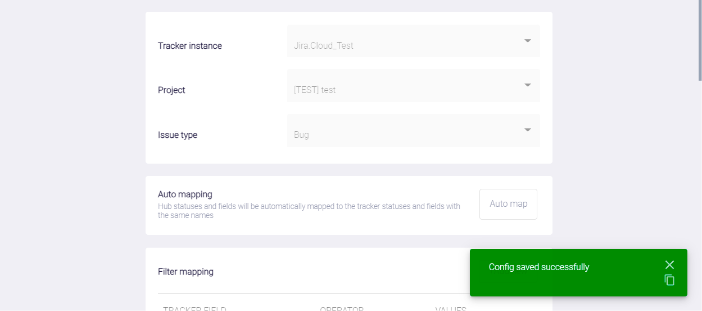
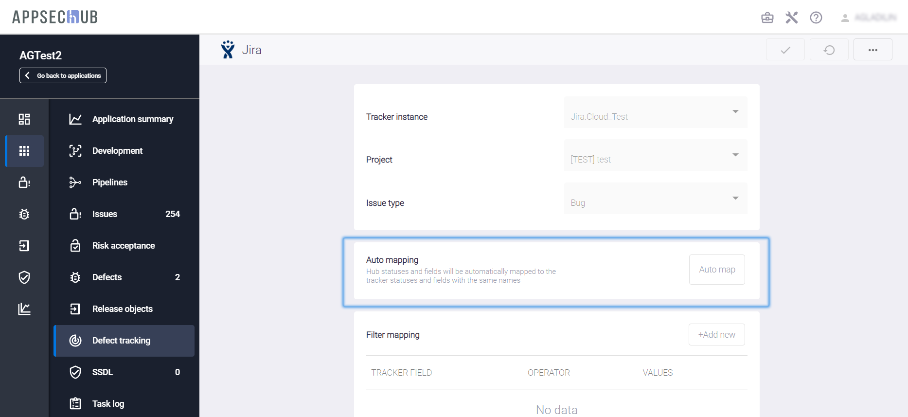
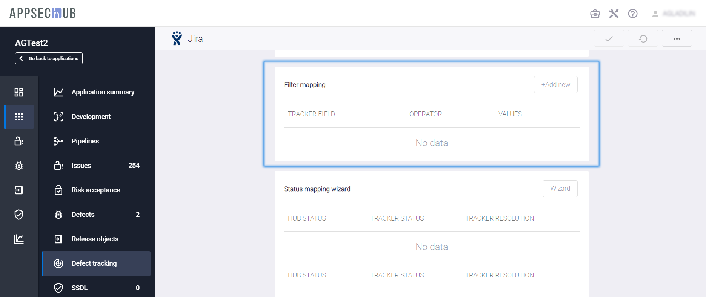
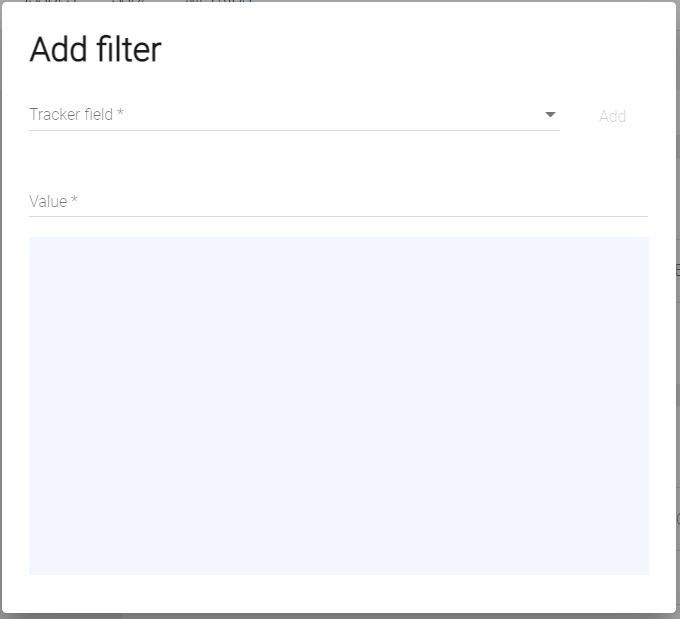
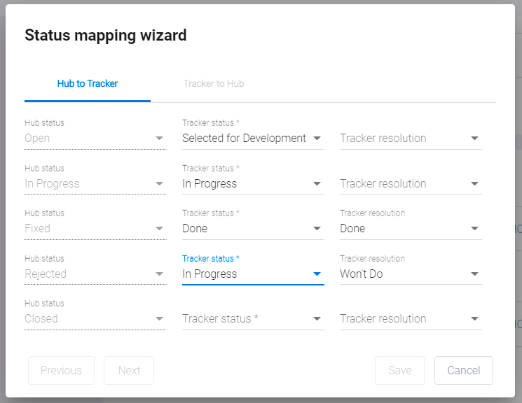
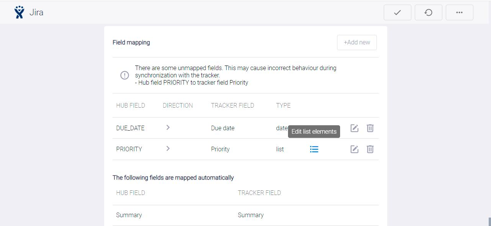
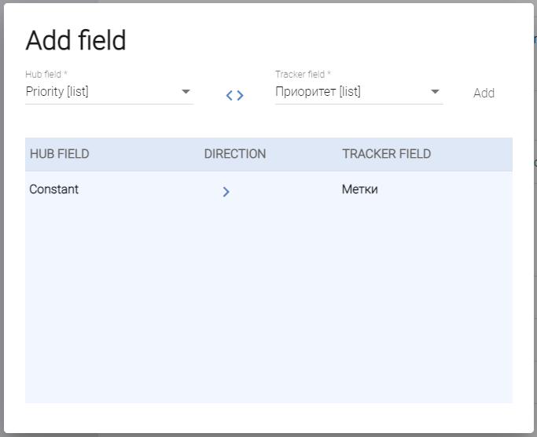
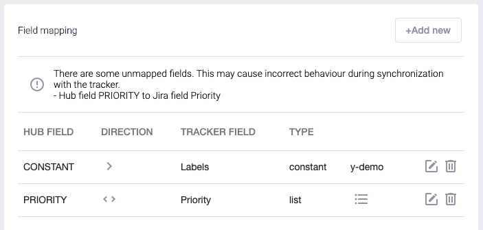

# Синхронизация с Jira — настройки

Для выполнения нижеописанных действий требуется роль Менеджер.

Каждый дефект в AppSec.Hub имеет статус, который показывает его текущий этап жизненного цикла дефекта (Registered, Open, In Progress, Fixed, Rejected, Closed). С другой стороны, дефект имеет также свой статус в Jira. Жизненный цикл дефекта в Jira, так же как и статус дефектов в Jira, определяется командой разработчиков, работающей в рамках своих собственных процессов. Например, команда разработчиков может использовать процесс Канбан, который имеет свой жизненный цикл дефекта и совершенно другой список статусов дефекта. Таким образом, список статусов дефекта в Jira в общем случае может не совпадать со списком статусов дефекта в AppSec.Hub. Для поддержания целостности работы с дефектами статусы дефекта в обеих системах должны быть соотнесены друг с другом.

Соотнесение статусов дефекта между AppSec.Hub и Jira определяется и задается в AppSec.Hub для каждого приложения.

Выберите пункт **Applications** в левом верхнем углу экрана. В окне появится список приложений.

<figure markdown></figure>

Выберите приложение и нажмите иконку **Show app details** на его карточке.

<figure markdown></figure>

Выберите пункт меню **Defect tracking** в меню, расположенном слева.

<figure markdown></figure>

В системе существует возможность просто скопировать все настройки отслеживания дефектов в AppSec.Hub из другого приложения. Для этого на появившейся странице **Defect Tracking** нажмите кнопку **Actions** в правом верхнем углу, выберите пункт выпадающего меню **Copy config from another app** и выберите из выпадающего списка приложение, из которого будут скопированы настройки.

<figure markdown></figure>
<figure markdown></figure>

Если настройки не копируются из другого приложения, для начала настройки на появившейся странице **Defect Tracking** выберите значения в выпадающих меню **Tracker instance** (значение — Jira), **Project** (значение — имя проекта) и **Issue type** (значение — элемент из списка Task, Bug и т. д.). Нажмите кнопку **Create config**  в правом верхнем углу.

<figure markdown></figure>

После этого можно начать процесс сопоставления статуса дефектов в появившихся на странице полях.

<figure markdown></figure>

Сопоставление статуса дефектов следует задавать отдельно для каждой комбинации значений, определяемых в полях **Instance**/**Project**/**Issue type**.

### Автоматическое сопоставление статусов

Кнопка **Auto map** в разделе **Auto mapping** позволяет автоматически сопоставить статусы и поля, если они в точности совпадают в AppSec.Hub и Jira. Имеет смысл использовать эту кнопку в начале процесса сопоставления статусов и полей, а затем при необходимости вручную корректировать результаты.

<figure markdown></figure>

После выполнения автоматического сопоставления статусов и полей нажмите кнопку **Update config** в правом верхнем углу страницы **Defect Tracking**, чтобы сохранить созданную конфигурацию.

<figure markdown></figure>

### Автоматическая фильтрация дефектов безопасности

При выборе значений в полях **Instance**/**Project**/**Issue type** необходимо установить параметры автоматической фильтрации и синхронизации дефектов безопасности.

Дефекты могут быть синхронизированы как из AppSec.Hub в Jira, так и из Jira в AppSec.Hub. Предположим, что до начала синхронизации с AppSec.Hub в Jira уже есть несколько дефектов разработки, относящихся к проекту, но не являющихся дефектами безопасности приложения. Если фильтр синхронизации не установлен, все эти дефекты разработки будут рассматриваться AppSec.Hub как дефекты безопасности, что на самом деле не так. Чтобы предотвратить такого рода неправильную классификацию существующих дефектов, необходимо добавить фильтр и создать правило, как отличать дефекты безопасности от всех других дефектов разработки.

Нажмите кнопку **+Add new** в секции **Filter mapping** на странице **Defect Tracking**.

<figure markdown></figure>

На экране откроется окно **Add filter**.

<figure markdown></figure>

Предположим, что все дефекты безопасности в Jira были помечены меткой **y-demo**. В таком случае необходимо выбрать значение **Labels** в выпадающем меню **Tracker field**, значение = в выпадающем меню **Operator**, ввести значение **y-demo** в поле **Value** и нажать кнопку **Add** справа. Вновь созданный фильтр появится в окне **Add filter**.

<figure markdown></figure>

и на странице **Defect Tracking**.

<figure markdown></figure>

Нажмите кнопку **Update config** в правом верхнем углу страницы **Defect Tracking**, чтобы сохранить конфигурацию.

### Мастер настройки сопоставления статусов дефектов

Для настройки сопоставления статусов дефектов AppSec.Hub и Jira необходимо воспользоваться соответствующим мастером настройки.

!!! note "Примечание"
    В приложениях, в которых сопоставление дефектов было настроено без использования мастера, будет отображаться старая версия интерфейса. При настройке новых приложений, пожалуйста, используйте Status mapping wizard.

Перейдите на страницу **Defect Tracking** и в разделе **Status mapping wizard** нажмите кнопку **Wizard**. Мастер позволяет выполнить настройку сопоставления статусов дефектов как при экспорте в систему отслеживания задач, так и при импорте.

<figure markdown></figure>

В левой колонке отображаются статусы AppSec.Hub, а в центральной колонке необходимо выбрать соответствующие им статусы в системе отслеживания задач. Завершив настройку сопоставления статусов экспорта и нажав кнопку **Next**, переходите к настройке статусов импорта.

<figure markdown></figure>

При появлении в системе отслеживания задач нового статуса можно добавить его в таблицу сопоставления статусов, нажав кнопку **Add row**. Выполнив все необходимые настройки, нажмите кнопку **Save**. Перечень всех сопоставленных статусов появится в разделе **Status mapping wizard**. При необходимости можно запустить мастер настройки вновь и повторить сопоставление статусов.

<figure markdown></figure>

Нажмите кнопку **Update config** в правом верхнем углу страницы **Defect Tracking**, чтобы сохранить конфигурацию.

### Сопоставление полей дефектов

Перед каждой синхронизацией дефектов с Jira необходимо последовательно соблюдать соответствие установленному фильтру и проставлять на все новые дефекты безопасности в AppSec.Hub метку **y-demo**. Такое действие может быть автоматически задано в настройках  в разделе **Field mapping** на странице **Defect Tracking**. Нажмите кнопку **+Add new** и выберите значение **Constant** в выпадающем меню **Hub field**, значение **Labels [value]** в выпадающем меню **Tracker field**, введите значение **y-demo** в поле **Constant** и нажмите кнопку **Add** справа.

<figure markdown></figure>

Таким образом было задано новое правило сопоставления полей между AppSec.Hub и Jira. Это правило отображается в разделе **Field mapping** на странице **Defect Tracking**.

<figure markdown></figure>

Аналогично с помощью данного механизма можно для дефектов, создаваемых в AppSec.Hub, назначать исполнителя в проектной системе отслеживания дефектов (данный способ работает как в Jira, так и в YouTrack).

<figure markdown></figure>

В результате последующей синхронизации в системе отслеживания дефектов будут созданы тикеты, в поле **Исполнитель** которых, будет отображаться выбранный пользователь.

Также реализован другой механизм синхронизации поля **Assignee (Исполнитель)** в проектной системе отслеживания дефектов, который работает только в Jira.

В окне **Add field** необходимо выбрать значения **Defect Author [user]** и **Assignee [user]** и нажать кнопку **Add**.

<figure markdown></figure>

В результате последующей синхронизации автор дефекта в AppSec.Hub будет отображаться в поле **Assignee** (**Исполнитель**) в Jira.

!!! note "Примечание"
    При использовании обоих описанных выше подходов поле Assignee (Исполнитель) обновляется однократно. Если впоследствии оно было изменено в проектной системе отслеживания дефектов, то при последующей синхронизации обновление не происходит.

Обратите внимание, что внизу раздела **Field mapping** расположено предупреждение о том, что несколько полей в AppSec.Hub и в Jira автоматически соотнесены друг с другом с помощью AppSec.Hub. Эти поля перечислены в табличном формате. Все эти поля обязательно должны быть заполнены в процессе создания дефекта в Jira. Список «обязательных» полей определяется для каждого проекта в Jira. Если для дефектов проекта Jira требуется больше «обязательных» полей, AppSec.Hub показывает соответствующее предупреждение с именем (именами) полей Jira в разделе **Field mapping**. Эти поля в Jira должны быть сопоставлены с полями в AppSec.Hub с помощью механизма сопоставления полей.

Например, для проекта в Jira требуется определение приоритета дефекта. В этом случае необходимо сопоставить приоритет дефектов в AppSec.Hub с приоритетом дефектов в Jira. Нажмите кнопку **+Add new** и выберите значение **Priority [list]** в выпадающем меню Hub field, значение **Priority [list]** в выпадающем меню **Tracker field** и нажмите кнопку **Add**. В результате создастся новое правило сопоставления полей, которое отображается в разделе **Field mapping**.

<figure markdown></figure>

Однако, после создания этого правила сопоставления в секции **Field mapping** появилось предупреждение о существовании несопоставленных полей и возможном некорректном поведении при синхронизации с Jira. Списки приоритетов дефектов в AppSec.Hub и в проекте Jira часто различаются, и соответствие значений приоритета необходимо сопоставлять отдельно для каждого проекта. Кликните иконку **Edit list elements**  и сопоставьте попарно приоритеты дефектов AppSec.Hub с приоритетами дефектов Jira один за другим с помощью выпадающих списков в окне **Add values**. Нажмите кнопку **Add** для каждой пары сопоставленных приоритетов.

<figure markdown></figure>

Предупреждение о существовании несопоставленных полей в секции **Field mapping** должно исчезнуть после этой операции.

Чтобы завершить сопоставление приоритетов, необходимо установить двунаправленную синхронизацию приоритетов между AppSec.Hub и Jira. Индикатор, показывающий направление синхронизации — это значок «>» в строке сопоставления приоритетов. На данный момент он показывает, что синхронизация приоритетов установлена только из AppSec.Hub в Jira.

Нажмите иконку редактирования , расположенную в строке справа, чтобы изменить синхронизацию на двунаправленную. Появится окно редактирования поля **Edit field**. В этом окне несколько раз нажмите на указатель направления «>» между полями **Hub field** и **Tracker field**. Значок направления при этом меняется между знаками однонаправленной синхронизации «>» и «<», и знаком двунаправленной синхронизации «<>».

<figure markdown></figure>

Нажмите кнопку **Save**. Индикатор направления синхронизации «<>» показывает, что синхронизация приоритетов между AppSec.Hub и Jira теперь является двунаправленной.

<figure markdown></figure>

Обратите внимание, что сопоставление всех констант должно быть однонаправленным, так как константы определяются один раз и в дальнейшем не меняются (например, метки).

### Удаление конфигурации синхронизации с системой отслеживания дефектов

Чтобы удалить созданную конфигурацию синхронизации с проектной системой отслеживания дефектов, в нижней части страницы **Defect Tracking** нажмите кнопку **Delete**. После подтверждения настройки будут удалены.

<figure markdown></figure>

!!! note "Примечание"
    После удаления конфигурации все связи между ранее синхронизированными дефектами и проектной системой отслеживания дефектов разрываются, а значения в поле **LAST SYNC** на странице **Defects** изменятся на **Not started**. См. раздел «[Синхронизация дефектов безопасности с системой отслеживания дефектов]()».