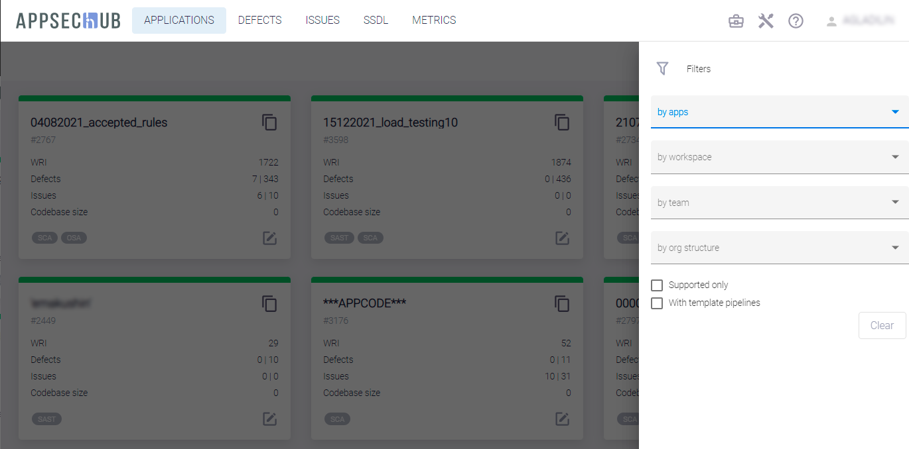
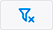

# Приложения в AppSec.Hub

!!! note "Примечание"
    Для выполнения нижеописанных действий требуется роль Менеджера.

AppSec.Hub нацелен на обеспечение безопасности разрабатываемых приложений. Таким образом, приложение можно рассматривать как целевой объект в системе. Именно для безопасной разработки приложений в системе используются автоматизация, различные инструменты, практики SSDL и т. п.

Чтобы начать работу с приложениями, выберите пункт меню **Applications** в верхнем левом углу экрана. На экране появится страница приложений AppSec.Hub.

<figure markdown></figure>

Каждая карточка на странице **Applications** представляет приложение и краткую информацию о нем:

* Имя.
* Идентификатор приложения в AppSec.Hub.
* Текущий статус приложения (supported/not supported) отображается разным цветом линии вверху карточки приложения. Если линия имеет серый цвет, Security Pipelines для этого приложения не могут быть запущены, а само приложение имеет статус Not supported. Если линия имеет зеленый цвет, Security Pipelines для этого приложения могут быть запущены, а само приложение имеет статус Supported. Более подробная информация приведена ниже в разделе «[Настройки приложения](../application settings/#_1)».
* Применяемые практики (SAST, SCA, DAST).
* Сводка по дефектам (Defects) и проблемам (Issues) безопасности приложения.
* Размер кодовой базы.
* WRI (Weighted Risk Index) — взвешенный риск-индекс. Используется для оценки текущего бизнес-риска приложения.

Существует возможность поиска и фильтрации приложений с использованием кнопки **Show filters**  в правом верхнем углу страницы. Чтобы найти приложение, нажмите эту кнопку и введите имя приложения или часть имени приложения в поле **by apps**.

<figure markdown></figure>

Также можно фильтровать существующие приложения, используя выпадающие меню **by workspace**, **by team** и **by orgstructure**, а также выбрав опции **Supported only** и **With template pipelines**. Настройки фильтра сохраняются в системе даже между сессиями пользователя.

Нажмите кнопку **Reset filters**  в правом верхнем углу страницы, чтобы сбросить все текущие фильтры.

Нажав значок **Show app details** , перейдите на страницу приложения.

<figure markdown></figure>

На странице приложения можно просмотреть, а также при необходимости отредактировать информацию о нем или выполнить необходимые настройки.

<figure markdown></figure>