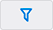
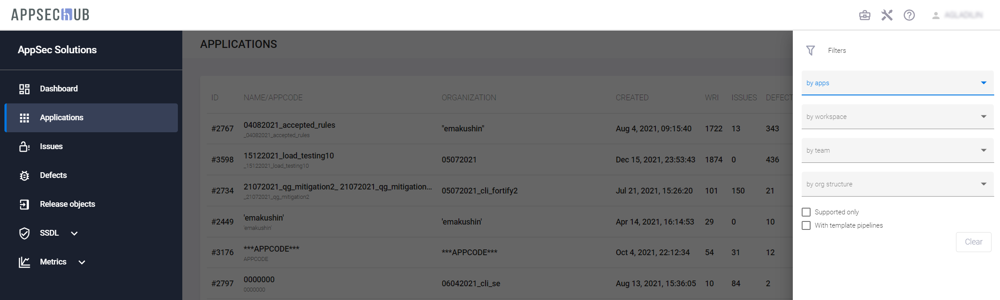

# Приложения в AppSec.Hub

!!! note "Примечание"
    Для выполнения нижеописанных действий требуется роль Менеджера.

AppSec.Hub нацелен на обеспечение безопасности разрабатываемых приложений. Таким образом, приложение можно рассматривать как целевой объект в системе. Именно для безопасной разработки приложений в системе используются автоматизация, различные инструменты, практики SSDL и т. п.

Чтобы начать работу с приложениями, выберите пункт меню **Applications** в левом меню. На экране появится страница приложений AppSec.Hub.

<figure markdown></figure>

Каждая строка на странице **Applications** представляет приложение и краткую информацию о нем:

* **NAME/APPCODE** – имя/код приложения.
* **ID** — идентификатор приложения в AppSec.Hub.
* **ORGANIZATION** — название подразделения организационной структуры, к которому относится приложение.
* **CREATED** – дата создания приложения.
* **WRI** (Weighted Risk Index) — взвешенный риск-индекс. Используется для оценки текущего бизнес-риска приложения.
* **ISSUES** – количество найденных в приложении проблем безопасности.
* **DEFECTS** – количество относящихся к приложению дефектов безопасности.
* **CB SIZE** – Размер кодовой базы приложения.
* **PRACTICES** – Применяемые при сканировании приложения практики.

Существует возможность поиска и фильтрации приложений с использованием кнопки **Show filters**  в правом верхнем углу страницы. Чтобы найти приложение, нажмите эту кнопку и введите имя приложения или часть имени приложения в поле **by apps**.

<figure markdown></figure>

Также можно фильтровать существующие приложения, используя выпадающие меню **by workspace**, **by team** и **by orgstructure**, а также выбрав опции **Supported only** и **With template pipelines**. Настройки фильтра сохраняются в системе даже между сессиями пользователя.

Нажмите кнопку **Reset filters**  в правом верхнем углу страницы, чтобы сбросить все текущие фильтры.

Нажав строку приложения, перейдите на его страницу.

На странице приложения можно просмотреть, а также при необходимости отредактировать информацию о нем или выполнить необходимые настройки.

<figure markdown></figure>